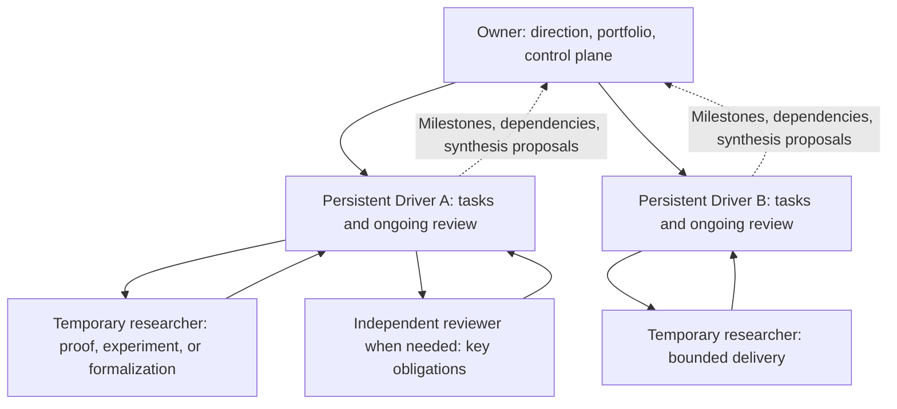

# Codex research organization: persistent lines, bounded researcher deliveries

Status: `ACTIVE / USER-DIRECTED ORCHESTRATION / V1`  
Effective: `2026-09-09`  
Scope: research organization and continuity; no new mathematical claim, task registry, or scheduler.

The Owner manages the portfolio and control plane, a line Driver owns an entire research loop, and a researcher owns one bounded task. The same Driver normally continues reviewing that line; ordinary results do not return to the Owner for another full review. Owner and line Driver are scopes of the existing `RESEARCH_DRIVER` role, not new identity enums.

## 1. Roles and decision ownership

| Role | Continuing responsibility | Decisions within scope | Upstream delivery |
| --- | --- | --- | --- |
| Owner | Parent objective, Enterprise worldview, portfolio, resources, control health | Establish, combine, split, park, and rank lines; govern shared interfaces | User-facing progress map, material advances, and questions actually requiring the user |
| Line Driver and persistent reviewer | One mother-question line, evidence versions, open issues, dependencies, next tasks | Register, publish, dispatch, review, return, replicate, formalize, integrate, and select justified next work within the line | Concise frontier changes, established obstacles, cross-line conflicts, synthesis proposals, exact sources |
| Temporary researcher | The smallest unfinished unit of the taskbook | Choose proof, computation, counterexample, and tool methods inside authority | Complete durable delivery and smallest next action; future contact is not assumed |
| Independent reviewer or formalization researcher | Explicit proof obligations or verification scope | Assess frozen inputs or perform kernel checks | Return to the line Driver; independent review is required when the Driver is also the author |
| Control maintainer | Reproducible state, publication, identity, binding, and CI defects | Bounded diagnosis, repair, appropriate regression, authorized publication | Root cause, fixed version, recovery entry; no change to mathematical conclusions |

Broad search, theorem/tool extraction, historical consolidation, and counterexample search are work packages when needed. Each need not become a persistent line. Temporary specialists must also leave reusable deliveries.

## 2. Delegate a whole line once

The Owner gives the Driver a line charter: stable line identifier, mother question, value, scope and exclusions, known sources, unfinished frontier, authority, resource constraints, closure criteria, and escalation triggers. The Driver explicitly accepts the current delegation and uses its own real Driver-ID, never the Owner's signature.

Default delegation covers the normal line loop without repeated approval for each task, PR, review, or next step. Global reprioritization, cross-line ownership changes, shared foundational semantics, and expansion beyond authority return to the Owner. Existing Working Truth, Foundation, and mathematical promotion gates remain applicable; a charter does not promote evidence.

Use the [line dossier template](../templates/RESEARCH_LINE_DOSSIER.md) and [delegation packets](../templates/RESEARCH_DELEGATION_PACKETS.md). A dossier provides routing and continuity; existing state-machine records continue to determine formal tasks, claims, results, and reviews. Do not create another executable task registry.

## 3. The Driver's autonomous research loop

1. Restore the highest verified frontier. Use `research_control_dispatch.py` to reconcile existing tasks and recoverable owners without duplicate claims.
2. Select an unresolved obligation that matters to the mother question. First consider continuing the current task, consuming an existing result, closing a local question, or returning to the existing queue.
3. If a new task is justified, specify discriminating outcomes and kill conditions and publish through V2. The taskbook and publication reach main atomically before formal execution.
4. Give the researcher a minimal input packet with source boundaries, output scope, resource limits, and required durable handoff before exit.
5. Review new evidence and resolve specific issues. Dispatch replication, counterexamples, literature, or formalization when useful. Ordinary review does not escalate to the Owner.
6. Persist actual Result/Driver records, source artifacts, and method-harvest conclusions; complete applicable publication and integration.
7. Update the frontier and choose same-task continuation, a justified successor, existing-queue return, local closure, or a synthesis/split proposal to the Owner.

`PASS_IS_NOT_A_SUCCESSOR_TRIGGER`: passing a check does not automatically create another task. Task closure, line closure, and parent closure are distinct judgments. Use the actual canonical entrypoints; never invent a terminal state to work around a missing control path.

## 4. Continuous review and independence

The persistent reviewer maintains an incremental ledger: object and exact version, accepted obligations and conditions, open issues, dependent lemmas/tools, affected scope, and evidence resolving each issue. Keep stable issue identifiers and close them with evidence instead of repackaging every change as a complete new audit.

Compare each return with the last reviewed version. Review the changes and affected dependency closure; unchanged material may reuse accepted conclusions and their sources. Reopen affected review for a new counterexample, invalid dependency, scope change, version mismatch, or an explicit independent-replication requirement. A renamed agent does not establish independence; disclose actual context and source exposure.

If the Driver helped construct the claim under review, its self-check is not independent review: another reviewer handles the decisive obligations. Prioritize independent validation for new shared tools, cross-line core lemmas, major theorem closure, or passage from finite experiments to a general claim. The Owner receives consequences and evidence, rather than becoming the default second mathematical reviewer.

Distinguish paper proof, finite exact certificate, experimental indication, conditional result, kernel-checked formalization, and pending formalization. Producing Lean files is not kernel verification. New axioms, `sorry`, or hidden assumptions may not discharge the original obligations.

## 5. Persistent context and recoverable dossiers

Persistence means continuing responsibility and preferential reuse of the same agent. It does not promise an immortal process, unlimited context, or hidden memory across sessions. Recover the same line from its dossier when execution context ends. Replacing an agent does not reset the mathematical frontier, provenance, or winning claim.

| Context layer | Retained working view | Expand on demand |
| --- | --- | --- |
| Owner | Line map, frontiers, verified depth, key obstacles, cross-line interfaces, decisions | Exact evidence relevant to a decision; not all execution logs |
| Line Driver | Dossier, current task, review ledger, assumptions/tool interfaces, next action | This change, related proof portions, replication receipts, invalidated dependencies |
| Researcher | Exact taskbook, necessary sources, acceptance conditions, output scope | Minimal extra material triggered by a concrete dependency |

Keep the dossier's opening view short, with authority paths and immutable commits. Preserve history in Git and existing returns/reviews. After compaction or replacement, read the opening view, current task, and new differences instead of injecting the entire history again. An incoming Driver verifies input versions and unresolved issues rather than trusting summaries alone.

## 6. Temporary researcher assignment and exit

A task packet must stand alone: mother question, task/publication binding, exact inputs, permitted sources/tools, hard target, success/negative/stop conditions, output paths, resource limits, and recipient. Researchers may explore methods inside the task; they do not take over global priority.

Formal research still uses actual registration, claim, and execution authorization. FREE starts with lightweight activity registration without first selecting a question or claiming a formal task. A delivery includes conclusions and conditions, proof/code/actual run evidence, failed or unresolved obligations, source exposure, actual tool use, exact remote locators, and the smallest next action.

Once future-needed material passes applicable durable-handoff checks, or the Driver confirms that it is readable and properly scoped, the researcher may finish under the original task/PRE_FINAL rules. When canonical readback already establishes delivery, do not add a wait for private Driver acknowledgment; mathematical review and subsequent line work may continue afterward. This adds no Driver approval to FREE. Later work can reuse the same agent or start a new researcher from the handoff. Discarding runtime context never means deleting evidence, branches, or history; do not assume a finished researcher can be contacted again.

## 7. The Enterprise mathematical method

Specify the mathematical objects, integer/coordinate carrier, allowed operations, observables, and information to preserve. Respect P000 and current native semantics. Apply Enterprise coordinates and BRC with their actual types and laws; renaming ordinary variables is not a native innovation.

After selecting a question, at a material obstacle, or before combining lines, examine BRC carriers, branches/provenance, observers, and future operations. Resolve current tool coverage as reuse, composition, extension, a capability gap, or inapplicability. A name match is not execution. If a quotient, normalization, or total loses a needed distinction, retain a repair coordinate or prove that the intended observer descends. Positive mass is not signed/phase cancellation; a finite certificate does not automatically close an infinite-scale claim.

At a traditional barrier, the Driver turns the obstruction into a discriminating question: what information does the representation lose, what invariant/coordinate/operator/interface might repair it, and what proof or negative witness would settle that proposal? Broad searches return verifiable theorem interfaces and applicability conditions. Reuse adequate existing tools. Develop new general tools only for an exact capability gap, and arrange independent applications or counterexamples to test their boundary.

FREE Phase A preserves its firewall: primitive substrate and registration identity only, without route maps, fashionable questions, or tool menus. After candidate freeze, perform deduplication, tool retrieval, and routing. Never retroactively restore a blind-discovery label.

## 8. Owner synthesis, splits, and closure

At a significant frontier, shared-tool candidate, or duplicate effort, compare objects/carriers, assumptions, targets, method interfaces, discharged obligations, remaining obstacles, and source independence. Similar topics or filenames are retrieval hints only.

| Judgment | Action | Preserve |
| --- | --- | --- |
| One line supplies an interface another needs | Add a dependency and reuse; usually no whole-line merge | Version, conditions, and unproved bridging obligations |
| Several lines need the same key lemma/tool | Form one shared task with one accountable Driver | Different original goals, inputs, and acceptance needs |
| Mother questions and remaining obligations coincide | Combine into one line and select its continuing Driver | Original provenance, completed results, explicit task/claim treatment |
| Assumptions, objects, strategies, or validation duties need independence | Split into bounded lines | Common baseline, distinct information gain, eventual recombination conditions |
| No remaining value or adequate closure reached | Close/park and return to the existing queue | Scoped conclusion, negative evidence, open parent objectives |

Record the semantic decision first, then let Drivers execute it through existing task protocols. Git integration does not prove two theorems equivalent. A new synthesis task still needs unified registration; renaming does not erase old tasks. Lines intended as independent discovery do not exchange candidates before freeze. A shared obstacle alone does not authorize exposure.

## 9. External tasks and free research in one view

At real dispatch/handoff boundaries, the Owner consumes canonical dispatch and the lightweight activity overview, including work the user published through other channels. Do not build a queue limited to this chat.

Research from ChatGPT, Codex, or another entry first registers an EM activity. At semantic checkpoints, persist EM source artifacts and exact readback before using the global knowledge base for recording/routing. KB-only work remains `SYNC_DEBT`; branch persistence and canonical-main visibility are distinct. Retrospective capture preserves unknown session information rather than inventing claims or identities.

An activity can represent free exploration without entering the formal claim queue. An eligible audited candidate can later become a formal task. Global visibility does not require every discovery to begin inside an existing line.

## 10. GitHub collaboration with multiple writers

The line Driver integrates its source artifacts and reviews; the Owner assigns responsibility for cross-line and shared-control changes. Agents use separate worktrees or explicitly disjoint paths. Read current target versions before writing, use non-force CAS/expected heads, and preserve other writers' changes.

Choose either branch checkpoints or the normal branch/PR/merge workflow without an extra PR-necessity test. PR/CI is not a universal waiting prerequisite for research startup, activity registration, or every update. An actual merge still satisfies applicable checks; diagnose failure or explicitly defer that merge.

Results and Driver reviews retain existing immutable records and write-boundary binding rules. Never silently rewrite old bytes. Atomic taskbook/publication requirements remain. One integration owner is not a permanent main lock: reread after contention and resolve semantic conflicts. The global knowledge base records source versions and does not replace EM artifacts or state-machine authority.

## 11. Actual Codex operation

Prefer a follow-up to the same available Driver over creating a new reviewer for every return. Send changes to running agents and resume bounded work on the same idle agent. Parallelize only useful independent work. Use the host's actual agent tools; do not assume identical commands across Codex surfaces.

With limited concurrency, retain executable driving/review work and run researchers in batches. A persistent line can be parked as a durable dossier without occupying a running slot; control repair activates when needed. This deployment currently supports four active agents including the Owner, a deployment snapshot rather than a fixed methodological constant. Waiting Drivers cannot solve capacity limits by generating agents indefinitely.

This authorization establishes responsibilities and current collaboration, not a claim that configuration guarantees permanent sessions, automatic wakeups, or unattended loops. Report any separately configured capability by its actual state. Independent FREE work needs an available clean-start mechanism and must not inherit the Owner's entire history.

Official documentation explains that subagents can isolate exploration and log noise while the main conversation retains requirements and decisions; it also identifies conflict costs of concurrent writes. This protocol adapts those observations to EM's state machine and is not a built-in OpenAI research workflow. [OpenAI subagent documentation](https://learn.chatgpt.com/docs/agent-configuration/subagents)

## 12. The Owner's minimum report

Each line reports only new conclusions and evidence level, deepest verified frontier, most important open obligation, next action, cross-line reuse/synthesis proposal, actual evidence links, and decisions required of the Owner. Keep raw logs in source artifacts instead of reinjecting them on every update.

The progress map separates directions/dependencies, proof depth, validation method, and registration/return/review/integration state. Stage numbers and PR counts do not measure mathematical depth. Measure substantive obligations closed, effective reuse, established obstructions, and duplicate work avoided rather than files or agents created.

Adopt this by assigning a continuing Driver to each existing line, building its dossier from verified frontiers, delegating ordinary review/publication, and using cross-line dependencies for the Owner's next portfolio decision. Organizational changes neither rerun completed work nor turn unfinished obligations into completed ones.
