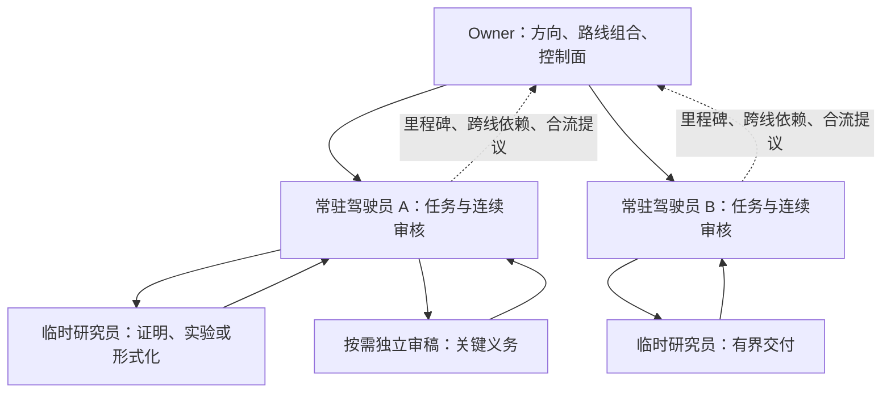

# Codex 研究组织方法：路线常驻，研究员按任务交付

状态：`ACTIVE / USER-DIRECTED ORCHESTRATION / V1`  
生效：`2026-09-09`  
范围：研究组织与连续性；不新增数学命题、任务注册表或调度器。

Owner 负责路线组合与控制面，路线驾驶员负责一条线的研究闭环，研究员负责一个有界任务。默认由同一驾驶员持续审阅该线；普通成果不逐件返回 Owner 重审。Owner 与路线驾驶员都是现有 `RESEARCH_DRIVER` 的职责范围，不是新的身份枚举。

## 1. 角色与决策归属

| 角色 | 持续负责 | 自行决定 | 提交给上层的内容 |
| --- | --- | --- | --- |
| Owner | 总目标、进取数论世界观、路线组合、资源与控制面健康 | 路线设立、合流、分岔、暂停、跨线优先级及共享接口治理 | 面向用户的进度图、关键进展和需要用户决策的真实问题 |
| 路线驾驶员兼常驻审核员 | 一条母问题路线、证据版本、疑点账册、依赖与后续任务 | 线内任务登记/发布/派发、审阅、退回、复现、形式化、源集成和有依据的下一步 | 简短路线变化、确定障碍、跨线冲突、合流/分岔建议及精确来源 |
| 临时研究员 | 当前任务书中的最小未完成单元 | 在授权范围内选择证明、计算、反例和工具方法 | 完整持久化交付及最小下一步；不依赖其以后还能被联系 |
| 独立审稿人或形式化研究员 | 明确的证明义务或复核范围 | 按冻结输入给出可追踪的意见或内核检查结果 | 回传路线驾驶员；如作者与驾驶员重合，独立审阅是必需的 |
| 控制面维护员 | 可复现的状态机、发布、身份、绑定与 CI 缺陷 | 有界诊断、修复、适当回归及已授权发布 | 根因、修复版本和恢复入口；不更改数学结论 |

广泛搜索、工具/定理提取、历史整理和反例搜索是按需工作包，不必各设一条常驻线。负责这些工作的临时研究员同样必须交付可复用的材料。

## 2. 一次委托整条路线

Owner 给驾驶员一份路线委托：稳定路线标识、母问题、价值、范围与禁区、已知来源、当前未完成前沿、权限、资源约束、关闭条件，以及何时需要升级到 Owner。驾驶员显式接受当前授权，使用自己的真实 Driver-ID；不得借用 Owner 的身份签审。

默认授权覆盖整条线的正常循环，不在每个任务、PR、审核或下一阶段重复申请。全局重排、跨线所有权变更、共享基础语义改变和授权外扩张才回到 Owner。Working Truth、Foundation 和数学提升继续遵守各自原有门禁；路线委托不是自动提升。

使用 [路线档案模板](../templates/RESEARCH_LINE_DOSSIER.md) 和 [委托模板](../templates/RESEARCH_DELEGATION_PACKETS.md)。档案是路由与连续性材料；正式任务、claim、结果和审核仍由现有状态机记录决定。不要制造第二套可执行任务表。

## 3. 驾驶员的自主研究循环

1. 从本线最高已验证前沿恢复；通过 `research_control_dispatch.py` 核对现有任务和可恢复 owner，不重复领取。
2. 选择真正影响母问题的未决义务。先考虑继续现有任务、复用已有结果、结束局部问题或转去现有队列。
3. 若确需新任务，形成有判别力的任务书与终止条件，通过统一 V2 发布。任务书和 publication 原子进入主线后才正式执行。
4. 给研究员最小输入包，明确来源隔离、允许输出、资源限制及退出前的持久化交付。
5. 审阅新增证据，处理具体问题；需要时派复现、反例、文献或形式化工作包。普通审阅不升级给 Owner。
6. 持久化实际 Result/Driver 记录、源产物及方法提取结论，完成适用的发布与合并。
7. 更新路线前沿，决定同任务继续、合理后继、返回已有队列、局部关闭或向 Owner 提议合流/分岔。

`PASS_IS_NOT_A_SUCCESSOR_TRIGGER`：通过一项检查并不自动产生下一任务。任务关闭、路线关闭与父目标关闭是三种不同判断；按实际可用的规范入口写入，不编造终态来绕过缺失的控制路径。

## 4. 连续审核与独立性

常驻审核员维护一份增量审阅账册：对象与精确版本、已接受的义务及条件、未决疑点、所依赖的引理/工具、影响范围，以及解决疑点的证据。问题沿用稳定标识，修复后关闭，不重新包装成一轮全量审查。

新回传先与上次已审版本作差异：审查变化以及受影响的依赖闭包。未变内容可以复用已审结论及来源。新反例、依赖失效、证明范围改变、版本不匹配或明确要求独立复现时才重开相关审阅。独立审稿不由“换一个名字”成立，需披露实际上下文与来源暴露。

驾驶员若参与了所审命题的证明构造，不得把自查记成独立审阅：交给另一审稿人处理关键义务。新共享工具、跨路线核心引理、重要理论闭合或由有限实验上升到一般结论时，优先安排独立验证；Owner 接收结论及影响，不默认充当第二个数学审核员。

区分：纸面证明、有限精确证书、实验迹象、条件结论、形式化内核已通过、形式化仍待。生成 Lean 文件不等于内核已验；不得以新的公理、`sorry` 或隐藏假设消去原任务义务。

## 5. 常驻上下文与可恢复档案

“常驻”表示连续责任和优先复用同一代理，不承诺进程永存、无限上下文或跨会话隐藏记忆。驾驶员的运行上下文结束后，由档案恢复同一条线；更换代理不重置数学进度、身份来源或获胜 claim。

| 上下文层 | 常驻内容 | 按需展开 |
| --- | --- | --- |
| Owner | 路线图、各线前沿、已验证深度、关键障碍、跨线接口、决策日志 | 决策涉及的确切证据；不收集全量执行日志 |
| 路线驾驶员 | 路线档案、当前任务、审阅账册、假设与工具接口、下一动作 | 本轮变化、相关证明片段、复现记录与失效依赖 |
| 研究员 | 精确任务书、必需来源、验收条件、输出范围 | 由具体依赖触发的最小新增材料 |

档案首屏保持短小，列出权威路径和 immutable commit；历史保留在 Git、既有回传和审阅材料中。压缩上下文或换代理时读取首屏、当前任务及新增差异，不重新注入整段研究史。接任驾驶员必须核验输入版本与未决项，而非仅相信摘要。

## 6. 临时研究员的任务与退出

任务包必须可独立理解：母问题、当前任务/发布绑定、精确输入、允许的来源与工具、硬目标、成功/否定/停止条件、输出目录、资源约束及回传对象。研究员可以主动探索任务内的方法，但不接管全局优先级。

正式研究继续使用真实登记、claim 和执行授权；FREE 先做轻量活动登记，不需要先选择问题或领取正式任务。研究员交付至少包括结论与条件、证明/代码/真实运行记录、失败或未决义务、来源暴露、工具实际使用情况、精确远端定位及最小下一步。

后续需要的材料通过适用的持久化交接核验，或已由驾驶员确认可读取且边界清楚后，研究员可按原有任务/PRE_FINAL 规则结束。已有规范回读足以核验交付时，不再等待驾驶员的私聊确认；数学审阅与后续路线工作可以随后继续。FREE 不因此增加 Driver 审批。需要补做时，可用原代理，也可让新研究员从交付包继续。丢弃运行上下文不意味着删除证据、分支或历史；不得预设已经结束的研究员一定能够重新联系。

## 7. 进取数论的研究方法

先给出问题的本体、整数/坐标载体、允许运算、观察量及希望保留的信息。坚守 P000 与当前原生语义；进取坐标系和 BRC 应按真实类型与定律应用，不能把普通变量换名后称为原生创新。

选定问题、遇到实质障碍或准备合流时，先检查 BRC 的适用载体、分支/来源、观察与未来运算。查当前工具覆盖后，明确复用、组合、扩展、能力缺口或不适用；查到名称不算执行。若取商、归一化、取总量会丢掉所需区别，保留修复坐标或证明观察量确实可下降。正质量不能代替符号或相位抵消，有限证书不能自动闭合无限尺度结论。

传统方法受阻时，驾驶员把障碍改写成可检验的问题：当前表示丢失了什么信息，什么新不变量、坐标、算子或接口能补上，怎样证明有效或给出否定见证。广泛搜索返回可验证的定理接口和适用条件。已有工具足够时直接复用；只有确切能力缺口才发展新通用工具，并安排独立应用或反例检验其边界。

FREE Phase A 保持来源防火墙：只接收原始基底和登记所需身份信息，不注入路线图、热门题目或工具菜单。候选冻结后再查重、检索工具与决定是否接入路线；不得事后恢复“盲研”标签。

## 8. Owner 如何合流、分岔与闭合

每次重要前沿、共享工具候选或重复研究出现时，Owner 比较：对象/载体、假设、目标、方法接口、已证义务、剩余障碍及来源独立性。主题或文件名相似只是检索线索。

| 判断 | 处置 | 必须保留 |
| --- | --- | --- |
| 一条线已提供另一条线需要的接口 | 增加依赖并复用，通常不合并整线 | 版本、适用条件及尚未证明的桥接义务 |
| 多条线缺同一关键引理/工具 | 汇成一个共享任务，指定单一驾驶员 | 各原线的不同目标、输入和验收需求 |
| 母问题与剩余义务实质一致 | 合流为一条线，选择连续驾驶员 | 原路线来源、已完成结果、claim/任务的显式处理 |
| 假设、数学对象、证明策略或验证职责确需独立 | 分岔成有界子线 | 公共基线、各自信息增益与最终合流条件 |
| 没有剩余研究价值或已充分闭合 | 关闭/暂停并回到已有队列 | 结论范围、否定结果和仍开放的父目标 |

合流先写语义决策，再由驾驶员通过现有任务协议执行；不能凭 Git 合并宣布两个定理等价。新合流任务仍需统一登记，旧任务不因改名消失。需要保持独立发现的两线在冻结前不交换候选；共同瓶颈也不自动授权相互暴露。

## 9. 外部任务与自由研究进入同一视野

Owner 在真实调度/交接边界同时读取 canonical dispatch 和轻量活动概览，接收用户从其他渠道发布的工作。不要另造一个只反映本聊天的队列。

ChatGPT、Codex 或其他入口的研究都先在 EM 做活动登记。语义检查点先持久化 EM 源产物与精确回读，再将全局知识库作为记录/路由。KB-only 仍是 `SYNC_DEBT`；分支上的登记与 canonical main 可见性分开。历史补录保留未知会话信息，不伪造 claim 或研究身份。

轻量活动可表示自由探索，不自动进入正式 claim 队列；候选经过相应审查后再登记为正式任务。这样全局可见性不强迫所有发现先服从一条既定路线。

## 10. 多写者 GitHub 协作

路线驾驶员是本线源产物与审阅的集成负责人；Owner 负责跨线和共享控制变更的归属。代理使用独立 worktree 或明确不重叠的路径，写前读取目标当前版本，使用非强制 CAS/预期 head，并保留其他写者的变化。

可以选择分支检查点或通常的 branch/PR/merge 工作流，无需另证明 PR 必要；PR/CI 不成为研究启动、活动登记或每次进度的统一前置等待。真实合并仍满足该变更适用的检查，失败就诊断或明确暂缓合并。

Result 与 Driver 审核使用原有不可变记录和写前绑定规则，禁止对旧字节静默改写。任务书与 publication 的原子发布规则不变。单一集成责任不表示永久锁定 main；竞争失败先重读目标，冲突应按语义处理。全局知识库记录源版本，不替代 EM 成果或状态机。

## 11. Codex 中的实际使用

有可用代理时，优先向同一驾驶员发送 follow-up，而不是每次新建审核员。给运行中的代理发送变更消息；给已空闲的同一代理恢复有界工作。只有独立且有用的工作才并行；使用宿主实际提供的代理工具，不假设所有 Codex 界面命令一致。

并发槽位有限时保留可执行的驾驶/审核工作，研究员分批运行。常驻路线可以停放为持久化档案而不占运行槽位，控制修复也只在需要时激活。此部署当前可同时运行四个代理（含 Owner）；这是部署快照，不是方法的固定常数。等待中的驾驶员不能靠无限生成代理解决容量不足。

当前授权仅建立职责与本轮协作，不声称配置文件能保证跨会话常驻、自动唤醒或无人值守循环；那些能力若另行配置，应单独报告其实际状态。需要独立 FREE 上下文时使用可用的干净启动方式，不能整段继承 Owner 历史。

官方文档说明子代理可隔离探索与日志噪声，主对话保留需求和决策，同时提醒并行写入会增加冲突成本。本协议据此结合本仓库状态机设计，并非 OpenAI 内置的研究流程。[OpenAI 子代理文档](https://learn.chatgpt.com/docs/agent-configuration/subagents)

## 12. Owner 接收的最小报告

每条线只报告：本次新增结论及等级、当前最深已验证前沿、最重要未决义务、下一动作、跨线复用或合流建议、实际证据链接与需要 Owner 决策的事项。原始日志留在源产物，不在每次汇报重复注入。

进度图分别展示研究方向/依赖、证明深度、验证方式以及登记/回传/审阅/集成状态；阶段编号和 PR 数不代表数学深度。衡量关闭的实质义务、可复用工具的有效应用、辨清的障碍和减少的重复研究，不以文件数量或代理数量为进展。

落地次序：为现有路线指定连续驾驶员；从当前已验证前沿建立档案；把普通审核与发布移交线内；Owner 根据跨线依赖做下一轮路线组合。已有成果不因组织调整重跑，未完成义务也不因组织调整被标成完成。
