# Enterprise Math research progress map

<!-- Generated by tools/render_research_progress_map.py; edit research_progress_map.json. -->

Read A0–A5 for the global structure, then the evidence table and current closeout/frontier rows. BRC is a typed cross-direction tool; X6 is one A5 branch. This is a maintained source index, not a new theorem, full-repository audit or task-claim queue.

Snapshot: 2026-09-08. The 20 foundation/router pins remain frozen at aaf9b812. The map first entered main via PR1396 at dc401229. Later verified frontiers: raw PR1390 main aa5683f; H0O PR1391 main b3d39a9 source capture, formal review pending; p2 PR1394 main c27616a2; star/dual PR1398 main 167746c5. A3 correction PR1399 is integrated on main d4bad545, retaining source 3ac5a5dd; whole-PR955 formal Driver review remains pending. The original 19-entry owner portfolio is a source snapshot, not a repository total or live queue. Other GEO/Hodge routes require exact-source refresh. Weighted trade PR1401 is on main 86f753be. The full canonical catalog comparison there finds exactly 3 of the original 19 objects on main and 16 retained in source; it does not merely subtract one shard. Owner b506f92a publishes the 57-template paper and partial valuation-digits BRC DIV checkpoint as SOURCE_ONLY. The observed main advance to fa9cb29 adds one RH paper only; this map has not reviewed or indexed that paper. PP PR1404 is now merged at 44243768, whose actual tree matches the tested combination. An exact full-catalog comparison finds 4 of the original 19 objects on main and 15 retained in source (8 DOMAIN, 5 RESULT, 2 reference candidates). Owner 528ea6aa separately publishes the injective-axis inequality and p3 equality-flow paper/review/adoption as SOURCE_ONLY; its archived receipt keeps its prepublication time. This graph update reruns no mathematics and promotes no API or formal review.

Frozen main source: [`aaf9b8125ba3`](https://github.com/awdawmip/enterprise-math/commit/aaf9b8125ba3294932b5c90d80f700e02799c88e). Composition base: `4424376809ddb7c41180453fa85f29a72d585a3e`.

## Direction map

Scope closure, a negative boundary, main integration, executable checks, Lean coverage and formal review are different facts. Arrows are typed below; CONTAINS is organizational, while dashed reuse edges do not assert a proved transfer. Historical Continuity never establishes a current claim.

```mermaid
flowchart TB
  subgraph homes["A0 - A5"]
    A0["A0: Primitive discrete state algebra"]
    A1["A1: Dynamics and history coalescence"]
    A2["A2: Observation and future-safe quotient"]
    A3["A3: Structured relation-state algebra"]
    A4["A4: Admissible support and correspondence"]
    A5["A5: Enterprise coordinates and intrinsic geometry"]
  end
  BRC["BRC typed cross-direction tools"]
  X6["X6 raw spatial readouts"]
  RAW_PAPER["Raw compression and two-positive bound"]
  RAW_EXT["Three raw extensions integrated"]
  P2_CONSUMER["Two-positive executable consumer"]
  STAR["Three-positive star subclass papers"]
  RAW_DUAL["Compressed finite dual certificate"]
  A3_A4_REVIEW["PR955 review with local correction"]
  NUMBER_THEORY["Number-theoretic program"]
  PERFECT_PRIME["Perfect Prime AP residual / HCM0"]
  P021["Causal boundary"]
  E001["Engineering and physical interpretation"]
  GEO6["GEO6 external geometry route"]
  GEO7["GEO7 external geometry route"]
  GEO8["GEO8 external geometry route"]
  HODGE["Hodge program"]
  H0O["H0O theorem-preserving contract revision"]
  OWNER_PORTFOLIO["Original owner portfolio: 4 integrated, 15 retained in source"]
  WEIGHTED_TRADE["Eight-positive weighted trade classified"]
  P3_TEMPLATES["Three-positive support templates"]
  VALUATION_DIGITS["Valuation digits local BRC division migration"]
  PP_MOMENT_NOGO["Perfect Prime m3 ordinary-moment no-go"]
  INJECTIVE_AXIS_RAW["Raw stability along an injective positive-support axis"]
  PFSSV_SHELL["Prime-factor semiprime thin-shell review and revision"]
  PFSSV_FINITE_WINDOW["Finite-window null contract and identifiability"]
  RB_ENTERPRISE_THEOREM_PACKAGE_V2_INDEPENDENT_VALIDATION["RB × Enterprise independent-validation route"]
  RB_BLIND_BRANCH_PATTERNS["RB incomplete stage accepted and archived"]
  RB_SOURCE_EXPOSED_EXACT_MAP["RB eight-gate author PASS and peer-reviewed return; formal closeout pending"]
  A3 -->|"CONSUMES"| A4
  BRC -->|"CONSUMES"| A4
  BRC -.->|"REUSE_IDENTIFIED"| A1
  BRC -.->|"REUSE_IDENTIFIED"| A2
  BRC -->|"CONSUMES"| X6
  A5 -->|"CONTAINS"| X6
  X6 -->|"CONSUMES"| RAW_PAPER
  RAW_PAPER -->|"CONSUMES"| RAW_EXT
  RAW_EXT -->|"CONSUMES"| P2_CONSUMER
  RAW_EXT -->|"CONSUMES"| STAR
  RAW_PAPER -->|"CONSUMES"| RAW_DUAL
  A3 -->|"CONTAINS"| A3_A4_REVIEW
  A2 -->|"CONSUMES"| P021
  A2 -->|"CONSUMES"| NUMBER_THEORY
  NUMBER_THEORY -->|"CONTAINS"| PERFECT_PRIME
  A2 -->|"CONSUMES"| E001
  HODGE -->|"CONTAINS"| H0O
  X6 -->|"CONTAINS"| WEIGHTED_TRADE
  OWNER_PORTFOLIO -->|"CONTAINS"| WEIGHTED_TRADE
  X6 -->|"CONTAINS"| P3_TEMPLATES
  RAW_PAPER -->|"CONSUMES"| P3_TEMPLATES
  RAW_DUAL -->|"CONSUMES"| P3_TEMPLATES
  NUMBER_THEORY -->|"CONTAINS"| VALUATION_DIGITS
  BRC -->|"CONSUMES"| VALUATION_DIGITS
  OWNER_PORTFOLIO -->|"CONTAINS"| VALUATION_DIGITS
  X6 -->|"CONTAINS"| VALUATION_DIGITS
  NUMBER_THEORY -->|"CONTAINS"| PP_MOMENT_NOGO
  PERFECT_PRIME -->|"CONSUMES"| PP_MOMENT_NOGO
  OWNER_PORTFOLIO -->|"CONTAINS"| PP_MOMENT_NOGO
  X6 -->|"CONTAINS"| INJECTIVE_AXIS_RAW
  P3_TEMPLATES -->|"CONSUMES"| INJECTIVE_AXIS_RAW
  NUMBER_THEORY -->|"CONTAINS"| PFSSV_SHELL
  BRC -->|"CONSUMES"| PFSSV_SHELL
  PFSSV_SHELL -->|"CONTAINS"| PFSSV_FINITE_WINDOW
  RB_ENTERPRISE_THEOREM_PACKAGE_V2_INDEPENDENT_VALIDATION -->|"CONTAINS"| RB_BLIND_BRANCH_PATTERNS
  RB_BLIND_BRANCH_PATTERNS -->|"CONTAINS"| RB_SOURCE_EXPOSED_EXACT_MAP
```



## Comparable evidence at the stated scope

These are source statements and recorded receipts, not new checks performed by this map.

| Node / exact scope | Mathematics | Lean | Program evidence | Publication | Formal review |
| --- | --- | --- | --- | --- | --- |
| **A0 — Primitive discrete state algebra**<br>Roots/collapse, quotient-remainder, basin/gap and scale; P001–P009.<br>[S01](#source-s01), [S07](#source-s07), [S10](#source-s10) | Canonical scoped answers to P001–P009. | Catalog records T001–T015 root-Lean coverage; exact original statements only. | Source reports executable checks; not rerun for this map. | MAIN at the pinned source scope. | No new formal acceptance in this index. |
| **A1 — Dynamics and history coalescence**<br>Deterministic kernels, collisions and stabilization; P010/P011/P019/P020.<br>[S07](#source-s07), [S08](#source-s08) | Scoped collision/irreversibility results and stabilization classification. | P020 well-founded partial-order stabilization is source-recorded Lean checked. | Source reports executable checks; not rerun for this map. | MAIN at the pinned source scope. | No new formal acceptance in this index. |
| **A2 — Observation and future-safe quotient**<br>Declared future/action language; P018/P023/P024.<br>[S07](#source-s07), [S08](#source-s08), [S09](#source-s09) | Bounded quotient-root action basis and canonical partial-operation extension. | Action-basis theorem: LEAN_CHECKED_MAIN. Partial-operation extension: NOT LEAN-CHECKED. | Source reports executable checks; not rerun for this map. | MAIN at the pinned source scope. | No new formal acceptance in this index. |
| **A3 — Structured relation-state algebra**<br>Weighted relation field, lattice, scale/rank; richer than an unproved functional-kernel reduction.<br>[S08](#source-s08), [S13](#source-s13) | Canonical executable core; broader theorem claims keep their own WIP/canonical status. | No new Lean claim; consult exact source coverage. | Source reports executable checks; not rerun for this map. | MAIN at the pinned source scope. | No new formal acceptance in this index. |
| **A4 — Admissible support and correspondence**<br>Finite multivalued relations, MAY/MUST support, witnesses and Boolean BRC.<br>[S08](#source-s08), [S13](#source-s13) | R023 Boolean support core is canonical at its declared type. | R023 Boolean core: source-recorded LEAN_CHECKED_MAIN. | Source reports executable checks; not rerun for this map. | MAIN at the pinned source scope. | No new formal acceptance in this index. |
| **A5 — Enterprise coordinates and intrinsic geometry**<br>P022 geometry, exact graph distance/Barlow growth; X6 is one branch.<br>[S02](#source-s02), [S07](#source-s07), [S08](#source-s08) | Canonical executable geometry slices; the whole P022 remains OPEN. | No new Lean claim; consult exact source coverage. | Source reports executable checks; not rerun for this map. | MAIN at the pinned source scope. | No new formal acceptance in this index. |
| **BRC — BRC typed cross-direction tools**<br>Boolean support; positive weighted branches/histograms; signed analysis has its own contract.<br>[S02](#source-s02), [S03](#source-s03), [S06](#source-s06), [S08](#source-s08), [S11](#source-s11), [S14](#source-s14) | Native chain through critical degeneracy; WBRC-T39–T42 source status: PROVED_MAIN_BACKED_EXECUTABLE_CHECKED. | Boolean R023 only where stated; no all-BRC Lean claim. | Source reports executable checks; not rerun for this map. | MAIN at the pinned source scope. | No new formal acceptance in this index. |
| **X6 — X6 raw spatial readouts**<br>Same anchor, labelled signed Cell torsor; centered three-axis slice.<br>[S02](#source-s02), [S04](#source-s04), [S05](#source-s05) | Current P000-bound native foundation types. | No new Lean claim; consult exact source coverage. | Source reports executable checks; not rerun for this map. | MAIN at the pinned source scope. | No new formal acceptance in this index. |
| **RAW_PAPER — Raw compression and two-positive bound**<br>Finite rational signed difference after Jordan cancellation; all 20 raw three-axis L1 norms.<br>[S12](#source-s12), [S15](#source-s15), [S16](#source-s16), [S17](#source-s17) | Compression preserves coordinate-marginal L1; carrier ≤(p+1)^6. For p≤2, sharp 4M≤D; p=0/zero treated separately. | No Lean claim. | These two registrations are RESULT_ONLY with empty APIs; proof is paper evidence. | MAIN at the pinned source scope. | Internal paper review recorded; no formal acceptance assigned by the shard. |
| **RAW_EXT — Three raw extensions integrated**<br>Compression certificate; p≤2 equality rectangle; p3 seven-point mass-boundary probe.<br>[S23](#source-s23), [S31](#source-s31) | Nonzero p≤2 equality is an equal-weight original-coordinate rectangle. Seven-point M=7,D=26 gives only a general p3 lower bound 7/26. | No Lean claim. | Compression: author 18 cases/360 tables + independent 5/100; main combination receipt. Only audit_compression is public API. | MAIN_INTEGRATED via PR1390 at aa5683f; applicable CI and 8 shards passed per publisher readback. | Candidate classifications preserved; two results remain RESULT_ONLY; no formal acceptance. |
| **P2_CONSUMER — Two-positive executable consumer**<br>Original raw signed X6, post-Jordan p≤2; exact per-table checks and equality witness.<br>[S24](#source-s24), [S25](#source-s25), [S26](#source-s26), [S27](#source-s27), [S32](#source-s32), [S35](#source-s35) | Consumes existing bound/equality papers; adds no wider theorem. | No Lean claim. | Independent 9 cases/180 tables and 19 rejections recorded; portable evidence published. Not rerun by the map. | MAIN_INTEGRATED via PR1394 at c27616a2. Three applicable CI workflows and 8 shards passed; publisher verified the actual merge tree/parents against tested checkout 7868d30a. Original author/independent source 3ac5a5dd is retained. | Independent execution review is not formal mathematical acceptance. |
| **STAR — Three-positive star subclass papers**<br>Three positive points obtained by three distinct single-axis changes from a common base; arbitrary nonzero signed spans.<br>[S33](#source-s33), [S34](#source-s34), [S36](#source-s36), [S37](#source-s37) | Within the fixed star, sharp M≤(7/26)D holds for arbitrary mass. At N=P with fixed strictly positive weights, min D=max(8P,24m−4P), m=max weights; internal paper reviews now classify original-space minimizers over all weight ranges. | No Lean claim. | Paper-only results; no new executable verification claimed. | MAIN_INTEGRATED via PR1398 at 167746c5. Three applicable CI workflows and 8 shards passed; publisher verified actual merge tree/parents against tested checkout 5f0c0bba. Historical owner paper pins are retained. | Internal bounded paper review only; no formal review or status promotion. |
| **RAW_DUAL — Compressed finite dual certificate**<br>Fixed finite positive support S; twenty complete bounded integer tables on its compressed carrier.<br>[S22](#source-s22), [S15](#source-s15), [S33](#source-s33), [S37](#source-s37) | Bounded paper PASS: LD≥Σ a_s w_s+BN and a complete gap identity. Uniform M bound needs a_s≥A and B≥A. | No Lean claim. | Proposed finite verification interface is not implemented by this paper. | MAIN_INTEGRATED in the PR1398 paper package at 167746c5; original owner source 6724f761 and the execution generation of the composition receipt remain distinct. | Internal paper review only; no formal task/Result/review authority. |
| **A3_A4_REVIEW — PR955 review with local correction**<br>Frozen generated-support quotient/interpolation return, unchanged original source.<br>[S29](#source-s29), [S30](#source-s30) | Local correction paper PASS: im W=H, H/L=Z⊕Z/2; ambient Z4/L=Z²⊕Z/2. Same quotient can have different Q0. | No new Lean claim. | Old finite evidence remains historical; no replay for the correction/map. | Correction MAIN_INTEGRATED via PR1399 at d4bad545; the original PR955 return and source correction 3ac5a5dd are preserved. This one-paper admission is not acceptance of the whole PR955 handoff. | Local rank clarification closed; whole PR955 formal Driver review remains pending. |
| **NUMBER_THEORY — Number-theoretic program**<br>Legendre pressure tests (P017), precision/arithmetic applications and Perfect Prime residual work.<br>[S07](#source-s07), [S08](#source-s08), [S09](#source-s09) | P017 is OPEN; substantial structural results are not a Legendre conjecture proof. | Use each exact theorem scope; no conjecture-level Lean claim. | Source reports executable checks; not rerun for this map. | MAIN at the pinned source scope. | No new formal acceptance in this index. |
| **PERFECT_PRIME — Perfect Prime AP residual / HCM0**<br>The September 3 residual Mobius/Bernstein coefficient-positivity return.<br>[S18](#source-s18), [S19](#source-s19), [S20](#source-s20), [S53](#source-s53), [S54](#source-s54), [S60](#source-s60), [S61](#source-s61) | Return gives all-m signed squared-secant coefficient representation and endpoint factors; positivity reduced to HCM0. | No Lean coverage verified here. | Stronger full Hausdorff pattern has finite m=2..10 evidence only. | MAIN at the pinned source scope. | Result requests Driver review; current operational review not refreshed. |
| **P021 — Causal boundary**<br>Finite graph plus integer expansion, consuming P018 observation/refinement.<br>[S07](#source-s07), [S08](#source-s08) | Canonical executable finite slice; P021 overall OPEN. | No new Lean claim; consult exact source coverage. | Source reports executable checks; not rerun for this map. | MAIN at the pinned source scope. | No new formal acceptance in this index. |
| **E001 — Engineering and physical interpretation**<br>Material impulse, tick order, measured-polyline refinement and finite residual conservation.<br>[S07](#source-s07), [S08](#source-s08) | Canonical executable finite slices; P016 closed only at falsification-protocol scope. | No new Lean claim; consult exact source coverage. | Source reports executable checks; not rerun for this map. | MAIN at the pinned source scope. | No new formal acceptance in this index. |
| **GEO6 — GEO6 external geometry route**<br>Existing historical direction; latest exact result/review not retrieved.<br>[S21](#source-s21) | SOURCE_REFRESH_REQUIRED; no present closure assertion. | SOURCE_REFRESH_REQUIRED. | SOURCE_REFRESH_REQUIRED. | Historical pointers only; present main/owner status not inferred. | SOURCE_REFRESH_REQUIRED; no live claim inferred. |
| **GEO7 — GEO7 external geometry route**<br>Existing historical direction; latest exact result/review not retrieved.<br>[S21](#source-s21) | SOURCE_REFRESH_REQUIRED; no present closure assertion. | SOURCE_REFRESH_REQUIRED. | SOURCE_REFRESH_REQUIRED. | Historical pointers only; present main/owner status not inferred. | SOURCE_REFRESH_REQUIRED; no live claim inferred. |
| **GEO8 — GEO8 external geometry route**<br>Existing historical direction; latest exact result/review not retrieved.<br>[S21](#source-s21) | SOURCE_REFRESH_REQUIRED; no present closure assertion. | SOURCE_REFRESH_REQUIRED. | SOURCE_REFRESH_REQUIRED. | Historical pointers only; present main/owner status not inferred. | SOURCE_REFRESH_REQUIRED; no live claim inferred. |
| **HODGE — Hodge program**<br>Existing program; H0O is one bounded leaf, not the entire program.<br>[S21](#source-s21), [S28](#source-s28) | Other routes: SOURCE_REFRESH_REQUIRED. | SOURCE_REFRESH_REQUIRED. | No whole-program executable audit performed. | Only the H0O capture below was newly verified. | No program-wide acceptance or claim inference. |
| **H0O — H0O theorem-preserving contract revision**<br>Pure codimension-3 Poincare-polarization intermediate support family on the same nonsplit target.<br>[S28](#source-s28), [S93](#source-s93), [S94](#source-s94), [S95](#source-s95), [S96](#source-s96), [S97](#source-s97) | Preserve the scoped identity Pi_W(ch_3(Psi_Q(F)))=T_lambda(Pi_W([F]_cyc)) and its nonzero equivalence with invertible T_lambda. It cannot create exceptional output from zero exceptional input; this does not prove universal zero projection or family non-instantiability. | No new Lean claim. | Original output/Execution record preserved; 18 capture control checks are not a new mathematical replay. | Original source capture remains PR1391 / b3d39a9; PR1148 closed as duplicate source, not mathematical closure. The Driver review and same-TaskID generation-2 REVISION were published at 3db36e3b and integrated by PR1412 into main a8ac21f9e1b1685dcefe3631f6f754e5425f7d4e. | DR-59B956C38543808B4146 records REQUEST_REVISION / destination NONE / terminal=false at 2026-09-08T13:07:35Z. This preserves the theorem and requests correction of unsupported satisfaction/closure labels; it grants no theorem acceptance or hard-target completion. |
| **OWNER_PORTFOLIO — Original owner portfolio: 4 integrated, 15 retained in source**<br>The original 20260907 shard snapshot: 19 candidates across native/raw/BRC operators, result-only records and two reference candidates that are not tools. This is not the repository-wide method count or a live task queue.<br>[S38](#source-s38), [S39](#source-s39), [S42](#source-s42), [S43](#source-s43), [S52](#source-s52), [S57](#source-s57), [S59](#source-s59), [S61](#source-s61) | Mixed per-entry claims only. The portfolio count and classifications do not establish proof for all 19 entries. | No portfolio-wide Lean claim. | No portfolio-wide execution claim. Each API, native arithmetic boundary and receipt requires its own exact-source assessment when selected. | PARTIAL_MAIN_INTEGRATION / OWNER_SOURCE_RETAINED. Full canonical inventory and all direct addenda at main 44243768 contain exactly four unchanged original objects: shell-length, one-positive, weighted_minimum_trade and PP finite_power_moment_lift_obstruction. The remaining fifteen stay in the original published owner snapshot. | No collective formal acceptance; classifications are not review dispositions. |
| **WEIGHTED_TRADE — Eight-positive weighted trade classified**<br>Nonzero finite raw X6 signed difference; all 20 three-axis marginals zero; exactly eight positive spatial sites.<br>[S40](#source-s40), [S41](#source-s41), [S42](#source-s42), [S43](#source-s43) | RESULT_ONLY: exactly eight negative sites, one common absolute weight and the source-defined four-bit parity structure. This closes the eight-positive/more-negative and delete-light-point mechanism. | No new Lean coverage is asserted. | Metadata-only registration/current-main receipt is published; no historical checker or mathematical consumer was replayed for this map; api=[]. | MAIN via PR1401 at 86f753be; the indexed receipt retains its original eb90 composition generation. | Owner source/index evidence only; no new formal Task/Result/Driver acceptance. |
| **P3_TEMPLATES — Three-positive support templates**<br>Three distinct post-Jordan positive sites in one raw X6 chart; point labels and weights move together. Projected address fibers and full original Cell fibers remain distinct notions.<br>[S44](#source-s44), [S45](#source-s45), [S15](#source-s15), [S22](#source-s22), [S62](#source-s62), [S63](#source-s63), [S64](#source-s64) | 57 unweighted support templates (64 minus 7 degenerate); retain the ordered weight vector modulo each template stabilizer and track the original fresh fibers. | No new Lean coverage is asserted. | The source paper retains the original bounded integer type count; publication did not rerun it. No LP, raw population/weight enumeration, old consumer replay or new API. | SOURCE_ONLY at owner b506f92a. The paper and source-review receipt are published; the receipt retains its prepublication execution/review generation. No main admission or formal acceptance. | Owner source/index evidence only; no new formal Task/Result/Driver acceptance. |
| **VALUATION_DIGITS — Valuation digits local BRC division migration**<br>Local digits routine within the original shortest-path valuation-spectrum source method; this is not whole-spectrum native compliance.<br>[S38](#source-s38), [S46](#source-s46), [S47](#source-s47), [S48](#source-s48), [S49](#source-s49), [S50](#source-s50), [S51](#source-s51), [S52](#source-s52) | Existing valuation/digit definitions and caller contracts retained; no new theorem or family is claimed. | No new Lean coverage is asserted. | Published portable replay records 288 native DIV-facade evaluations, 10 valid digit cases, 8 standalone rejections and 11 pre-histogram caller boundaries. Source metadata/static validation is a separate receipt. This map reruns neither; no full-spectrum regression was run. | SOURCE_ONLY: the local digits substitution and its evidence package are applied/published at owner b506f92a. No main or formal admission; the older nineteen-object snapshot remains pinned separately. | Owner source/index evidence only; no new formal Task/Result/Driver acceptance. |
| **PP_MOMENT_NOGO — Perfect Prime m3 ordinary-moment no-go**<br>The exact historical m=3 cofactor sequence normalized by positive q0; ordinary power-moment representation is distinguished from finite exchangeable factorial observation.<br>[S53](#source-s53), [S54](#source-s54), [S55](#source-s55), [S56](#source-s56), [S57](#source-s57), [S58](#source-s58), [S59](#source-s59), [S60](#source-s60), [S61](#source-s61) | RESULT_ONLY source result: all 28 admissible finite alternating differences are positive, yet a degree-four square observation is negative, ruling out a positive ordinary-power-moment measure even on the real line. The finite BRC identities under nonnegative beta remain valid. | No new Lean coverage is asserted. | Frozen historical Fraction audit and same-generation JSON only; not new native BRC-facade numerical evidence. The JSON serializes seven positive beta values and records the 28-cell check, not a full 28-value table. A metadata receipt must remain separate and must not import or replay this audit. Metadata-only lookup and two rejection cases have their own frozen receipts; the new-helper static check selected only validator.py. | MAIN RESULT_ONLY via PR1404 at 44243768. Its nine-file transport retains the original method object, empty API and null family. The actual merged tree matches the tested combination; no executable finite-BRC consumer or formal acceptance is added. | No official Task/Result/Driver acceptance, Working Truth or Foundation status is created by this result index. |
| **INJECTIVE_AXIS_RAW — Raw stability along an injective positive-support axis**<br>Same anchor and labelled raw X6 chart, finite Jordan positive and negative populations. One actual physical coordinate is injective on all positive support points; no mixed-coordinate replacement axis.<br>[S62](#source-s62), [S63](#source-s63), [S64](#source-s64), [S65](#source-s65), [S44](#source-s44), [S45](#source-s45) | Paper proof for any finite positive-support size: D>=10P-2N+10&#124;P-N&#124;+12N_empty>=4M, using all twenty raw tables. For exactly three positive points q_i=(a_i,r_i) with distinct a_i, deduplicate R={r_i} and set W_r=sum_(j:r_j=r)w_j. Equality iff n=sum c_(i,r) delta_(a_i,r), c>=0, supported on Ham(r,r_i)=1, with row sums w_i and column sums W_r. The whole injective-axis class has a nonzero sharp 1/4 six-cell example. | No new Lean proof or coverage is claimed. | Paper only. No consumer, LP, flow solver, template enumeration, numerical replay or widened p<=1/p<=2 program domain was executed or added. | SOURCE_ONLY at owner 528ea6aa: paper, byte-identical independent review archive and source-adoption receipt published. The receipt retains its original TEMP preparation state and review time; publication does not relabel them as a new execution. No main mathematical admission. | Internal paper review only; no official Task/Result/Driver acceptance, Working Truth, Foundation or API. |
| **PFSSV_SHELL — Prime-factor semiprime thin-shell review and revision**<br>The existing PFSSV task: exact p<=q shells X<pq<=floor((1+eta)X), with D(pq)=(p,q,0) as a derived min-zero factor-coordinate representation. S3 expansion is a display diagnostic, not a new native point ontology or metric. This is a number-theory experimental closeout, not an X6 result.<br>[S66](#source-s66), [S67](#source-s67), [S68](#source-s68), [S69](#source-s69), [S70](#source-s70), [S71](#source-s71), [S72](#source-s72), [S73](#source-s73), [S74](#source-s74), [S75](#source-s75), [S76](#source-s76), [S77](#source-s77), [S78](#source-s78), [S79](#source-s79), [S80](#source-s80), [S81](#source-s81), [S82](#source-s82), [S83](#source-s83), [S84](#source-s84), [S85](#source-s85), [S86](#source-s86), [S87](#source-s87), [S88](#source-s88), [S89](#source-s89), [S90](#source-s90), [S91](#source-s91), [S92](#source-s92) | The deterministic capacity audit reports MODEL_SUPPORT_FAILURE in all 21 original scale/width cells. Eighteen have a witness on a positive-total target that survives the old mask; three currently show only zero-total-target witnesses: X=100000 at eta=3/1000 and 1/1000, and X=300000 at eta=1/1000. The 18090 violating table entries (15400 positive-target and 2690 zero-target) are neither independent trials nor p-values. This bounds an exact occupancy interpretation of Null A; it does not prove residual structure absent or forbid a declared scalar count surrogate. | No new Lean theorem or coverage is claimed. | Preserve Stage1's separately pinned new one-cell probe and independent review. The actual Stage2 record completes original21 exact observations and deterministic capacity audits in internal 224.453 s, with zero scientific random-null draws. The complete prefix through 50500000 contains 3029296 primes. Recorded canonical calls and returns agree at 302618 (DIV 293797, ROOT 22, LOG 8799); the receipt records 100831585 raw trace bytes and a lossless 29555979-byte container, with peak process memory 180793344 bytes. These are source execution receipts, not mathematical or numerical reruns by this map; they do not constitute the 512/4096 residual screen or a new blind holdout. | Original recovery remains PR1406/main 6efc3fdb and the earlier revision registration PR1408/main be350eb1. Stage1, precompute and actual Stage2 remain separately pinned at 01b6dd93, f662d48f and a82ced7b. Canonical Result RR-BDA72F26E3786AD69EA5 is published at 24d31456; the immutable Driver review and follow-up are at 436995cfda7b5aaf7b7531a7ce5237753ab1b458. PR1411 is merged on main 4d5c4992d0b1e1719b000cf23d0666b6f8b58bf3; its actual tree and ordered parents match the verified CI combination. The older candidate-return header is preserved as pre-freeze history, not current status. | DR-A833B5898809BEEDA41D is ACCEPTED/ARCHIVE and terminal at TASK scope for RR-BDA72F26E3786AD69EA5: the corrected 21-cell observations and the bounded Null A occupancy-capacity obstruction are accepted. DFU-32BE5124B006B15987BB records TASK_SET_PUBLISHED for one continuation. This closes the frozen generation, not the residual hard target or parent Objective; it grants no Working Truth, canonical/Foundation promotion, new API or general residual refutation. |
| **PFSSV_FINITE_WINDOW — Finite-window null contract and identifiability**<br>Published continuation RS-PFSSV-FINITE-WINDOW-NULL-IDENTIFIABILITY under the same prime/semiprime parent. Separate finite integer-slot capacity, primality, row/channel margins, shared q-address consistency and conditional sample space. Imported probability laws are additional diagnostic assumptions; derived S3/rank/density-flat coordinates do not create a new native ontology.<br>[S87](#source-s87), [S88](#source-s88), [S89](#source-s89), [S90](#source-s90), [S91](#source-s91), [S92](#source-s92) | A specification/identifiability question is published; no new answer is established. Admissible outputs are an explicit finite-support contract with a limited inferential target, two compatible laws with different target distributions proving nonidentifiability, or an exact missing-assumption obstruction. Capacity compliance alone proves neither exchangeability nor validity for deterministic primes. | No Lean theorem, formalization or new coverage is published for this task. | At the publication snapshot the new task has no claim, ER or execution. The accepted original21 output is an input, not an execution of this continuation. This task authorizes no 512/4096 screen, new blind experiment or all-scale numerical rerun; any later bounded arithmetic check must retain the applicable native-tool and exact-trace contract. | TP2-38717785C4ADF3A12A49 was immutably published at 2026-09-08T12:40:31.877466+00:00 through DFU-32BE5124B006B15987BB, as CONTINUATION of the PFSSV task under the same parent. Its record is claimable=true and owner=taskbook/unassigned at publication. Source 436995cf entered main 4d5c4992d0b1e1719b000cf23d0666b6f8b58bf3 through PR1411. Main integration does not mean this task has run; this map neither claims it nor supplies current runtime authority. | The parent generation has an ACCEPTED/ARCHIVE review, and the valid follow-up publishes this new question. That decision is not a Result or acceptance for the successor. No successor Result, Driver verdict, Working Truth, API or Foundation promotion is claimed. |
| **RB_ENTERPRISE_THEOREM_PACKAGE_V2_INDEPENDENT_VALIDATION — RB × Enterprise independent-validation route**<br>Organizational parent keyed exactly to RB_ENTERPRISE_THEOREM_PACKAGE_V2_INDEPENDENT_VALIDATION in the published task. This node indexes the child checkpoint only; it does not report the depth or completion of the full Ramanujan–Borwein × Enterprise package.<br>[S104](#source-s104), [S105](#source-s105) | See the child assignment-coverage scope. No full-route theorem, exact map, ODE solution or completeness conclusion is inferred. | This checkpoint adds no Lean coverage for the parent route. | The child has a published finite integer-enumeration receipt; no program audit of the whole RB package was performed by this map. | The existing immutable task publication names this parent objective. Adding its map node is source indexing, not new task publication or theorem-package admission. | Parent OPEN. No acceptance, final raw freeze or closure is assigned to the parent by the child progress checkpoint. |
| **RB_BLIND_BRANCH_PATTERNS — RB incomplete stage accepted and archived**<br>Existing task RS-RB-ENTERPRISE-DEGREE6-CM24-BLIND-BRANCH-PATTERN-COMPLETION / TP2-032D4712B5CB0E5D2376. The published BLIND_FORWARD stage returns BLIND_BRANCH_PATTERN_INCOMPLETE for 4+2+0+0 and 2+2+2+0; it does not reconstruct the originating map or satisfy the hard target.<br>[S98](#source-s98), [S99](#source-s99), [S100](#source-s100), [S101](#source-s101), [S102](#source-s102), [S103](#source-s103), [S104](#source-s104), [S105](#source-s105), [S106](#source-s106), [S107](#source-s107), [S108](#source-s108), [S109](#source-s109), [S110](#source-s110), [S111](#source-s111), [S112](#source-s112), [S113](#source-s113), [S114](#source-s114), [S115](#source-s115), [S116](#source-s116), [S117](#source-s117), [S118](#source-s118), [S119](#source-s119), [S120](#source-s120), [S121](#source-s121), [S122](#source-s122) | Assignment coverage remains complete: raw 180 / 360; fixed lambda and k permit only target V4 quotienting, giving 45 / 90 candidates. Cover-only 33 / 54 and coarser 11 / 9 are not fixed-parameter ODE candidates. The partial square-class/RR frontier and empty-fiber obstruction exclude 180 parameter components in 4+2, leaving 540 there and 1440 in 2+2+2: 1980 unsolved parameter families, not 1980 maps or a finite solution set. Twisted critical conditions are necessary filters, not a solved full ODE. | No Lean proof or formalized classification is claimed by this checkpoint. | Published partial certificates record assignment enumeration, corrected square-class/RR identities, the empty-fiber obstruction and twisted critical-numerator checks at their original executions. Their integer enumeration and cleared-polynomial checks are not a full map solver, BRC invocation or native certificate. The stage-return receipt checks bytes and metadata only. This map reruns no mathematics and adds no program-verified full solution. | RR-34B2213BDFE75A5795CC and the restored source history remain immutable. Main commit 3a00ea191ad0380bf341af746a825e0b0c474874 atomically records DR-EBB9B39761FE6E86D57D, DFU-AE59D6971E88DE79B661 and the separately published source-exposed task TP2-554AC43234E8E297A6E9. The old raw freeze and formula-recovery chronology are preserved; source capture alone did not verify the formula. | DR-EBB9B39761FE6E86D57D is ACCEPTED / ARCHIVE at TASK / RESULT_ONLY scope. It accepts the permitted BLIND_BRANCH_PATTERN_INCOMPLETE / NEGATIVE_BOUNDARY reduction; the reconstruction/refutation hard target remains NOT SATISFIED. The 1980 entries are unresolved indexed parameter problems, not maps, proved nonempty solutions or asserted irreducible components. The parent RB_ENTERPRISE_THEOREM_PACKAGE_V2_INDEPENDENT_VALIDATION remains OPEN. SOURCE_COMPARISON_UNRESOLVED remains a true old-freeze statement; later source recovery and the new task are explicitly source-exposed, not blind verification. |
| **RB_SOURCE_EXPOSED_EXACT_MAP — RB eight-gate author PASS and peer-reviewed return; formal closeout pending**<br>RS-RB-CM24-SOURCE-EXPOSED-EXACT-MAP-CERTIFICATE / TP2-554AC43234E8E297A6E9. A separately published CONTINUATION for one pinned restored formula, explicitly SOURCE_EXPOSED / NONBLIND_DISCLOSED; it does not reopen the blind classification or cover all surviving families.<br>[S113](#source-s113), [S114](#source-s114), [S115](#source-s115), [S116](#source-s116), [S117](#source-s117), [S119](#source-s119), [S120](#source-s120), [S121](#source-s121), [S122](#source-s122), [S123](#source-s123), [S124](#source-s124), [S125](#source-s125), [S126](#source-s126), [S127](#source-s127), [S128](#source-s128), [S129](#source-s129), [S130](#source-s130), [S131](#source-s131), [S132](#source-s132), [S133](#source-s133), [S134](#source-s134), [S135](#source-s135), [S136](#source-s136) | The source-exposed v3 proof supplies the coefficient-field basis and nonzero witnesses, common-basepoint cancellation, all four special-fiber divisors, both degree-six conclusions (X on C and the map D to E), the target j/model relation, and the unsquared differential with sign and exceptional-point regularity. It includes an explicit half-point and three scalar/function reconstructions over L for x′. The canonical z class transport, Picard class S, RR divisor and eta relations are paper deductions tied to the exact normal-form evidence; they are not all separate direct program evaluations. This is one complete algebraic candidate, not exhaustive classification of the surviving families. | No Lean proof or formalized exact-map result is claimed. | The existing canonical authorization binds claim comment 5593861263 and ER-BDAB13EB167775B80BE7; the map grants no current lease. Published placement_v3_final receipts record exit 0 for certificate generation, 13 focused tests and the selected two-file arithmetic-policy gate. Exact checks include the full frozen ODE without critical-divisor substitution, fiber norm/coprimality identities, the half-point, all three x′ scalar/function pairs over L, and the second V4 transform z with its complete ODE and Wz sign. Geometric valuations and canonical z/Picard/eta consequences retain their stated paper interpretation. These are recorded researcher executions, not a new independent replay here. The published tool-coverage review supports composing existing capabilities; it does not establish native BRC execution or a new tool family. | The taskbook/TP2, activity and ER remain in main; the complete mathematical v3 source remains immutable at d275ed2a52dffe5aa7571b7e05e31d0253934bb6. The named eight-gate return, final execution/handoff receipt and independent paper/code review are now published at e8b66ced566afaa35c570360cacc64e570578a58. Their source publication is verified; mathematical main intake and the canonical Result/Driver process are not inferred. The ordinary tool-coverage memo remains pinned to 3a2ad00fefc463792a76ae5a16a0b2aa7c35c32c, separately integrated by PR1436. | The previous blind stage retains its TASK-scoped ACCEPTED/ARCHIVE disposition. The new return records author PASS / hard target SATISFIED for all eight original gates, at one pinned SOURCE_EXPOSED / RESULT_ONLY exact-map scope. The published independent peer reports PASS within disclosed paper/code review; it did not rerun mathematics and is not a formal Driver verdict. The earlier v3 INCOMPLETE labels remain unchanged historical checkpoints. A canonical RR, Driver disposition and this task’s terminal state are still pending; neither source publication nor these reviews promote Working Truth, an API, Foundation or parent closure. |

## Unfinished frontier and existing next action

Reading order only; this is not the live task-selection queue.

| Reading priority | Node | What remains / limiting boundary | Existing next action |
| --- | --- | --- | --- |
| Current closeout | A3_A4_REVIEW | Do not equate an ambient quotient rank with the minimal realizable state data; no new research assignment. | Finish the existing formal Driver review of PR955 using the admitted narrow correction; preserve the unaffected original arguments and do not repeat the completed source admission. |
| Current closeout | H0O | Original output 4 remains unmet: no positive exceptional output, whole-family zero-projection theorem, or exact target-side family non-instantiability theorem is established. Exceptional source-cycle existence remains unresolved; parent HODGE_SPECIAL_OPEN_FRONTIER_ALGEBRAICITY_MECHANISM stays OPEN. No non-algebraicity, H1 or all-kernel conclusion follows. | DFU-55A50DE009218A7E6CF2 publishes the same-TaskID REVISION TP2-853EE36ED78FF34CC992 at 2026-09-08T13:07:52Z; unclaimed and unexecuted at this update. Preserve all six original obligations, account for the three terminal alternatives, and return a theorem-preserving correction with a nonempty residue if the hard target remains unproved. No new kernel search or replay of the historical 46 checks; use canonical runtime for any later claim. |
| Current closeout | VALUATION_DIGITS | Primality, histogram/Fraction arithmetic and broad imports remain separate boundaries. The helper can collect a local trace; the unchanged public spectrum API neither returns nor persists digit traces. Local evidence is not whole-spectrum or transitive native compliance. | Preserve the local migration and its actual caller boundary; continue only an explicitly selected unfinished spectrum interface. |
| Current closeout | PFSSV_SHELL | The finite observation/capacity unit is now accepted and archived as RESULT_ONLY with existing T0+T1 composition. The residual hard target and PROGRESSIVE_PLANE_PRIME_SEMIPRIME_COORDINATE_DISCOVERY remain OPEN. Corrected/signed scientific residuals, valid two-null comparison, family-wise calibration and the original blind gate remain undischarged; unavailable vectors are not zeros. No new joint-null gate is retroactively imposed and no prime-process conclusion follows from this accepted support boundary. | Preserve the accepted generation and its exact source/trace evidence. The published continuation RS-PFSSV-FINITE-WINDOW-NULL-IDENTIFIABILITY first addresses support, shared q-address consistency, a declared probability law and exchangeability premises. It is separately scoped and unexecuted at publication; the current canonical runtime governs any later claim. Do not repeat original21 or infer a scientific screen, blind reset or second-order rescue from task closure. |
| Current closeout | RB_BLIND_BRANCH_PATTERNS | The 180 exclusions and remaining 540 + 1440 = 1980 parameter families retain their limited mathematical scope. Full family classification and original-field descent remain open. One recovered formula now has a separate registered exact-map task; that does not settle the period integer/homology index, absolute period ratio, a whole remaining pattern or the parent theorem package. | Use the published source-exposed exact-map continuation under its own valid execution bindings. Preserve the archived blind stage; do not reclaim or rewrite it. Keep the period-index and all-1980 classification gaps OPEN without inventing registered successor tasks for them. This map grants no claim or scheduling authority. |
| Existing mathematical frontier | NUMBER_THEORY | Centered prime-radius results have left-prime/size hypotheses and imply neither universal symmetric pairs nor Goldbach. | Keep the existing P017/Perfect Prime mathematical frontier visible alongside the X6 branch. |
| Existing mathematical frontier | PERFECT_PRIME | All-m finite complete monotonicity/HCM0 and mother-determinant nonvanishing remain OPEN. The ordinary positive power-moment lift is separately ruled out already at m3; the conditional finite BRC factorial representation is not that rejected lift. | Verify the current handoff and resume only an exact existing residual/HCM0 gap. Keep the finite factorial-observer contract; do not restart the rejected block/inertia or ordinary-power-measure routes. |
| Existing mathematical frontier | P021 | Causal focusing, direction/witness composition and physical interpretation remain open. | Continue a specified finite causal/observation contract without importing a physical theorem. |
| Existing mathematical frontier | E001 | Not a universal constitutive/mechanics theorem; finite readings do not recover an unknown continuous curve. | Bind any application to actual measurements and the existing falsification contract. |
| Existing mathematical frontier | P3_TEMPLATES | The carrier bound 2^nC*3^(sum nP)*4^nD alone does not supply a uniform p3 bound. The separate source-only injective-axis paper proves D>=4M for the 41 nD>=1 templates; the other 16 are outside its hypothesis. Fresh coordinates can represent infinite original fibers; proof relabeling is not a native operation, and no per-template sharpness is inferred. | Reuse the established 57-template geometry with ordered weight parameters and raw-table identities, alongside the separately scoped injective-axis result. Preserve existing results for the other templates; this map does not initiate enumeration, a solver or a new research question. |
| Existing mathematical frontier | PFSSV_FINITE_WINDOW | Determine what the stated geometric, residue and first-order constraints identify, and what additional probability-law or invariance premise is indispensable. Keep a stipulated scalar surrogate distinct from shared-address occupancy and inference about primes. The hard target FINITE_WINDOW_NULL_CONTRACT_IDENTIFIABLE_OR_EXACTLY_OBSTRUCTED is open and unexecuted. | After a real canonical assignment, pin the frozen Result and reviewed prior art; write the typed semantic matrix, shared-address/window mapping, conditioning variables, weights, normalization and assumed/proved exchangeability. Return the finite contract, constructive nonidentifiability or exact obstruction before scientific sampling. Reject outcome-fitted law selection, ignored capacities/overlaps and retrospective blindness; capacity compliance alone does not open a successor experiment. |
| Existing mathematical frontier | RB_ENTERPRISE_THEOREM_PACKAGE_V2_INDEPENDENT_VALIDATION | Independent validation remains open at the existing child frontier. The rest of the route is not assessed here. | Consult the existing child source checkpoint and canonical runtime for continuation. This organizational edge changes no task priority, claim or dispatch decision. |
| Existing mathematical frontier | RB_SOURCE_EXPOSED_EXACT_MAP | The eight-gate mathematical return is complete at the author’s stated exact-map scope and supported by the published independent paper/code review. What remains here is canonical Result freezing, Driver disposition and lawful task-terminal recording; a control-plane exit defect is not an additional unsolved mathematical gate. Period integer/homology index, independent absolute period ratio and exhaustive classification of all 1980 parameter families remain separate OPEN parent gaps. The 1980 count denotes parameter families, not maps. | Use the published return/review/receipt to complete the existing canonical Result and Driver closeout, preserving the earlier frozen checkpoints and all evidence boundaries. Do not rerun completed mathematics just to change a status label, invent a successor task, or turn TASK-scope closure into parent completion. Mathematical main intake, formal task state and the still-open family/period questions remain distinct. |
| Refresh exact source when selected | GEO6 | Historical closure/revalidation language is not a current verdict. | Refresh one exact current source/handoff if this existing route is selected. |
| Refresh exact source when selected | GEO7 | Historical closure/revalidation language is not a current verdict. | Refresh one exact current source/handoff if this existing route is selected. |
| Refresh exact source when selected | GEO8 | Historical closure/revalidation language is not a current verdict. | Refresh one exact current source/handoff if this existing route is selected. |
| Refresh exact source when selected | HODGE | Do not generalize H0O seed-conservation to a Hodge/non-algebraicity theorem. | Finish H0O review; refresh other routes only on their own exact source. |
| Refresh exact source when selected | OWNER_PORTFOLIO | Original 19 = 10 DOMAIN_OPERATOR + 7 RESULT_ONLY + 2 CANDIDATE_NOT_TOOL. The remaining 15 = 8 DOMAIN_OPERATOR + 5 RESULT_ONLY + 2 CANDIDATE_NOT_TOOL. This exact original-object comparison is not a repository total, collective proof or admission of the remaining entries; source-only digits and injective-axis work remain separately scoped. | Keep the source branch and per-entry evidence. Reuse the four integrated original results at their actual scopes. Select an existing unfinished unit only when authorized; do not launch fifteen admissions or promote reference candidates into tools. |
| Refresh exact source when selected | INJECTIVE_AXIS_RAW | For p3 this applies to the 41 unweighted templates with nD>=1; the other 16 lie outside this hypothesis and retain their separate existing results/frontiers. No per-template sharpness or attainability is asserted. The equality-flow theorem is p3 only: repeated r_i share one column; Hamming one means one coordinate differs, not unit distance. Nonzero equality forces P=N; zero has no ratio. | When selected, reuse the published physical-axis proof and its exact raw-address/weight contract. Preserve ordered weights and the deduplicated columns; a nonzero sharp example needs distinct a0,a1,a2, b0!=b1 and w1=w2+w3>0. Do not extend the p3 flow or old consumer input domains to arbitrary p. |
| Integrated; reuse without repeating | RAW_EXT | A low-level pushforward has no arbitrary-input norm guarantee; no general p3 upper bound. Equal-mass probe covers its symmetric family only. | Reuse the integrated API/source package; retain source and execution-generation distinctions. |
| Integrated; reuse without repeating | P2_CONSUMER | This closes the bounded tool-admission subflow only; p≤2 and the original raw-coordinate contract remain binding. Main integration does not add a higher-p theorem or formal mathematical acceptance. | Reuse the admitted consumer and its exact registered API/evidence; preserve the source and main-composition receipts without repeating completed admission. |
| Integrated; reuse without repeating | STAR | This fixed-star, fixed-positive-weight, equal-mass classification is scope-closed. For m≥P/2, excess mass Δ=m−(w2+w3) is arbitrary finite nonnegative rational mass on all six punctured original coordinate lines through the dominant point; Δ=0 matches the old simplex boundary. General p3 geometry remains OPEN. | Reuse the admitted papers and their exact star contract, including the full six-axis minimizer classification; do not infer a general three-positive upper bound or start a new admission for the same work. |
| Integrated; reuse without repeating | RAW_DUAL | No automatic optimal-dual search or universal p3 bound; tight compressed points can have infinite original fibers. | Reuse the admitted paper as a scoped certificate theorem. A later generic verifier still needs its own complete-table, source-binding and carrier-budget implementation; none is supplied by this admission. |
| Integrated; reuse without repeating | WEIGHTED_TRADE | The unrestricted best stability constant for p<=7 remains OPEN. RESULT_ONLY supplies no new executable API or primitive negative BRC. | Reuse the closed trade structure when the same all20/p=8 contract is present; keep the general raw-stability gap separate. |
| Integrated; reuse without repeating | PP_MOMENT_NOGO | The universal ordinary-power-measure lift is blocked by m3. All-m beta/finite-CM positivity, HCM0 and mother-determinant nonvanishing remain OPEN. The separate finite-BRC executable consumer is excluded from this result slice; its source publication is not a new runtime or main certification. | Reuse the integrated m3 no-go and the finite factorial interpretation at their exact scopes. Resume only a separately authorized existing all-m gap; do not repeat this result or restart the rejected power-measure route. |
| Direction and scoped established results | A0 | Scope closure does not make every newly proposed operator obey the old identities. | Reuse the exact operator contract and theorem before extending it. |
| Direction and scoped established results | A1 | No automatic physical time-arrow or thermodynamic-entropy theorem. | Keep any physical interpretation distinct from the deterministic theorem. |
| Direction and scoped established results | A2 | P018/P023/P024 remain open programs; state-dependent and higher-dimensional languages need exact contracts. | Continue only a specified language/observation gap; preserve enabledness for partial operations. |
| Direction and scoped established results | A3 | The PR955 handoff is one review leaf, not completion of A3. | Consume the explicit A3→A4 bridge and finish the existing PR955 review scope. |
| Direction and scoped established results | A4 | Boolean support forgets multiplicity, provenance, weights and signed cancellation. | Choose the support or weighted/provenance type explicitly at each interface. |
| Direction and scoped established results | A5 | A representation/readout is not automatically a state isometry or a physical interpretation. | Route geometry work through its exact coordinate and observation contract. |
| Direction and scoped established results | BRC | Total mass cannot recover critical tie multiplicity; general algebraic correction is not rational LN. | Reuse/compose the exact existing type; do not invent a synonymous global family. |
| Direction and scoped established results | X6 | can3 alone loses common offset. Raw analysis does not reconstruct microscopic BRC or branch history. | Keep Spatial6 identity, Jordan cancellation and the exact declared raw observations bound together. |
| Direction and scoped established results | RAW_PAPER | Carrier bound is not support count; no native isometry/history preservation or p≥3 theorem. | Consume the exact two-result contracts; separate later equality/tool extensions. |

## Typed connections

- `CONTAINS`: Existing organizational home or bounded leaf; no theorem implication.
- `CONSUMES`: Read source/upstream → consuming downstream: A3→A4 means A4 uses A3 at the declared scope, not the reverse.
- `REUSE_IDENTIFIED`: Typed reuse is identified, without asserting execution or a new proved transfer.

| From → to | Type | Exact meaning / boundary | Sources |
| --- | --- | --- | --- |
| A3 → A4 | `CONSUMES` | A4 explicit executable bridge consumes the A3 relation-state slice. | [S08](#source-s08), [S13](#source-s13) |
| BRC → A4 | `CONSUMES` | Boolean split/image/recoalescence support interface only. | [S08](#source-s08), [S13](#source-s13) |
| BRC → A1 | `REUSE_IDENTIFIED` | Typed branch histories/recurrent tools are reusable; this edge asserts no new dynamics theorem transfer. | [S02](#source-s02), [S03](#source-s03) |
| BRC → A2 | `REUSE_IDENTIFIED` | Observation compression must explicitly retain the required branch/histogram data. | [S03](#source-s03), [S08](#source-s08) |
| BRC → X6 | `CONSUMES` | X6 analysis consumes the native signed-BRC/Cell contract; negative analysis weights are not negative primitive populations. | [S02](#source-s02), [S05](#source-s05) |
| A5 → X6 | `CONTAINS` | X6 is an A5 geometry branch, not a replacement global skeleton. | [S02](#source-s02), [S08](#source-s08) |
| X6 → RAW_PAPER | `CONSUMES` | Raw results require the same anchor, labelled coordinates and Jordan cancellation. | [S05](#source-s05), [S15](#source-s15) |
| RAW_PAPER → RAW_EXT | `CONSUMES` | Certificate/equality/probe extend existing raw-stability contracts, with separate classifications. | [S15](#source-s15), [S31](#source-s31) |
| RAW_EXT → P2_CONSUMER | `CONSUMES` | Consumer uses the existing p≤2 bound and equality paper. | [S24](#source-s24), [S32](#source-s32) |
| RAW_EXT → STAR | `CONSUMES` | Star papers refine the seven-point probe in a specified positive-support geometry only. | [S31](#source-s31), [S33](#source-s33), [S34](#source-s34) |
| RAW_PAPER → RAW_DUAL | `CONSUMES` | Paper uses exact compression and complete raw-table dual pairing; no generic new family. | [S15](#source-s15), [S22](#source-s22) |
| A3 → A3_A4_REVIEW | `CONTAINS` | Existing A3/A4 review handoff leaf. | [S29](#source-s29), [S30](#source-s30) |
| A2 → P021 | `CONSUMES` | Finite causal boundary explicitly consumes P018 observation/refinement. | [S07](#source-s07), [S08](#source-s08) |
| A2 → NUMBER_THEORY | `CONSUMES` | Scoped P018 centered-prime-radius application; not a Goldbach/Legendre proof. | [S08](#source-s08) |
| NUMBER_THEORY → PERFECT_PRIME | `CONTAINS` | Existing number-theoretic residual route; no inferred theorem dependence on X6. | [S19](#source-s19) |
| A2 → E001 | `CONSUMES` | Measured refinement consumes actual new finite observations, not interpolated continuum data. | [S08](#source-s08) |
| HODGE → H0O | `CONTAINS` | One exact frozen negative-boundary Result awaiting mathematical review. | [S28](#source-s28) |
| X6 → WEIGHTED_TRADE | `CONTAINS` | Bounded raw X6 kernel classification; no closure of the whole X6 program. | [S40](#source-s40), [S41](#source-s41) |
| OWNER_PORTFOLIO → WEIGHTED_TRADE | `CONTAINS` | This exact result is one of the original nineteen method objects and is now on main. | [S38](#source-s38), [S42](#source-s42) |
| X6 → P3_TEMPLATES | `CONTAINS` | A three-positive raw support classification, not a new global family. | [S44](#source-s44) |
| RAW_PAPER → P3_TEMPLATES | `CONSUMES` | Template carrier sizes use the existing positive-support compression theorem and its all20 norm contract. | [S15](#source-s15), [S44](#source-s44) |
| RAW_DUAL → P3_TEMPLATES | `CONSUMES` | The template paper uses the existing finite-dual input/fiber contract to state the future boundary; it does not execute or produce a uniform dual. | [S22](#source-s22), [S44](#source-s44) |
| NUMBER_THEORY → VALUATION_DIGITS | `CONTAINS` | Existing valuation arithmetic subdirection; not a new number-theoretic theorem. | [S46](#source-s46), [S50](#source-s50) |
| BRC → VALUATION_DIGITS | `CONSUMES` | The local digits replacement calls the existing canonical BRC DIV facade; no whole-spectrum compliance follows. | [S46](#source-s46), [S50](#source-s50) |
| OWNER_PORTFOLIO → VALUATION_DIGITS | `CONTAINS` | A bounded implementation slice of the original valuation-spectrum candidate, which remains among the sixteen source entries. | [S38](#source-s38), [S46](#source-s46) |
| X6 → VALUATION_DIGITS | `CONTAINS` | The existing source method concerns shortest-path valuation spectra in X6; this edge asserts no new geometric implication. | [S38](#source-s38), [S46](#source-s46) |
| NUMBER_THEORY → PP_MOMENT_NOGO | `CONTAINS` | One bounded result in the existing Perfect Prime number-theoretic direction; no new family. | [S53](#source-s53), [S54](#source-s54) |
| PERFECT_PRIME → PP_MOMENT_NOGO | `CONSUMES` | The m3 correction consumes the original AP-residual cofactor/normalization model and rejects one ordinary-moment interpretation; it does not disprove all-m HCM0. | [S18](#source-s18), [S19](#source-s19), [S53](#source-s53), [S54](#source-s54) |
| OWNER_PORTFOLIO → PP_MOMENT_NOGO | `CONTAINS` | This unchanged original nineteen-portfolio RESULT_ONLY object is now the fourth exact original object on main 44243768; the rest are not admitted by this edge. | [S38](#source-s38), [S57](#source-s57) |
| X6 → INJECTIVE_AXIS_RAW | `CONTAINS` | A raw labelled-coordinate stability direction with an explicit physical-axis hypothesis; no new family. | [S62](#source-s62) |
| P3_TEMPLATES → INJECTIVE_AXIS_RAW | `CONSUMES` | The p3 applicability statement consumes the existing D-type coordinate partition and 41/16 count; the any-p inequality itself does not require enumeration. | [S44](#source-s44), [S45](#source-s45), [S62](#source-s62) |
| NUMBER_THEORY → PFSSV_SHELL | `CONTAINS` | An existing semiprime factor-coordinate experiment belongs to the arithmetic program. This is organizational only: it asserts no Legendre/Perfect Prime theorem dependency, no BRC execution and no transfer from the A2 quotient or A5/X6 geometry results. | [S66](#source-s66) |
| BRC → PFSSV_SHELL | `CONSUMES` | Only actual canonical T0 DIV/ROOT/LOG calls recorded separately for the Stage1 probe and Stage2 original21 observation/capacity audit: the latter records 293797 DIV, 22 ROOT and 8799 LOG calls with matching returns. This consumes the existing T0 substrate within a documented T0+T1 COMPOSE/RESULT_ONLY boundary; it certifies neither a residual/null screen nor every dependency, a new API/ontology, or an A5/X6 theorem. | [S78](#source-s78), [S79](#source-s79), [S80](#source-s80), [S81](#source-s81), [S83](#source-s83), [S84](#source-s84), [S85](#source-s85) |
| PFSSV_SHELL → PFSSV_FINITE_WINDOW | `CONTAINS` | Organizational bounded continuation only: the accepted PFSSV generation and its explicit support gap lead to the separately published finite-window contract task under the same parent. This is neither theorem implication, execution evidence, a new null law nor authorization of a further experiment. | [S88](#source-s88), [S89](#source-s89), [S90](#source-s90), [S91](#source-s91), [S92](#source-s92) |
| RB_ENTERPRISE_THEOREM_PACKAGE_V2_INDEPENDENT_VALIDATION → RB_BLIND_BRANCH_PATTERNS | `CONTAINS` | Organizational parent-objective binding from the immutable task publication only. No theorem implication, whole-route depth claim, BRC execution or inferred originating-map relation. | [S104](#source-s104), [S105](#source-s105) |
| RB_BLIND_BRANCH_PATTERNS → RB_SOURCE_EXPOSED_EXACT_MAP | `CONTAINS` | The immutable followup and TP2.parent_task_id establish this bounded continuation of the archived incomplete stage. Its frozen Result and divisor/square-class frontier are declared inputs. This organizational/source relation is not a theorem implication, runtime dependency gate, execution receipt or proof of the restored map. | [S120](#source-s120), [S121](#source-s121), [S122](#source-s122) |

## Immutable source pins and evidence depth

Source IDs resolve below; SHA256 values pin file contents. An immutable file link does not prove current runtime authority.

- `FROZEN_MAIN_SOURCE`: File bytes checked at the frozen main; mathematical wording is a source declaration, not a fresh proof run.
- `PUBLISHED_PIN_READBACK`: Exact published content pin inspected; publication readback supplied by the owner. No mathematical rerun by this index.
- `PUBLISHED_RECEIPT_NOT_REEXECUTED`: A published execution receipt is indexed with its original execution generation, not relabelled as a new run.
- `RETURN_DECLARATION_NOT_REVIEW`: Frozen return/Result declaration only; this does not itself supply formal review acceptance.
- `HISTORICAL_ROUTING_ONLY`: Historical route pointer; not current mathematical/claim/review authority.

<a id="source-s01"></a>
- **S01** [README.md](https://github.com/awdawmip/enterprise-math/blob/aaf9b8125ba3294932b5c90d80f700e02799c88e/README.md); `FROZEN_MAIN_SOURCE`; SHA256 `6a7346a84bdd0bf133681c4ee0f59591c459ca925c95471d70edf8f8c6301fc9`.

<a id="source-s02"></a>
- **S02** [definitions/00_CURRENT_NATIVE_FOUNDATION.md](https://github.com/awdawmip/enterprise-math/blob/aaf9b8125ba3294932b5c90d80f700e02799c88e/definitions/00_CURRENT_NATIVE_FOUNDATION.md); `FROZEN_MAIN_SOURCE`; SHA256 `b98bcb492b322bcc8e5c04a36143a16b0d203238e6917b564db03f6a683fe6f5`.

<a id="source-s03"></a>
- **S03** [definitions/ENTERPRISE_BRC_CRITICAL_DEGENERACY_THEOREM_LEDGER_20260903.json](https://github.com/awdawmip/enterprise-math/blob/aaf9b8125ba3294932b5c90d80f700e02799c88e/definitions/ENTERPRISE_BRC_CRITICAL_DEGENERACY_THEOREM_LEDGER_20260903.json); `FROZEN_MAIN_SOURCE`; SHA256 `a6db22636708a30963417edd1a3a749e5e271c57a5fc1beee4cdee85210093bf`.

<a id="source-s04"></a>
- **S04** [definitions/ENTERPRISE_X6_CENTERED_THREE_AXIS_SLICE_REBASE_20260905.md](https://github.com/awdawmip/enterprise-math/blob/aaf9b8125ba3294932b5c90d80f700e02799c88e/definitions/ENTERPRISE_X6_CENTERED_THREE_AXIS_SLICE_REBASE_20260905.md); `FROZEN_MAIN_SOURCE`; SHA256 `f5f637a97154c9516053efde1c0222ba444eb68cc5afebc9b347ff9b042e1515`.

<a id="source-s05"></a>
- **S05** [definitions/ENTERPRISE_X6_NATIVE_SPATIAL_CELL_TORSOR_20260905.md](https://github.com/awdawmip/enterprise-math/blob/aaf9b8125ba3294932b5c90d80f700e02799c88e/definitions/ENTERPRISE_X6_NATIVE_SPATIAL_CELL_TORSOR_20260905.md); `FROZEN_MAIN_SOURCE`; SHA256 `519a16725156be5461c6e28a0dcef664e267cff4e85120cfb257d5d540ec459e`.

<a id="source-s06"></a>
- **S06** [docs/ENTERPRISE_TOOLBOX_REGISTRY.md](https://github.com/awdawmip/enterprise-math/blob/aaf9b8125ba3294932b5c90d80f700e02799c88e/docs/ENTERPRISE_TOOLBOX_REGISTRY.md); `FROZEN_MAIN_SOURCE`; SHA256 `1a94e1728586d6a0add42bbb5fb9788281f0c057b132c93cfe5b174fde8c15e9`.

<a id="source-s07"></a>
- **S07** [docs/PROBLEM_STATUS.zh-CN.md](https://github.com/awdawmip/enterprise-math/blob/aaf9b8125ba3294932b5c90d80f700e02799c88e/docs/PROBLEM_STATUS.zh-CN.md); `FROZEN_MAIN_SOURCE`; SHA256 `2841b3a7effc0dc579bc7cf3ed619c27706fce2be3e6c81a728a5b3fd1124a98`.

<a id="source-s08"></a>
- **S08** [docs/RESEARCH_COMMON_SURFACE.en.md](https://github.com/awdawmip/enterprise-math/blob/aaf9b8125ba3294932b5c90d80f700e02799c88e/docs/RESEARCH_COMMON_SURFACE.en.md); `FROZEN_MAIN_SOURCE`; SHA256 `c27a61db61b3a759e235ff65e422ec6d96069e9dab1da8809de278eb7f97e7c8`.

<a id="source-s09"></a>
- **S09** [docs/ROADMAP.zh-CN.md](https://github.com/awdawmip/enterprise-math/blob/aaf9b8125ba3294932b5c90d80f700e02799c88e/docs/ROADMAP.zh-CN.md); `FROZEN_MAIN_SOURCE`; SHA256 `54666215710011efa341a50e0b3bfd73b676d60eb2e2fbe70979321f012b722e`.

<a id="source-s10"></a>
- **S10** [docs/THEOREMS.zh-CN.md](https://github.com/awdawmip/enterprise-math/blob/aaf9b8125ba3294932b5c90d80f700e02799c88e/docs/THEOREMS.zh-CN.md); `FROZEN_MAIN_SOURCE`; SHA256 `e7d180cf616f5538e6135a893297a9d24cadfea704801d2d1a99cdc26ba98457`.

<a id="source-s11"></a>
- **S11** [enterprise_toolbox_registry.json](https://github.com/awdawmip/enterprise-math/blob/aaf9b8125ba3294932b5c90d80f700e02799c88e/enterprise_toolbox_registry.json); `FROZEN_MAIN_SOURCE`; SHA256 `d8a0a7e6e2090def201175d9f42da1b1c2a56e80fe5a5220ab5c6c8e12da10e6`.

<a id="source-s12"></a>
- **S12** [experiments/owner_raw_stability_harvest_20260908/validate_registration.py](https://github.com/awdawmip/enterprise-math/blob/aaf9b8125ba3294932b5c90d80f700e02799c88e/experiments/owner_raw_stability_harvest_20260908/validate_registration.py); `FROZEN_MAIN_SOURCE`; SHA256 `bfd8fa0bf33a047318d37809020b796e728b5d604e4861222cea3f469bc28983`.

<a id="source-s13"></a>
- **S13** [research_common_surface.json](https://github.com/awdawmip/enterprise-math/blob/aaf9b8125ba3294932b5c90d80f700e02799c88e/research_common_surface.json); `FROZEN_MAIN_SOURCE`; SHA256 `3a2e9da23c98ab0e7daf7292bc8da8a78bcb237221dbf01d40ad377454e7f74e`.

<a id="source-s14"></a>
- **S14** [research_method_inventory.json](https://github.com/awdawmip/enterprise-math/blob/aaf9b8125ba3294932b5c90d80f700e02799c88e/research_method_inventory.json); `FROZEN_MAIN_SOURCE`; SHA256 `f6b221bcd7050ddea5965bcb80d6cf64c98e99d23f9ae6cbadb8e23a390f7402`.

<a id="source-s15"></a>
- **S15** [research_method_inventory_addenda/20260908_owner_raw_stability_results.json](https://github.com/awdawmip/enterprise-math/blob/aaf9b8125ba3294932b5c90d80f700e02799c88e/research_method_inventory_addenda/20260908_owner_raw_stability_results.json); `FROZEN_MAIN_SOURCE`; SHA256 `b1d4d216f76bde3fa2964912db68c96d5ff68b661ce793054e18df44048e95eb`.

<a id="source-s16"></a>
- **S16** [research_notes/OWNER_TWO_POSITIVE_RAW_STABILITY_BOUND_REVIEW_20260908.md](https://github.com/awdawmip/enterprise-math/blob/aaf9b8125ba3294932b5c90d80f700e02799c88e/research_notes/OWNER_TWO_POSITIVE_RAW_STABILITY_BOUND_REVIEW_20260908.md); `FROZEN_MAIN_SOURCE`; SHA256 `1bb732a50cccbbec6c8c11950104c62eed9afc15f326fcc39d9142bd13b24a35`.

<a id="source-s17"></a>
- **S17** [research_notes/OWNER_TWO_POSITIVE_RAW_STABILITY_INDEPENDENT_AUDIT_20260908.md](https://github.com/awdawmip/enterprise-math/blob/aaf9b8125ba3294932b5c90d80f700e02799c88e/research_notes/OWNER_TWO_POSITIVE_RAW_STABILITY_INDEPENDENT_AUDIT_20260908.md); `FROZEN_MAIN_SOURCE`; SHA256 `f610e3d642b53279efa91dec15ad3b392270768f73ad0a31edf38212b60be61c`.

<a id="source-s18"></a>
- **S18** [research_result_records/RS-PERFECT-PRIME-AP-RESIDUAL-MOBIUS-BERNSTEIN-COEFFICIENT-POSITIVITY/RR-23D512CBD58341BB6BDB.json](https://github.com/awdawmip/enterprise-math/blob/aaf9b8125ba3294932b5c90d80f700e02799c88e/research_result_records/RS-PERFECT-PRIME-AP-RESIDUAL-MOBIUS-BERNSTEIN-COEFFICIENT-POSITIVITY/RR-23D512CBD58341BB6BDB.json); `FROZEN_MAIN_SOURCE`; SHA256 `c9e89b1b54d21e196ac6ba23a810d4f701bedc9b879b9d3d2fee8cb3dea40a21`.

<a id="source-s19"></a>
- **S19** [research_returns/PERFECT_PRIME_AP_RESIDUAL_MOBIUS_BERNSTEIN_COEFFICIENT_POSITIVITY_RETURN_20260903.md](https://github.com/awdawmip/enterprise-math/blob/aaf9b8125ba3294932b5c90d80f700e02799c88e/research_returns/PERFECT_PRIME_AP_RESIDUAL_MOBIUS_BERNSTEIN_COEFFICIENT_POSITIVITY_RETURN_20260903.md); `FROZEN_MAIN_SOURCE`; SHA256 `617b34abac20d524023933a09777b85aa4220e1962283586c1c2121d3031b28d`.

<a id="source-s20"></a>
- **S20** [research_task_records/RS-PERFECT-PRIME-AP-RESIDUAL-MOBIUS-BERNSTEIN-COEFFICIENT-POSITIVITY/TP2-8C910B14D7B854905F6E.json](https://github.com/awdawmip/enterprise-math/blob/aaf9b8125ba3294932b5c90d80f700e02799c88e/research_task_records/RS-PERFECT-PRIME-AP-RESIDUAL-MOBIUS-BERNSTEIN-COEFFICIENT-POSITIVITY/TP2-8C910B14D7B854905F6E.json); `FROZEN_MAIN_SOURCE`; SHA256 `16283a9087c8a84685f418de70f5c6592188c0dd97e4cd929cdaca31717df62e`.

<a id="source-s21"></a>
- **S21** [Historical Driver Continuity](https://github.com/awdawmip/chatgpt-global-knowledge/blob/a624e4dad38f144ff748892c1e08f134eb396007/projects/enterprise-math/DRIVER_CONTINUITY.md); `HISTORICAL_ROUTING_ONLY`; SHA256 `494c7c3df7594dffbadee810f78d9b70f2d189de19b0fe80ec29bfd4b42e72b8`.

<a id="source-s22"></a>
- **S22** [Compressed raw dual certificate paper](https://github.com/awdawmip/enterprise-math/blob/6724f761dd2aff998892a331efb5649d835b0f8d/research_notes/OWNER_COMPRESSED_RAW_DUAL_CERTIFICATE_REVIEW_20260908.md); `PUBLISHED_PIN_READBACK`; SHA256 `193e5833b3d59e434ff656779839501af6ddd6ece9a40b6fe36aad406071bbdc`.

<a id="source-s23"></a>
- **S23** [Raw extension composition receipt (execution at its recorded input)](https://github.com/awdawmip/enterprise-math/blob/aa5683f158b993f8a3aa7e4e6bbfcf426768cd75/experiments/owner_raw_stability_extensions_harvest_20260908/current_main_composition_20260908.json); `PUBLISHED_RECEIPT_NOT_REEXECUTED`; SHA256 `0d93b2484c07bce5c5fd7e9d598c0a089952c7c63e1de3e487741f6a9f6f00fe`.

<a id="source-s24"></a>
- **S24** [Two-positive consumer](https://github.com/awdawmip/enterprise-math/blob/3ac5a5dd0e3b62f489cf1a5a1739b63b90c53b8f/experiments/owner_two_positive_stability_20260908/check_two_positive_stability.py); `PUBLISHED_PIN_READBACK`; SHA256 `3fe2fa6c824b7cff1fca4ad9a3f0235fc008c2a00b152893559eed54d2f63da7`.

<a id="source-s25"></a>
- **S25** [Two-positive author certificate](https://github.com/awdawmip/enterprise-math/blob/3ac5a5dd0e3b62f489cf1a5a1739b63b90c53b8f/experiments/owner_two_positive_stability_20260908/certificate.json); `PUBLISHED_RECEIPT_NOT_REEXECUTED`; SHA256 `244e9cd7844e391b3f19cdbebaaad36fd70ddf14c97701252847ca2a50761e7e`.

<a id="source-s26"></a>
- **S26** [Two-positive portable independent review](https://github.com/awdawmip/enterprise-math/blob/3ac5a5dd0e3b62f489cf1a5a1739b63b90c53b8f/experiments/owner_two_positive_stability_20260908/independent_review_20260908/README.md); `PUBLISHED_PIN_READBACK`; SHA256 `c01d49cd12927db32cb14a515707ebf4e4c72214caf47f2229bc7eaff9e2490a`.

<a id="source-s27"></a>
- **S27** [Two-positive independent execution receipt](https://github.com/awdawmip/enterprise-math/blob/3ac5a5dd0e3b62f489cf1a5a1739b63b90c53b8f/experiments/owner_two_positive_stability_20260908/independent_review_20260908/validation.json); `PUBLISHED_RECEIPT_NOT_REEXECUTED`; SHA256 `513f65ccf2c08796adadfd2ebeafb4fd8fb4f2fb6b540d913af537a51df479ac`.

<a id="source-s28"></a>
- **S28** [H0O original Result captured unchanged on main](https://github.com/awdawmip/enterprise-math/blob/b3d39a9ccb0bef7ca9d9eec74eb6175ac4ed0e26/research_result_records/RS-HODGE-H0O-NONSPLIT-WEIL-INTERMEDIATE-SUPPORT-FM-EXCEPTIONAL-CH3/RR-FB3CF77C4F611FDED79B.json); `RETURN_DECLARATION_NOT_REVIEW`; SHA256 `41acd75fe81e00f1561d6076c5b8987da829079b751f55b9a6adf152c6433657`.

<a id="source-s29"></a>
- **S29** [PR955 frozen return](https://github.com/awdawmip/enterprise-math/blob/684754b69d1767a4c38b6c56af3fa2d0a43cc62c/research_returns/A3_A4_GENERATED_SUPPORT_QUOTIENT_INTERPOLATION_RETURN_20260830.md); `RETURN_DECLARATION_NOT_REVIEW`; SHA256 `f954f4f7038e01c064e6188ddac15fa4ee49394958a2b938da5f1a42052477d5`.

<a id="source-s30"></a>
- **S30** [A3/A4 realizable-image quotient correction](https://github.com/awdawmip/enterprise-math/blob/3ac5a5dd0e3b62f489cf1a5a1739b63b90c53b8f/research_notes/OWNER_A3_A4_QUOTIENT_IMAGE_CORRECTION_20260908.md); `PUBLISHED_PIN_READBACK`; SHA256 `cbed25b3548323770b973430df4ccbd9c31a8f772886b6fd8a1d4d3ea42bdafb`.

<a id="source-s31"></a>
- **S31** [Three raw extensions: exact classifications and APIs](https://github.com/awdawmip/enterprise-math/blob/aa5683f158b993f8a3aa7e4e6bbfcf426768cd75/research_method_inventory_addenda/20260908_owner_raw_stability_extensions.json); `PUBLISHED_PIN_READBACK`; SHA256 `506bc35b11c211f351d26ac0f19e1f3ba09b841521cfb49302067f69b293b571`.

<a id="source-s32"></a>
- **S32** [Two-positive consumer contract](https://github.com/awdawmip/enterprise-math/blob/3ac5a5dd0e3b62f489cf1a5a1739b63b90c53b8f/experiments/owner_two_positive_stability_20260908/README.md); `PUBLISHED_PIN_READBACK`; SHA256 `929dedf2a8f5ac05b965406ad15eca1ecab27c05d9586fdbdf2406af2843c327`.

<a id="source-s33"></a>
- **S33** [Star subclass sharp bound and equality paper](https://github.com/awdawmip/enterprise-math/blob/6724f761dd2aff998892a331efb5649d835b0f8d/research_notes/OWNER_THREE_POSITIVE_STAR_SHARP_STABILITY_REVIEW_20260908.md); `PUBLISHED_PIN_READBACK`; SHA256 `6a809986a77a5cc21deb8cdb4062af13d44993fc465b073111eaacf5f7671fe1`.

<a id="source-s34"></a>
- **S34** [Star fixed-weight equal-mass profile paper](https://github.com/awdawmip/enterprise-math/blob/6724f761dd2aff998892a331efb5649d835b0f8d/research_notes/OWNER_THREE_POSITIVE_STAR_WEIGHT_PROFILE_REVIEW_20260908.md); `PUBLISHED_PIN_READBACK`; SHA256 `fe5169d2e5e093d21753ad27994825ecf4f58d9ea2fa19d042dd445e78b6e0e6`.

<a id="source-s35"></a>
- **S35** [Two-positive current-main composition receipt (original execution generation)](https://github.com/awdawmip/enterprise-math/blob/c27616a2e176c2d03000ad2e56a72280f8bd205a/experiments/20260908_owner_two_positive_stability/current_main_composition_20260908.json); `PUBLISHED_RECEIPT_NOT_REEXECUTED`; SHA256 `12678881fee7a0074da3bc77a9baed5ed52858041f9d9a0a7a9839f003f90ae2`.

<a id="source-s36"></a>
- **S36** [Star dominant-weight minimizers: all six original axes](https://github.com/awdawmip/enterprise-math/blob/909ed4c3c81adca8d5d653994a83df316faf1365/research_notes/OWNER_THREE_POSITIVE_STAR_DOMINANT_EQUALITY_REVIEW_20260908.md); `PUBLISHED_PIN_READBACK`; SHA256 `42e631101e44a5053c0170fbbe0122e6cf8fa182757c4c078fd772d3ee00c61e`.

<a id="source-s37"></a>
- **S37** [Star/dual current-main composition receipt (original execution generation)](https://github.com/awdawmip/enterprise-math/blob/167746c563842d308cbed1c8c441b163c3a6d0f6/experiments/20260908_owner_star_dual_results/current_main_composition_20260908.json); `PUBLISHED_RECEIPT_NOT_REEXECUTED`; SHA256 `6d3388a5dd2e31eedf903296d90f75b53299facfd298d4c4922a6b5d5021bc84`.

<a id="source-s38"></a>
- **S38** [Original owner 20260907 portfolio: 19 candidates](https://github.com/awdawmip/enterprise-math/blob/909ed4c3c81adca8d5d653994a83df316faf1365/research_method_inventory_addenda/20260907_owner_native_frontier_candidates.json); `PUBLISHED_PIN_READBACK`; SHA256 `9b9b1851602200bbb207681dbac444a7e745b2915d6f8851bc999fd3a028f115`.

<a id="source-s39"></a>
- **S39** [Exact main subset of the original portfolio: two methods](https://github.com/awdawmip/enterprise-math/blob/c27616a2e176c2d03000ad2e56a72280f8bd205a/research_method_inventory_addenda/20260907_owner_native_frontier_candidates.json); `FROZEN_MAIN_SOURCE`; SHA256 `8e9a8484054f620437efa2e9b81d00a6e62dd0fd4b9c335bd70eda327a6abef3`.

<a id="source-s40"></a>
- **S40** [Weighted minimum trade paper on main](https://github.com/awdawmip/enterprise-math/blob/86f753beee249887457d032e44937e1e475bbc8e/research_notes/OWNER_WEIGHTED_TRADE_FRONTIER_20260907.md); `FROZEN_MAIN_SOURCE`; SHA256 `520a41ee878aeb1d1c546a7c088ae1c86f0acbe8292d7356d00436322b6f20be`.

<a id="source-s41"></a>
- **S41** [Weighted trade independent paper audit on main](https://github.com/awdawmip/enterprise-math/blob/86f753beee249887457d032e44937e1e475bbc8e/research_notes/OWNER_WEIGHTED_TRADE_INDEPENDENT_AUDIT_20260907.md); `FROZEN_MAIN_SOURCE`; SHA256 `bafe071af7d04a7734641410cd5820342ab307ddcef1a0e5cfd89f38bb0d2aa9`.

<a id="source-s42"></a>
- **S42** [One exact RESULT_ONLY weighted trade method object](https://github.com/awdawmip/enterprise-math/blob/86f753beee249887457d032e44937e1e475bbc8e/research_method_inventory_addenda/20260908_owner_weighted_trade_result.json); `FROZEN_MAIN_SOURCE`; SHA256 `c8ff8390990f2f54186edb57159a4f87d87b982f651f8bf984c2208f0e211065`.

<a id="source-s43"></a>
- **S43** [Weighted trade current-main composition receipt: original eb90 execution](https://github.com/awdawmip/enterprise-math/blob/86f753beee249887457d032e44937e1e475bbc8e/experiments/20260908_owner_weighted_trade_result/current_main_composition_20260908.json); `PUBLISHED_RECEIPT_NOT_REEXECUTED`; SHA256 `a2a39182fdebe7cd082af08a5ca394409fd02f570402d40e447bf23fafb78959`.

<a id="source-s44"></a>
- **S44** [Three-positive support template source paper](https://github.com/awdawmip/enterprise-math/blob/b506f92a117ec4f2e9b9b1a792fddb349a74b24d/research_notes/OWNER_THREE_POSITIVE_RAW_SUPPORT_TEMPLATE_REVIEW_20260908.md); `PUBLISHED_PIN_READBACK`; SHA256 `b614f83ef1e722409020de4489a99aa057088819507b5a05fde7a27b91a7b4cb`.

<a id="source-s45"></a>
- **S45** [Template paper source-review receipt: original generation](https://github.com/awdawmip/enterprise-math/blob/b506f92a117ec4f2e9b9b1a792fddb349a74b24d/experiments/owner_three_positive_support_templates_20260908/source_review.json); `PUBLISHED_RECEIPT_NOT_REEXECUTED`; SHA256 `09a304cfb8a2432d4abcecd55a3a0867f74ed83fbb33104ce34128c78293f293`.

<a id="source-s46"></a>
- **S46** [Applied local digits BRC DIV replacement](https://github.com/awdawmip/enterprise-math/blob/b506f92a117ec4f2e9b9b1a792fddb349a74b24d/research_notes/owner_arithmetic_20260907.py); `PUBLISHED_PIN_READBACK`; SHA256 `209c5f38dee8dcd0f61b895ef3c2b1e3d4e2b46724bb3bf7326dd210f813b2ce`.

<a id="source-s47"></a>
- **S47** [Partial digit migration and evidence-generation contract](https://github.com/awdawmip/enterprise-math/blob/b506f92a117ec4f2e9b9b1a792fddb349a74b24d/experiments/owner_valuation_digits_brc_20260908/README.md); `PUBLISHED_PIN_READBACK`; SHA256 `05973fc9f1bf246f7d9cefdda746650be4d400cc6aa65169e147d8daa7daa9ee`.

<a id="source-s48"></a>
- **S48** [Digits source metadata and local helper static receipt](https://github.com/awdawmip/enterprise-math/blob/b506f92a117ec4f2e9b9b1a792fddb349a74b24d/experiments/owner_valuation_digits_brc_20260908/source_validation.json); `PUBLISHED_RECEIPT_NOT_REEXECUTED`; SHA256 `0ff6659d19a65aac3d11360e4b16ed77c40b7947093d02caed21cb72796aca57`.

<a id="source-s49"></a>
- **S49** [Digits portable replay receipt: original recorded run](https://github.com/awdawmip/enterprise-math/blob/b506f92a117ec4f2e9b9b1a792fddb349a74b24d/experiments/owner_valuation_digits_brc_20260908/portable_replay/replay_receipt.json); `PUBLISHED_RECEIPT_NOT_REEXECUTED`; SHA256 `b94c15c5a677ad95f1922a595dccb7f336ac1e7ed4242d513f83bc9ff9394f4b`.

<a id="source-s50"></a>
- **S50** [Digits replay: actual native calls and bounded caller evidence](https://github.com/awdawmip/enterprise-math/blob/b506f92a117ec4f2e9b9b1a792fddb349a74b24d/experiments/owner_valuation_digits_brc_20260908/portable_replay/review.json); `PUBLISHED_RECEIPT_NOT_REEXECUTED`; SHA256 `c6074a591732d7c8240467cdcb43f55ac3605f1212f182015a6d61fcb67cc5bf`.

<a id="source-s51"></a>
- **S51** [Digits owner source adoption and preserved historical failures](https://github.com/awdawmip/enterprise-math/blob/b506f92a117ec4f2e9b9b1a792fddb349a74b24d/experiments/owner_valuation_digits_brc_20260908/owner_adoption.json); `PUBLISHED_RECEIPT_NOT_REEXECUTED`; SHA256 `d46e78e0db66716faa544d0ebf4562c7a40490dccfcf0899f87c3dfcb484ac66`.

<a id="source-s52"></a>
- **S52** [Owner source shard with one scoped digits update; original snapshot retained](https://github.com/awdawmip/enterprise-math/blob/b506f92a117ec4f2e9b9b1a792fddb349a74b24d/research_method_inventory_addenda/20260907_owner_native_frontier_candidates.json); `PUBLISHED_PIN_READBACK`; SHA256 `495076a74441e94e3fdd0d1c84799fa01e56baf80fcae13569d47b28a50a1e18`.

<a id="source-s53"></a>
- **S53** [PP m3 correction paper; frozen historical result](https://github.com/awdawmip/enterprise-math/blob/4424376809ddb7c41180453fa85f29a72d585a3e/research_notes/OWNER_PP_FINITE_MOMENT_CORRECTION_20260907.md); `FROZEN_MAIN_SOURCE`; SHA256 `804d85f5fc34cda940b41b917a684595bd2037e67726e501debbbc494e42a530`.

<a id="source-s54"></a>
- **S54** [PP original independent audit paper; preserved generation](https://github.com/awdawmip/enterprise-math/blob/4424376809ddb7c41180453fa85f29a72d585a3e/research_notes/OWNER_PP_FINITE_MOMENT_INDEPENDENT_AUDIT_20260907.md); `FROZEN_MAIN_SOURCE`; SHA256 `469a388a971adb20e2ef11dcfce02b0fd6314487dbe0cc7cf7332b8054b9cd81`.

<a id="source-s55"></a>
- **S55** [PP historical Fraction audit source; not native-certified](https://github.com/awdawmip/enterprise-math/blob/4424376809ddb7c41180453fa85f29a72d585a3e/experiments/owner_pp_finite_moment_audit_20260907.py); `FROZEN_MAIN_SOURCE`; SHA256 `3497b9093612a90c69db13f67f7cba3896c7ed4d626c8ebf4ff6699cdce30b00`.

<a id="source-s56"></a>
- **S56** [PP historical rational receipt: seven beta values, no 28-value table](https://github.com/awdawmip/enterprise-math/blob/4424376809ddb7c41180453fa85f29a72d585a3e/experiments/owner_pp_finite_moment_audit_20260907.json); `PUBLISHED_RECEIPT_NOT_REEXECUTED`; SHA256 `c4722335bee9797064f60a70f8aebd6c8998998ae418cdd0701653ca92d4bd98`.

<a id="source-s57"></a>
- **S57** [PP sole RESULT_ONLY registration; original object preserved](https://github.com/awdawmip/enterprise-math/blob/4424376809ddb7c41180453fa85f29a72d585a3e/research_method_inventory_addenda/20260908_owner_pp_moment_result.json); `FROZEN_MAIN_SOURCE`; SHA256 `808d322fcea01f94519bd3010f1b6eaa48032a4dd192b1920eec622635ed2e2a`.

<a id="source-s58"></a>
- **S58** [PP metadata validator; no mathematics imported](https://github.com/awdawmip/enterprise-math/blob/4424376809ddb7c41180453fa85f29a72d585a3e/experiments/20260908_owner_pp_moment_result/validator.py); `FROZEN_MAIN_SOURCE`; SHA256 `9d35ad13497b6b59d0c79ba6ba65616e948ea286f20aed25f25a8ab309654aaa`.

<a id="source-s59"></a>
- **S59** [PP preparation metadata receipt; original input generation](https://github.com/awdawmip/enterprise-math/blob/4424376809ddb7c41180453fa85f29a72d585a3e/experiments/20260908_owner_pp_moment_result/validation.json); `PUBLISHED_RECEIPT_NOT_REEXECUTED`; SHA256 `ae6fb9f13cc68a7b96f589b3e7e6f25498eafce537d97c019066ae132d83b3fc`.

<a id="source-s60"></a>
- **S60** [PP bounded mathematical L4 admission scope](https://github.com/awdawmip/enterprise-math/blob/4424376809ddb7c41180453fa85f29a72d585a3e/experiments/20260908_owner_pp_moment_result/ADMISSION.md); `FROZEN_MAIN_SOURCE`; SHA256 `d32337e3bed7a5fcf9d849f1c7b9d1aa9eb77bff369628090fc4732c9678bf1a`.

<a id="source-s61"></a>
- **S61** [PP actual d492 combination receipt before PR1404](https://github.com/awdawmip/enterprise-math/blob/4424376809ddb7c41180453fa85f29a72d585a3e/experiments/20260908_owner_pp_moment_result/current_main_composition_20260908.json); `PUBLISHED_RECEIPT_NOT_REEXECUTED`; SHA256 `687a60bcad0b3c207de38b827702ca5f0babd9107eac65e1ce638f29c2e0ae34`.

<a id="source-s62"></a>
- **S62** [Injective actual-axis inequality and p3 equality-flow source paper](https://github.com/awdawmip/enterprise-math/blob/528ea6aa20ccb4db3a8d3deb70ece05c873907f5/research_notes/OWNER_INJECTIVE_AXIS_RAW_STABILITY_20260908.md); `PUBLISHED_PIN_READBACK`; SHA256 `4aa06d1cf4fd8a1f64bdc7e9a8fa0073b58a8274dfa23b260dfad7a87cb47a28`.

<a id="source-s63"></a>
- **S63** [Archived independent injective-axis paper review; original TEMP generation](https://github.com/awdawmip/enterprise-math/blob/528ea6aa20ccb4db3a8d3deb70ece05c873907f5/research_notes/OWNER_INJECTIVE_AXIS_RAW_STABILITY_INDEPENDENT_REVIEW_20260908.md); `PUBLISHED_PIN_READBACK`; SHA256 `436ce0539a4080efd9e5421b12fd9a0451198f6d072a8db950f8b86e87398a7d`.

<a id="source-s64"></a>
- **S64** [Injective-axis source adoption receipt; preparation state preserved](https://github.com/awdawmip/enterprise-math/blob/528ea6aa20ccb4db3a8d3deb70ece05c873907f5/experiments/owner_injective_axis_raw_stability_20260908/source_adoption.json); `PUBLISHED_RECEIPT_NOT_REEXECUTED`; SHA256 `dc1e492a03c1e1a7ba431a55cb88bf5b82ceffd02ae055a7d8aa6d31ebd4f403`.

<a id="source-s65"></a>
- **S65** [Existing one-positive paper: the (5,2) fiber ledger reused on paper](https://github.com/awdawmip/enterprise-math/blob/4424376809ddb7c41180453fa85f29a72d585a3e/research_notes/OWNER_ONE_POSITIVE_STABILITY_20260907.md); `FROZEN_MAIN_SOURCE`; SHA256 `b49eac9291c7b6a6ec458a133700ee17a4573972e58787a976871512746dd4e7`.

<a id="source-s66"></a>
- **S66** [PFSSV original hard-target taskbook](https://github.com/awdawmip/enterprise-math/blob/6efc3fdbad07bddee88270d10fc0ca2554a1184c/research_tasks/PRIME_FACTOR_SEMIPRIME_SHELL_RESIDUAL_VALIDATION_20260827.md); `FROZEN_MAIN_SOURCE`; SHA256 `b4e6011b736026ab2a5fc247f8a3750163cd33909fe25cf04bec6391078157d3`.

<a id="source-s67"></a>
- **S67** [PFSSV frozen original return; full-closeout claim is not accepted by the independent review](https://github.com/awdawmip/enterprise-math/blob/6efc3fdbad07bddee88270d10fc0ca2554a1184c/research_returns/PRIME_FACTOR_SEMIPRIME_SHELL_RESIDUAL_VALIDATION_RETURN_20260827.md); `RETURN_DECLARATION_NOT_REVIEW`; SHA256 `78963ec2070cc872806fce3e252a4136aa58334f8fe27c86aa363d2a5bb58c05`.

<a id="source-s68"></a>
- **S68** [PFSSV original NumPy checker; no execution by this graph draft](https://github.com/awdawmip/enterprise-math/blob/6efc3fdbad07bddee88270d10fc0ca2554a1184c/scripts/check_prime_factor_semiprime_shell_residual_validation.py); `FROZEN_MAIN_SOURCE`; SHA256 `8772484435d77abf74e87a6f053a0edaf4fa9395bdbade93ede2413083f22140`.

<a id="source-s69"></a>
- **S69** [PFSSV original result summary; historical finite experiment output](https://github.com/awdawmip/enterprise-math/blob/6efc3fdbad07bddee88270d10fc0ca2554a1184c/research_artifacts/PRIME_FACTOR_SEMIPRIME_SHELL_RESIDUAL_VALIDATION/result_summary.json); `RETURN_DECLARATION_NOT_REVIEW`; SHA256 `473cc5ed0d43373e91a41db7c37af1a9922d0d145f419dffbe62ee2bf874cff9`.

<a id="source-s70"></a>
- **S70** [PFSSV independent hard-target review; not a new experiment](https://github.com/awdawmip/enterprise-math/blob/fc6d7bc6ed4c92363b8abd4889575bef69a9328f/research_artifacts/PFSSV_DRIVER_REVIEW_20260908/INDEPENDENT_REVIEW.md); `PUBLISHED_PIN_READBACK`; SHA256 `53db4b935131fe33f9b084ba4014fad29af2c141aab2cb400fee063a1d01ec6a`.

<a id="source-s71"></a>
- **S71** [Original bounded independent-review script; historical invocation retained](https://github.com/awdawmip/enterprise-math/blob/fc6d7bc6ed4c92363b8abd4889575bef69a9328f/research_artifacts/PFSSV_DRIVER_REVIEW_20260908/small_boundary_review.py); `PUBLISHED_PIN_READBACK`; SHA256 `463a082b919283220892373f40d05a0f27bfe91ef2b8d3be13bc7c8998ff60f7`.

<a id="source-s72"></a>
- **S72** [Original bounded nonblind review receipt; not replayed by this map](https://github.com/awdawmip/enterprise-math/blob/fc6d7bc6ed4c92363b8abd4889575bef69a9328f/research_artifacts/PFSSV_DRIVER_REVIEW_20260908/small_boundary_receipt.json); `PUBLISHED_RECEIPT_NOT_REEXECUTED`; SHA256 `d4f1f3c976c4fd9ed391e673c890eea0d5c8b5bc9c2222889687adcbde005f66`.

<a id="source-s73"></a>
- **S73** [Published PFSSV Driver REQUEST_REVISION record](https://github.com/awdawmip/enterprise-math/blob/fc6d7bc6ed4c92363b8abd4889575bef69a9328f/research_result_reviews/RR-3287C6124F8D8A1F0901/DR-FDDA90E2280E08CA5A35.json); `PUBLISHED_PIN_READBACK`; SHA256 `7a5f46bfabd0dbe15cd305f10556b6d62ee9c90325f27891c8f5e0abeb148b6f`.

<a id="source-s74"></a>
- **S74** [Published PFSSV Driver review artifact](https://github.com/awdawmip/enterprise-math/blob/fc6d7bc6ed4c92363b8abd4889575bef69a9328f/driver_reviews/PFSSV_FROZEN_RETURN_REVISION_REQUEST_20260908.md); `PUBLISHED_PIN_READBACK`; SHA256 `5d313aae3df3b3da3d7fcb7b048057be61d1c3b1a92b9ce2b33e9e06f19ae302`.

<a id="source-s75"></a>
- **S75** [Same-task PFSSV generation-2 revision taskbook](https://github.com/awdawmip/enterprise-math/blob/fc6d7bc6ed4c92363b8abd4889575bef69a9328f/research_tasks/PRIME_FACTOR_SEMIPRIME_SHELL_RESIDUAL_VALIDATION_REVISION_20260908.md); `PUBLISHED_PIN_READBACK`; SHA256 `e1b35c812f66f105a55af54ad258d3f5381f8de33ac598ff3d806ba7b0ca0c0f`.

<a id="source-s76"></a>
- **S76** [Immutable PFSSV generation-2 publication](https://github.com/awdawmip/enterprise-math/blob/fc6d7bc6ed4c92363b8abd4889575bef69a9328f/research_task_records/RS-PRIME-FACTOR-SEMIPRIME-SHELL-RESIDUAL-VALIDATION/TP2-2029B5CCC5EEC5F0132C.json); `PUBLISHED_PIN_READBACK`; SHA256 `adaea5673bbc0881ed28f69ffd286cf145730cb6ed39e3e665ea1e78e02f4b9f`.

<a id="source-s77"></a>
- **S77** [Committed PFSSV Driver follow-up packet](https://github.com/awdawmip/enterprise-math/blob/fc6d7bc6ed4c92363b8abd4889575bef69a9328f/research_driver_followups/DR-FDDA90E2280E08CA5A35/DFU-19973107B48580C086E7.json); `PUBLISHED_PIN_READBACK`; SHA256 `9ca06c55a0e6e802e6cc60aa8dd252aecfb84776d75ba7d006f8874ec8ebb8ae`.

<a id="source-s78"></a>
- **S78** [PFSSV Stage1 actual one-cell resource probe](https://github.com/awdawmip/enterprise-math/blob/01b6dd932f62fd3b0a6f3b06d29ff809b04ed62e/research_artifacts/PFSSV_REVISION_20260908/resource_probe.json); `PUBLISHED_RECEIPT_NOT_REEXECUTED`; SHA256 `5abb0c6c19050b8559f18e5daef86c11572cfe5968f6f192b0da96676e83e19e`.

<a id="source-s79"></a>
- **S79** [PFSSV Stage1 canonical DIV/ROOT/LOG call receipt](https://github.com/awdawmip/enterprise-math/blob/01b6dd932f62fd3b0a6f3b06d29ff809b04ed62e/research_artifacts/PFSSV_REVISION_20260908/native_runtime_receipt.json); `PUBLISHED_RECEIPT_NOT_REEXECUTED`; SHA256 `05c3d57e9c5fe598902d488060481cdd46c6ab6dd414292d80d8c9094af887bb`.

<a id="source-s80"></a>
- **S80** [PFSSV Stage1 independent bounded source review](https://github.com/awdawmip/enterprise-math/blob/f662d48f4615fe6d08a55225c7c36ecd15f91518/driver_reviews/PFSSV_GENERATION2_STAGE1_INDEPENDENT_REVIEW_20260908.md); `PUBLISHED_PIN_READBACK`; SHA256 `b1b0e43f0f7901349531d88567da44d361adb1a90d670b7d12025d70944dedb2`.

<a id="source-s81"></a>
- **S81** [PFSSV Stage1 independent review receipt and scope](https://github.com/awdawmip/enterprise-math/blob/f662d48f4615fe6d08a55225c7c36ecd15f91518/driver_reviews/PFSSV_GENERATION2_STAGE1_INDEPENDENT_REVIEW_20260908.json); `PUBLISHED_RECEIPT_NOT_REEXECUTED`; SHA256 `e6565106ab565883971c5b6f1b12fd9cf7acafff09c838029927b0303b77df2c`.

<a id="source-s82"></a>
- **S82** [PFSSV Stage2 precompute continuation; no 21-cell result receipt](https://github.com/awdawmip/enterprise-math/blob/f662d48f4615fe6d08a55225c7c36ecd15f91518/research_artifacts/PFSSV_REVISION_20260908/continuation_state.json); `PUBLISHED_PIN_READBACK`; SHA256 `fa293c9694815265130eb904ca62327f1c10e2edfc2c65e339e7aaf9f1e5c270`.

<a id="source-s83"></a>
- **S83** [PFSSV Stage2 actual original21 observation/capacity result receipt](https://github.com/awdawmip/enterprise-math/blob/a82ced7bb227471c1b16fecb5a5e3d7ff72a5536/research_artifacts/PFSSV_REVISION_20260908/result_summary.json); `PUBLISHED_RECEIPT_NOT_REEXECUTED`; SHA256 `1b6cf5586f7854b184ff3892a86fee3971362fb47f71fccd0bd0b8286fcf14c6`.

<a id="source-s84"></a>
- **S84** [PFSSV Stage2 actual DIV/ROOT/LOG calls and lossless trace receipt](https://github.com/awdawmip/enterprise-math/blob/a82ced7bb227471c1b16fecb5a5e3d7ff72a5536/research_artifacts/PFSSV_REVISION_20260908/native_runtime_receipt.json); `PUBLISHED_RECEIPT_NOT_REEXECUTED`; SHA256 `bbad0969b9e3713f71fc3f1b407db4a65b271dc74d0b0b8b26e890d270aded3c`.

<a id="source-s85"></a>
- **S85** [PFSSV gen2 candidate NEGATIVE_BOUNDARY return; Result/Driver pending](https://github.com/awdawmip/enterprise-math/blob/a82ced7bb227471c1b16fecb5a5e3d7ff72a5536/research_returns/PRIME_FACTOR_SEMIPRIME_SHELL_RESIDUAL_VALIDATION_REVISION_RETURN_20260908.md); `RETURN_DECLARATION_NOT_REVIEW`; SHA256 `907783453bed7593872901bdaaadffe8c3f91f29e3dd8460a4bd330a72de7fc9`.

<a id="source-s86"></a>
- **S86** [PFSSV Stage2 frozen-output readout: positive/zero target boundary](https://github.com/awdawmip/enterprise-math/blob/a82ced7bb227471c1b16fecb5a5e3d7ff72a5536/driver_reviews/PFSSV_GENERATION2_STAGE2_SUPPORT_READOUT_20260908.json); `PUBLISHED_RECEIPT_NOT_REEXECUTED`; SHA256 `37991c535f70111bec3f8e37218561a12ab7b7f8bfee0997d27a50e99bc64fb9`.

<a id="source-s87"></a>
- **S87** [PFSSV gen2 canonical frozen Result: bounded negative outcome](https://github.com/awdawmip/enterprise-math/blob/24d314560a35cefe14d240deb3b44ed7cc24fa38/research_result_records/RS-PRIME-FACTOR-SEMIPRIME-SHELL-RESIDUAL-VALIDATION/RR-BDA72F26E3786AD69EA5.json); `RETURN_DECLARATION_NOT_REVIEW`; SHA256 `45b8a21d91df9a87a2e1fc2370f795c2b3bb61526361d2c1508b7341a58b8a26`.

<a id="source-s88"></a>
- **S88** [PFSSV gen2 immutable Driver ACCEPTED/ARCHIVE review record](https://github.com/awdawmip/enterprise-math/blob/436995cfda7b5aaf7b7531a7ce5237753ab1b458/research_result_reviews/RR-BDA72F26E3786AD69EA5/DR-A833B5898809BEEDA41D.json); `PUBLISHED_PIN_READBACK`; SHA256 `6e2cfa35a01dc55caac02a3c6542e15a160d2c541a7a07f289eb3248e649ec06`.

<a id="source-s89"></a>
- **S89** [PFSSV gen2 Driver acceptance scope and open parent boundary](https://github.com/awdawmip/enterprise-math/blob/436995cfda7b5aaf7b7531a7ce5237753ab1b458/driver_reviews/PFSSV_GENERATION2_STAGE2_DRIVER_REVIEW_20260908.md); `PUBLISHED_PIN_READBACK`; SHA256 `73937658968aaa1666e5b86ac072a8d488b0d8951f91ea59dcde48c4a53bc252`.

<a id="source-s90"></a>
- **S90** [PFSSV accepted Result follow-up: one published continuation](https://github.com/awdawmip/enterprise-math/blob/436995cfda7b5aaf7b7531a7ce5237753ab1b458/research_driver_followups/DR-A833B5898809BEEDA41D/DFU-32BE5124B006B15987BB.json); `PUBLISHED_PIN_READBACK`; SHA256 `47512031898feeee524ce18a6ce3eeb7088da6205fe9e751671dde334407d9a3`.

<a id="source-s91"></a>
- **S91** [PFSSV finite-window identifiability: immutable task publication](https://github.com/awdawmip/enterprise-math/blob/436995cfda7b5aaf7b7531a7ce5237753ab1b458/research_task_records/RS-PFSSV-FINITE-WINDOW-NULL-IDENTIFIABILITY/TP2-38717785C4ADF3A12A49.json); `PUBLISHED_PIN_READBACK`; SHA256 `b96ae295f68d08dba29a32a0bc191078411c2b7fe2260b7c3ab440270eca861d`.

<a id="source-s92"></a>
- **S92** [PFSSV finite-window contract and identifiability task scope; unexecuted](https://github.com/awdawmip/enterprise-math/blob/436995cfda7b5aaf7b7531a7ce5237753ab1b458/research_tasks/PFSSV_FINITE_WINDOW_NULL_IDENTIFIABILITY_20260908.md); `PUBLISHED_PIN_READBACK`; SHA256 `d357f54587345679f80c0cc90360c620c6b96a0336e1941cf992fb117dbeb7af`.

<a id="source-s93"></a>
- **S93** [H0O immutable Driver REQUEST_REVISION record](https://github.com/awdawmip/enterprise-math/blob/3db36e3b996351ec04e2c6ec318448c8b1443b61/research_result_reviews/RR-FB3CF77C4F611FDED79B/DR-59B956C38543808B4146.json); `PUBLISHED_PIN_READBACK`; SHA256 `e36b7a3069031babeb72f729c28f065825d7dc825aa7284cece3e629043d5630`.

<a id="source-s94"></a>
- **S94** [H0O same-task REVISION follow-up packet](https://github.com/awdawmip/enterprise-math/blob/3db36e3b996351ec04e2c6ec318448c8b1443b61/research_driver_followups/DR-59B956C38543808B4146/DFU-55A50DE009218A7E6CF2.json); `PUBLISHED_PIN_READBACK`; SHA256 `0ee3bfc1393c6baf6a99ab837c3b04448ecead9d1cae23b596d11c0de0903100`.

<a id="source-s95"></a>
- **S95** [H0O generation-2 immutable revision publication](https://github.com/awdawmip/enterprise-math/blob/3db36e3b996351ec04e2c6ec318448c8b1443b61/research_task_records/RS-HODGE-H0O-NONSPLIT-WEIL-INTERMEDIATE-SUPPORT-FM-EXCEPTIONAL-CH3/TP2-853EE36ED78FF34CC992.json); `PUBLISHED_PIN_READBACK`; SHA256 `72d79a6c97950ea4cb90fff46de6354a5a2b63696738508dd428334ef8f67207`.

<a id="source-s96"></a>
- **S96** [H0O theorem-preserving contract-alignment revision scope](https://github.com/awdawmip/enterprise-math/blob/3db36e3b996351ec04e2c6ec318448c8b1443b61/research_tasks/HODGE_H0O_CONTRACT_ALIGNMENT_REVISION_20260908.md); `PUBLISHED_PIN_READBACK`; SHA256 `04352a60dfb61a7c8e7926e54bd6c9edc7725a0420abda7fe8d1e3b34d407e35`.

<a id="source-s97"></a>
- **S97** [H0O Driver decision: retained theorem and unmet terminal alternatives](https://github.com/awdawmip/enterprise-math/blob/3db36e3b996351ec04e2c6ec318448c8b1443b61/driver_reviews/HODGE_H0O_CONTRACT_ALIGNMENT_REVISION_REQUEST_20260908.md); `PUBLISHED_PIN_READBACK`; SHA256 `d7e40f5229ce0c8c687117e99e34d60bef0b7fdacf9255bd74f0e15c9e9f1894`.

<a id="source-s98"></a>
- **S98** [RB blind finite assignment enumerator source](https://github.com/awdawmip/enterprise-math/blob/b8c4fb6c8e86080699c67b65b863e1ce791f1263/scripts/check_rb_blind_branch_patterns_20260908.py); `PUBLISHED_PIN_READBACK`; SHA256 `3cfb6b09016b8d41066245f2e9bd4d06d8b13d6a4bf13a06d2bf8d628bb42a81`.

<a id="source-s99"></a>
- **S99** [RB blind assignment focused tests; historical execution](https://github.com/awdawmip/enterprise-math/blob/b8c4fb6c8e86080699c67b65b863e1ce791f1263/tests/test_rb_blind_branch_patterns_20260908.py); `PUBLISHED_PIN_READBACK`; SHA256 `4281d2769a1b15257168f8b02aeb629c69895a6c439525af6160291e8ff8dc71`.

<a id="source-s100"></a>
- **S100** [RB blind checkpoint source exposure and frozen-input binding](https://github.com/awdawmip/enterprise-math/blob/b8c4fb6c8e86080699c67b65b863e1ce791f1263/research_artifacts/RB_BLIND_BRANCH_PATTERN_COMPLETION_20260908/source_binding.json); `PUBLISHED_PIN_READBACK`; SHA256 `516400d46ae5dd5a8aa2d25520021ee3a57dc839538746a550ad2a7bfae2a473`.

<a id="source-s101"></a>
- **S101** [RB blind assignment classification scope and symmetry boundaries](https://github.com/awdawmip/enterprise-math/blob/b8c4fb6c8e86080699c67b65b863e1ce791f1263/research_artifacts/RB_BLIND_BRANCH_PATTERN_COMPLETION_20260908/branch_assignment_classification.md); `PUBLISHED_PIN_READBACK`; SHA256 `8cbb95a5fdacf6e146e9ab934b6228a78e0180d361807a651710a83db4f89770`.

<a id="source-s102"></a>
- **S102** [RB frozen assignment coverage certificate; not a terminal raw freeze](https://github.com/awdawmip/enterprise-math/blob/b8c4fb6c8e86080699c67b65b863e1ce791f1263/research_artifacts/RB_BLIND_BRANCH_PATTERN_COMPLETION_20260908/branch_assignment_classification.json); `PUBLISHED_PIN_READBACK`; SHA256 `a83524c6b9b8cb6e00561c014e7129c614e9b1c46eedcbd9c9e79f2ff5ee89a0`.

<a id="source-s103"></a>
- **S103** [RB actual assignment execution and rejection receipt](https://github.com/awdawmip/enterprise-math/blob/b8c4fb6c8e86080699c67b65b863e1ce791f1263/research_artifacts/RB_BLIND_BRANCH_PATTERN_COMPLETION_20260908/assignment_execution_receipt.json); `PUBLISHED_RECEIPT_NOT_REEXECUTED`; SHA256 `d33bc0f2ea583f763e999530ff2f024fa6046bf18670132114f1c4a641bb97f4`.

<a id="source-s104"></a>
- **S104** [RB immutable blind branch-pattern task and parent-objective binding](https://github.com/awdawmip/enterprise-math/blob/07af62e91f5178d9538d90c310f66fc9fa73f0dc/research_task_records/RS-RB-ENTERPRISE-DEGREE6-CM24-BLIND-BRANCH-PATTERN-COMPLETION/TP2-032D4712B5CB0E5D2376.json); `PUBLISHED_PIN_READBACK`; SHA256 `5e20459df838709d0d2657ddcf80decbcdbc5f32ff93fcfc47b7ca54477c0b48`.

<a id="source-s105"></a>
- **S105** [RB blind branch-pattern taskbook; metadata-only map intake](https://github.com/awdawmip/enterprise-math/blob/07af62e91f5178d9538d90c310f66fc9fa73f0dc/research_tasks/RB_ENTERPRISE_DEGREE6_CM24_BLIND_BRANCH_PATTERN_COMPLETION_20260828.md); `PUBLISHED_PIN_READBACK`; SHA256 `0249807db62a8e2753a0eb38cce1a0afb1d5bc17ffce02117a8ebcba0bbe15aa`.

<a id="source-s106"></a>
- **S106** [RB immutable execution intent; not a substitute for the winning claim](https://github.com/awdawmip/enterprise-math/blob/07af62e91f5178d9538d90c310f66fc9fa73f0dc/research_execution_records/RS-RB-ENTERPRISE-DEGREE6-CM24-BLIND-BRANCH-PATTERN-COMPLETION/ER-B78C668C38B9A9C54D9D.json); `PUBLISHED_PIN_READBACK`; SHA256 `0ed326244a2cc38c179bff4c70464aa2045faf21fdcc94eb1cb86e170a62b82d`.

<a id="source-s107"></a>
- **S107** [RB immutable pre-comparison raw freeze; partial frontier](https://github.com/awdawmip/enterprise-math/blob/7791ddf5c969bb580cff04b1cb742ec3f9d8a9b9/research_artifacts/RB_BLIND_BRANCH_PATTERN_COMPLETION_20260908/raw_freeze_branch_patterns.json); `PUBLISHED_PIN_READBACK`; SHA256 `a9bac29196d70c40e0b08eb9efc23a3a5c07add447479bca979a11b885bec9b2`.

<a id="source-s108"></a>
- **S108** [RB incomplete stage continuation metadata](https://github.com/awdawmip/enterprise-math/blob/fd9b81c9a872a5a5e8d9a06e11c6e124fbad153d/research_artifacts/RB_BLIND_BRANCH_PATTERN_COMPLETION_20260908/continuation_state.json); `PUBLISHED_PIN_READBACK`; SHA256 `6bca00c77641fabf340b525576df81ae737d9e4f755ea3147c4a2398c3970cfd`.

<a id="source-s109"></a>
- **S109** [RB bounded post-freeze source queries; comparison unresolved](https://github.com/awdawmip/enterprise-math/blob/fd9b81c9a872a5a5e8d9a06e11c6e124fbad153d/research_artifacts/RB_BLIND_BRANCH_PATTERN_COMPLETION_20260908/post_freeze_comparison.json); `PUBLISHED_PIN_READBACK`; SHA256 `faa8b0e3ad72b58271e2829e33d452c60c1061fac0fe1d95661aaea84b41b439`.

<a id="source-s110"></a>
- **S110** [RB post-freeze comparison scope and explicit source debt](https://github.com/awdawmip/enterprise-math/blob/fd9b81c9a872a5a5e8d9a06e11c6e124fbad153d/research_artifacts/RB_BLIND_BRANCH_PATTERN_COMPLETION_20260908/post_freeze_comparison.md); `PUBLISHED_PIN_READBACK`; SHA256 `fdfb8813555c3c24e3e7e4bc8c33110331d0d43bd09563de3c48ca60f05cbb65`.

<a id="source-s111"></a>
- **S111** [RB recorded stage-return integrity checks; no mathematical rerun](https://github.com/awdawmip/enterprise-math/blob/fd9b81c9a872a5a5e8d9a06e11c6e124fbad153d/research_artifacts/RB_BLIND_BRANCH_PATTERN_COMPLETION_20260908/stage_return_integrity_receipt.json); `PUBLISHED_RECEIPT_NOT_REEXECUTED`; SHA256 `cc29664749437a5f33e860f31c289797a5c69864e4784ae019a9d76fee3dd6af`.

<a id="source-s112"></a>
- **S112** [RB BLIND_BRANCH_PATTERN_INCOMPLETE stage return](https://github.com/awdawmip/enterprise-math/blob/fd9b81c9a872a5a5e8d9a06e11c6e124fbad153d/research_returns/RB_ENTERPRISE_DEGREE6_CM24_BLIND_BRANCH_PATTERN_COMPLETION_RETURN_20260828.md); `RETURN_DECLARATION_NOT_REVIEW`; SHA256 `0ffa4e70c3b0955ff0720d82a7ee26ac398c0740cf0e0ad2cc716c8df8af7611`.

<a id="source-s113"></a>
- **S113** [RB canonical NEGATIVE_BOUNDARY Result; not a Driver acceptance](https://github.com/awdawmip/enterprise-math/blob/c41722e67875b175461feee2aeb78a90da581793/research_result_records/RS-RB-ENTERPRISE-DEGREE6-CM24-BLIND-BRANCH-PATTERN-COMPLETION/RR-34B2213BDFE75A5795CC.json); `RETURN_DECLARATION_NOT_REVIEW`; SHA256 `dc6839fa2d039415d6e5e4021b5476057038512abf28c7fc6ae886ab587dfd3f`.

<a id="source-s114"></a>
- **S114** [Recovered original explicit-map journal; historical claims remain unverified](https://github.com/awdawmip/enterprise-math/blob/4044e5ec5935be96f358b4e1d8a0e3a92e6a1276/research_notes/RB_CM24_ORIGIN_EXPLICIT_MAP_20260827.md); `PUBLISHED_PIN_READBACK`; SHA256 `d72563af774b53ba25518e5768ee1c986b82e3fb935e4f35efdef74f4ac82291`.

<a id="source-s115"></a>
- **S115** [Recovered historical symbolic-replay claim; no fresh replay](https://github.com/awdawmip/enterprise-math/blob/4044e5ec5935be96f358b4e1d8a0e3a92e6a1276/research_notes/RB_CM24_ORIGIN_SYMBOLIC_REPLAY_CLAIM_20260827.md); `PUBLISHED_PIN_READBACK`; SHA256 `28085412628f2ed56ee87d7081b0489336f5a614a6ca57e054326c073aa7d1b3`.

<a id="source-s116"></a>
- **S116** [Recovered historical hostile audit and blind packet](https://github.com/awdawmip/enterprise-math/blob/4044e5ec5935be96f358b4e1d8a0e3a92e6a1276/research_notes/RB_CM24_ORIGIN_HOSTILE_AUDIT_AND_BLIND_PACKET_20260827.md); `PUBLISHED_PIN_READBACK`; SHA256 `f2b94217dc2c0e3f70e3687801548def7abccd1d36433d92cec6d651017cb333`.

<a id="source-s117"></a>
- **S117** [Owner source-locator recovery and structural comparison only](https://github.com/awdawmip/enterprise-math/blob/20a1fe807a7c30376098685ec3f3d62650ab0e42/research_notes/OWNER_RB_ORIGIN_RECOVERY_COMPARISON_20260909.md); `PUBLISHED_PIN_READBACK`; SHA256 `b5bcbf0862b4b010ed3f4742f2b1873b326e1ca3bf03f1f81942a633afe8e1c6`.

<a id="source-s118"></a>
- **S118** [Historical source activity: verified EM repair, unknown original session, no live authority](https://github.com/awdawmip/enterprise-math/blob/20a1fe807a7c30376098685ec3f3d62650ab0e42/research_activity_records/RA-3AA99FDD73D4DE233E1F81E5.json); `PUBLISHED_PIN_READBACK`; SHA256 `7b9cfd3e9eae122791ee9dea59c85022a9db2d1585b748a53de40e615675b9fb`.

<a id="source-s119"></a>
- **S119** [RB TASK-scoped ACCEPTED/ARCHIVE review of the incomplete Result](https://github.com/awdawmip/enterprise-math/blob/3a00ea191ad0380bf341af746a825e0b0c474874/research_result_reviews/RR-34B2213BDFE75A5795CC/DR-EBB9B39761FE6E86D57D.json); `PUBLISHED_PIN_READBACK`; SHA256 `60f6833915dfc8d1ed8625f03dcecfffd71c11ad521720452cc5d5bd454f7ff1`.

<a id="source-s120"></a>
- **S120** [Published bounded RB mathematical continuation; no parent closure](https://github.com/awdawmip/enterprise-math/blob/3a00ea191ad0380bf341af746a825e0b0c474874/research_driver_followups/DR-EBB9B39761FE6E86D57D/DFU-AE59D6971E88DE79B661.json); `PUBLISHED_PIN_READBACK`; SHA256 `8c799338dd5e23564d0a787dd4a20acc2d55043bc884c3e96cc5af4b1b96e810`.

<a id="source-s121"></a>
- **S121** [Immutable source-exposed exact-map task publication](https://github.com/awdawmip/enterprise-math/blob/3a00ea191ad0380bf341af746a825e0b0c474874/research_task_records/RS-RB-CM24-SOURCE-EXPOSED-EXACT-MAP-CERTIFICATE/TP2-554AC43234E8E297A6E9.json); `PUBLISHED_PIN_READBACK`; SHA256 `c60441aed68beaf48f0583466aaeedc0e12af08c19c131c854ba755532895a15`.

<a id="source-s122"></a>
- **S122** [Exact-map hard target: placement, both degrees, full ODE and unsquared differential](https://github.com/awdawmip/enterprise-math/blob/3a00ea191ad0380bf341af746a825e0b0c474874/research_tasks/RB_CM24_SOURCE_EXPOSED_EXACT_MAP_CERTIFICATE_20260909.md); `PUBLISHED_PIN_READBACK`; SHA256 `2bab68e1b51431162696b689fc91295d4d96f3cb357b444e1173ad67cd9f41c9`.

<a id="source-s123"></a>
- **S123** [Published authorized identity_v1 checkpoint; remaining gates and INCOMPLETE](https://github.com/awdawmip/enterprise-math/blob/341f36bb53c25d97c3ae533a71c92ad273a7b904/research_artifacts/RB_CM24_SOURCE_EXPOSED_EXACT_MAP_20260909/checkpoints/identity_v1_checkpoint.json); `PUBLISHED_RECEIPT_NOT_REEXECUTED`; SHA256 `a6af5bef28400febef075b0fd15c412a3b8397ef468fcac5f690109f5c174de8`.

<a id="source-s124"></a>
- **S124** [Complete cleared ODE zero remainder; conditional target equation and open gates](https://github.com/awdawmip/enterprise-math/blob/341f36bb53c25d97c3ae533a71c92ad273a7b904/research_artifacts/RB_CM24_SOURCE_EXPOSED_EXACT_MAP_20260909/exact_map_certificate.json); `PUBLISHED_RECEIPT_NOT_REEXECUTED`; SHA256 `c11db2a62c2c1926306117abcac0495ed7a518ae37e1fb6fbd27bfdd75ef6ab8`.

<a id="source-s125"></a>
- **S125** [Actual identity_v1 execution receipt linked to authorization and certificate](https://github.com/awdawmip/enterprise-math/blob/341f36bb53c25d97c3ae533a71c92ad273a7b904/research_artifacts/RB_CM24_SOURCE_EXPOSED_EXACT_MAP_20260909/runs/identity_v1/receipt.json); `PUBLISHED_RECEIPT_NOT_REEXECUTED`; SHA256 `d67a19adaf231cca83394206e865d2b5a869034ffef78530e5cc1ab6b8ba7a36`.

<a id="source-s126"></a>
- **S126** [Recorded canonical winning-claim authorization; not perpetual live authority](https://github.com/awdawmip/enterprise-math/blob/341f36bb53c25d97c3ae533a71c92ad273a7b904/research_artifacts/RB_CM24_SOURCE_EXPOSED_EXACT_MAP_20260909/execution_authorization.json); `PUBLISHED_PIN_READBACK`; SHA256 `9f227d6944bdb96ff59e7d5d116d958b05bc7ea7bd38920e8955ff875185903d`.

<a id="source-s127"></a>
- **S127** [Published source-exposed v3 algebraic proof; paper/program boundaries retained](https://github.com/awdawmip/enterprise-math/blob/d275ed2a52dffe5aa7571b7e05e31d0253934bb6/research_artifacts/RB_CM24_SOURCE_EXPOSED_EXACT_MAP_20260909/exact_map_proof.md); `PUBLISHED_PIN_READBACK`; SHA256 `7c8c480af589fcd875488a8031db4e6adb1cc1a144adee2950a2e16b74866f12`.

<a id="source-s128"></a>
- **S128** [Published v3 exact normal-form certificate; INCOMPLETE, not independently rerun](https://github.com/awdawmip/enterprise-math/blob/d275ed2a52dffe5aa7571b7e05e31d0253934bb6/research_artifacts/RB_CM24_SOURCE_EXPOSED_EXACT_MAP_20260909/exact_map_certificate.json); `PUBLISHED_RECEIPT_NOT_REEXECUTED`; SHA256 `bbb33d3e80274af0eb09aeef6bb6d5009745048849c6e8b93026a6410bac0e5e`.

<a id="source-s129"></a>
- **S129** [Published v3 proof/certificate/run binding and pending closeout](https://github.com/awdawmip/enterprise-math/blob/d275ed2a52dffe5aa7571b7e05e31d0253934bb6/research_artifacts/RB_CM24_SOURCE_EXPOSED_EXACT_MAP_20260909/checkpoints/full_map_v3_binding.json); `PUBLISHED_PIN_READBACK`; SHA256 `6b5e67c1410861ae0dade41057be2f132b958f6f3d4bdb691f99d16f7699d1b2`.

<a id="source-s130"></a>
- **S130** [Historical actual v3 runner receipt; no mathematical replay by this map update](https://github.com/awdawmip/enterprise-math/blob/d275ed2a52dffe5aa7571b7e05e31d0253934bb6/research_artifacts/RB_CM24_SOURCE_EXPOSED_EXACT_MAP_20260909/runs/placement_v3_final/receipt.json); `PUBLISHED_RECEIPT_NOT_REEXECUTED`; SHA256 `b02c0cc64126fab7bac3c355d24db2fc816a068e7408ca9c7c28a07744570c26`.

<a id="source-s131"></a>
- **S131** [Published raw output: 13 focused tests passed in the recorded v3 run](https://github.com/awdawmip/enterprise-math/blob/d275ed2a52dffe5aa7571b7e05e31d0253934bb6/research_artifacts/RB_CM24_SOURCE_EXPOSED_EXACT_MAP_20260909/runs/placement_v3_final/focused-tests.stderr); `PUBLISHED_RECEIPT_NOT_REEXECUTED`; SHA256 `34816491f93cd8bcb61f6ffc5738d6a9798205ebd405227ac056d2888ace4abd`.

<a id="source-s132"></a>
- **S132** [Published raw output: selected arithmetic-policy gate passed for two files](https://github.com/awdawmip/enterprise-math/blob/d275ed2a52dffe5aa7571b7e05e31d0253934bb6/research_artifacts/RB_CM24_SOURCE_EXPOSED_EXACT_MAP_20260909/runs/placement_v3_final/selected-static.stdout); `PUBLISHED_RECEIPT_NOT_REEXECUTED`; SHA256 `6853a5c4fbfc2de59bf759a2c668127cec1db9cdfef90d879764dfca2fa0ddaa`.

<a id="source-s133"></a>
- **S133** [Published ordinary Driver tool-coverage review; historical v2 gaps, not a new research/tool claim](https://github.com/awdawmip/enterprise-math/blob/3a2ad00fefc463792a76ae5a16a0b2aa7c35c32c/driver_reviews/RB_SOURCE_EXPOSED_TOOL_COVERAGE_20260909/DRIVER_TOOL_GAP_MEMO.md); `PUBLISHED_PIN_READBACK`; SHA256 `5134d90e50c7eb6399369ce17ee971399cd86ddc5698c29fb314a83c51d1613e`.

<a id="source-s134"></a>
- **S134** [Published final eight-gate return: author PASS/SATISFIED; canonical closeout separate](https://github.com/awdawmip/enterprise-math/blob/e8b66ced566afaa35c570360cacc64e570578a58/research_returns/RB_CM24_SOURCE_EXPOSED_EXACT_MAP_CERTIFICATE_RETURN_20260909.md); `PUBLISHED_PIN_READBACK`; SHA256 `f0a6c1e2690a9a98fb8f4f7c4a8e7e7149e6f229b21393e176d0aa33ee61fc27`.

<a id="source-s135"></a>
- **S135** [Published final handoff metadata; no new mathematics and no formal Result/Driver verdict](https://github.com/awdawmip/enterprise-math/blob/e8b66ced566afaa35c570360cacc64e570578a58/research_artifacts/RB_CM24_SOURCE_EXPOSED_EXACT_MAP_20260909/execution_receipt.json); `PUBLISHED_RECEIPT_NOT_REEXECUTED`; SHA256 `d5495b7faf82eb8e25fd555dd62bad4a4d750bf0a04673d8f41d27794d87ffd4`.

<a id="source-s136"></a>
- **S136** [Published independent source-exposed paper/code review PASS; no mathematical rerun](https://github.com/awdawmip/enterprise-math/blob/e8b66ced566afaa35c570360cacc64e570578a58/research_artifacts/RB_CM24_SOURCE_EXPOSED_EXACT_MAP_20260909/checkpoints/peer_review_v3/REVIEW.md); `PUBLISHED_PIN_READBACK`; SHA256 `0bb42450087e1d5d726ccd226923744ab373c6febda8ebee28eeaeff7787f18e`.

## Maintenance

Edit only research_progress_map.json for graph content; retain semantic IDs and immutable source pins, then regenerate both documents. Update factual rows from exact source/receipt evidence, keeping old source links when they remain provenance. CURRENT_CLOSEOUT means consolidation/review of existing work; MATHEMATICAL_FRONTIER means an existing unresolved mathematical gap, not an instruction to claim it. A completed bounded leaf does not close its parent program. Use current canonical runtime for actual handoff/claim decisions.

```sh
python tools/render_research_progress_map.py
python tools/render_research_progress_map.py --check
```

`--check` checks the JSON structure, local source-ID references, immutable-pin syntax and generated bytes. It performs no network fetch, theorem check, CI run, live claim lookup or status promotion. Reverify source contents before updating a pin or a factual frontier.
