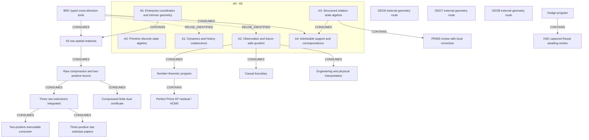

# Enterprise Math research progress map

<!-- Generated by tools/render_research_progress_map.py; edit research_progress_map.json. -->

Read A0–A5 for the global structure, then the evidence table and current closeout/frontier rows. BRC is a typed cross-direction tool; X6 is one A5 branch. This is a maintained source index, not a new theorem, full-repository audit or task-claim queue.

Snapshot: 2026-09-08. The 20 foundation/router pins were checked against aaf9b812 and the a9f120 composition base. Later immutable updates: raw PR1390 main aa5683f; H0O PR1391 source capture main b3d39a9, review pending; p2 consumer PR1394 main c27616a2, with original source 3ac5a5dd retained. The A3 correction is published at 3ac5a5dd; its main admission and whole-PR955 formal review remain pending. GEO/Hodge routes beyond the exact H0O leaf require source refresh.

Frozen main source: [`aaf9b8125ba3`](https://github.com/awdawmip/enterprise-math/commit/aaf9b8125ba3294932b5c90d80f700e02799c88e). Composition base: `a9f120f8292eb78d463da4eea53867a861fd99a5`.

## Direction map

Scope closure, a negative boundary, main integration, executable checks, Lean coverage and formal review are different facts. Arrows are typed below; CONTAINS is organizational, while dashed reuse edges do not assert a proved transfer. Historical Continuity never establishes a current claim.



## Comparable evidence at the stated scope

These are source statements and recorded receipts, not new checks performed by this map.

| Node / exact scope | Mathematics | Lean | Program evidence | Publication | Formal review |
| --- | --- | --- | --- | --- | --- |
| **A0 — Primitive discrete state algebra**<br>Roots/collapse, quotient-remainder, basin/gap and scale; P001–P009.<br>[S01](#source-s01), [S07](#source-s07), [S10](#source-s10) | Canonical scoped answers to P001–P009. | Catalog records T001–T015 root-Lean coverage; exact original statements only. | Source reports executable checks; not rerun for this map. | MAIN at the pinned source scope. | No new formal acceptance in this index. |
| **A1 — Dynamics and history coalescence**<br>Deterministic kernels, collisions and stabilization; P010/P011/P019/P020.<br>[S07](#source-s07), [S08](#source-s08) | Scoped collision/irreversibility results and stabilization classification. | P020 well-founded partial-order stabilization is source-recorded Lean checked. | Source reports executable checks; not rerun for this map. | MAIN at the pinned source scope. | No new formal acceptance in this index. |
| **A2 — Observation and future-safe quotient**<br>Declared future/action language; P018/P023/P024.<br>[S07](#source-s07), [S08](#source-s08), [S09](#source-s09) | Bounded quotient-root action basis and canonical partial-operation extension. | Action-basis theorem: LEAN_CHECKED_MAIN. Partial-operation extension: NOT LEAN-CHECKED. | Source reports executable checks; not rerun for this map. | MAIN at the pinned source scope. | No new formal acceptance in this index. |
| **A3 — Structured relation-state algebra**<br>Weighted relation field, lattice, scale/rank; richer than an unproved functional-kernel reduction.<br>[S08](#source-s08), [S13](#source-s13) | Canonical executable core; broader theorem claims keep their own WIP/canonical status. | No new Lean claim; consult exact source coverage. | Source reports executable checks; not rerun for this map. | MAIN at the pinned source scope. | No new formal acceptance in this index. |
| **A4 — Admissible support and correspondence**<br>Finite multivalued relations, MAY/MUST support, witnesses and Boolean BRC.<br>[S08](#source-s08), [S13](#source-s13) | R023 Boolean support core is canonical at its declared type. | R023 Boolean core: source-recorded LEAN_CHECKED_MAIN. | Source reports executable checks; not rerun for this map. | MAIN at the pinned source scope. | No new formal acceptance in this index. |
| **A5 — Enterprise coordinates and intrinsic geometry**<br>P022 geometry, exact graph distance/Barlow growth; X6 is one branch.<br>[S02](#source-s02), [S07](#source-s07), [S08](#source-s08) | Canonical executable geometry slices; the whole P022 remains OPEN. | No new Lean claim; consult exact source coverage. | Source reports executable checks; not rerun for this map. | MAIN at the pinned source scope. | No new formal acceptance in this index. |
| **BRC — BRC typed cross-direction tools**<br>Boolean support; positive weighted branches/histograms; signed analysis has its own contract.<br>[S02](#source-s02), [S03](#source-s03), [S06](#source-s06), [S08](#source-s08), [S11](#source-s11), [S14](#source-s14) | Native chain through critical degeneracy; WBRC-T39–T42 source status: PROVED_MAIN_BACKED_EXECUTABLE_CHECKED. | Boolean R023 only where stated; no all-BRC Lean claim. | Source reports executable checks; not rerun for this map. | MAIN at the pinned source scope. | No new formal acceptance in this index. |
| **X6 — X6 raw spatial readouts**<br>Same anchor, labelled signed Cell torsor; centered three-axis slice.<br>[S02](#source-s02), [S04](#source-s04), [S05](#source-s05) | Current P000-bound native foundation types. | No new Lean claim; consult exact source coverage. | Source reports executable checks; not rerun for this map. | MAIN at the pinned source scope. | No new formal acceptance in this index. |
| **RAW_PAPER — Raw compression and two-positive bound**<br>Finite rational signed difference after Jordan cancellation; all 20 raw three-axis L1 norms.<br>[S12](#source-s12), [S15](#source-s15), [S16](#source-s16), [S17](#source-s17) | Compression preserves coordinate-marginal L1; carrier ≤(p+1)^6. For p≤2, sharp 4M≤D; p=0/zero treated separately. | No Lean claim. | These two registrations are RESULT_ONLY with empty APIs; proof is paper evidence. | MAIN at the pinned source scope. | Internal paper review recorded; no formal acceptance assigned by the shard. |
| **RAW_EXT — Three raw extensions integrated**<br>Compression certificate; p≤2 equality rectangle; p3 seven-point mass-boundary probe.<br>[S23](#source-s23), [S31](#source-s31) | Nonzero p≤2 equality is an equal-weight original-coordinate rectangle. Seven-point M=7,D=26 gives only a general p3 lower bound 7/26. | No Lean claim. | Compression: author 18 cases/360 tables + independent 5/100; main combination receipt. Only audit_compression is public API. | MAIN_INTEGRATED via PR1390 at aa5683f; applicable CI and 8 shards passed per publisher readback. | Candidate classifications preserved; two results remain RESULT_ONLY; no formal acceptance. |
| **P2_CONSUMER — Two-positive executable consumer**<br>Original raw signed X6, post-Jordan p≤2; exact per-table checks and equality witness.<br>[S24](#source-s24), [S25](#source-s25), [S26](#source-s26), [S27](#source-s27), [S32](#source-s32), [S35](#source-s35) | Consumes existing bound/equality papers; adds no wider theorem. | No Lean claim. | Independent 9 cases/180 tables and 19 rejections recorded; portable evidence published. Not rerun by the map. | MAIN_INTEGRATED via PR1394 at c27616a2. Three applicable CI workflows and 8 shards passed; publisher verified the actual merge tree/parents against tested checkout 7868d30a. Original author/independent source 3ac5a5dd is retained. | Independent execution review is not formal mathematical acceptance. |
| **STAR — Three-positive star subclass papers**<br>Three positive points obtained by three distinct single-axis changes from a common base; arbitrary nonzero signed spans.<br>[S33](#source-s33), [S34](#source-s34) | Internal paper PASS: sharp M≤(7/26)D; equal-mass fixed-weight min D=max(8P,24m−4P), m=max weights, within the star contract. | No Lean claim. | Paper-only results; no new executable verification claimed. | OWNER_SOURCE_PUBLISHED; main admission pending. | Internal bounded paper review only; no formal review or status promotion. |
| **RAW_DUAL — Compressed finite dual certificate**<br>Fixed finite positive support S; twenty complete bounded integer tables on its compressed carrier.<br>[S22](#source-s22), [S15](#source-s15), [S33](#source-s33) | Bounded paper PASS: LD≥Σ a_s w_s+BN and a complete gap identity. Uniform M bound needs a_s≥A and B≥A. | No Lean claim. | Proposed finite verification interface is not implemented by this paper. | OWNER_SOURCE_PUBLISHED; main admission pending. | Internal paper review only; no formal task/Result/review authority. |
| **A3_A4_REVIEW — PR955 review with local correction**<br>Frozen generated-support quotient/interpolation return, unchanged original source.<br>[S29](#source-s29), [S30](#source-s30) | Local correction paper PASS: im W=H, H/L=Z⊕Z/2; ambient Z4/L=Z²⊕Z/2. Same quotient can have different Q0. | No new Lean claim. | Old finite evidence remains historical; no replay for the correction/map. | PR955 frozen source plus correction published at 3ac5a5dd; correction main admission pending. | Local rank clarification closed; whole PR955 formal Driver review remains pending. |
| **NUMBER_THEORY — Number-theoretic program**<br>Legendre pressure tests (P017), precision/arithmetic applications and Perfect Prime residual work.<br>[S07](#source-s07), [S08](#source-s08), [S09](#source-s09) | P017 is OPEN; substantial structural results are not a Legendre conjecture proof. | Use each exact theorem scope; no conjecture-level Lean claim. | Source reports executable checks; not rerun for this map. | MAIN at the pinned source scope. | No new formal acceptance in this index. |
| **PERFECT_PRIME — Perfect Prime AP residual / HCM0**<br>The September 3 residual Mobius/Bernstein coefficient-positivity return.<br>[S18](#source-s18), [S19](#source-s19), [S20](#source-s20) | Return gives all-m signed squared-secant coefficient representation and endpoint factors; positivity reduced to HCM0. | No Lean coverage verified here. | Stronger full Hausdorff pattern has finite m=2..10 evidence only. | MAIN at the pinned source scope. | Result requests Driver review; current operational review not refreshed. |
| **P021 — Causal boundary**<br>Finite graph plus integer expansion, consuming P018 observation/refinement.<br>[S07](#source-s07), [S08](#source-s08) | Canonical executable finite slice; P021 overall OPEN. | No new Lean claim; consult exact source coverage. | Source reports executable checks; not rerun for this map. | MAIN at the pinned source scope. | No new formal acceptance in this index. |
| **E001 — Engineering and physical interpretation**<br>Material impulse, tick order, measured-polyline refinement and finite residual conservation.<br>[S07](#source-s07), [S08](#source-s08) | Canonical executable finite slices; P016 closed only at falsification-protocol scope. | No new Lean claim; consult exact source coverage. | Source reports executable checks; not rerun for this map. | MAIN at the pinned source scope. | No new formal acceptance in this index. |
| **GEO6 — GEO6 external geometry route**<br>Existing historical direction; latest exact result/review not retrieved.<br>[S21](#source-s21) | SOURCE_REFRESH_REQUIRED; no present closure assertion. | SOURCE_REFRESH_REQUIRED. | SOURCE_REFRESH_REQUIRED. | Historical pointers only; present main/owner status not inferred. | SOURCE_REFRESH_REQUIRED; no live claim inferred. |
| **GEO7 — GEO7 external geometry route**<br>Existing historical direction; latest exact result/review not retrieved.<br>[S21](#source-s21) | SOURCE_REFRESH_REQUIRED; no present closure assertion. | SOURCE_REFRESH_REQUIRED. | SOURCE_REFRESH_REQUIRED. | Historical pointers only; present main/owner status not inferred. | SOURCE_REFRESH_REQUIRED; no live claim inferred. |
| **GEO8 — GEO8 external geometry route**<br>Existing historical direction; latest exact result/review not retrieved.<br>[S21](#source-s21) | SOURCE_REFRESH_REQUIRED; no present closure assertion. | SOURCE_REFRESH_REQUIRED. | SOURCE_REFRESH_REQUIRED. | Historical pointers only; present main/owner status not inferred. | SOURCE_REFRESH_REQUIRED; no live claim inferred. |
| **HODGE — Hodge program**<br>Existing program; H0O is one bounded leaf, not the entire program.<br>[S21](#source-s21), [S28](#source-s28) | Other routes: SOURCE_REFRESH_REQUIRED. | SOURCE_REFRESH_REQUIRED. | No whole-program executable audit performed. | Only the H0O capture below was newly verified. | No program-wide acceptance or claim inference. |
| **H0O — H0O captured Result awaiting review**<br>Pure codimension-3 Poincare-polarization intermediate support family on the same nonsplit target.<br>[S28](#source-s28) | Original Result declares NEGATIVE_BOUNDARY: this family cannot create the first exceptional seed. | No new Lean claim. | Original output/Execution record preserved; 18 capture control checks are not a new mathematical replay. | MAIN_SOURCE_CAPTURED at b3d39a9 via PR1391. Old PR1148 closed as duplicated source, not mathematical closure. | Canonical FROZEN_RETURN / AWAITING_REVIEW, claim null at the verified snapshot; formal Driver review pending. |

## Unfinished frontier and existing next action

Reading order only; this is not the live task-selection queue.

| Reading priority | Node | What remains / limiting boundary | Existing next action |
| --- | --- | --- | --- |
| Current closeout | STAR | No extension to arbitrary three-positive geometry; fixed-weight paper does not classify every minimizer above the 8P regime. | Consolidate the already reviewed papers through the existing source/main path; do not restart the proof. |
| Current closeout | RAW_DUAL | No automatic optimal-dual search or universal p3 bound; tight compressed points can have infinite original fibers. | First consolidate the frozen paper; any later verifier must check complete tables, source binding and carrier budget. |
| Current closeout | A3_A4_REVIEW | Do not equate an ambient quotient rank with the minimal realizable state data; no new research assignment. | Review the original handoff with the narrow correction and preserve unrelated arguments. |
| Current closeout | H0O | No non-algebraicity claim; other genuinely mixing kernels or explicit exceptional cycles remain open. | Review preserved TP2-A314F727276CFF8CE168 / RR-FB3CF77C4F611FDED79B at its exact scope; do not re-claim or re-research from this map. |
| Existing mathematical frontier | NUMBER_THEORY | Centered prime-radius results have left-prime/size hypotheses and imply neither universal symmetric pairs nor Goldbach. | Keep the existing P017/Perfect Prime mathematical frontier visible alongside the X6 branch. |
| Existing mathematical frontier | PERFECT_PRIME | HCM0 / signed-secant Hausdorff lift and mother-determinant nonvanishing remain OPEN. | Resume from the exact residual/HCM0 gap after current handoff verification; do not restart the rejected block/inertia route. |
| Existing mathematical frontier | P021 | Causal focusing, direction/witness composition and physical interpretation remain open. | Continue a specified finite causal/observation contract without importing a physical theorem. |
| Existing mathematical frontier | E001 | Not a universal constitutive/mechanics theorem; finite readings do not recover an unknown continuous curve. | Bind any application to actual measurements and the existing falsification contract. |
| Refresh exact source when selected | GEO6 | Historical closure/revalidation language is not a current verdict. | Refresh one exact current source/handoff if this existing route is selected. |
| Refresh exact source when selected | GEO7 | Historical closure/revalidation language is not a current verdict. | Refresh one exact current source/handoff if this existing route is selected. |
| Refresh exact source when selected | GEO8 | Historical closure/revalidation language is not a current verdict. | Refresh one exact current source/handoff if this existing route is selected. |
| Refresh exact source when selected | HODGE | Do not generalize H0O seed-conservation to a Hodge/non-algebraicity theorem. | Finish H0O review; refresh other routes only on their own exact source. |
| Integrated; reuse without repeating | RAW_EXT | A low-level pushforward has no arbitrary-input norm guarantee; no general p3 upper bound. Equal-mass probe covers its symmetric family only. | Reuse the integrated API/source package; retain source and execution-generation distinctions. |
| Integrated; reuse without repeating | P2_CONSUMER | This closes the bounded tool-admission subflow only; p≤2 and the original raw-coordinate contract remain binding. Main integration does not add a higher-p theorem or formal mathematical acceptance. | Reuse the admitted consumer and its exact registered API/evidence; preserve the source and main-composition receipts without repeating completed admission. |
| Direction and scoped established results | A0 | Scope closure does not make every newly proposed operator obey the old identities. | Reuse the exact operator contract and theorem before extending it. |
| Direction and scoped established results | A1 | No automatic physical time-arrow or thermodynamic-entropy theorem. | Keep any physical interpretation distinct from the deterministic theorem. |
| Direction and scoped established results | A2 | P018/P023/P024 remain open programs; state-dependent and higher-dimensional languages need exact contracts. | Continue only a specified language/observation gap; preserve enabledness for partial operations. |
| Direction and scoped established results | A3 | The PR955 handoff is one review leaf, not completion of A3. | Consume the explicit A3→A4 bridge and finish the existing PR955 review scope. |
| Direction and scoped established results | A4 | Boolean support forgets multiplicity, provenance, weights and signed cancellation. | Choose the support or weighted/provenance type explicitly at each interface. |
| Direction and scoped established results | A5 | A representation/readout is not automatically a state isometry or a physical interpretation. | Route geometry work through its exact coordinate and observation contract. |
| Direction and scoped established results | BRC | Total mass cannot recover critical tie multiplicity; general algebraic correction is not rational LN. | Reuse/compose the exact existing type; do not invent a synonymous global family. |
| Direction and scoped established results | X6 | can3 alone loses common offset. Raw analysis does not reconstruct microscopic BRC or branch history. | Keep Spatial6 identity, Jordan cancellation and the exact declared raw observations bound together. |
| Direction and scoped established results | RAW_PAPER | Carrier bound is not support count; no native isometry/history preservation or p≥3 theorem. | Consume the exact two-result contracts; separate later equality/tool extensions. |

## Typed connections

- `CONTAINS`: Existing organizational home or bounded leaf; no theorem implication.
- `CONSUMES`: A source declares use of the exact upstream contract in the stated scope.
- `REUSE_IDENTIFIED`: Typed reuse is identified, without asserting execution or a new proved transfer.

| From → to | Type | Exact meaning / boundary | Sources |
| --- | --- | --- | --- |
| A3 → A4 | `CONSUMES` | A4 explicit executable bridge consumes the A3 relation-state slice. | [S08](#source-s08), [S13](#source-s13) |
| BRC → A4 | `CONSUMES` | Boolean split/image/recoalescence support interface only. | [S08](#source-s08), [S13](#source-s13) |
| BRC → A1 | `REUSE_IDENTIFIED` | Typed branch histories/recurrent tools are reusable; this edge asserts no new dynamics theorem transfer. | [S02](#source-s02), [S03](#source-s03) |
| BRC → A2 | `REUSE_IDENTIFIED` | Observation compression must explicitly retain the required branch/histogram data. | [S03](#source-s03), [S08](#source-s08) |
| BRC → X6 | `CONSUMES` | X6 analysis consumes the native signed-BRC/Cell contract; negative analysis weights are not negative primitive populations. | [S02](#source-s02), [S05](#source-s05) |
| A5 → X6 | `CONTAINS` | X6 is an A5 geometry branch, not a replacement global skeleton. | [S02](#source-s02), [S08](#source-s08) |
| X6 → RAW_PAPER | `CONSUMES` | Raw results require the same anchor, labelled coordinates and Jordan cancellation. | [S05](#source-s05), [S15](#source-s15) |
| RAW_PAPER → RAW_EXT | `CONSUMES` | Certificate/equality/probe extend existing raw-stability contracts, with separate classifications. | [S15](#source-s15), [S31](#source-s31) |
| RAW_EXT → P2_CONSUMER | `CONSUMES` | Consumer uses the existing p≤2 bound and equality paper. | [S24](#source-s24), [S32](#source-s32) |
| RAW_EXT → STAR | `CONSUMES` | Star papers refine the seven-point probe in a specified positive-support geometry only. | [S31](#source-s31), [S33](#source-s33), [S34](#source-s34) |
| RAW_PAPER → RAW_DUAL | `CONSUMES` | Paper uses exact compression and complete raw-table dual pairing; no generic new family. | [S15](#source-s15), [S22](#source-s22) |
| A3 → A3_A4_REVIEW | `CONTAINS` | Existing A3/A4 review handoff leaf. | [S29](#source-s29), [S30](#source-s30) |
| A2 → P021 | `CONSUMES` | Finite causal boundary explicitly consumes P018 observation/refinement. | [S07](#source-s07), [S08](#source-s08) |
| A2 → NUMBER_THEORY | `CONSUMES` | Scoped P018 centered-prime-radius application; not a Goldbach/Legendre proof. | [S08](#source-s08) |
| NUMBER_THEORY → PERFECT_PRIME | `CONTAINS` | Existing number-theoretic residual route; no inferred theorem dependence on X6. | [S19](#source-s19) |
| A2 → E001 | `CONSUMES` | Measured refinement consumes actual new finite observations, not interpolated continuum data. | [S08](#source-s08) |
| HODGE → H0O | `CONTAINS` | One exact frozen negative-boundary Result awaiting mathematical review. | [S28](#source-s28) |

## Immutable source pins and evidence depth

Source IDs resolve below; SHA256 values pin file contents. An immutable file link does not prove current runtime authority.

- `FROZEN_MAIN_SOURCE`: File bytes checked at the frozen main; mathematical wording is a source declaration, not a fresh proof run.
- `PUBLISHED_PIN_READBACK`: Exact published content pin inspected; publication readback supplied by the owner. No mathematical rerun by this index.
- `PUBLISHED_RECEIPT_NOT_REEXECUTED`: A published execution receipt is indexed with its original execution generation, not relabelled as a new run.
- `RETURN_DECLARATION_NOT_REVIEW`: Frozen return/Result declaration only; this does not itself supply formal review acceptance.
- `HISTORICAL_ROUTING_ONLY`: Historical route pointer; not current mathematical/claim/review authority.

<a id="source-s01"></a>
- **S01** [README.md](https://github.com/awdawmip/enterprise-math/blob/aaf9b8125ba3294932b5c90d80f700e02799c88e/README.md); `FROZEN_MAIN_SOURCE`; SHA256 `6a7346a84bdd0bf133681c4ee0f59591c459ca925c95471d70edf8f8c6301fc9`.

<a id="source-s02"></a>
- **S02** [definitions/00_CURRENT_NATIVE_FOUNDATION.md](https://github.com/awdawmip/enterprise-math/blob/aaf9b8125ba3294932b5c90d80f700e02799c88e/definitions/00_CURRENT_NATIVE_FOUNDATION.md); `FROZEN_MAIN_SOURCE`; SHA256 `b98bcb492b322bcc8e5c04a36143a16b0d203238e6917b564db03f6a683fe6f5`.

<a id="source-s03"></a>
- **S03** [definitions/ENTERPRISE_BRC_CRITICAL_DEGENERACY_THEOREM_LEDGER_20260903.json](https://github.com/awdawmip/enterprise-math/blob/aaf9b8125ba3294932b5c90d80f700e02799c88e/definitions/ENTERPRISE_BRC_CRITICAL_DEGENERACY_THEOREM_LEDGER_20260903.json); `FROZEN_MAIN_SOURCE`; SHA256 `a6db22636708a30963417edd1a3a749e5e271c57a5fc1beee4cdee85210093bf`.

<a id="source-s04"></a>
- **S04** [definitions/ENTERPRISE_X6_CENTERED_THREE_AXIS_SLICE_REBASE_20260905.md](https://github.com/awdawmip/enterprise-math/blob/aaf9b8125ba3294932b5c90d80f700e02799c88e/definitions/ENTERPRISE_X6_CENTERED_THREE_AXIS_SLICE_REBASE_20260905.md); `FROZEN_MAIN_SOURCE`; SHA256 `f5f637a97154c9516053efde1c0222ba444eb68cc5afebc9b347ff9b042e1515`.

<a id="source-s05"></a>
- **S05** [definitions/ENTERPRISE_X6_NATIVE_SPATIAL_CELL_TORSOR_20260905.md](https://github.com/awdawmip/enterprise-math/blob/aaf9b8125ba3294932b5c90d80f700e02799c88e/definitions/ENTERPRISE_X6_NATIVE_SPATIAL_CELL_TORSOR_20260905.md); `FROZEN_MAIN_SOURCE`; SHA256 `519a16725156be5461c6e28a0dcef664e267cff4e85120cfb257d5d540ec459e`.

<a id="source-s06"></a>
- **S06** [docs/ENTERPRISE_TOOLBOX_REGISTRY.md](https://github.com/awdawmip/enterprise-math/blob/aaf9b8125ba3294932b5c90d80f700e02799c88e/docs/ENTERPRISE_TOOLBOX_REGISTRY.md); `FROZEN_MAIN_SOURCE`; SHA256 `1a94e1728586d6a0add42bbb5fb9788281f0c057b132c93cfe5b174fde8c15e9`.

<a id="source-s07"></a>
- **S07** [docs/PROBLEM_STATUS.zh-CN.md](https://github.com/awdawmip/enterprise-math/blob/aaf9b8125ba3294932b5c90d80f700e02799c88e/docs/PROBLEM_STATUS.zh-CN.md); `FROZEN_MAIN_SOURCE`; SHA256 `2841b3a7effc0dc579bc7cf3ed619c27706fce2be3e6c81a728a5b3fd1124a98`.

<a id="source-s08"></a>
- **S08** [docs/RESEARCH_COMMON_SURFACE.en.md](https://github.com/awdawmip/enterprise-math/blob/aaf9b8125ba3294932b5c90d80f700e02799c88e/docs/RESEARCH_COMMON_SURFACE.en.md); `FROZEN_MAIN_SOURCE`; SHA256 `c27a61db61b3a759e235ff65e422ec6d96069e9dab1da8809de278eb7f97e7c8`.

<a id="source-s09"></a>
- **S09** [docs/ROADMAP.zh-CN.md](https://github.com/awdawmip/enterprise-math/blob/aaf9b8125ba3294932b5c90d80f700e02799c88e/docs/ROADMAP.zh-CN.md); `FROZEN_MAIN_SOURCE`; SHA256 `54666215710011efa341a50e0b3bfd73b676d60eb2e2fbe70979321f012b722e`.

<a id="source-s10"></a>
- **S10** [docs/THEOREMS.zh-CN.md](https://github.com/awdawmip/enterprise-math/blob/aaf9b8125ba3294932b5c90d80f700e02799c88e/docs/THEOREMS.zh-CN.md); `FROZEN_MAIN_SOURCE`; SHA256 `e7d180cf616f5538e6135a893297a9d24cadfea704801d2d1a99cdc26ba98457`.

<a id="source-s11"></a>
- **S11** [enterprise_toolbox_registry.json](https://github.com/awdawmip/enterprise-math/blob/aaf9b8125ba3294932b5c90d80f700e02799c88e/enterprise_toolbox_registry.json); `FROZEN_MAIN_SOURCE`; SHA256 `d8a0a7e6e2090def201175d9f42da1b1c2a56e80fe5a5220ab5c6c8e12da10e6`.

<a id="source-s12"></a>
- **S12** [experiments/owner_raw_stability_harvest_20260908/validate_registration.py](https://github.com/awdawmip/enterprise-math/blob/aaf9b8125ba3294932b5c90d80f700e02799c88e/experiments/owner_raw_stability_harvest_20260908/validate_registration.py); `FROZEN_MAIN_SOURCE`; SHA256 `bfd8fa0bf33a047318d37809020b796e728b5d604e4861222cea3f469bc28983`.

<a id="source-s13"></a>
- **S13** [research_common_surface.json](https://github.com/awdawmip/enterprise-math/blob/aaf9b8125ba3294932b5c90d80f700e02799c88e/research_common_surface.json); `FROZEN_MAIN_SOURCE`; SHA256 `3a2e9da23c98ab0e7daf7292bc8da8a78bcb237221dbf01d40ad377454e7f74e`.

<a id="source-s14"></a>
- **S14** [research_method_inventory.json](https://github.com/awdawmip/enterprise-math/blob/aaf9b8125ba3294932b5c90d80f700e02799c88e/research_method_inventory.json); `FROZEN_MAIN_SOURCE`; SHA256 `f6b221bcd7050ddea5965bcb80d6cf64c98e99d23f9ae6cbadb8e23a390f7402`.

<a id="source-s15"></a>
- **S15** [research_method_inventory_addenda/20260908_owner_raw_stability_results.json](https://github.com/awdawmip/enterprise-math/blob/aaf9b8125ba3294932b5c90d80f700e02799c88e/research_method_inventory_addenda/20260908_owner_raw_stability_results.json); `FROZEN_MAIN_SOURCE`; SHA256 `b1d4d216f76bde3fa2964912db68c96d5ff68b661ce793054e18df44048e95eb`.

<a id="source-s16"></a>
- **S16** [research_notes/OWNER_TWO_POSITIVE_RAW_STABILITY_BOUND_REVIEW_20260908.md](https://github.com/awdawmip/enterprise-math/blob/aaf9b8125ba3294932b5c90d80f700e02799c88e/research_notes/OWNER_TWO_POSITIVE_RAW_STABILITY_BOUND_REVIEW_20260908.md); `FROZEN_MAIN_SOURCE`; SHA256 `1bb732a50cccbbec6c8c11950104c62eed9afc15f326fcc39d9142bd13b24a35`.

<a id="source-s17"></a>
- **S17** [research_notes/OWNER_TWO_POSITIVE_RAW_STABILITY_INDEPENDENT_AUDIT_20260908.md](https://github.com/awdawmip/enterprise-math/blob/aaf9b8125ba3294932b5c90d80f700e02799c88e/research_notes/OWNER_TWO_POSITIVE_RAW_STABILITY_INDEPENDENT_AUDIT_20260908.md); `FROZEN_MAIN_SOURCE`; SHA256 `f610e3d642b53279efa91dec15ad3b392270768f73ad0a31edf38212b60be61c`.

<a id="source-s18"></a>
- **S18** [research_result_records/RS-PERFECT-PRIME-AP-RESIDUAL-MOBIUS-BERNSTEIN-COEFFICIENT-POSITIVITY/RR-23D512CBD58341BB6BDB.json](https://github.com/awdawmip/enterprise-math/blob/aaf9b8125ba3294932b5c90d80f700e02799c88e/research_result_records/RS-PERFECT-PRIME-AP-RESIDUAL-MOBIUS-BERNSTEIN-COEFFICIENT-POSITIVITY/RR-23D512CBD58341BB6BDB.json); `FROZEN_MAIN_SOURCE`; SHA256 `c9e89b1b54d21e196ac6ba23a810d4f701bedc9b879b9d3d2fee8cb3dea40a21`.

<a id="source-s19"></a>
- **S19** [research_returns/PERFECT_PRIME_AP_RESIDUAL_MOBIUS_BERNSTEIN_COEFFICIENT_POSITIVITY_RETURN_20260903.md](https://github.com/awdawmip/enterprise-math/blob/aaf9b8125ba3294932b5c90d80f700e02799c88e/research_returns/PERFECT_PRIME_AP_RESIDUAL_MOBIUS_BERNSTEIN_COEFFICIENT_POSITIVITY_RETURN_20260903.md); `FROZEN_MAIN_SOURCE`; SHA256 `617b34abac20d524023933a09777b85aa4220e1962283586c1c2121d3031b28d`.

<a id="source-s20"></a>
- **S20** [research_task_records/RS-PERFECT-PRIME-AP-RESIDUAL-MOBIUS-BERNSTEIN-COEFFICIENT-POSITIVITY/TP2-8C910B14D7B854905F6E.json](https://github.com/awdawmip/enterprise-math/blob/aaf9b8125ba3294932b5c90d80f700e02799c88e/research_task_records/RS-PERFECT-PRIME-AP-RESIDUAL-MOBIUS-BERNSTEIN-COEFFICIENT-POSITIVITY/TP2-8C910B14D7B854905F6E.json); `FROZEN_MAIN_SOURCE`; SHA256 `16283a9087c8a84685f418de70f5c6592188c0dd97e4cd929cdaca31717df62e`.

<a id="source-s21"></a>
- **S21** [Historical Driver Continuity](https://github.com/awdawmip/chatgpt-global-knowledge/blob/a624e4dad38f144ff748892c1e08f134eb396007/projects/enterprise-math/DRIVER_CONTINUITY.md); `HISTORICAL_ROUTING_ONLY`; SHA256 `494c7c3df7594dffbadee810f78d9b70f2d189de19b0fe80ec29bfd4b42e72b8`.

<a id="source-s22"></a>
- **S22** [Compressed raw dual certificate paper](https://github.com/awdawmip/enterprise-math/blob/6724f761dd2aff998892a331efb5649d835b0f8d/research_notes/OWNER_COMPRESSED_RAW_DUAL_CERTIFICATE_REVIEW_20260908.md); `PUBLISHED_PIN_READBACK`; SHA256 `193e5833b3d59e434ff656779839501af6ddd6ece9a40b6fe36aad406071bbdc`.

<a id="source-s23"></a>
- **S23** [Raw extension composition receipt (execution at its recorded input)](https://github.com/awdawmip/enterprise-math/blob/aa5683f158b993f8a3aa7e4e6bbfcf426768cd75/experiments/owner_raw_stability_extensions_harvest_20260908/current_main_composition_20260908.json); `PUBLISHED_RECEIPT_NOT_REEXECUTED`; SHA256 `0d93b2484c07bce5c5fd7e9d598c0a089952c7c63e1de3e487741f6a9f6f00fe`.

<a id="source-s24"></a>
- **S24** [Two-positive consumer](https://github.com/awdawmip/enterprise-math/blob/3ac5a5dd0e3b62f489cf1a5a1739b63b90c53b8f/experiments/owner_two_positive_stability_20260908/check_two_positive_stability.py); `PUBLISHED_PIN_READBACK`; SHA256 `3fe2fa6c824b7cff1fca4ad9a3f0235fc008c2a00b152893559eed54d2f63da7`.

<a id="source-s25"></a>
- **S25** [Two-positive author certificate](https://github.com/awdawmip/enterprise-math/blob/3ac5a5dd0e3b62f489cf1a5a1739b63b90c53b8f/experiments/owner_two_positive_stability_20260908/certificate.json); `PUBLISHED_RECEIPT_NOT_REEXECUTED`; SHA256 `244e9cd7844e391b3f19cdbebaaad36fd70ddf14c97701252847ca2a50761e7e`.

<a id="source-s26"></a>
- **S26** [Two-positive portable independent review](https://github.com/awdawmip/enterprise-math/blob/3ac5a5dd0e3b62f489cf1a5a1739b63b90c53b8f/experiments/owner_two_positive_stability_20260908/independent_review_20260908/README.md); `PUBLISHED_PIN_READBACK`; SHA256 `c01d49cd12927db32cb14a515707ebf4e4c72214caf47f2229bc7eaff9e2490a`.

<a id="source-s27"></a>
- **S27** [Two-positive independent execution receipt](https://github.com/awdawmip/enterprise-math/blob/3ac5a5dd0e3b62f489cf1a5a1739b63b90c53b8f/experiments/owner_two_positive_stability_20260908/independent_review_20260908/validation.json); `PUBLISHED_RECEIPT_NOT_REEXECUTED`; SHA256 `513f65ccf2c08796adadfd2ebeafb4fd8fb4f2fb6b540d913af537a51df479ac`.

<a id="source-s28"></a>
- **S28** [H0O original Result captured unchanged on main](https://github.com/awdawmip/enterprise-math/blob/b3d39a9ccb0bef7ca9d9eec74eb6175ac4ed0e26/research_result_records/RS-HODGE-H0O-NONSPLIT-WEIL-INTERMEDIATE-SUPPORT-FM-EXCEPTIONAL-CH3/RR-FB3CF77C4F611FDED79B.json); `RETURN_DECLARATION_NOT_REVIEW`; SHA256 `41acd75fe81e00f1561d6076c5b8987da829079b751f55b9a6adf152c6433657`.

<a id="source-s29"></a>
- **S29** [PR955 frozen return](https://github.com/awdawmip/enterprise-math/blob/684754b69d1767a4c38b6c56af3fa2d0a43cc62c/research_returns/A3_A4_GENERATED_SUPPORT_QUOTIENT_INTERPOLATION_RETURN_20260830.md); `RETURN_DECLARATION_NOT_REVIEW`; SHA256 `f954f4f7038e01c064e6188ddac15fa4ee49394958a2b938da5f1a42052477d5`.

<a id="source-s30"></a>
- **S30** [A3/A4 realizable-image quotient correction](https://github.com/awdawmip/enterprise-math/blob/3ac5a5dd0e3b62f489cf1a5a1739b63b90c53b8f/research_notes/OWNER_A3_A4_QUOTIENT_IMAGE_CORRECTION_20260908.md); `PUBLISHED_PIN_READBACK`; SHA256 `cbed25b3548323770b973430df4ccbd9c31a8f772886b6fd8a1d4d3ea42bdafb`.

<a id="source-s31"></a>
- **S31** [Three raw extensions: exact classifications and APIs](https://github.com/awdawmip/enterprise-math/blob/aa5683f158b993f8a3aa7e4e6bbfcf426768cd75/research_method_inventory_addenda/20260908_owner_raw_stability_extensions.json); `PUBLISHED_PIN_READBACK`; SHA256 `506bc35b11c211f351d26ac0f19e1f3ba09b841521cfb49302067f69b293b571`.

<a id="source-s32"></a>
- **S32** [Two-positive consumer contract](https://github.com/awdawmip/enterprise-math/blob/3ac5a5dd0e3b62f489cf1a5a1739b63b90c53b8f/experiments/owner_two_positive_stability_20260908/README.md); `PUBLISHED_PIN_READBACK`; SHA256 `929dedf2a8f5ac05b965406ad15eca1ecab27c05d9586fdbdf2406af2843c327`.

<a id="source-s33"></a>
- **S33** [Star subclass sharp bound and equality paper](https://github.com/awdawmip/enterprise-math/blob/6724f761dd2aff998892a331efb5649d835b0f8d/research_notes/OWNER_THREE_POSITIVE_STAR_SHARP_STABILITY_REVIEW_20260908.md); `PUBLISHED_PIN_READBACK`; SHA256 `6a809986a77a5cc21deb8cdb4062af13d44993fc465b073111eaacf5f7671fe1`.

<a id="source-s34"></a>
- **S34** [Star fixed-weight equal-mass profile paper](https://github.com/awdawmip/enterprise-math/blob/6724f761dd2aff998892a331efb5649d835b0f8d/research_notes/OWNER_THREE_POSITIVE_STAR_WEIGHT_PROFILE_REVIEW_20260908.md); `PUBLISHED_PIN_READBACK`; SHA256 `fe5169d2e5e093d21753ad27994825ecf4f58d9ea2fa19d042dd445e78b6e0e6`.

<a id="source-s35"></a>
- **S35** [Two-positive current-main composition receipt (original execution generation)](https://github.com/awdawmip/enterprise-math/blob/c27616a2e176c2d03000ad2e56a72280f8bd205a/experiments/20260908_owner_two_positive_stability/current_main_composition_20260908.json); `PUBLISHED_RECEIPT_NOT_REEXECUTED`; SHA256 `12678881fee7a0074da3bc77a9baed5ed52858041f9d9a0a7a9839f003f90ae2`.

## Maintenance

Edit only research_progress_map.json for graph content; retain semantic IDs and immutable source pins, then regenerate both documents. Update factual rows from exact source/receipt evidence, keeping old source links when they remain provenance. CURRENT_CLOSEOUT means consolidation/review of existing work; MATHEMATICAL_FRONTIER means an existing unresolved mathematical gap, not an instruction to claim it. A completed bounded leaf does not close its parent program. Use current canonical runtime for actual handoff/claim decisions.

```sh
python tools/render_research_progress_map.py
python tools/render_research_progress_map.py --check
```

`--check` checks the JSON structure, local source-ID references, immutable-pin syntax and generated bytes. It performs no network fetch, theorem check, CI run, live claim lookup or status promotion. Reverify source contents before updating a pin or a factual frontier.
