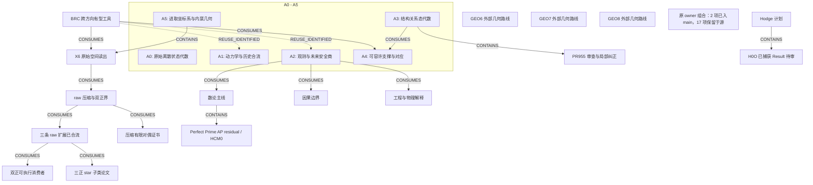

# 进取数论研究进度图

<!-- Generated by tools/render_research_progress_map.py; edit research_progress_map.json. -->

先读 A0–A5 全局骨架，再看证据表与当前收尾/数学前沿。BRC 是跨方向有型工具；X6 只是 A5 一支。本图是可维护来源索引，不是新定理、全仓审计或任务领取队列。

快照：2026-09-08。20 个基础/路由 pin 仍冻结于 aaf9b812。本图初版经 PR1396 在 dc401229 入 main。后续已核前沿：raw PR1390 入 main aa5683f；H0O PR1391 在 b3d39a9 捕获入 main、正式审查待办；p2 PR1394 入 main c27616a2；star/dual PR1398 入 main 167746c5。A3 纠正 PR1399 已入 main d4bad545，原源 3ac5a5dd 保留；整份 PR955 正式 Driver 审查仍待办。原 owner 19 项组合是来源快照，不是仓库总数或 live 队列；其他 GEO/Hodge 路线需精确来源刷新。

冻结主线来源: [`aaf9b8125ba3`](https://github.com/awdawmip/enterprise-math/commit/aaf9b8125ba3294932b5c90d80f700e02799c88e). 组合基线: `d4bad54522bc0abf63e11d1ec03977efdb6f57b6`.

## 方向图

范围闭合、负向边界、入 main、程序检查、Lean 覆盖与正式审查是不同事实。边的型别见下表；CONTAINS 仅表示归属，虚线复用边不声称已证传递。历史 Continuity 不能建立当前 claim。



## 同一范围内的证据对照

以下区分来源声明与已记录回执；建图本身没有重新证明或执行数学。

| 节点 / 精确范围 | 数学证据 | Lean | 程序证据 | 发布层 | 正式审查 |
| --- | --- | --- | --- | --- | --- |
| **A0 — 原始离散状态代数**<br>根/坍缩、商余、盆/间隙与尺度；P001–P009。<br>[S01](#source-s01), [S07](#source-s07), [S10](#source-s10) | P001–P009 在各自合同内已有规范答案。 | 目录记载 T001–T015 的 root Lean 覆盖，仅限原始精确命题。 | 来源记录可执行检查，建图未重跑。 | 所引范围已在 MAIN。 | 本索引不新增正式接受。 |
| **A1 — 动力学与历史合流**<br>确定性核、碰撞与稳定化；P010/P011/P019/P020。<br>[S07](#source-s07), [S08](#source-s08) | 已有精确碰撞/不可逆性结果与稳定化分类。 | P020 良基偏序稳定化由来源记载为 Lean 已核。 | 来源记录可执行检查，建图未重跑。 | 所引范围已在 MAIN。 | 本索引不新增正式接受。 |
| **A2 — 观测与未来安全商**<br>已声明未来/动作语言；P018/P023/P024。<br>[S07](#source-s07), [S08](#source-s08), [S09](#source-s09) | 有界 quotient-root 动作基与规范部分操作扩展。 | 动作基定理：LEAN_CHECKED_MAIN；部分操作扩展：NOT LEAN-CHECKED。 | 来源记录可执行检查，建图未重跑。 | 所引范围已在 MAIN。 | 本索引不新增正式接受。 |
| **A3 — 结构关系态代数**<br>加权关系场、格、尺度/秩；未经证明不降格为普通函数核。<br>[S08](#source-s08), [S13](#source-s13) | 规范可执行核心；更广定理保留各自 WIP/规范状态。 | 不新增 Lean 声称，按原来源覆盖范围读取。 | 来源记录可执行检查，建图未重跑。 | 所引范围已在 MAIN。 | 本索引不新增正式接受。 |
| **A4 — 可容许支撑与对应**<br>有限多值关系、MAY/MUST 支撑、见证与 Boolean BRC。<br>[S08](#source-s08), [S13](#source-s13) | R023 Boolean 支撑核心在其声明型别内规范化。 | R023 Boolean 核心：来源记载 LEAN_CHECKED_MAIN。 | 来源记录可执行检查，建图未重跑。 | 所引范围已在 MAIN。 | 本索引不新增正式接受。 |
| **A5 — 进取坐标系与内禀几何**<br>P022 几何、精确图距离/Barlow 增长；X6 只是其中一支。<br>[S02](#source-s02), [S07](#source-s07), [S08](#source-s08) | 规范可执行几何切片；P022 整体仍 OPEN。 | 不新增 Lean 声称，按原来源覆盖范围读取。 | 来源记录可执行检查，建图未重跑。 | 所引范围已在 MAIN。 | 本索引不新增正式接受。 |
| **BRC — BRC 跨方向有型工具**<br>Boolean 支撑、正权分支/直方图；signed 分析具有独立合同。<br>[S02](#source-s02), [S03](#source-s03), [S06](#source-s06), [S08](#source-s08), [S11](#source-s11), [S14](#source-s14) | 原生链推进至 critical degeneracy；WBRC-T39–T42 来源状态为 PROVED_MAIN_BACKED_EXECUTABLE_CHECKED。 | 仅在明确范围内引用 Boolean R023；不声称全部 BRC 已 Lean。 | 来源记录可执行检查，建图未重跑。 | 所引范围已在 MAIN。 | 本索引不新增正式接受。 |
| **X6 — X6 原始空间读出**<br>同一锚点、带标号 signed Cell torsor；centered 三轴切片。<br>[S02](#source-s02), [S04](#source-s04), [S05](#source-s05) | 当前 P000-bound 原生 foundation 型别。 | 不新增 Lean 声称，按原来源覆盖范围读取。 | 来源记录可执行检查，建图未重跑。 | 所引范围已在 MAIN。 | 本索引不新增正式接受。 |
| **RAW_PAPER — raw 压缩与双正界**<br>有限有理 signed 差，先 Jordan 抵消；全部 20 张 raw 三轴 L1 范数。<br>[S12](#source-s12), [S15](#source-s15), [S16](#source-s16), [S17](#source-s17) | 压缩保各坐标边缘 L1，carrier≤(p+1)^6；p≤2 sharp 4M≤D；p=0/零差单独处理。 | 无 Lean 声称。 | 两项登记均 RESULT_ONLY、API 为空；证明证据在论文。 | 所引范围已在 MAIN。 | 已记录内部纸面独审；分片不赋予正式接受。 |
| **RAW_EXT — 三条 raw 扩展已合流**<br>压缩证书、p≤2 矩形取等、p3 七点质量边界 probe。<br>[S23](#source-s23), [S31](#source-s31) | 非零 p≤2 取等为等权原始坐标矩形；七点 M=7,D=26 只给一般 p3 下界 7/26。 | 无 Lean 声称。 | 压缩：作者 18 例/360 表＋独立 5/100；有主组合回执。仅 audit_compression 是公开 API。 | PR1390 / aa5683f 已 MAIN_INTEGRATED；发布者核实适用 CI 与 8 分片通过。 | 候选分类保持；两条结果仍 RESULT_ONLY；无正式接受。 |
| **P2_CONSUMER — 双正可执行消费者**<br>原始 raw signed X6、Jordan 后 p≤2；逐表精确检查与取等见证。<br>[S24](#source-s24), [S25](#source-s25), [S26](#source-s26), [S27](#source-s27), [S32](#source-s32), [S35](#source-s35) | 消费已有界/取等论文，不新增更广定理。 | 无 Lean 声称。 | 已记录独立 9 例/180 表和 19 个拒绝；可移植证据已发布；建图未重跑。 | PR1394 / c27616a2 已 MAIN_INTEGRATED。3 个适用 CI 工作流与 8 分片通过；发布者核实实际 merge tree/parents 与受测 checkout 7868d30a 一致。原作者/独审来源 3ac5a5dd 保留。 | 独立执行审查不等于正式数学接受。 |
| **STAR — 三正 star 子类论文**<br>三个正点由同一基点沿三条不同轴单独变动得到；跨度可为任意非零 signed 整数。<br>[S33](#source-s33), [S34](#source-s34), [S36](#source-s36), [S37](#source-s37) | 固定 star 内，任意质量有 sharp M≤(7/26)D。N=P 且固定严格正权时，min D=max(8P,24m−4P)，m 为最大正权；内部纸面复核现已分类全部权区间的原空间极小者。 | 无 Lean 声称。 | 纯纸面结果，不声称新增可执行核验。 | PR1398 / 167746c5 已 MAIN_INTEGRATED。3 个适用 CI 工作流与 8 分片通过；发布者核实实际 merge tree/parents 与受测 checkout 5f0c0bba 一致。历史 owner 论文 pin 保留。 | 仅内部有界纸面独审；无正式审查/状态提升。 |
| **RAW_DUAL — 压缩有限对偶证书**<br>固定有限正支撑 S；压缩 carrier 上二十张完整有界整数表。<br>[S22](#source-s22), [S15](#source-s15), [S33](#source-s33), [S37](#source-s37) | 有界纸面 PASS：LD≥Σ a_s w_s+BN 及完整间隙恒等式；统一 M 界需 a_s≥A 且 B≥A。 | 无 Lean 声称。 | 本论文未实现拟议的有限核验接口。 | 已随 PR1398 纸面包在 167746c5 MAIN_INTEGRATED；原 owner 来源 6724f761 与组合回执的实际执行代次保持区分。 | 仅内部纸面独审；无正式 task/Result/review 权威。 |
| **A3_A4_REVIEW — PR955 审查与局部纠正**<br>冻结 generated-support 商/插值交回，保留原源。<br>[S29](#source-s29), [S30](#source-s30) | 局部纠正论文 PASS：im W=H、H/L=Z⊕Z/2；环境 Z4/L=Z²⊕Z/2；同商仍可异 Q0。 | 不新增 Lean 声称。 | 旧有限证据保留为历史；纠正/建图未重跑。 | 纠正已经 PR1399 在 d4bad545 MAIN_INTEGRATED；原 PR955 交回与纠正源 3ac5a5dd 保留。这一篇论文准入不是对整份 PR955 交回的接受。 | 局部商秩澄清已闭合；整份 PR955 正式 Driver 审查仍待办。 |
| **NUMBER_THEORY — 数论主线**<br>Legendre 压力测试 P017、精度/算术应用及 Perfect Prime residual。<br>[S07](#source-s07), [S08](#source-s08), [S09](#source-s09) | P017 为 OPEN；已有结构结果不等于 Legendre 猜想证明。 | 逐项读取精确定理范围；无猜想级 Lean 声称。 | 来源记录可执行检查，建图未重跑。 | 所引范围已在 MAIN。 | 本索引不新增正式接受。 |
| **PERFECT_PRIME — Perfect Prime AP residual / HCM0**<br>9 月 3 日 residual Mobius/Bernstein 系数正性交回。<br>[S18](#source-s18), [S19](#source-s19), [S20](#source-s20) | 交回给出 all-m signed squared-secant 系数表示与端点因子；正性归约到 HCM0。 | 本图未核定 Lean 覆盖。 | 更强完整 Hausdorff 模式仅有 m=2..10 有限证据。 | 所引范围已在 MAIN。 | Result 请求 Driver review；本轮未刷新该审查 operational 状态。 |
| **P021 — 因果边界**<br>有限图与整数 expansion，消费 P018 观测/refinement。<br>[S07](#source-s07), [S08](#source-s08) | 规范可执行有限切片；P021 整体 OPEN。 | 不新增 Lean 声称，按原来源覆盖范围读取。 | 来源记录可执行检查，建图未重跑。 | 所引范围已在 MAIN。 | 本索引不新增正式接受。 |
| **E001 — 工程与物理解释**<br>材料冲量、tick order、测量折线 refinement 与有限 residual conservation。<br>[S07](#source-s07), [S08](#source-s08) | 规范可执行有限切片；P016 仅 falsification 协议范围闭合。 | 不新增 Lean 声称，按原来源覆盖范围读取。 | 来源记录可执行检查，建图未重跑。 | 所引范围已在 MAIN。 | 本索引不新增正式接受。 |
| **GEO6 — GEO6 外部几何路线**<br>已有历史方向；未取最新精确 Result/review。<br>[S21](#source-s21) | SOURCE_REFRESH_REQUIRED；不声称当下闭合。 | SOURCE_REFRESH_REQUIRED。 | SOURCE_REFRESH_REQUIRED。 | 仅历史指针；不推断当下 main/owner 状态。 | SOURCE_REFRESH_REQUIRED；不推断 live claim。 |
| **GEO7 — GEO7 外部几何路线**<br>已有历史方向；未取最新精确 Result/review。<br>[S21](#source-s21) | SOURCE_REFRESH_REQUIRED；不声称当下闭合。 | SOURCE_REFRESH_REQUIRED。 | SOURCE_REFRESH_REQUIRED。 | 仅历史指针；不推断当下 main/owner 状态。 | SOURCE_REFRESH_REQUIRED；不推断 live claim。 |
| **GEO8 — GEO8 外部几何路线**<br>已有历史方向；未取最新精确 Result/review。<br>[S21](#source-s21) | SOURCE_REFRESH_REQUIRED；不声称当下闭合。 | SOURCE_REFRESH_REQUIRED。 | SOURCE_REFRESH_REQUIRED。 | 仅历史指针；不推断当下 main/owner 状态。 | SOURCE_REFRESH_REQUIRED；不推断 live claim。 |
| **HODGE — Hodge 计划**<br>已有计划；H0O 是一个有界叶子，不代表整个计划。<br>[S21](#source-s21), [S28](#source-s28) | 其余路线：SOURCE_REFRESH_REQUIRED。 | SOURCE_REFRESH_REQUIRED。 | 未做全计划程序审计。 | 本轮只新核实下述 H0O 捕获。 | 不推断全计划接受或 claim。 |
| **H0O — H0O 已捕获 Result 待审**<br>同一 nonsplit target 上 pure codim-3 Poincare-polarization 中间支撑族。<br>[S28](#source-s28) | 原 Result 声明 NEGATIVE_BOUNDARY：此族不能创造首个 exceptional seed。 | 不新增 Lean 声称。 | 原产物/Execution record 保留；18 项捕获控制检查不是新增数学重放。 | PR1391 / b3d39a9 已 MAIN_SOURCE_CAPTURED。旧 PR1148 作为重复源关闭，不是数学闭合。 | 已核快照为 canonical FROZEN_RETURN / AWAITING_REVIEW、claim null；正式 Driver 审查待办。 |
| **OWNER_PORTFOLIO — 原 owner 组合：2 项已入 main，17 项保留于源**<br>原 20260907 分片快照的 19 项候选：native/raw/BRC 算子、纯结果及两个参考 candidate 非工具。这不是仓库方法总数，也不是 live 任务队列。<br>[S38](#source-s38), [S39](#source-s39) | 仅有逐项不同的来源声称；组合计数和分类不证明全部 19 项数学成立。 | 无全组合 Lean 声称。 | 无全组合执行声称；被实际选中时，逐项核对 API、原生算术边界与精确来源回执。 | PARTIAL_MAIN_INTEGRATION / OWNER_SOURCE_RETAINED。精确 c27616a2 分片仅纳入 shell-length 与 one-positive；原其余 17 个 ID 保留于已发布 owner 快照。 | 无组合级正式接受；分类不是审查处置。 |

## 未完前沿与已有下一步

仅为阅读顺序，不是 live 任务选择队列。

| 阅读优先级 | 节点 | 未完项 / 限定边界 | 已有下一步 |
| --- | --- | --- | --- |
| 当前收尾 | A3_A4_REVIEW | 不能把环境商秩等同可实现状态所需最少数据；不新建研究任务。 | 使用已准入的窄纠正，收尾原 PR955 正式 Driver 审查；保留不受影响的原论证，不重复已完成源准入。 |
| 当前收尾 | H0O | 无非代数性声称；真正混合的其他核或显式 exceptional cycles 仍开放。 | 在精确范围审保留的 TP2-A314F727276CFF8CE168 / RR-FB3CF77C4F611FDED79B；不从图中重新 claim/研究。 |
| 已有数学前沿 | NUMBER_THEORY | centered prime-radius 有 left-prime/size 假设，不推出普遍对称素数对或 Goldbach。 | 与 X6 子支并列保留 P017/Perfect Prime 原有数学前沿。 |
| 已有数学前沿 | PERFECT_PRIME | HCM0 / signed-secant Hausdorff lift 与母 determinant nonvanishing 仍 OPEN。 | 核实当前交接后，从精确 residual/HCM0 缺口续接；不重启已否定 block/inertia 路线。 |
| 已有数学前沿 | P021 | causal focusing、方向/witness 复合及物理解释仍开放。 | 在明确有限因果/观测合同内续接，不偷渡物理定理。 |
| 已有数学前沿 | E001 | 不是通用材料本构/力学定理；有限读出不能恢复未知连续曲线。 | 应用绑定实际测量与已有 falsification 合同。 |
| 被选中时刷新精确来源 | GEO6 | 历史闭合/再验证措辞不是当前 verdict。 | 该既有路线被选中时，仅刷新一个精确当前来源/交接。 |
| 被选中时刷新精确来源 | GEO7 | 历史闭合/再验证措辞不是当前 verdict。 | 该既有路线被选中时，仅刷新一个精确当前来源/交接。 |
| 被选中时刷新精确来源 | GEO8 | 历史闭合/再验证措辞不是当前 verdict。 | 该既有路线被选中时，仅刷新一个精确当前来源/交接。 |
| 被选中时刷新精确来源 | HODGE | 不把 H0O 种子守恒外推为 Hodge/非代数性定理。 | 收尾 H0O 审查；其他路线按各自精确来源刷新。 |
| 被选中时刷新精确来源 | OWNER_PORTFOLIO | 原 19 项 = 10 DOMAIN_OPERATOR＋7 RESULT_ONLY＋2 CANDIDATE_NOT_TOOL。扣除已入 main 的两项 DOMAIN_OPERATOR，剩余 17 项 = 8 DOMAIN_OPERATOR＋7 RESULT_ONLY＋2 CANDIDATE_NOT_TOOL。其他 p2/star 合流不关闭这个原组合或整个 PR1364。 | 保留源分支和逐项证据。仅在实际选中时，按 canonical 算术/工具边界判断复用、修订、保持结果型或不推广；不启动 17 项准入，不把两个参考 candidate 变成工具。 |
| 已合流，复用不重做 | RAW_EXT | 低层 pushforward 不保证任意输入保范数；无一般 p3 上界；等质量 probe 仅覆盖指定对称族。 | 复用已合流 API/源包；继续区分来源与实际执行代次。 |
| 已合流，复用不重做 | P2_CONSUMER | 本次仅闭合有界工具准入子流程；p≤2 与原始 raw 坐标合同保持。入 main 不新增更高 p 定理或正式数学接受。 | 复用已准入消费者及精确登记 API/证据；保留原源与主组合回执，不重复已完成准入。 |
| 已合流，复用不重做 | STAR | 固定 star、固定严格正权、等质量的分类范围已闭合。m≥P/2 时，额外质量 Δ=m−(w2+w3) 可任意有限地分布于经过主导点的全部六条去心原始坐标轴线上；Δ=0 与旧单纯形边界吻合。一般 p3 几何仍 OPEN。 | 复用已准入论文与精确 star 合同，包括完整六轴极小者分类；不推断一般三正上界，不为相同成果重启准入。 |
| 已合流，复用不重做 | RAW_DUAL | 不自动寻找最优对偶，不给统一 p3 界；压缩紧点可有无限原始纤维。 | 按有范围证书定理复用已准入论文；后续通用核验器仍需实现完整表、来源绑定与 carrier 预算检查，本次准入不提供该实现。 |
| 方向与范围内既有成果 | A0 | 范围闭合不代表任意新算子自动满足旧恒等式。 | 扩展前复用精确算子合同和原定理。 |
| 方向与范围内既有成果 | A1 | 不自动得到物理时间箭头或热力学熵定理。 | 将物理解释与确定性定理分开验证。 |
| 方向与范围内既有成果 | A2 | P018/P023/P024 整体仍开放；状态依赖与高维语言需精确合同。 | 只推进明确语言/观测缺口；部分操作保留 enabledness。 |
| 方向与范围内既有成果 | A3 | PR955 交接只是一条审查叶子，不代表 A3 完成。 | 消费已有 A3→A4 bridge，收尾原 PR955 审查范围。 |
| 方向与范围内既有成果 | A4 | Boolean 支撑遗忘重数、来源、权重与 signed 抵消。 | 每次接口明确选择支撑型或加权/来源型。 |
| 方向与范围内既有成果 | A5 | 表示/读出不自动成为状态等距或物理解释。 | 按精确坐标与观测合同续接几何研究。 |
| 方向与范围内既有成果 | BRC | 总质量不能恢复 critical tie 重数；一般代数修正不是 rational LN。 | 按现有精确型别复用/组合，不另建同义 global family。 |
| 方向与范围内既有成果 | X6 | can3 单独会丢 common offset；raw 分析不重建微观 BRC 或分支历史。 | 绑定 Spatial6 身份、Jordan 抵消与明确 raw 观测。 |
| 方向与范围内既有成果 | RAW_PAPER | carrier 上界不是支撑数；不保原生等距/历史，不给 p≥3 定理。 | 消费这两个精确结果合同；分开后续取等/工具扩展。 |

## 有型别的关系

- `CONTAINS`: 既有归属或有界叶子，不表达定理蕴涵。
- `CONSUMES`: 按“来源/上游 → 使用它的下游”读取：A3→A4 表示 A4 在声明范围使用 A3，不是反向。
- `REUSE_IDENTIFIED`: 已识别有型复用，不宣称执行或新增已证传递。

| 从 → 到 | 型别 | 精确含义 / 边界 | 来源 |
| --- | --- | --- | --- |
| A3 → A4 | `CONSUMES` | A4 明确可执行 bridge 消费 A3 关系态切片。 | [S08](#source-s08), [S13](#source-s13) |
| BRC → A4 | `CONSUMES` | 仅 Boolean split/image/recoalescence 支撑接口。 | [S08](#source-s08), [S13](#source-s13) |
| BRC → A1 | `REUSE_IDENTIFIED` | 有型分支历史/recurrent 工具可复用；此边不宣称新增动力学定理传递。 | [S02](#source-s02), [S03](#source-s03) |
| BRC → A2 | `REUSE_IDENTIFIED` | 观测压缩必须显式保留所需分支/直方图数据。 | [S03](#source-s03), [S08](#source-s08) |
| BRC → X6 | `CONSUMES` | X6 分析消费原生 signed-BRC/Cell 合同；负分析权不是负 primitive 人口。 | [S02](#source-s02), [S05](#source-s05) |
| A5 → X6 | `CONTAINS` | X6 是 A5 几何子支，不替换全局骨架。 | [S02](#source-s02), [S08](#source-s08) |
| X6 → RAW_PAPER | `CONSUMES` | raw 结果要求同锚点、带标号坐标及 Jordan 抵消。 | [S05](#source-s05), [S15](#source-s15) |
| RAW_PAPER → RAW_EXT | `CONSUMES` | 证书/取等/probe 扩展现有 raw 稳定性合同，保留独立分类。 | [S15](#source-s15), [S31](#source-s31) |
| RAW_EXT → P2_CONSUMER | `CONSUMES` | 消费者使用已有 p≤2 界与取等论文。 | [S24](#source-s24), [S32](#source-s32) |
| RAW_EXT → STAR | `CONSUMES` | star 论文仅在指定正支撑几何内细化七点 probe。 | [S31](#source-s31), [S33](#source-s33), [S34](#source-s34) |
| RAW_PAPER → RAW_DUAL | `CONSUMES` | 论文使用精确压缩与完整 raw 表对偶配对；无新的通用 family。 | [S15](#source-s15), [S22](#source-s22) |
| A3 → A3_A4_REVIEW | `CONTAINS` | 既有 A3/A4 审查交接叶子。 | [S29](#source-s29), [S30](#source-s30) |
| A2 → P021 | `CONSUMES` | 有限因果边界明确消费 P018 观测/refinement。 | [S07](#source-s07), [S08](#source-s08) |
| A2 → NUMBER_THEORY | `CONSUMES` | 有范围 P018 centered-prime-radius 应用；不是 Goldbach/Legendre 证明。 | [S08](#source-s08) |
| NUMBER_THEORY → PERFECT_PRIME | `CONTAINS` | 既有数论 residual 路线；不推断其定理依赖 X6。 | [S19](#source-s19) |
| A2 → E001 | `CONSUMES` | 测量 refinement 消费实际新增有限观测，不是插值连续体数据。 | [S08](#source-s08) |
| HODGE → H0O | `CONTAINS` | 一条精确冻结负向边界 Result，等待数学审查。 | [S28](#source-s28) |

## 不可变来源与证据深度

source ID 在此解析，SHA256 固定文件字节；不可变文件链接不证明当前运行时权威。

- `FROZEN_MAIN_SOURCE`: 已核冻结主线文件字节；数学措辞属于来源声明，不是本轮新证明执行。
- `PUBLISHED_PIN_READBACK`: 已查看精确已发布内容 pin，发布回读由 owner 提供；本索引未重跑数学。
- `PUBLISHED_RECEIPT_NOT_REEXECUTED`: 索引已发布执行回执及其原执行代次，不改称新运行。
- `RETURN_DECLARATION_NOT_REVIEW`: 仅冻结交回/Result 声明，本身不提供正式审查接受。
- `HISTORICAL_ROUTING_ONLY`: 历史路线指针，不是当前数学/claim/review 权威。

<a id="source-s01"></a>
- **S01** [README.md](https://github.com/awdawmip/enterprise-math/blob/aaf9b8125ba3294932b5c90d80f700e02799c88e/README.md); `FROZEN_MAIN_SOURCE`; SHA256 `6a7346a84bdd0bf133681c4ee0f59591c459ca925c95471d70edf8f8c6301fc9`.

<a id="source-s02"></a>
- **S02** [definitions/00_CURRENT_NATIVE_FOUNDATION.md](https://github.com/awdawmip/enterprise-math/blob/aaf9b8125ba3294932b5c90d80f700e02799c88e/definitions/00_CURRENT_NATIVE_FOUNDATION.md); `FROZEN_MAIN_SOURCE`; SHA256 `b98bcb492b322bcc8e5c04a36143a16b0d203238e6917b564db03f6a683fe6f5`.

<a id="source-s03"></a>
- **S03** [definitions/ENTERPRISE_BRC_CRITICAL_DEGENERACY_THEOREM_LEDGER_20260903.json](https://github.com/awdawmip/enterprise-math/blob/aaf9b8125ba3294932b5c90d80f700e02799c88e/definitions/ENTERPRISE_BRC_CRITICAL_DEGENERACY_THEOREM_LEDGER_20260903.json); `FROZEN_MAIN_SOURCE`; SHA256 `a6db22636708a30963417edd1a3a749e5e271c57a5fc1beee4cdee85210093bf`.

<a id="source-s04"></a>
- **S04** [definitions/ENTERPRISE_X6_CENTERED_THREE_AXIS_SLICE_REBASE_20260905.md](https://github.com/awdawmip/enterprise-math/blob/aaf9b8125ba3294932b5c90d80f700e02799c88e/definitions/ENTERPRISE_X6_CENTERED_THREE_AXIS_SLICE_REBASE_20260905.md); `FROZEN_MAIN_SOURCE`; SHA256 `f5f637a97154c9516053efde1c0222ba444eb68cc5afebc9b347ff9b042e1515`.

<a id="source-s05"></a>
- **S05** [definitions/ENTERPRISE_X6_NATIVE_SPATIAL_CELL_TORSOR_20260905.md](https://github.com/awdawmip/enterprise-math/blob/aaf9b8125ba3294932b5c90d80f700e02799c88e/definitions/ENTERPRISE_X6_NATIVE_SPATIAL_CELL_TORSOR_20260905.md); `FROZEN_MAIN_SOURCE`; SHA256 `519a16725156be5461c6e28a0dcef664e267cff4e85120cfb257d5d540ec459e`.

<a id="source-s06"></a>
- **S06** [docs/ENTERPRISE_TOOLBOX_REGISTRY.md](https://github.com/awdawmip/enterprise-math/blob/aaf9b8125ba3294932b5c90d80f700e02799c88e/docs/ENTERPRISE_TOOLBOX_REGISTRY.md); `FROZEN_MAIN_SOURCE`; SHA256 `1a94e1728586d6a0add42bbb5fb9788281f0c057b132c93cfe5b174fde8c15e9`.

<a id="source-s07"></a>
- **S07** [docs/PROBLEM_STATUS.zh-CN.md](https://github.com/awdawmip/enterprise-math/blob/aaf9b8125ba3294932b5c90d80f700e02799c88e/docs/PROBLEM_STATUS.zh-CN.md); `FROZEN_MAIN_SOURCE`; SHA256 `2841b3a7effc0dc579bc7cf3ed619c27706fce2be3e6c81a728a5b3fd1124a98`.

<a id="source-s08"></a>
- **S08** [docs/RESEARCH_COMMON_SURFACE.en.md](https://github.com/awdawmip/enterprise-math/blob/aaf9b8125ba3294932b5c90d80f700e02799c88e/docs/RESEARCH_COMMON_SURFACE.en.md); `FROZEN_MAIN_SOURCE`; SHA256 `c27a61db61b3a759e235ff65e422ec6d96069e9dab1da8809de278eb7f97e7c8`.

<a id="source-s09"></a>
- **S09** [docs/ROADMAP.zh-CN.md](https://github.com/awdawmip/enterprise-math/blob/aaf9b8125ba3294932b5c90d80f700e02799c88e/docs/ROADMAP.zh-CN.md); `FROZEN_MAIN_SOURCE`; SHA256 `54666215710011efa341a50e0b3bfd73b676d60eb2e2fbe70979321f012b722e`.

<a id="source-s10"></a>
- **S10** [docs/THEOREMS.zh-CN.md](https://github.com/awdawmip/enterprise-math/blob/aaf9b8125ba3294932b5c90d80f700e02799c88e/docs/THEOREMS.zh-CN.md); `FROZEN_MAIN_SOURCE`; SHA256 `e7d180cf616f5538e6135a893297a9d24cadfea704801d2d1a99cdc26ba98457`.

<a id="source-s11"></a>
- **S11** [enterprise_toolbox_registry.json](https://github.com/awdawmip/enterprise-math/blob/aaf9b8125ba3294932b5c90d80f700e02799c88e/enterprise_toolbox_registry.json); `FROZEN_MAIN_SOURCE`; SHA256 `d8a0a7e6e2090def201175d9f42da1b1c2a56e80fe5a5220ab5c6c8e12da10e6`.

<a id="source-s12"></a>
- **S12** [experiments/owner_raw_stability_harvest_20260908/validate_registration.py](https://github.com/awdawmip/enterprise-math/blob/aaf9b8125ba3294932b5c90d80f700e02799c88e/experiments/owner_raw_stability_harvest_20260908/validate_registration.py); `FROZEN_MAIN_SOURCE`; SHA256 `bfd8fa0bf33a047318d37809020b796e728b5d604e4861222cea3f469bc28983`.

<a id="source-s13"></a>
- **S13** [research_common_surface.json](https://github.com/awdawmip/enterprise-math/blob/aaf9b8125ba3294932b5c90d80f700e02799c88e/research_common_surface.json); `FROZEN_MAIN_SOURCE`; SHA256 `3a2e9da23c98ab0e7daf7292bc8da8a78bcb237221dbf01d40ad377454e7f74e`.

<a id="source-s14"></a>
- **S14** [research_method_inventory.json](https://github.com/awdawmip/enterprise-math/blob/aaf9b8125ba3294932b5c90d80f700e02799c88e/research_method_inventory.json); `FROZEN_MAIN_SOURCE`; SHA256 `f6b221bcd7050ddea5965bcb80d6cf64c98e99d23f9ae6cbadb8e23a390f7402`.

<a id="source-s15"></a>
- **S15** [research_method_inventory_addenda/20260908_owner_raw_stability_results.json](https://github.com/awdawmip/enterprise-math/blob/aaf9b8125ba3294932b5c90d80f700e02799c88e/research_method_inventory_addenda/20260908_owner_raw_stability_results.json); `FROZEN_MAIN_SOURCE`; SHA256 `b1d4d216f76bde3fa2964912db68c96d5ff68b661ce793054e18df44048e95eb`.

<a id="source-s16"></a>
- **S16** [research_notes/OWNER_TWO_POSITIVE_RAW_STABILITY_BOUND_REVIEW_20260908.md](https://github.com/awdawmip/enterprise-math/blob/aaf9b8125ba3294932b5c90d80f700e02799c88e/research_notes/OWNER_TWO_POSITIVE_RAW_STABILITY_BOUND_REVIEW_20260908.md); `FROZEN_MAIN_SOURCE`; SHA256 `1bb732a50cccbbec6c8c11950104c62eed9afc15f326fcc39d9142bd13b24a35`.

<a id="source-s17"></a>
- **S17** [research_notes/OWNER_TWO_POSITIVE_RAW_STABILITY_INDEPENDENT_AUDIT_20260908.md](https://github.com/awdawmip/enterprise-math/blob/aaf9b8125ba3294932b5c90d80f700e02799c88e/research_notes/OWNER_TWO_POSITIVE_RAW_STABILITY_INDEPENDENT_AUDIT_20260908.md); `FROZEN_MAIN_SOURCE`; SHA256 `f610e3d642b53279efa91dec15ad3b392270768f73ad0a31edf38212b60be61c`.

<a id="source-s18"></a>
- **S18** [research_result_records/RS-PERFECT-PRIME-AP-RESIDUAL-MOBIUS-BERNSTEIN-COEFFICIENT-POSITIVITY/RR-23D512CBD58341BB6BDB.json](https://github.com/awdawmip/enterprise-math/blob/aaf9b8125ba3294932b5c90d80f700e02799c88e/research_result_records/RS-PERFECT-PRIME-AP-RESIDUAL-MOBIUS-BERNSTEIN-COEFFICIENT-POSITIVITY/RR-23D512CBD58341BB6BDB.json); `FROZEN_MAIN_SOURCE`; SHA256 `c9e89b1b54d21e196ac6ba23a810d4f701bedc9b879b9d3d2fee8cb3dea40a21`.

<a id="source-s19"></a>
- **S19** [research_returns/PERFECT_PRIME_AP_RESIDUAL_MOBIUS_BERNSTEIN_COEFFICIENT_POSITIVITY_RETURN_20260903.md](https://github.com/awdawmip/enterprise-math/blob/aaf9b8125ba3294932b5c90d80f700e02799c88e/research_returns/PERFECT_PRIME_AP_RESIDUAL_MOBIUS_BERNSTEIN_COEFFICIENT_POSITIVITY_RETURN_20260903.md); `FROZEN_MAIN_SOURCE`; SHA256 `617b34abac20d524023933a09777b85aa4220e1962283586c1c2121d3031b28d`.

<a id="source-s20"></a>
- **S20** [research_task_records/RS-PERFECT-PRIME-AP-RESIDUAL-MOBIUS-BERNSTEIN-COEFFICIENT-POSITIVITY/TP2-8C910B14D7B854905F6E.json](https://github.com/awdawmip/enterprise-math/blob/aaf9b8125ba3294932b5c90d80f700e02799c88e/research_task_records/RS-PERFECT-PRIME-AP-RESIDUAL-MOBIUS-BERNSTEIN-COEFFICIENT-POSITIVITY/TP2-8C910B14D7B854905F6E.json); `FROZEN_MAIN_SOURCE`; SHA256 `16283a9087c8a84685f418de70f5c6592188c0dd97e4cd929cdaca31717df62e`.

<a id="source-s21"></a>
- **S21** [历史 Driver Continuity](https://github.com/awdawmip/chatgpt-global-knowledge/blob/a624e4dad38f144ff748892c1e08f134eb396007/projects/enterprise-math/DRIVER_CONTINUITY.md); `HISTORICAL_ROUTING_ONLY`; SHA256 `494c7c3df7594dffbadee810f78d9b70f2d189de19b0fe80ec29bfd4b42e72b8`.

<a id="source-s22"></a>
- **S22** [压缩 raw 对偶证书论文](https://github.com/awdawmip/enterprise-math/blob/6724f761dd2aff998892a331efb5649d835b0f8d/research_notes/OWNER_COMPRESSED_RAW_DUAL_CERTIFICATE_REVIEW_20260908.md); `PUBLISHED_PIN_READBACK`; SHA256 `193e5833b3d59e434ff656779839501af6ddd6ece9a40b6fe36aad406071bbdc`.

<a id="source-s23"></a>
- **S23** [raw 扩展组合回执（执行输入见回执）](https://github.com/awdawmip/enterprise-math/blob/aa5683f158b993f8a3aa7e4e6bbfcf426768cd75/experiments/owner_raw_stability_extensions_harvest_20260908/current_main_composition_20260908.json); `PUBLISHED_RECEIPT_NOT_REEXECUTED`; SHA256 `0d93b2484c07bce5c5fd7e9d598c0a089952c7c63e1de3e487741f6a9f6f00fe`.

<a id="source-s24"></a>
- **S24** [双正消费者](https://github.com/awdawmip/enterprise-math/blob/3ac5a5dd0e3b62f489cf1a5a1739b63b90c53b8f/experiments/owner_two_positive_stability_20260908/check_two_positive_stability.py); `PUBLISHED_PIN_READBACK`; SHA256 `3fe2fa6c824b7cff1fca4ad9a3f0235fc008c2a00b152893559eed54d2f63da7`.

<a id="source-s25"></a>
- **S25** [双正作者证书](https://github.com/awdawmip/enterprise-math/blob/3ac5a5dd0e3b62f489cf1a5a1739b63b90c53b8f/experiments/owner_two_positive_stability_20260908/certificate.json); `PUBLISHED_RECEIPT_NOT_REEXECUTED`; SHA256 `244e9cd7844e391b3f19cdbebaaad36fd70ddf14c97701252847ca2a50761e7e`.

<a id="source-s26"></a>
- **S26** [双正可移植独审](https://github.com/awdawmip/enterprise-math/blob/3ac5a5dd0e3b62f489cf1a5a1739b63b90c53b8f/experiments/owner_two_positive_stability_20260908/independent_review_20260908/README.md); `PUBLISHED_PIN_READBACK`; SHA256 `c01d49cd12927db32cb14a515707ebf4e4c72214caf47f2229bc7eaff9e2490a`.

<a id="source-s27"></a>
- **S27** [双正独立执行回执](https://github.com/awdawmip/enterprise-math/blob/3ac5a5dd0e3b62f489cf1a5a1739b63b90c53b8f/experiments/owner_two_positive_stability_20260908/independent_review_20260908/validation.json); `PUBLISHED_RECEIPT_NOT_REEXECUTED`; SHA256 `513f65ccf2c08796adadfd2ebeafb4fd8fb4f2fb6b540d913af537a51df479ac`.

<a id="source-s28"></a>
- **S28** [H0O 原 Result 原字节捕获入 main](https://github.com/awdawmip/enterprise-math/blob/b3d39a9ccb0bef7ca9d9eec74eb6175ac4ed0e26/research_result_records/RS-HODGE-H0O-NONSPLIT-WEIL-INTERMEDIATE-SUPPORT-FM-EXCEPTIONAL-CH3/RR-FB3CF77C4F611FDED79B.json); `RETURN_DECLARATION_NOT_REVIEW`; SHA256 `41acd75fe81e00f1561d6076c5b8987da829079b751f55b9a6adf152c6433657`.

<a id="source-s29"></a>
- **S29** [PR955 冻结交回](https://github.com/awdawmip/enterprise-math/blob/684754b69d1767a4c38b6c56af3fa2d0a43cc62c/research_returns/A3_A4_GENERATED_SUPPORT_QUOTIENT_INTERPOLATION_RETURN_20260830.md); `RETURN_DECLARATION_NOT_REVIEW`; SHA256 `f954f4f7038e01c064e6188ddac15fa4ee49394958a2b938da5f1a42052477d5`.

<a id="source-s30"></a>
- **S30** [A3/A4 可实现像商纠正](https://github.com/awdawmip/enterprise-math/blob/3ac5a5dd0e3b62f489cf1a5a1739b63b90c53b8f/research_notes/OWNER_A3_A4_QUOTIENT_IMAGE_CORRECTION_20260908.md); `PUBLISHED_PIN_READBACK`; SHA256 `cbed25b3548323770b973430df4ccbd9c31a8f772886b6fd8a1d4d3ea42bdafb`.

<a id="source-s31"></a>
- **S31** [三条 raw 扩展：精确分类与 API](https://github.com/awdawmip/enterprise-math/blob/aa5683f158b993f8a3aa7e4e6bbfcf426768cd75/research_method_inventory_addenda/20260908_owner_raw_stability_extensions.json); `PUBLISHED_PIN_READBACK`; SHA256 `506bc35b11c211f351d26ac0f19e1f3ba09b841521cfb49302067f69b293b571`.

<a id="source-s32"></a>
- **S32** [双正消费者合同](https://github.com/awdawmip/enterprise-math/blob/3ac5a5dd0e3b62f489cf1a5a1739b63b90c53b8f/experiments/owner_two_positive_stability_20260908/README.md); `PUBLISHED_PIN_READBACK`; SHA256 `929dedf2a8f5ac05b965406ad15eca1ecab27c05d9586fdbdf2406af2843c327`.

<a id="source-s33"></a>
- **S33** [star 子类 sharp 界与取等论文](https://github.com/awdawmip/enterprise-math/blob/6724f761dd2aff998892a331efb5649d835b0f8d/research_notes/OWNER_THREE_POSITIVE_STAR_SHARP_STABILITY_REVIEW_20260908.md); `PUBLISHED_PIN_READBACK`; SHA256 `6a809986a77a5cc21deb8cdb4062af13d44993fc465b073111eaacf5f7671fe1`.

<a id="source-s34"></a>
- **S34** [star 固定权等质量轮廓论文](https://github.com/awdawmip/enterprise-math/blob/6724f761dd2aff998892a331efb5649d835b0f8d/research_notes/OWNER_THREE_POSITIVE_STAR_WEIGHT_PROFILE_REVIEW_20260908.md); `PUBLISHED_PIN_READBACK`; SHA256 `fe5169d2e5e093d21753ad27994825ecf4f58d9ea2fa19d042dd445e78b6e0e6`.

<a id="source-s35"></a>
- **S35** [双正当前主线组合回执（原执行代次）](https://github.com/awdawmip/enterprise-math/blob/c27616a2e176c2d03000ad2e56a72280f8bd205a/experiments/20260908_owner_two_positive_stability/current_main_composition_20260908.json); `PUBLISHED_RECEIPT_NOT_REEXECUTED`; SHA256 `12678881fee7a0074da3bc77a9baed5ed52858041f9d9a0a7a9839f003f90ae2`.

<a id="source-s36"></a>
- **S36** [star 主导权极小者：全部六条原始轴线](https://github.com/awdawmip/enterprise-math/blob/909ed4c3c81adca8d5d653994a83df316faf1365/research_notes/OWNER_THREE_POSITIVE_STAR_DOMINANT_EQUALITY_REVIEW_20260908.md); `PUBLISHED_PIN_READBACK`; SHA256 `42e631101e44a5053c0170fbbe0122e6cf8fa182757c4c078fd772d3ee00c61e`.

<a id="source-s37"></a>
- **S37** [star/dual 当前主线组合回执（原执行代次）](https://github.com/awdawmip/enterprise-math/blob/167746c563842d308cbed1c8c441b163c3a6d0f6/experiments/20260908_owner_star_dual_results/current_main_composition_20260908.json); `PUBLISHED_RECEIPT_NOT_REEXECUTED`; SHA256 `6d3388a5dd2e31eedf903296d90f75b53299facfd298d4c4922a6b5d5021bc84`.

<a id="source-s38"></a>
- **S38** [原 owner 20260907 组合：19 项候选](https://github.com/awdawmip/enterprise-math/blob/909ed4c3c81adca8d5d653994a83df316faf1365/research_method_inventory_addenda/20260907_owner_native_frontier_candidates.json); `PUBLISHED_PIN_READBACK`; SHA256 `9b9b1851602200bbb207681dbac444a7e745b2915d6f8851bc999fd3a028f115`.

<a id="source-s39"></a>
- **S39** [原组合的精确 main 子集：两项方法](https://github.com/awdawmip/enterprise-math/blob/c27616a2e176c2d03000ad2e56a72280f8bd205a/research_method_inventory_addenda/20260907_owner_native_frontier_candidates.json); `FROZEN_MAIN_SOURCE`; SHA256 `8e9a8484054f620437efa2e9b81d00a6e62dd0fd4b9c335bd70eda327a6abef3`.

## 维护方法

图内容只编辑 research_progress_map.json，保留语义 ID 与不可变来源 pin，再生成两份文档。依据精确来源/回执更新事实；仍作 provenance 的旧链接保留。CURRENT_CLOSEOUT 表示已有工作合流/审查；MATHEMATICAL_FRONTIER 表示已有数学缺口，不是领取指令。有界叶子完成不关闭父计划；实际交接/领取仍使用当前 canonical runtime。

```sh
python tools/render_research_progress_map.py
python tools/render_research_progress_map.py --check
```

`--check` 检查 JSON 结构、本地 source-ID 引用、不可变 pin 格式及生成文件字节。它不访问网络，不证明数学，不运行 CI，不读取 live claim，也不提升状态。修改 pin 或事实前沿前仍需核对原来源字节。
