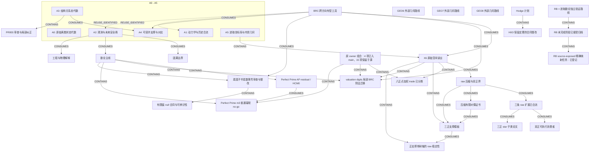

# 进取数论研究进度图

<!-- Generated by tools/render_research_progress_map.py; edit research_progress_map.json. -->

先读 A0–A5 全局骨架，再看证据表与当前收尾/数学前沿。BRC 是跨方向有型工具；X6 只是 A5 一支。本图是可维护来源索引，不是新定理、全仓审计或任务领取队列。

快照：2026-09-08。20 个基础/路由 pin 仍冻结于 aaf9b812。本图初版经 PR1396 在 dc401229 入 main。后续已核前沿：raw PR1390 入 main aa5683f；H0O PR1391 在 b3d39a9 捕获入 main、正式审查待办；p2 PR1394 入 main c27616a2；star/dual PR1398 入 main 167746c5。A3 纠正 PR1399 已入 main d4bad545，原源 3ac5a5dd 保留；整份 PR955 正式 Driver 审查仍待办。原 owner 19 项组合是来源快照，不是仓库总数或 live 队列；其他 GEO/Hodge 路线需精确来源刷新。 weighted trade PR1401 已入 main 86f753be；该代全 canonical 目录比较确认原 19 对象中恰 3 项入 main、16 项保留于源，并非仅减某一个分片。owner b506f92a 已将 57 模板论文与局部 valuation-digits BRC DIV 检查点以 SOURCE_ONLY 发布。所观察 main 前进至 fa9cb29 仅新增一篇 RH 论文；本图未审阅或纳入该论文。 PP PR1404 现已合流于 44243768，实际树与受测组合相同。精确全目录比较确认原 19 对象中 4 项入 main、15 项保留于源（8 DOMAIN、5 RESULT、2 参考候选）。owner528ea6aa 另以 SOURCE_ONLY 发布单射轴不等式及 p3 取等 flow 论文/审稿/adoption；归档回执保留发布前时点。本次图更新不重跑数学，不提升 API 或正式审查。

冻结主线来源: [`aaf9b8125ba3`](https://github.com/awdawmip/enterprise-math/commit/aaf9b8125ba3294932b5c90d80f700e02799c88e). 组合基线: `4424376809ddb7c41180453fa85f29a72d585a3e`.

## 方向图

范围闭合、负向边界、入 main、程序检查、Lean 覆盖与正式审查是不同事实。边的型别见下表；CONTAINS 仅表示归属，虚线复用边不声称已证传递。历史 Continuity 不能建立当前 claim。



## 同一范围内的证据对照

以下区分来源声明与已记录回执；建图本身没有重新证明或执行数学。

| 节点 / 精确范围 | 数学证据 | Lean | 程序证据 | 发布层 | 正式审查 |
| --- | --- | --- | --- | --- | --- |
| **A0 — 原始离散状态代数**<br>根/坍缩、商余、盆/间隙与尺度；P001–P009。<br>[S01](#source-s01), [S07](#source-s07), [S10](#source-s10) | P001–P009 在各自合同内已有规范答案。 | 目录记载 T001–T015 的 root Lean 覆盖，仅限原始精确命题。 | 来源记录可执行检查，建图未重跑。 | 所引范围已在 MAIN。 | 本索引不新增正式接受。 |
| **A1 — 动力学与历史合流**<br>确定性核、碰撞与稳定化；P010/P011/P019/P020。<br>[S07](#source-s07), [S08](#source-s08) | 已有精确碰撞/不可逆性结果与稳定化分类。 | P020 良基偏序稳定化由来源记载为 Lean 已核。 | 来源记录可执行检查，建图未重跑。 | 所引范围已在 MAIN。 | 本索引不新增正式接受。 |
| **A2 — 观测与未来安全商**<br>已声明未来/动作语言；P018/P023/P024。<br>[S07](#source-s07), [S08](#source-s08), [S09](#source-s09) | 有界 quotient-root 动作基与规范部分操作扩展。 | 动作基定理：LEAN_CHECKED_MAIN；部分操作扩展：NOT LEAN-CHECKED。 | 来源记录可执行检查，建图未重跑。 | 所引范围已在 MAIN。 | 本索引不新增正式接受。 |
| **A3 — 结构关系态代数**<br>加权关系场、格、尺度/秩；未经证明不降格为普通函数核。<br>[S08](#source-s08), [S13](#source-s13) | 规范可执行核心；更广定理保留各自 WIP/规范状态。 | 不新增 Lean 声称，按原来源覆盖范围读取。 | 来源记录可执行检查，建图未重跑。 | 所引范围已在 MAIN。 | 本索引不新增正式接受。 |
| **A4 — 可容许支撑与对应**<br>有限多值关系、MAY/MUST 支撑、见证与 Boolean BRC。<br>[S08](#source-s08), [S13](#source-s13) | R023 Boolean 支撑核心在其声明型别内规范化。 | R023 Boolean 核心：来源记载 LEAN_CHECKED_MAIN。 | 来源记录可执行检查，建图未重跑。 | 所引范围已在 MAIN。 | 本索引不新增正式接受。 |
| **A5 — 进取坐标系与内禀几何**<br>P022 几何、精确图距离/Barlow 增长；X6 只是其中一支。<br>[S02](#source-s02), [S07](#source-s07), [S08](#source-s08) | 规范可执行几何切片；P022 整体仍 OPEN。 | 不新增 Lean 声称，按原来源覆盖范围读取。 | 来源记录可执行检查，建图未重跑。 | 所引范围已在 MAIN。 | 本索引不新增正式接受。 |
| **BRC — BRC 跨方向有型工具**<br>Boolean 支撑、正权分支/直方图；signed 分析具有独立合同。<br>[S02](#source-s02), [S03](#source-s03), [S06](#source-s06), [S08](#source-s08), [S11](#source-s11), [S14](#source-s14) | 原生链推进至 critical degeneracy；WBRC-T39–T42 来源状态为 PROVED_MAIN_BACKED_EXECUTABLE_CHECKED。 | 仅在明确范围内引用 Boolean R023；不声称全部 BRC 已 Lean。 | 来源记录可执行检查，建图未重跑。 | 所引范围已在 MAIN。 | 本索引不新增正式接受。 |
| **X6 — X6 原始空间读出**<br>同一锚点、带标号 signed Cell torsor；centered 三轴切片。<br>[S02](#source-s02), [S04](#source-s04), [S05](#source-s05) | 当前 P000-bound 原生 foundation 型别。 | 不新增 Lean 声称，按原来源覆盖范围读取。 | 来源记录可执行检查，建图未重跑。 | 所引范围已在 MAIN。 | 本索引不新增正式接受。 |
| **RAW_PAPER — raw 压缩与双正界**<br>有限有理 signed 差，先 Jordan 抵消；全部 20 张 raw 三轴 L1 范数。<br>[S12](#source-s12), [S15](#source-s15), [S16](#source-s16), [S17](#source-s17) | 压缩保各坐标边缘 L1，carrier≤(p+1)^6；p≤2 sharp 4M≤D；p=0/零差单独处理。 | 无 Lean 声称。 | 两项登记均 RESULT_ONLY、API 为空；证明证据在论文。 | 所引范围已在 MAIN。 | 已记录内部纸面独审；分片不赋予正式接受。 |
| **RAW_EXT — 三条 raw 扩展已合流**<br>压缩证书、p≤2 矩形取等、p3 七点质量边界 probe。<br>[S23](#source-s23), [S31](#source-s31) | 非零 p≤2 取等为等权原始坐标矩形；七点 M=7,D=26 只给一般 p3 下界 7/26。 | 无 Lean 声称。 | 压缩：作者 18 例/360 表＋独立 5/100；有主组合回执。仅 audit_compression 是公开 API。 | PR1390 / aa5683f 已 MAIN_INTEGRATED；发布者核实适用 CI 与 8 分片通过。 | 候选分类保持；两条结果仍 RESULT_ONLY；无正式接受。 |
| **P2_CONSUMER — 双正可执行消费者**<br>原始 raw signed X6、Jordan 后 p≤2；逐表精确检查与取等见证。<br>[S24](#source-s24), [S25](#source-s25), [S26](#source-s26), [S27](#source-s27), [S32](#source-s32), [S35](#source-s35) | 消费已有界/取等论文，不新增更广定理。 | 无 Lean 声称。 | 已记录独立 9 例/180 表和 19 个拒绝；可移植证据已发布；建图未重跑。 | PR1394 / c27616a2 已 MAIN_INTEGRATED。3 个适用 CI 工作流与 8 分片通过；发布者核实实际 merge tree/parents 与受测 checkout 7868d30a 一致。原作者/独审来源 3ac5a5dd 保留。 | 独立执行审查不等于正式数学接受。 |
| **STAR — 三正 star 子类论文**<br>三个正点由同一基点沿三条不同轴单独变动得到；跨度可为任意非零 signed 整数。<br>[S33](#source-s33), [S34](#source-s34), [S36](#source-s36), [S37](#source-s37) | 固定 star 内，任意质量有 sharp M≤(7/26)D。N=P 且固定严格正权时，min D=max(8P,24m−4P)，m 为最大正权；内部纸面复核现已分类全部权区间的原空间极小者。 | 无 Lean 声称。 | 纯纸面结果，不声称新增可执行核验。 | PR1398 / 167746c5 已 MAIN_INTEGRATED。3 个适用 CI 工作流与 8 分片通过；发布者核实实际 merge tree/parents 与受测 checkout 5f0c0bba 一致。历史 owner 论文 pin 保留。 | 仅内部有界纸面独审；无正式审查/状态提升。 |
| **RAW_DUAL — 压缩有限对偶证书**<br>固定有限正支撑 S；压缩 carrier 上二十张完整有界整数表。<br>[S22](#source-s22), [S15](#source-s15), [S33](#source-s33), [S37](#source-s37) | 有界纸面 PASS：LD≥Σ a_s w_s+BN 及完整间隙恒等式；统一 M 界需 a_s≥A 且 B≥A。 | 无 Lean 声称。 | 本论文未实现拟议的有限核验接口。 | 已随 PR1398 纸面包在 167746c5 MAIN_INTEGRATED；原 owner 来源 6724f761 与组合回执的实际执行代次保持区分。 | 仅内部纸面独审；无正式 task/Result/review 权威。 |
| **A3_A4_REVIEW — PR955 审查与局部纠正**<br>冻结 generated-support 商/插值交回，保留原源。<br>[S29](#source-s29), [S30](#source-s30) | 局部纠正论文 PASS：im W=H、H/L=Z⊕Z/2；环境 Z4/L=Z²⊕Z/2；同商仍可异 Q0。 | 不新增 Lean 声称。 | 旧有限证据保留为历史；纠正/建图未重跑。 | 纠正已经 PR1399 在 d4bad545 MAIN_INTEGRATED；原 PR955 交回与纠正源 3ac5a5dd 保留。这一篇论文准入不是对整份 PR955 交回的接受。 | 局部商秩澄清已闭合；整份 PR955 正式 Driver 审查仍待办。 |
| **NUMBER_THEORY — 数论主线**<br>Legendre 压力测试 P017、精度/算术应用及 Perfect Prime residual。<br>[S07](#source-s07), [S08](#source-s08), [S09](#source-s09) | P017 为 OPEN；已有结构结果不等于 Legendre 猜想证明。 | 逐项读取精确定理范围；无猜想级 Lean 声称。 | 来源记录可执行检查，建图未重跑。 | 所引范围已在 MAIN。 | 本索引不新增正式接受。 |
| **PERFECT_PRIME — Perfect Prime AP residual / HCM0**<br>9 月 3 日 residual Mobius/Bernstein 系数正性交回。<br>[S18](#source-s18), [S19](#source-s19), [S20](#source-s20), [S53](#source-s53), [S54](#source-s54), [S60](#source-s60), [S61](#source-s61) | 交回给出 all-m signed squared-secant 系数表示与端点因子；正性归约到 HCM0。 | 本图未核定 Lean 覆盖。 | 更强完整 Hausdorff 模式仅有 m=2..10 有限证据。 | 所引范围已在 MAIN。 | Result 请求 Driver review；本轮未刷新该审查 operational 状态。 |
| **P021 — 因果边界**<br>有限图与整数 expansion，消费 P018 观测/refinement。<br>[S07](#source-s07), [S08](#source-s08) | 规范可执行有限切片；P021 整体 OPEN。 | 不新增 Lean 声称，按原来源覆盖范围读取。 | 来源记录可执行检查，建图未重跑。 | 所引范围已在 MAIN。 | 本索引不新增正式接受。 |
| **E001 — 工程与物理解释**<br>材料冲量、tick order、测量折线 refinement 与有限 residual conservation。<br>[S07](#source-s07), [S08](#source-s08) | 规范可执行有限切片；P016 仅 falsification 协议范围闭合。 | 不新增 Lean 声称，按原来源覆盖范围读取。 | 来源记录可执行检查，建图未重跑。 | 所引范围已在 MAIN。 | 本索引不新增正式接受。 |
| **GEO6 — GEO6 外部几何路线**<br>已有历史方向；未取最新精确 Result/review。<br>[S21](#source-s21) | SOURCE_REFRESH_REQUIRED；不声称当下闭合。 | SOURCE_REFRESH_REQUIRED。 | SOURCE_REFRESH_REQUIRED。 | 仅历史指针；不推断当下 main/owner 状态。 | SOURCE_REFRESH_REQUIRED；不推断 live claim。 |
| **GEO7 — GEO7 外部几何路线**<br>已有历史方向；未取最新精确 Result/review。<br>[S21](#source-s21) | SOURCE_REFRESH_REQUIRED；不声称当下闭合。 | SOURCE_REFRESH_REQUIRED。 | SOURCE_REFRESH_REQUIRED。 | 仅历史指针；不推断当下 main/owner 状态。 | SOURCE_REFRESH_REQUIRED；不推断 live claim。 |
| **GEO8 — GEO8 外部几何路线**<br>已有历史方向；未取最新精确 Result/review。<br>[S21](#source-s21) | SOURCE_REFRESH_REQUIRED；不声称当下闭合。 | SOURCE_REFRESH_REQUIRED。 | SOURCE_REFRESH_REQUIRED。 | 仅历史指针；不推断当下 main/owner 状态。 | SOURCE_REFRESH_REQUIRED；不推断 live claim。 |
| **HODGE — Hodge 计划**<br>已有计划；H0O 是一个有界叶子，不代表整个计划。<br>[S21](#source-s21), [S28](#source-s28) | 其余路线：SOURCE_REFRESH_REQUIRED。 | SOURCE_REFRESH_REQUIRED。 | 未做全计划程序审计。 | 本轮只新核实下述 H0O 捕获。 | 不推断全计划接受或 claim。 |
| **H0O — H0O 保留定理的合同整改**<br>同一 nonsplit target 上 pure codim-3 Poincare-polarization 中间支撑族。<br>[S28](#source-s28), [S93](#source-s93), [S94](#source-s94), [S95](#source-s95), [S96](#source-s96), [S97](#source-s97) | 保留限定范围的恒等式 Pi_W(ch_3(Psi_Q(F)))=T_lambda(Pi_W([F]_cyc)) 及 T_lambda 可逆给出的非零等价。它不能从零 exceptional 输入创造非零输出；这不证明全族投影为零或该族不可实例化。 | 不新增 Lean 声称。 | 原产物/Execution record 保留；18 项捕获控制检查不是新增数学重放。 | 原来源捕获仍为 PR1391 / b3d39a9；PR1148 作为重复源关闭，不是数学闭合。Driver 审查和同 TaskID 的第二代 REVISION 已发布于 3db36e3b，并由 PR1412 合入 main a8ac21f9e1b1685dcefe3631f6f754e5425f7d4e。 | DR-59B956C38543808B4146 于 2026-09-08T13:07:35Z 记录 REQUEST_REVISION / destination NONE / terminal=false。保留定理并要求纠正无充分证据的满足/闭合标签，不授予定理接受或硬目标完成。 |
| **OWNER_PORTFOLIO — 原 owner 组合：4 项已入 main，15 项保留于源**<br>原 20260907 分片快照的 19 项候选：native/raw/BRC 算子、纯结果及两个参考 candidate 非工具。这不是仓库方法总数，也不是 live 任务队列。<br>[S38](#source-s38), [S39](#source-s39), [S42](#source-s42), [S43](#source-s43), [S52](#source-s52), [S57](#source-s57), [S59](#source-s59), [S61](#source-s61) | 仅有逐项不同的来源声称；组合计数和分类不证明全部 19 项数学成立。 | 无全组合 Lean 声称。 | 无全组合执行声称；被实际选中时，逐项核对 API、原生算术边界与精确来源回执。 | PARTIAL_MAIN_INTEGRATION / OWNER_SOURCE_RETAINED。main44243768 的完整 canonical 目录及全部直接 addenda 中恰有四个原对象逐项完全相同：shell-length、one-positive、weighted_minimum_trade、PP finite_power_moment_lift_obstruction；其余十五项保留于原已发布 owner 快照。 | 无组合级正式接受；分类不是审查处置。 |
| **WEIGHTED_TRADE — 八正点加权 trade 已分类**<br>非零有限 raw X6 signed 差；全部 20 张三轴边缘为零；恰八个正空间支点。<br>[S40](#source-s40), [S41](#source-s41), [S42](#source-s42), [S43](#source-s43) | RESULT_ONLY：恰八个负点、共同绝对权及来源定义的四位 parity 结构；闭合八正点/更多负点及删除轻点机制。 | 不新增 Lean 覆盖声称。 | 已发布纯元数据登记/当前主线组合回执；本图未重跑历史 checker 或数学消费者；api=[]。 | 经 PR1401 在 86f753be 入 MAIN；所引回执保留原 eb90 组合代次。 | 仅 owner 来源/索引证据，不新增正式 Task/Result/Driver 接受。 |
| **P3_TEMPLATES — 三正支撑模板**<br>同一 raw X6 chart 中三个不同的 post-Jordan 正点；点标签与正权同步搬运。投影地址纤维与完整原始 Cell 纤维保持区分。<br>[S44](#source-s44), [S45](#source-s45), [S15](#source-s15), [S22](#source-s22), [S62](#source-s62), [S63](#source-s63), [S64](#source-s64) | 57 个无权支撑模板（64 减 7 个退化）；保留有序权向量及模板 stabilizer，并追踪原始 fresh 纤维。 | 不新增 Lean 覆盖声称。 | 源论文保留原有界整数类型计数，发布时未重跑。无 LP、raw 人口/权重枚举、旧消费者重跑或新 API。 | 已在 owner b506f92a 发布，层级为 SOURCE_ONLY。论文及源审查回执已发布，回执保留原发布前执行/审查代次；未入 main、无正式接受。 | 仅 owner 来源/索引证据，不新增正式 Task/Result/Driver 接受。 |
| **VALUATION_DIGITS — valuation digits 局部 BRC 除法迁移**<br>原 shortest-path valuation-spectrum 源方法中的局部 digits 例程；不等于全谱原生合规。<br>[S38](#source-s38), [S46](#source-s46), [S47](#source-s47), [S48](#source-s48), [S49](#source-s49), [S50](#source-s50), [S51](#source-s51), [S52](#source-s52) | 保留既有 valuation/digit 定义与调用合同，不声称新定理或 family。 | 不新增 Lean 覆盖声称。 | 已发布可移植重放记录 288 次原生 DIV facade 求值、10 个合法 digit 案例、8 个独立拒绝及 11 个进入 histogram 前的 caller 边界。源元数据/静态检查另有回执；本图均未重跑，未执行全谱回归。 | SOURCE_ONLY：局部 digits 替换及证据包已在 owner b506f92a 应用/发布；未入 main、无正式准入；旧十九对象快照另行固定保留。 | 仅 owner 来源/索引证据，不新增正式 Task/Result/Driver 接受。 |
| **PP_MOMENT_NOGO — Perfect Prime m3 普通幂矩 no-go**<br>正 q0 归一化后的精确历史 m=3 cofactor 列；普通幂矩表示与有限可交换阶乘观测分开。<br>[S53](#source-s53), [S54](#source-s54), [S55](#source-s55), [S56](#source-s56), [S57](#source-s57), [S58](#source-s58), [S59](#source-s59), [S60](#source-s60), [S61](#source-s61) | RESULT_ONLY 源结果：28 个允许的有限交替差分均正，但二次多项式的平方读出为负，排除实线上正普通幂矩测度；非负 beta 合同下的有限 BRC 恒等式仍成立。 | 不新增 Lean 覆盖声称。 | 仅冻结的历史 Fraction 审计及同代 JSON，不是新原生 BRC facade 数值证据。JSON 保存七个正 beta 并记录 28 格检查，未逐项保存全部 28 个值；纯元数据回执须独立，不导入或重跑该审计。 纯元数据查询与两项拒绝有独立冻结回执；新 helper 静态检查仅选择 validator.py。 | 已经 PR1404 在 44243768 以 MAIN RESULT_ONLY 合流；九文件承载保留原 method 对象、空 API 和 null family。实际合并树与受测组合相同，不增加可执行有限 BRC 消费者或正式接受。 | 本结果索引不建立正式 Task/Result/Driver 接受、Working Truth 或 Foundation 状态。 |
| **INJECTIVE_AXIS_RAW — 正支撑单射轴的 raw 稳定性**<br>同一 anchor 和带实际轴标签的 raw X6 chart，有限 Jordan 正负人口；一条实际物理轴在全部正支撑上单射，不用混合坐标伪造新轴。<br>[S62](#source-s62), [S63](#source-s63), [S64](#source-s64), [S65](#source-s65), [S44](#source-s44), [S45](#source-s45) | 任意有限正支点数的纸面证明：全部二十张 raw 表给出 D>=10P-2N+10&#124;P-N&#124;+12N_empty>=4M。恰三正 q_i=(a_i,r_i) 且 a_i 互异时，将 R={r_i} 去重，置 W_r=sum_(j:r_j=r)w_j；取等当且仅当 n=sum c_(i,r)delta_(a_i,r)，c>=0，仅允许 Ham(r,r_i)=1，行和 w_i、列和 W_r。整个单射轴类有非零六 Cell 的 sharp 1/4 见证。 | 未声称新增 Lean 证明或覆盖。 | 仅纸面；未执行或新增消费者、LP、求流程序、模板枚举、数值重放，也未扩展既有 p<=1/p<=2 程序输入域。 | 已在 owner 528ea6aa 以 SOURCE_ONLY 发布论文、逐字相同的独立审稿归档及 source-adoption 回执。回执保留原 TEMP 准备状态与审查时点，发布不将其改称新执行；未作数学主线准入。 | 仅内部纸面审阅，不建立正式 Task/Result/Driver 接受、Working Truth、Foundation 或 API。 |
| **PFSSV_SHELL — 素因子半素数薄壳审查与整改**<br>既有 PFSSV 任务：精确 p<=q、X<pq<=floor((1+eta)X) 薄壳，以 D(pq)=(p,q,0) 作派生 min-zero 素因子坐标表示；S3 展开仅作显示诊断，不建立新原生点本体或度量。这是数论实验收尾，不是 X6 结果。<br>[S66](#source-s66), [S67](#source-s67), [S68](#source-s68), [S69](#source-s69), [S70](#source-s70), [S71](#source-s71), [S72](#source-s72), [S73](#source-s73), [S74](#source-s74), [S75](#source-s75), [S76](#source-s76), [S77](#source-s77), [S78](#source-s78), [S79](#source-s79), [S80](#source-s80), [S81](#source-s81), [S82](#source-s82), [S83](#source-s83), [S84](#source-s84), [S85](#source-s85), [S86](#source-s86), [S87](#source-s87), [S88](#source-s88), [S89](#source-s89), [S90](#source-s90), [S91](#source-s91), [S92](#source-s92) | 确定性容量审计在原 21 个 scale/width cells 全部记录 MODEL_SUPPORT_FAILURE。18 格具有通过旧 mask 的 positive-total target 反例；3 格此次仅见 zero-total target 反例：X=100000 的 eta=3/1000、1/1000，以及 X=300000 的 eta=1/1000。18090 条失败 table entries（positive-target 15400、zero-target 2690）不是独立试验，也不是 p 值。这限定 Null A 的精确占据解释，不证明残差结构不存在，也不禁止声明范围内的 scalar count surrogate。 | 不新增 Lean 定理或覆盖声称。 | 保留 Stage1 单独固定的新单 cell probe 与独审。Stage2 实际记录在内部 224.453 秒内完成原 21 格精确观测及确定性容量审计，科学随机 null 抽样为零。至 50500000 的完整 prefix 含 3029296 个素数。canonical 调用与返回一致为 302618 次（DIV 293797、ROOT 22、LOG 8799）；回执记录 raw trace 100831585 bytes、无损容器 29555979 bytes，peak process memory 180793344 bytes。这些是来源执行回执，建图未重跑数学或数值；它们不构成 512/4096 residual 筛选或新盲 holdout。 | 原恢复仍为 PR1406/main 6efc3fdb，此前整改登记为 PR1408/main be350eb1。Stage1、预计算和 Stage2 实际结果仍分别绑定 01b6dd93、f662d48f、a82ced7b。canonical Result RR-BDA72F26E3786AD69EA5 已在 24d31456 发布；不可变 Driver 审查及 follow-up 已在 436995cfda7b5aaf7b7531a7ce5237753ab1b458 发布。PR1411 已合入 main 4d5c4992d0b1e1719b000cf23d0666b6f8b58bf3，实际树及有序父提交与已核 CI 组合一致。旧候选回传标题保留为冻结前历史，不代表当前状态。 | DR-A833B5898809BEEDA41D 对 RR-BDA72F26E3786AD69EA5 的判定为 ACCEPTED/ARCHIVE、在 TASK 范围终局：接受修正后的 21 格观测及有界 Null A 占据容量障碍。DFU-32BE5124B006B15987BB 记录一项 continuation 的 TASK_SET_PUBLISHED。闭合的是该冻结代次，不是残差硬目标或 parent Objective；不授予 Working Truth、canonical/Foundation promotion、新 API 或一般残差反驳。 |
| **PFSSV_FINITE_WINDOW — 有限窗 null 合同与可辨识性**<br>同一素数/半素数 parent 下的已发布 continuation RS-PFSSV-FINITE-WINDOW-NULL-IDENTIFIABILITY。区分有限整数槽容量、素性、行/通道 margins、共享 q 地址一致性及条件样本空间。引入的概率律是附加诊断假设；派生 S3/rank/density-flat 坐标不建立新原生本体。<br>[S87](#source-s87), [S88](#source-s88), [S89](#source-s89), [S90](#source-s90), [S91](#source-s91), [S92](#source-s92) | 已发布的是合同/可辨识性问题，尚未建立新答案。可接受输出包括：带有限推断目标的明确有限支撑合同；满足同一约束而目标分布不同的两种概率律，以证明不可辨识；或精确的缺失假设障碍。仅满足容量既不证明交换性，也不证明对确定性素数数据的有效性。 | 此任务尚未发布 Lean 定理、形式化或新覆盖。 | 在发布快照中，新任务没有 claim、ER 或执行。已接受的原 21 格输出是输入，不是此 continuation 的执行。此任务不授权 512/4096 筛选、新盲实验或全范围数值重跑；后续任何有界算术核验须保留适用的原生工具和精确 trace 合同。 | TP2-38717785C4ADF3A12A49 已于 2026-09-08T12:40:31.877466+00:00 经 DFU-32BE5124B006B15987BB 不可变发布，在同 parent 下作为 PFSSV 任务的 CONTINUATION。发布记录为 claimable=true、owner=taskbook/unassigned。source 436995cf 已经 PR1411 入 main 4d5c4992d0b1e1719b000cf23d0666b6f8b58bf3。入主线不表示此任务已执行；本图不领取任务，也不提供当前 runtime 权限。 | 前代已有 ACCEPTED/ARCHIVE 审查，合法 follow-up 发布了这个新问题；该决定不是后继任务的 Result 或接受。此处不声称后继 Result、Driver 判词、Working Truth、API 或 Foundation promotion。 |
| **RB_ENTERPRISE_THEOREM_PACKAGE_V2_INDEPENDENT_VALIDATION — RB × 进取数论独立验证路线**<br>仅组织性母节点，精确绑定已发布任务的 RB_ENTERPRISE_THEOREM_PACKAGE_V2_INDEPENDENT_VALIDATION。本节点只索引子任务检查点，不报告整个 Ramanujan–Borwein × 进取数论定理包的深度或完成度。<br>[S104](#source-s104), [S105](#source-s105) | 只对应子任务的 assignment 覆盖范围，不推断全路线定理、精确映射、ODE 解或完备性结论。 | 本检查点不增加母路线的 Lean 覆盖。 | 子任务有已发布的有限整数枚举回执；本图未审计整个 RB 定理包的程序。 | 既有不可变任务发布已指明该母目标；补入图节点只是来源索引，不是新任务发布或定理包准入。 | 父目标 OPEN；子任务进展检查点不赋予母路线接受、终局 raw freeze 或闭合。 |
| **RB_BLIND_BRANCH_PATTERNS — RB 未完成阶段已接受归档**<br>既有任务 RS-RB-ENTERPRISE-DEGREE6-CM24-BLIND-BRANCH-PATTERN-COMPLETION / TP2-032D4712B5CB0E5D2376。已发布 BLIND_FORWARD 阶段对 4+2+0+0 与 2+2+2+0 回传 BLIND_BRANCH_PATTERN_INCOMPLETE；未重建 originating map，未满足硬目标。<br>[S98](#source-s98), [S99](#source-s99), [S100](#source-s100), [S101](#source-s101), [S102](#source-s102), [S103](#source-s103), [S104](#source-s104), [S105](#source-s105), [S106](#source-s106), [S107](#source-s107), [S108](#source-s108), [S109](#source-s109), [S110](#source-s110), [S111](#source-s111), [S112](#source-s112), [S113](#source-s113), [S114](#source-s114), [S115](#source-s115), [S116](#source-s116), [S117](#source-s117), [S118](#source-s118), [S119](#source-s119), [S120](#source-s120), [S121](#source-s121), [S122](#source-s122) | assignment 覆盖保持完成：原始 180 / 360；固定 lambda 与 k 时仅可按 target V4 取商，得到 45 / 90 个候选。cover-only 33 / 54 与更粗 11 / 9 不是固定参数 ODE 候选。局部 square-class/RR 前沿与空纤维阻碍排除 4+2 中 180 个参数组件，仍余 4+2 的 540 与 2+2+2 的 1440：合计 1980 个未解参数族，不是 1980 个映射或有限解集。twisted critical 条件只是必要过滤，尚未解完整 ODE。 | 本检查点不声称 Lean 证明或形式化分类。 | 已发布局部证书记录 assignment 枚举、修正后的 square-class/RR 恒等式、空纤维阻碍及 twisted critical numerator 检查的原始执行。整数枚举与清分母形式多项式检查不是完整映射求解器、BRC 调用或原生证书。阶段回传回执只检查字节和元数据；本图不重跑数学，不增加程序已验证的完整解。 | RR-34B2213BDFE75A5795CC 与恢复来源历史保持不可变。主线提交 3a00ea191ad0380bf341af746a825e0b0c474874 原子记录 DR-EBB9B39761FE6E86D57D、DFU-AE59D6971E88DE79B661，以及单独发布的 source-exposed 任务 TP2-554AC43234E8E297A6E9。原 raw freeze 与公式来源恢复时序均保留；来源转存本身未验证公式。 | DR-EBB9B39761FE6E86D57D 在 TASK / RESULT_ONLY 范围为 ACCEPTED / ARCHIVE，接受任务允许的 BLIND_BRANCH_PATTERN_INCOMPLETE / NEGATIVE_BOUNDARY 约简；重建/反驳硬目标仍 NOT SATISFIED。1980 项是未解的有索引参数问题，不是映射、已证非空解或已断言不可约组件。母目标 RB_ENTERPRISE_THEOREM_PACKAGE_V2_INDEPENDENT_VALIDATION 仍 OPEN。SOURCE_COMPARISON_UNRESOLVED 保留为旧冻结时的真实状态；后来来源恢复及新任务明确属于 source-exposed，不是盲验证。 |
| **RB_SOURCE_EXPOSED_EXACT_MAP — RB source-exposed 精确映射任务：已登记**<br>RS-RB-CM24-SOURCE-EXPOSED-EXACT-MAP-CERTIFICATE / TP2-554AC43234E8E297A6E9。独立发布的 CONTINUATION，只核一条固定恢复公式，明确 SOURCE_EXPOSED / NONBLIND_DISCLOSED；不重开盲分类，不覆盖全部存活族。<br>[S113](#source-s113), [S114](#source-s114), [S115](#source-s115), [S116](#source-s116), [S117](#source-s117), [S119](#source-s119), [S120](#source-s120), [S121](#source-s121), [S122](#source-s122) | 这里记录必需证书合同，不是新增已证结果：绑定四个特殊纤维及除子/square-class 定位，处理全部共同基点，分别在正确函数域意义证明 descended X 与 D 到 E 的度数均为六，验证目标方程/j、完整冻结 ODE 及含 Y/符号/嵌入/异常点的未平方拉回微分。全部关卡均必需；仅度数或平方恒等式检查不能给 PASS。 | 不声称 Lean 证明或形式化精确映射结果。 | 发布检查点状态为已登记、待执行证据；本图尚未采纳新 claim、ER 或数学运行回执。T0/T6 仅用于任务合同的型别与观察保持约束；lookup 不是执行，正计数不能替代复系数、平方类或分支符号。 | TP2-554AC43234E8E297A6E9 于 2026-09-08T23:55:43.753227+00:00 经 DFU-AE59D6971E88DE79B661 与精确任务书一起发布于主线提交 3a00ea191ad0380bf341af746a825e0b0c474874。第1代发布时为 claimable=true、owner=taskbook/unassigned；登记不等于已执行或当前 runtime 权威。 | 前阶段已有有效 ACCEPTED/ARCHIVE 审查，这个独立问题已发布；该判词不是新任务的 Result 或接受。此处不声称后继数学 PASS、Working Truth、API、Foundation promotion 或父目标闭合。 |

## 未完前沿与已有下一步

仅为阅读顺序，不是 live 任务选择队列。

| 阅读优先级 | 节点 | 未完项 / 限定边界 | 已有下一步 |
| --- | --- | --- | --- |
| 当前收尾 | A3_A4_REVIEW | 不能把环境商秩等同可实现状态所需最少数据；不新建研究任务。 | 使用已准入的窄纠正，收尾原 PR955 正式 Driver 审查；保留不受影响的原论证，不重复已完成源准入。 |
| 当前收尾 | H0O | 原输出 4 仍未满足：非零 exceptional 输出、全族零投影定理、目标侧该族不可实例化的精确定理，三项均未建立。exceptional 源支撑循环的存在性仍未决；父目标 HODGE_SPECIAL_OPEN_FRONTIER_ALGEBRAICITY_MECHANISM 保持 OPEN。不推出非代数性、H1 或全核结论。 | DFU-55A50DE009218A7E6CF2 于 2026-09-08T13:07:52Z 发布同 TaskID 的 REVISION TP2-853EE36ED78FF34CC992；本次更新时尚未领取、未执行。保留原六项义务，逐项核清三个终局，若硬目标仍未证明，则交回保留定理且有非空未决项的纠正。不搜索新核，不重放历史 46 项检查；后续领取须走 canonical runtime。 |
| 当前收尾 | VALUATION_DIGITS | 素性、histogram/Fraction 算术及广泛导入仍有独立边界。helper 可收集局部 trace；未变更的 public 谱 API 不返回或持久化 digit trace。局部证据不是全谱或传递原生合规。 | 保留局部迁移及实际 caller 边界；仅继续被明确选中的既有谱未完接口。 |
| 当前收尾 | PFSSV_SHELL | 有限观测/容量单元现已按 RESULT_ONLY 接受并归档，复用既有 T0+T1 组合。残差硬目标及 PROGRESSIVE_PLANE_PRIME_SEMIPRIME_COORDINATE_DISCOVERY 仍为 OPEN。corrected/signed 科学残差、有效双 null 比较、family-wise 校准与原盲测门槛仍未完成；unavailable 向量不是零。不追加新的 joint-null 原任务门槛，也不由已接受的支撑边界推出素数过程结论。 | 保留已接受代次及其精确来源/trace 证据。已发布 continuation RS-PFSSV-FINITE-WINDOW-NULL-IDENTIFIABILITY 首先处理支撑、共享 q 地址一致性、明确的概率律和交换性前提。它范围独立、发布时尚未执行；后续领取须由当前 canonical runtime 决定。不得因任务闭合重复原 21 格或推定科学筛选、盲性重置、二阶补救路线。 |
| 当前收尾 | RB_BLIND_BRANCH_PATTERNS | 180 项排除与仍余 540 + 1440 = 1980 参数族保留原有限数学强度；全部族分类与原域下降仍 OPEN。恢复的一条公式现对应独立登记的精确映射任务，但不解决周期整数/同调指数、绝对周期比、任一整个剩余模式或父定理包。 | 后续按独立有效执行绑定推进已发布的 source-exposed 精确映射 continuation；保留已归档盲阶段，不重新领取或改写。周期指数与全部 1980 项分类缺口继续 OPEN，不为它们虚构已登记后继任务。本图不授予 claim 或调度权限。 |
| 已有数学前沿 | NUMBER_THEORY | centered prime-radius 有 left-prime/size 假设，不推出普遍对称素数对或 Goldbach。 | 与 X6 子支并列保留 P017/Perfect Prime 原有数学前沿。 |
| 已有数学前沿 | PERFECT_PRIME | 全 m 有限完全单调性/HCM0 及母 determinant 非消失仍 OPEN。正普通幂矩 lift 已在 m3 被单独否定；有条件的有限 BRC 阶乘表示不是被否定的 lift。 | 核实当前交接，仅从精确既有 residual/HCM0 缺口续接。保留有限阶乘观测合同，不重启已否定 block/inertia 或普通幂矩测度路线。 |
| 已有数学前沿 | P021 | causal focusing、方向/witness 复合及物理解释仍开放。 | 在明确有限因果/观测合同内续接，不偷渡物理定理。 |
| 已有数学前沿 | E001 | 不是通用材料本构/力学定理；有限读出不能恢复未知连续曲线。 | 应用绑定实际测量与已有 falsification 合同。 |
| 已有数学前沿 | P3_TEMPLATES | 载体界 2^nC*3^(sum nP)*4^nD 本身不给出统一 p3 界。另有 source-only 单射轴论文对 41 个 nD>=1 模板证明 D>=4M；余 16 个不在其假设内。fresh 坐标可对应无限原纤维；证明重标记不是原生操作，也不推出每模板 sharp。 | 复用既有 57 模板几何、有序权参数和 raw 表身份，结合单独限定范围的单射轴结果；保留其他模板的既有成果，本图不启动枚举、求解器或新研究问题。 |
| 已有数学前沿 | PFSSV_FINITE_WINDOW | 判定已声明的几何、residue 与一阶约束究竟识别什么，以及哪些概率律或不变性前提不可缺少。区分人为约定的 scalar surrogate、共享地址占据和关于素数的推断。硬目标 FINITE_WINDOW_NULL_CONTRACT_IDENTIFIABLE_OR_EXACTLY_OBSTRUCTED 尚为开放、未执行。 | 在真实 canonical 分配后，固定冻结 Result 与已审 prior art；写出有型语义矩阵、共享地址/窗口映射、条件变量、权重、归一化及假设/已证交换性。在科学抽样前返回有限合同、构造性不可辨识或精确障碍。拒绝按已暴露结果拟合选择概率律、忽略容量/重叠和追溯性盲性；仅满足容量不打开后继实验。 |
| 已有数学前沿 | RB_ENTERPRISE_THEOREM_PACKAGE_V2_INDEPENDENT_VALIDATION | 独立验证在既有子任务前沿继续开放；本次不评估路线的其余部分。 | 续接既有子任务来源检查点及 canonical runtime；此组织边不改变任务优先级、claim 或调度决定。 |
| 已有数学前沿 | RB_SOURCE_EXPOSED_EXACT_MAP | 登记检查点的 RB_CM24_PINNED_SOURCE_EXACT_MAP_CERTIFIED_OR_EXACT_FAILURE 仍 OPEN。须在声明的精确嵌入下检查历史公式与 replay 声称。周期整数/同调指数、独立绝对周期比及全部 1980 项分类仍是另列的 OPEN 父缺口，不是额外已登记任务。 | 取得有效执行绑定后，将来源与域嵌入固定为数据，定位冻结分类中的特殊纤维，给出全部硬目标关卡或精确指名的障碍。保留失败；任何关卡未解决均返回 INCOMPLETE，不以局部证书或追溯性盲性替代。 |
| 被选中时刷新精确来源 | GEO6 | 历史闭合/再验证措辞不是当前 verdict。 | 该既有路线被选中时，仅刷新一个精确当前来源/交接。 |
| 被选中时刷新精确来源 | GEO7 | 历史闭合/再验证措辞不是当前 verdict。 | 该既有路线被选中时，仅刷新一个精确当前来源/交接。 |
| 被选中时刷新精确来源 | GEO8 | 历史闭合/再验证措辞不是当前 verdict。 | 该既有路线被选中时，仅刷新一个精确当前来源/交接。 |
| 被选中时刷新精确来源 | HODGE | 不把 H0O 种子守恒外推为 Hodge/非代数性定理。 | 收尾 H0O 审查；其他路线按各自精确来源刷新。 |
| 被选中时刷新精确来源 | OWNER_PORTFOLIO | 原 19 项 = 10 DOMAIN_OPERATOR＋7 RESULT_ONLY＋2 CANDIDATE_NOT_TOOL；余 15 项 = 8 DOMAIN_OPERATOR＋5 RESULT_ONLY＋2 CANDIDATE_NOT_TOOL。这是原对象逐项精确比较，不是仓库总数、组合证明或剩余条目准入；source-only digits 与单射轴工作各守原范围。 | 保留源分支及逐项证据，在实际范围复用四项已合流原成果；仅获授权后选择既有未完单元，不启动十五项准入，不把参考 candidate 升为工具。 |
| 被选中时刷新精确来源 | INJECTIVE_AXIS_RAW | 对 p3 覆盖 nD>=1 的 41 个无权模板；另 16 个不满足此假设，保留各自既有结果与前沿。不声称每模板 sharp 或均可取等。取等 flow 仅限 p3：重复 r_i 共用一列，Hamming 一表示恰一坐标不同，不是单位距离。非零取等强制 P=N；零差不取比值。 | 被选中时复用已发布实际轴证明及精确 raw 地址/权合同；保留有序权与去重列。非零 sharp 见证须 a0,a1,a2 互异、b0!=b1 且 w1=w2+w3>0。不把 p3 flow 或旧消费者输入域推广到任意 p。 |
| 已合流，复用不重做 | RAW_EXT | 低层 pushforward 不保证任意输入保范数；无一般 p3 上界；等质量 probe 仅覆盖指定对称族。 | 复用已合流 API/源包；继续区分来源与实际执行代次。 |
| 已合流，复用不重做 | P2_CONSUMER | 本次仅闭合有界工具准入子流程；p≤2 与原始 raw 坐标合同保持。入 main 不新增更高 p 定理或正式数学接受。 | 复用已准入消费者及精确登记 API/证据；保留原源与主组合回执，不重复已完成准入。 |
| 已合流，复用不重做 | STAR | 固定 star、固定严格正权、等质量的分类范围已闭合。m≥P/2 时，额外质量 Δ=m−(w2+w3) 可任意有限地分布于经过主导点的全部六条去心原始坐标轴线上；Δ=0 与旧单纯形边界吻合。一般 p3 几何仍 OPEN。 | 复用已准入论文与精确 star 合同，包括完整六轴极小者分类；不推断一般三正上界，不为相同成果重启准入。 |
| 已合流，复用不重做 | RAW_DUAL | 不自动寻找最优对偶，不给统一 p3 界；压缩紧点可有无限原始纤维。 | 按有范围证书定理复用已准入论文；后续通用核验器仍需实现完整表、来源绑定与 carrier 预算检查，本次准入不提供该实现。 |
| 已合流，复用不重做 | WEIGHTED_TRADE | 一般 p<=7 最优稳定性常数仍 OPEN；RESULT_ONLY 不提供新可执行 API 或负 BRC primitive。 | 仅在相同 all20/p=8 合同下复用已闭合 trade 结构，保留一般 raw 稳定性缺口。 |
| 已合流，复用不重做 | PP_MOMENT_NOGO | m3 已阻断通用普通幂矩测度 lift；全 m beta/有限 CM 正性、HCM0 和母 determinant 非消失仍 OPEN。独立有限 BRC 可执行消费者不在这个结果切片内，其源发布不是新运行时或主线认证。 | 在精确范围复用已合流的 m3 no-go 与有限阶乘解释；仅续接另行授权的既有全 m 缺口，不重做该结果，也不重启已否定幂矩测度路线。 |
| 方向与范围内既有成果 | A0 | 范围闭合不代表任意新算子自动满足旧恒等式。 | 扩展前复用精确算子合同和原定理。 |
| 方向与范围内既有成果 | A1 | 不自动得到物理时间箭头或热力学熵定理。 | 将物理解释与确定性定理分开验证。 |
| 方向与范围内既有成果 | A2 | P018/P023/P024 整体仍开放；状态依赖与高维语言需精确合同。 | 只推进明确语言/观测缺口；部分操作保留 enabledness。 |
| 方向与范围内既有成果 | A3 | PR955 交接只是一条审查叶子，不代表 A3 完成。 | 消费已有 A3→A4 bridge，收尾原 PR955 审查范围。 |
| 方向与范围内既有成果 | A4 | Boolean 支撑遗忘重数、来源、权重与 signed 抵消。 | 每次接口明确选择支撑型或加权/来源型。 |
| 方向与范围内既有成果 | A5 | 表示/读出不自动成为状态等距或物理解释。 | 按精确坐标与观测合同续接几何研究。 |
| 方向与范围内既有成果 | BRC | 总质量不能恢复 critical tie 重数；一般代数修正不是 rational LN。 | 按现有精确型别复用/组合，不另建同义 global family。 |
| 方向与范围内既有成果 | X6 | can3 单独会丢 common offset；raw 分析不重建微观 BRC 或分支历史。 | 绑定 Spatial6 身份、Jordan 抵消与明确 raw 观测。 |
| 方向与范围内既有成果 | RAW_PAPER | carrier 上界不是支撑数；不保原生等距/历史，不给 p≥3 定理。 | 消费这两个精确结果合同；分开后续取等/工具扩展。 |

## 有型别的关系

- `CONTAINS`: 既有归属或有界叶子，不表达定理蕴涵。
- `CONSUMES`: 按“来源/上游 → 使用它的下游”读取：A3→A4 表示 A4 在声明范围使用 A3，不是反向。
- `REUSE_IDENTIFIED`: 已识别有型复用，不宣称执行或新增已证传递。

| 从 → 到 | 型别 | 精确含义 / 边界 | 来源 |
| --- | --- | --- | --- |
| A3 → A4 | `CONSUMES` | A4 明确可执行 bridge 消费 A3 关系态切片。 | [S08](#source-s08), [S13](#source-s13) |
| BRC → A4 | `CONSUMES` | 仅 Boolean split/image/recoalescence 支撑接口。 | [S08](#source-s08), [S13](#source-s13) |
| BRC → A1 | `REUSE_IDENTIFIED` | 有型分支历史/recurrent 工具可复用；此边不宣称新增动力学定理传递。 | [S02](#source-s02), [S03](#source-s03) |
| BRC → A2 | `REUSE_IDENTIFIED` | 观测压缩必须显式保留所需分支/直方图数据。 | [S03](#source-s03), [S08](#source-s08) |
| BRC → X6 | `CONSUMES` | X6 分析消费原生 signed-BRC/Cell 合同；负分析权不是负 primitive 人口。 | [S02](#source-s02), [S05](#source-s05) |
| A5 → X6 | `CONTAINS` | X6 是 A5 几何子支，不替换全局骨架。 | [S02](#source-s02), [S08](#source-s08) |
| X6 → RAW_PAPER | `CONSUMES` | raw 结果要求同锚点、带标号坐标及 Jordan 抵消。 | [S05](#source-s05), [S15](#source-s15) |
| RAW_PAPER → RAW_EXT | `CONSUMES` | 证书/取等/probe 扩展现有 raw 稳定性合同，保留独立分类。 | [S15](#source-s15), [S31](#source-s31) |
| RAW_EXT → P2_CONSUMER | `CONSUMES` | 消费者使用已有 p≤2 界与取等论文。 | [S24](#source-s24), [S32](#source-s32) |
| RAW_EXT → STAR | `CONSUMES` | star 论文仅在指定正支撑几何内细化七点 probe。 | [S31](#source-s31), [S33](#source-s33), [S34](#source-s34) |
| RAW_PAPER → RAW_DUAL | `CONSUMES` | 论文使用精确压缩与完整 raw 表对偶配对；无新的通用 family。 | [S15](#source-s15), [S22](#source-s22) |
| A3 → A3_A4_REVIEW | `CONTAINS` | 既有 A3/A4 审查交接叶子。 | [S29](#source-s29), [S30](#source-s30) |
| A2 → P021 | `CONSUMES` | 有限因果边界明确消费 P018 观测/refinement。 | [S07](#source-s07), [S08](#source-s08) |
| A2 → NUMBER_THEORY | `CONSUMES` | 有范围 P018 centered-prime-radius 应用；不是 Goldbach/Legendre 证明。 | [S08](#source-s08) |
| NUMBER_THEORY → PERFECT_PRIME | `CONTAINS` | 既有数论 residual 路线；不推断其定理依赖 X6。 | [S19](#source-s19) |
| A2 → E001 | `CONSUMES` | 测量 refinement 消费实际新增有限观测，不是插值连续体数据。 | [S08](#source-s08) |
| HODGE → H0O | `CONTAINS` | 一条精确冻结负向边界 Result，等待数学审查。 | [S28](#source-s28) |
| X6 → WEIGHTED_TRADE | `CONTAINS` | 有界 raw X6 核分类，不关闭整个 X6 计划。 | [S40](#source-s40), [S41](#source-s41) |
| OWNER_PORTFOLIO → WEIGHTED_TRADE | `CONTAINS` | 这个精确结果属于原十九个方法对象，现已入 main。 | [S38](#source-s38), [S42](#source-s42) |
| X6 → P3_TEMPLATES | `CONTAINS` | 三正 raw 支撑分类，不是新的 global family。 | [S44](#source-s44) |
| RAW_PAPER → P3_TEMPLATES | `CONSUMES` | 模板载体大小使用既有正支撑压缩定理及其 all20 范数合同。 | [S15](#source-s15), [S44](#source-s44) |
| RAW_DUAL → P3_TEMPLATES | `CONSUMES` | 模板论文使用既有有限对偶输入/纤维合同界定后续边界；未执行或产出统一对偶。 | [S22](#source-s22), [S44](#source-s44) |
| NUMBER_THEORY → VALUATION_DIGITS | `CONTAINS` | 既有 valuation 算术子方向，不是新数论定理。 | [S46](#source-s46), [S50](#source-s50) |
| BRC → VALUATION_DIGITS | `CONSUMES` | 局部 digits 替换调用既有 canonical BRC DIV facade；不推出全谱合规。 | [S46](#source-s46), [S50](#source-s50) |
| OWNER_PORTFOLIO → VALUATION_DIGITS | `CONTAINS` | 原 valuation-spectrum candidate 的有界实现切片；整个条目仍属于源中保留的十六项。 | [S38](#source-s38), [S46](#source-s46) |
| X6 → VALUATION_DIGITS | `CONTAINS` | 既有源方法研究 X6 shortest-path valuation spectrum；此边不宣称新的几何蕴涵。 | [S38](#source-s38), [S46](#source-s46) |
| NUMBER_THEORY → PP_MOMENT_NOGO | `CONTAINS` | 既有 Perfect Prime 数论方向的一条有界结果，不建立新 family。 | [S53](#source-s53), [S54](#source-s54) |
| PERFECT_PRIME → PP_MOMENT_NOGO | `CONSUMES` | m3 纠正消费原 AP residual cofactor/归一化模型，否定一个普通幂矩解释；不否定全 m HCM0。 | [S18](#source-s18), [S19](#source-s19), [S53](#source-s53), [S54](#source-s54) |
| OWNER_PORTFOLIO → PP_MOMENT_NOGO | `CONTAINS` | 原十九组合中这一未改的 RESULT_ONLY 对象已成为 main44243768 上第四个精确原对象；此边不准入其余条目。 | [S38](#source-s38), [S57](#source-s57) |
| X6 → INJECTIVE_AXIS_RAW | `CONTAINS` | 带明确实际轴假设的 raw 坐标稳定性子方向，不建立新 family。 | [S62](#source-s62) |
| P3_TEMPLATES → INJECTIVE_AXIS_RAW | `CONSUMES` | p3 适用范围消费既有 D 型坐标分型及 41/16 计数；任意 p 不等式本身不依赖枚举。 | [S44](#source-s44), [S45](#source-s45), [S62](#source-s62) |
| NUMBER_THEORY → PFSSV_SHELL | `CONTAINS` | 既有半素数素因子坐标实验归于算术主线。仅表示组织归属，不声称依赖 Legendre／Perfect Prime 定理、已执行 BRC，或从 A2 商／A5／X6 几何结果传递定理。 | [S66](#source-s66) |
| BRC → PFSSV_SHELL | `CONSUMES` | 仅表示分别记录的 Stage1 probe 与 Stage2 原 21 格观测/容量审计实际调用 canonical T0 DIV/ROOT/LOG；后者记录 DIV 293797、ROOT 22、LOG 8799 次，返回数对应一致。这是在既有 T0+T1 COMPOSE/RESULT_ONLY 边界内消费 T0 底层，不认证 residual/null 科学筛选、全部依赖、新 API/本体或 A5/X6 定理。 | [S78](#source-s78), [S79](#source-s79), [S80](#source-s80), [S81](#source-s81), [S83](#source-s83), [S84](#source-s84), [S85](#source-s85) |
| PFSSV_SHELL → PFSSV_FINITE_WINDOW | `CONTAINS` | 仅表示有界 continuation 的组织关系：已接受 PFSSV 代次及其明确支撑缺口，对应同 parent 下独立发布的有限窗合同任务。它不是定理蕴涵、执行证据、新 null 概率律或后续实验授权。 | [S88](#source-s88), [S89](#source-s89), [S90](#source-s90), [S91](#source-s91), [S92](#source-s92) |
| RB_ENTERPRISE_THEOREM_PACKAGE_V2_INDEPENDENT_VALIDATION → RB_BLIND_BRANCH_PATTERNS | `CONTAINS` | 只表达不可变任务发布中的组织性母目标绑定，不表达定理蕴涵、全路线深度、BRC 执行或推测的 originating-map 关系。 | [S104](#source-s104), [S105](#source-s105) |
| RB_BLIND_BRANCH_PATTERNS → RB_SOURCE_EXPOSED_EXACT_MAP | `CONTAINS` | 不可变 followup 与 TP2.parent_task_id 确认这是已归档未完成阶段的有界 continuation，冻结 Result 与除子/square-class 前沿是声明输入。该组织/来源关系不是定理蕴涵、runtime 依赖门禁、执行回执或恢复映射的证明。 | [S120](#source-s120), [S121](#source-s121), [S122](#source-s122) |

## 不可变来源与证据深度

source ID 在此解析，SHA256 固定文件字节；不可变文件链接不证明当前运行时权威。

- `FROZEN_MAIN_SOURCE`: 已核冻结主线文件字节；数学措辞属于来源声明，不是本轮新证明执行。
- `PUBLISHED_PIN_READBACK`: 已查看精确已发布内容 pin，发布回读由 owner 提供；本索引未重跑数学。
- `PUBLISHED_RECEIPT_NOT_REEXECUTED`: 索引已发布执行回执及其原执行代次，不改称新运行。
- `RETURN_DECLARATION_NOT_REVIEW`: 仅冻结交回/Result 声明，本身不提供正式审查接受。
- `HISTORICAL_ROUTING_ONLY`: 历史路线指针，不是当前数学/claim/review 权威。

<a id="source-s01"></a>
- **S01** [README.md](https://github.com/awdawmip/enterprise-math/blob/aaf9b8125ba3294932b5c90d80f700e02799c88e/README.md); `FROZEN_MAIN_SOURCE`; SHA256 `6a7346a84bdd0bf133681c4ee0f59591c459ca925c95471d70edf8f8c6301fc9`.

<a id="source-s02"></a>
- **S02** [definitions/00_CURRENT_NATIVE_FOUNDATION.md](https://github.com/awdawmip/enterprise-math/blob/aaf9b8125ba3294932b5c90d80f700e02799c88e/definitions/00_CURRENT_NATIVE_FOUNDATION.md); `FROZEN_MAIN_SOURCE`; SHA256 `b98bcb492b322bcc8e5c04a36143a16b0d203238e6917b564db03f6a683fe6f5`.

<a id="source-s03"></a>
- **S03** [definitions/ENTERPRISE_BRC_CRITICAL_DEGENERACY_THEOREM_LEDGER_20260903.json](https://github.com/awdawmip/enterprise-math/blob/aaf9b8125ba3294932b5c90d80f700e02799c88e/definitions/ENTERPRISE_BRC_CRITICAL_DEGENERACY_THEOREM_LEDGER_20260903.json); `FROZEN_MAIN_SOURCE`; SHA256 `a6db22636708a30963417edd1a3a749e5e271c57a5fc1beee4cdee85210093bf`.

<a id="source-s04"></a>
- **S04** [definitions/ENTERPRISE_X6_CENTERED_THREE_AXIS_SLICE_REBASE_20260905.md](https://github.com/awdawmip/enterprise-math/blob/aaf9b8125ba3294932b5c90d80f700e02799c88e/definitions/ENTERPRISE_X6_CENTERED_THREE_AXIS_SLICE_REBASE_20260905.md); `FROZEN_MAIN_SOURCE`; SHA256 `f5f637a97154c9516053efde1c0222ba444eb68cc5afebc9b347ff9b042e1515`.

<a id="source-s05"></a>
- **S05** [definitions/ENTERPRISE_X6_NATIVE_SPATIAL_CELL_TORSOR_20260905.md](https://github.com/awdawmip/enterprise-math/blob/aaf9b8125ba3294932b5c90d80f700e02799c88e/definitions/ENTERPRISE_X6_NATIVE_SPATIAL_CELL_TORSOR_20260905.md); `FROZEN_MAIN_SOURCE`; SHA256 `519a16725156be5461c6e28a0dcef664e267cff4e85120cfb257d5d540ec459e`.

<a id="source-s06"></a>
- **S06** [docs/ENTERPRISE_TOOLBOX_REGISTRY.md](https://github.com/awdawmip/enterprise-math/blob/aaf9b8125ba3294932b5c90d80f700e02799c88e/docs/ENTERPRISE_TOOLBOX_REGISTRY.md); `FROZEN_MAIN_SOURCE`; SHA256 `1a94e1728586d6a0add42bbb5fb9788281f0c057b132c93cfe5b174fde8c15e9`.

<a id="source-s07"></a>
- **S07** [docs/PROBLEM_STATUS.zh-CN.md](https://github.com/awdawmip/enterprise-math/blob/aaf9b8125ba3294932b5c90d80f700e02799c88e/docs/PROBLEM_STATUS.zh-CN.md); `FROZEN_MAIN_SOURCE`; SHA256 `2841b3a7effc0dc579bc7cf3ed619c27706fce2be3e6c81a728a5b3fd1124a98`.

<a id="source-s08"></a>
- **S08** [docs/RESEARCH_COMMON_SURFACE.en.md](https://github.com/awdawmip/enterprise-math/blob/aaf9b8125ba3294932b5c90d80f700e02799c88e/docs/RESEARCH_COMMON_SURFACE.en.md); `FROZEN_MAIN_SOURCE`; SHA256 `c27a61db61b3a759e235ff65e422ec6d96069e9dab1da8809de278eb7f97e7c8`.

<a id="source-s09"></a>
- **S09** [docs/ROADMAP.zh-CN.md](https://github.com/awdawmip/enterprise-math/blob/aaf9b8125ba3294932b5c90d80f700e02799c88e/docs/ROADMAP.zh-CN.md); `FROZEN_MAIN_SOURCE`; SHA256 `54666215710011efa341a50e0b3bfd73b676d60eb2e2fbe70979321f012b722e`.

<a id="source-s10"></a>
- **S10** [docs/THEOREMS.zh-CN.md](https://github.com/awdawmip/enterprise-math/blob/aaf9b8125ba3294932b5c90d80f700e02799c88e/docs/THEOREMS.zh-CN.md); `FROZEN_MAIN_SOURCE`; SHA256 `e7d180cf616f5538e6135a893297a9d24cadfea704801d2d1a99cdc26ba98457`.

<a id="source-s11"></a>
- **S11** [enterprise_toolbox_registry.json](https://github.com/awdawmip/enterprise-math/blob/aaf9b8125ba3294932b5c90d80f700e02799c88e/enterprise_toolbox_registry.json); `FROZEN_MAIN_SOURCE`; SHA256 `d8a0a7e6e2090def201175d9f42da1b1c2a56e80fe5a5220ab5c6c8e12da10e6`.

<a id="source-s12"></a>
- **S12** [experiments/owner_raw_stability_harvest_20260908/validate_registration.py](https://github.com/awdawmip/enterprise-math/blob/aaf9b8125ba3294932b5c90d80f700e02799c88e/experiments/owner_raw_stability_harvest_20260908/validate_registration.py); `FROZEN_MAIN_SOURCE`; SHA256 `bfd8fa0bf33a047318d37809020b796e728b5d604e4861222cea3f469bc28983`.

<a id="source-s13"></a>
- **S13** [research_common_surface.json](https://github.com/awdawmip/enterprise-math/blob/aaf9b8125ba3294932b5c90d80f700e02799c88e/research_common_surface.json); `FROZEN_MAIN_SOURCE`; SHA256 `3a2e9da23c98ab0e7daf7292bc8da8a78bcb237221dbf01d40ad377454e7f74e`.

<a id="source-s14"></a>
- **S14** [research_method_inventory.json](https://github.com/awdawmip/enterprise-math/blob/aaf9b8125ba3294932b5c90d80f700e02799c88e/research_method_inventory.json); `FROZEN_MAIN_SOURCE`; SHA256 `f6b221bcd7050ddea5965bcb80d6cf64c98e99d23f9ae6cbadb8e23a390f7402`.

<a id="source-s15"></a>
- **S15** [research_method_inventory_addenda/20260908_owner_raw_stability_results.json](https://github.com/awdawmip/enterprise-math/blob/aaf9b8125ba3294932b5c90d80f700e02799c88e/research_method_inventory_addenda/20260908_owner_raw_stability_results.json); `FROZEN_MAIN_SOURCE`; SHA256 `b1d4d216f76bde3fa2964912db68c96d5ff68b661ce793054e18df44048e95eb`.

<a id="source-s16"></a>
- **S16** [research_notes/OWNER_TWO_POSITIVE_RAW_STABILITY_BOUND_REVIEW_20260908.md](https://github.com/awdawmip/enterprise-math/blob/aaf9b8125ba3294932b5c90d80f700e02799c88e/research_notes/OWNER_TWO_POSITIVE_RAW_STABILITY_BOUND_REVIEW_20260908.md); `FROZEN_MAIN_SOURCE`; SHA256 `1bb732a50cccbbec6c8c11950104c62eed9afc15f326fcc39d9142bd13b24a35`.

<a id="source-s17"></a>
- **S17** [research_notes/OWNER_TWO_POSITIVE_RAW_STABILITY_INDEPENDENT_AUDIT_20260908.md](https://github.com/awdawmip/enterprise-math/blob/aaf9b8125ba3294932b5c90d80f700e02799c88e/research_notes/OWNER_TWO_POSITIVE_RAW_STABILITY_INDEPENDENT_AUDIT_20260908.md); `FROZEN_MAIN_SOURCE`; SHA256 `f610e3d642b53279efa91dec15ad3b392270768f73ad0a31edf38212b60be61c`.

<a id="source-s18"></a>
- **S18** [research_result_records/RS-PERFECT-PRIME-AP-RESIDUAL-MOBIUS-BERNSTEIN-COEFFICIENT-POSITIVITY/RR-23D512CBD58341BB6BDB.json](https://github.com/awdawmip/enterprise-math/blob/aaf9b8125ba3294932b5c90d80f700e02799c88e/research_result_records/RS-PERFECT-PRIME-AP-RESIDUAL-MOBIUS-BERNSTEIN-COEFFICIENT-POSITIVITY/RR-23D512CBD58341BB6BDB.json); `FROZEN_MAIN_SOURCE`; SHA256 `c9e89b1b54d21e196ac6ba23a810d4f701bedc9b879b9d3d2fee8cb3dea40a21`.

<a id="source-s19"></a>
- **S19** [research_returns/PERFECT_PRIME_AP_RESIDUAL_MOBIUS_BERNSTEIN_COEFFICIENT_POSITIVITY_RETURN_20260903.md](https://github.com/awdawmip/enterprise-math/blob/aaf9b8125ba3294932b5c90d80f700e02799c88e/research_returns/PERFECT_PRIME_AP_RESIDUAL_MOBIUS_BERNSTEIN_COEFFICIENT_POSITIVITY_RETURN_20260903.md); `FROZEN_MAIN_SOURCE`; SHA256 `617b34abac20d524023933a09777b85aa4220e1962283586c1c2121d3031b28d`.

<a id="source-s20"></a>
- **S20** [research_task_records/RS-PERFECT-PRIME-AP-RESIDUAL-MOBIUS-BERNSTEIN-COEFFICIENT-POSITIVITY/TP2-8C910B14D7B854905F6E.json](https://github.com/awdawmip/enterprise-math/blob/aaf9b8125ba3294932b5c90d80f700e02799c88e/research_task_records/RS-PERFECT-PRIME-AP-RESIDUAL-MOBIUS-BERNSTEIN-COEFFICIENT-POSITIVITY/TP2-8C910B14D7B854905F6E.json); `FROZEN_MAIN_SOURCE`; SHA256 `16283a9087c8a84685f418de70f5c6592188c0dd97e4cd929cdaca31717df62e`.

<a id="source-s21"></a>
- **S21** [历史 Driver Continuity](https://github.com/awdawmip/chatgpt-global-knowledge/blob/a624e4dad38f144ff748892c1e08f134eb396007/projects/enterprise-math/DRIVER_CONTINUITY.md); `HISTORICAL_ROUTING_ONLY`; SHA256 `494c7c3df7594dffbadee810f78d9b70f2d189de19b0fe80ec29bfd4b42e72b8`.

<a id="source-s22"></a>
- **S22** [压缩 raw 对偶证书论文](https://github.com/awdawmip/enterprise-math/blob/6724f761dd2aff998892a331efb5649d835b0f8d/research_notes/OWNER_COMPRESSED_RAW_DUAL_CERTIFICATE_REVIEW_20260908.md); `PUBLISHED_PIN_READBACK`; SHA256 `193e5833b3d59e434ff656779839501af6ddd6ece9a40b6fe36aad406071bbdc`.

<a id="source-s23"></a>
- **S23** [raw 扩展组合回执（执行输入见回执）](https://github.com/awdawmip/enterprise-math/blob/aa5683f158b993f8a3aa7e4e6bbfcf426768cd75/experiments/owner_raw_stability_extensions_harvest_20260908/current_main_composition_20260908.json); `PUBLISHED_RECEIPT_NOT_REEXECUTED`; SHA256 `0d93b2484c07bce5c5fd7e9d598c0a089952c7c63e1de3e487741f6a9f6f00fe`.

<a id="source-s24"></a>
- **S24** [双正消费者](https://github.com/awdawmip/enterprise-math/blob/3ac5a5dd0e3b62f489cf1a5a1739b63b90c53b8f/experiments/owner_two_positive_stability_20260908/check_two_positive_stability.py); `PUBLISHED_PIN_READBACK`; SHA256 `3fe2fa6c824b7cff1fca4ad9a3f0235fc008c2a00b152893559eed54d2f63da7`.

<a id="source-s25"></a>
- **S25** [双正作者证书](https://github.com/awdawmip/enterprise-math/blob/3ac5a5dd0e3b62f489cf1a5a1739b63b90c53b8f/experiments/owner_two_positive_stability_20260908/certificate.json); `PUBLISHED_RECEIPT_NOT_REEXECUTED`; SHA256 `244e9cd7844e391b3f19cdbebaaad36fd70ddf14c97701252847ca2a50761e7e`.

<a id="source-s26"></a>
- **S26** [双正可移植独审](https://github.com/awdawmip/enterprise-math/blob/3ac5a5dd0e3b62f489cf1a5a1739b63b90c53b8f/experiments/owner_two_positive_stability_20260908/independent_review_20260908/README.md); `PUBLISHED_PIN_READBACK`; SHA256 `c01d49cd12927db32cb14a515707ebf4e4c72214caf47f2229bc7eaff9e2490a`.

<a id="source-s27"></a>
- **S27** [双正独立执行回执](https://github.com/awdawmip/enterprise-math/blob/3ac5a5dd0e3b62f489cf1a5a1739b63b90c53b8f/experiments/owner_two_positive_stability_20260908/independent_review_20260908/validation.json); `PUBLISHED_RECEIPT_NOT_REEXECUTED`; SHA256 `513f65ccf2c08796adadfd2ebeafb4fd8fb4f2fb6b540d913af537a51df479ac`.

<a id="source-s28"></a>
- **S28** [H0O 原 Result 原字节捕获入 main](https://github.com/awdawmip/enterprise-math/blob/b3d39a9ccb0bef7ca9d9eec74eb6175ac4ed0e26/research_result_records/RS-HODGE-H0O-NONSPLIT-WEIL-INTERMEDIATE-SUPPORT-FM-EXCEPTIONAL-CH3/RR-FB3CF77C4F611FDED79B.json); `RETURN_DECLARATION_NOT_REVIEW`; SHA256 `41acd75fe81e00f1561d6076c5b8987da829079b751f55b9a6adf152c6433657`.

<a id="source-s29"></a>
- **S29** [PR955 冻结交回](https://github.com/awdawmip/enterprise-math/blob/684754b69d1767a4c38b6c56af3fa2d0a43cc62c/research_returns/A3_A4_GENERATED_SUPPORT_QUOTIENT_INTERPOLATION_RETURN_20260830.md); `RETURN_DECLARATION_NOT_REVIEW`; SHA256 `f954f4f7038e01c064e6188ddac15fa4ee49394958a2b938da5f1a42052477d5`.

<a id="source-s30"></a>
- **S30** [A3/A4 可实现像商纠正](https://github.com/awdawmip/enterprise-math/blob/3ac5a5dd0e3b62f489cf1a5a1739b63b90c53b8f/research_notes/OWNER_A3_A4_QUOTIENT_IMAGE_CORRECTION_20260908.md); `PUBLISHED_PIN_READBACK`; SHA256 `cbed25b3548323770b973430df4ccbd9c31a8f772886b6fd8a1d4d3ea42bdafb`.

<a id="source-s31"></a>
- **S31** [三条 raw 扩展：精确分类与 API](https://github.com/awdawmip/enterprise-math/blob/aa5683f158b993f8a3aa7e4e6bbfcf426768cd75/research_method_inventory_addenda/20260908_owner_raw_stability_extensions.json); `PUBLISHED_PIN_READBACK`; SHA256 `506bc35b11c211f351d26ac0f19e1f3ba09b841521cfb49302067f69b293b571`.

<a id="source-s32"></a>
- **S32** [双正消费者合同](https://github.com/awdawmip/enterprise-math/blob/3ac5a5dd0e3b62f489cf1a5a1739b63b90c53b8f/experiments/owner_two_positive_stability_20260908/README.md); `PUBLISHED_PIN_READBACK`; SHA256 `929dedf2a8f5ac05b965406ad15eca1ecab27c05d9586fdbdf2406af2843c327`.

<a id="source-s33"></a>
- **S33** [star 子类 sharp 界与取等论文](https://github.com/awdawmip/enterprise-math/blob/6724f761dd2aff998892a331efb5649d835b0f8d/research_notes/OWNER_THREE_POSITIVE_STAR_SHARP_STABILITY_REVIEW_20260908.md); `PUBLISHED_PIN_READBACK`; SHA256 `6a809986a77a5cc21deb8cdb4062af13d44993fc465b073111eaacf5f7671fe1`.

<a id="source-s34"></a>
- **S34** [star 固定权等质量轮廓论文](https://github.com/awdawmip/enterprise-math/blob/6724f761dd2aff998892a331efb5649d835b0f8d/research_notes/OWNER_THREE_POSITIVE_STAR_WEIGHT_PROFILE_REVIEW_20260908.md); `PUBLISHED_PIN_READBACK`; SHA256 `fe5169d2e5e093d21753ad27994825ecf4f58d9ea2fa19d042dd445e78b6e0e6`.

<a id="source-s35"></a>
- **S35** [双正当前主线组合回执（原执行代次）](https://github.com/awdawmip/enterprise-math/blob/c27616a2e176c2d03000ad2e56a72280f8bd205a/experiments/20260908_owner_two_positive_stability/current_main_composition_20260908.json); `PUBLISHED_RECEIPT_NOT_REEXECUTED`; SHA256 `12678881fee7a0074da3bc77a9baed5ed52858041f9d9a0a7a9839f003f90ae2`.

<a id="source-s36"></a>
- **S36** [star 主导权极小者：全部六条原始轴线](https://github.com/awdawmip/enterprise-math/blob/909ed4c3c81adca8d5d653994a83df316faf1365/research_notes/OWNER_THREE_POSITIVE_STAR_DOMINANT_EQUALITY_REVIEW_20260908.md); `PUBLISHED_PIN_READBACK`; SHA256 `42e631101e44a5053c0170fbbe0122e6cf8fa182757c4c078fd772d3ee00c61e`.

<a id="source-s37"></a>
- **S37** [star/dual 当前主线组合回执（原执行代次）](https://github.com/awdawmip/enterprise-math/blob/167746c563842d308cbed1c8c441b163c3a6d0f6/experiments/20260908_owner_star_dual_results/current_main_composition_20260908.json); `PUBLISHED_RECEIPT_NOT_REEXECUTED`; SHA256 `6d3388a5dd2e31eedf903296d90f75b53299facfd298d4c4922a6b5d5021bc84`.

<a id="source-s38"></a>
- **S38** [原 owner 20260907 组合：19 项候选](https://github.com/awdawmip/enterprise-math/blob/909ed4c3c81adca8d5d653994a83df316faf1365/research_method_inventory_addenda/20260907_owner_native_frontier_candidates.json); `PUBLISHED_PIN_READBACK`; SHA256 `9b9b1851602200bbb207681dbac444a7e745b2915d6f8851bc999fd3a028f115`.

<a id="source-s39"></a>
- **S39** [原组合的精确 main 子集：两项方法](https://github.com/awdawmip/enterprise-math/blob/c27616a2e176c2d03000ad2e56a72280f8bd205a/research_method_inventory_addenda/20260907_owner_native_frontier_candidates.json); `FROZEN_MAIN_SOURCE`; SHA256 `8e9a8484054f620437efa2e9b81d00a6e62dd0fd4b9c335bd70eda327a6abef3`.

<a id="source-s40"></a>
- **S40** [主线八正点加权最小 trade 论文](https://github.com/awdawmip/enterprise-math/blob/86f753beee249887457d032e44937e1e475bbc8e/research_notes/OWNER_WEIGHTED_TRADE_FRONTIER_20260907.md); `FROZEN_MAIN_SOURCE`; SHA256 `520a41ee878aeb1d1c546a7c088ae1c86f0acbe8292d7356d00436322b6f20be`.

<a id="source-s41"></a>
- **S41** [主线 weighted trade 独立纸面审查](https://github.com/awdawmip/enterprise-math/blob/86f753beee249887457d032e44937e1e475bbc8e/research_notes/OWNER_WEIGHTED_TRADE_INDEPENDENT_AUDIT_20260907.md); `FROZEN_MAIN_SOURCE`; SHA256 `bafe071af7d04a7734641410cd5820342ab307ddcef1a0e5cfd89f38bb0d2aa9`.

<a id="source-s42"></a>
- **S42** [weighted trade 单个精确 RESULT_ONLY 对象](https://github.com/awdawmip/enterprise-math/blob/86f753beee249887457d032e44937e1e475bbc8e/research_method_inventory_addenda/20260908_owner_weighted_trade_result.json); `FROZEN_MAIN_SOURCE`; SHA256 `c8ff8390990f2f54186edb57159a4f87d87b982f651f8bf984c2208f0e211065`.

<a id="source-s43"></a>
- **S43** [weighted trade 主线组合回执：原 eb90 执行代次](https://github.com/awdawmip/enterprise-math/blob/86f753beee249887457d032e44937e1e475bbc8e/experiments/20260908_owner_weighted_trade_result/current_main_composition_20260908.json); `PUBLISHED_RECEIPT_NOT_REEXECUTED`; SHA256 `a2a39182fdebe7cd082af08a5ca394409fd02f570402d40e447bf23fafb78959`.

<a id="source-s44"></a>
- **S44** [三正支撑模板源论文](https://github.com/awdawmip/enterprise-math/blob/b506f92a117ec4f2e9b9b1a792fddb349a74b24d/research_notes/OWNER_THREE_POSITIVE_RAW_SUPPORT_TEMPLATE_REVIEW_20260908.md); `PUBLISHED_PIN_READBACK`; SHA256 `b614f83ef1e722409020de4489a99aa057088819507b5a05fde7a27b91a7b4cb`.

<a id="source-s45"></a>
- **S45** [模板论文源审查回执：原代次](https://github.com/awdawmip/enterprise-math/blob/b506f92a117ec4f2e9b9b1a792fddb349a74b24d/experiments/owner_three_positive_support_templates_20260908/source_review.json); `PUBLISHED_RECEIPT_NOT_REEXECUTED`; SHA256 `09a304cfb8a2432d4abcecd55a3a0867f74ed83fbb33104ce34128c78293f293`.

<a id="source-s46"></a>
- **S46** [已应用的局部 digits BRC DIV 替换](https://github.com/awdawmip/enterprise-math/blob/b506f92a117ec4f2e9b9b1a792fddb349a74b24d/research_notes/owner_arithmetic_20260907.py); `PUBLISHED_PIN_READBACK`; SHA256 `209c5f38dee8dcd0f61b895ef3c2b1e3d4e2b46724bb3bf7326dd210f813b2ce`.

<a id="source-s47"></a>
- **S47** [局部 digit 迁移与证据代次合同](https://github.com/awdawmip/enterprise-math/blob/b506f92a117ec4f2e9b9b1a792fddb349a74b24d/experiments/owner_valuation_digits_brc_20260908/README.md); `PUBLISHED_PIN_READBACK`; SHA256 `05973fc9f1bf246f7d9cefdda746650be4d400cc6aa65169e147d8daa7daa9ee`.

<a id="source-s48"></a>
- **S48** [digits 源元数据与局部 helper 静态回执](https://github.com/awdawmip/enterprise-math/blob/b506f92a117ec4f2e9b9b1a792fddb349a74b24d/experiments/owner_valuation_digits_brc_20260908/source_validation.json); `PUBLISHED_RECEIPT_NOT_REEXECUTED`; SHA256 `0ff6659d19a65aac3d11360e4b16ed77c40b7947093d02caed21cb72796aca57`.

<a id="source-s49"></a>
- **S49** [digits 可移植重放回执：原记录运行](https://github.com/awdawmip/enterprise-math/blob/b506f92a117ec4f2e9b9b1a792fddb349a74b24d/experiments/owner_valuation_digits_brc_20260908/portable_replay/replay_receipt.json); `PUBLISHED_RECEIPT_NOT_REEXECUTED`; SHA256 `b94c15c5a677ad95f1922a595dccb7f336ac1e7ed4242d513f83bc9ff9394f4b`.

<a id="source-s50"></a>
- **S50** [digits 重放：实际原生调用与有界 caller 证据](https://github.com/awdawmip/enterprise-math/blob/b506f92a117ec4f2e9b9b1a792fddb349a74b24d/experiments/owner_valuation_digits_brc_20260908/portable_replay/review.json); `PUBLISHED_RECEIPT_NOT_REEXECUTED`; SHA256 `c6074a591732d7c8240467cdcb43f55ac3605f1212f182015a6d61fcb67cc5bf`.

<a id="source-s51"></a>
- **S51** [digits owner 源采用与保留的历史失败](https://github.com/awdawmip/enterprise-math/blob/b506f92a117ec4f2e9b9b1a792fddb349a74b24d/experiments/owner_valuation_digits_brc_20260908/owner_adoption.json); `PUBLISHED_RECEIPT_NOT_REEXECUTED`; SHA256 `d46e78e0db66716faa544d0ebf4562c7a40490dccfcf0899f87c3dfcb484ac66`.

<a id="source-s52"></a>
- **S52** [仅含局部 digits 更新的 owner 源分片；原快照保留](https://github.com/awdawmip/enterprise-math/blob/b506f92a117ec4f2e9b9b1a792fddb349a74b24d/research_method_inventory_addenda/20260907_owner_native_frontier_candidates.json); `PUBLISHED_PIN_READBACK`; SHA256 `495076a74441e94e3fdd0d1c84799fa01e56baf80fcae13569d47b28a50a1e18`.

<a id="source-s53"></a>
- **S53** [PP m3 纠正论文；冻结历史结果](https://github.com/awdawmip/enterprise-math/blob/4424376809ddb7c41180453fa85f29a72d585a3e/research_notes/OWNER_PP_FINITE_MOMENT_CORRECTION_20260907.md); `FROZEN_MAIN_SOURCE`; SHA256 `804d85f5fc34cda940b41b917a684595bd2037e67726e501debbbc494e42a530`.

<a id="source-s54"></a>
- **S54** [PP 原独立审稿；保留原代次](https://github.com/awdawmip/enterprise-math/blob/4424376809ddb7c41180453fa85f29a72d585a3e/research_notes/OWNER_PP_FINITE_MOMENT_INDEPENDENT_AUDIT_20260907.md); `FROZEN_MAIN_SOURCE`; SHA256 `469a388a971adb20e2ef11dcfce02b0fd6314487dbe0cc7cf7332b8054b9cd81`.

<a id="source-s55"></a>
- **S55** [PP 历史 Fraction 审计源码；无原生认证](https://github.com/awdawmip/enterprise-math/blob/4424376809ddb7c41180453fa85f29a72d585a3e/experiments/owner_pp_finite_moment_audit_20260907.py); `FROZEN_MAIN_SOURCE`; SHA256 `3497b9093612a90c69db13f67f7cba3896c7ed4d626c8ebf4ff6699cdce30b00`.

<a id="source-s56"></a>
- **S56** [PP 历史有理回执：七个 beta，非 28 值表](https://github.com/awdawmip/enterprise-math/blob/4424376809ddb7c41180453fa85f29a72d585a3e/experiments/owner_pp_finite_moment_audit_20260907.json); `PUBLISHED_RECEIPT_NOT_REEXECUTED`; SHA256 `c4722335bee9797064f60a70f8aebd6c8998998ae418cdd0701653ca92d4bd98`.

<a id="source-s57"></a>
- **S57** [PP 唯一 RESULT_ONLY 登记；原对象保持](https://github.com/awdawmip/enterprise-math/blob/4424376809ddb7c41180453fa85f29a72d585a3e/research_method_inventory_addenda/20260908_owner_pp_moment_result.json); `FROZEN_MAIN_SOURCE`; SHA256 `808d322fcea01f94519bd3010f1b6eaa48032a4dd192b1920eec622635ed2e2a`.

<a id="source-s58"></a>
- **S58** [PP 元数据 validator；不导入数学](https://github.com/awdawmip/enterprise-math/blob/4424376809ddb7c41180453fa85f29a72d585a3e/experiments/20260908_owner_pp_moment_result/validator.py); `FROZEN_MAIN_SOURCE`; SHA256 `9d35ad13497b6b59d0c79ba6ba65616e948ea286f20aed25f25a8ab309654aaa`.

<a id="source-s59"></a>
- **S59** [PP 准备层元数据回执；原输入代次](https://github.com/awdawmip/enterprise-math/blob/4424376809ddb7c41180453fa85f29a72d585a3e/experiments/20260908_owner_pp_moment_result/validation.json); `PUBLISHED_RECEIPT_NOT_REEXECUTED`; SHA256 `ae6fb9f13cc68a7b96f589b3e7e6f25498eafce537d97c019066ae132d83b3fc`.

<a id="source-s60"></a>
- **S60** [PP 有界数学 L4 接入范围](https://github.com/awdawmip/enterprise-math/blob/4424376809ddb7c41180453fa85f29a72d585a3e/experiments/20260908_owner_pp_moment_result/ADMISSION.md); `FROZEN_MAIN_SOURCE`; SHA256 `d32337e3bed7a5fcf9d849f1c7b9d1aa9eb77bff369628090fc4732c9678bf1a`.

<a id="source-s61"></a>
- **S61** [PP 在 d492 上的实际组合回执；PR1404 前代次](https://github.com/awdawmip/enterprise-math/blob/4424376809ddb7c41180453fa85f29a72d585a3e/experiments/20260908_owner_pp_moment_result/current_main_composition_20260908.json); `PUBLISHED_RECEIPT_NOT_REEXECUTED`; SHA256 `687a60bcad0b3c207de38b827702ca5f0babd9107eac65e1ce638f29c2e0ae34`.

<a id="source-s62"></a>
- **S62** [实际单射轴不等式与 p3 取等 flow 源论文](https://github.com/awdawmip/enterprise-math/blob/528ea6aa20ccb4db3a8d3deb70ece05c873907f5/research_notes/OWNER_INJECTIVE_AXIS_RAW_STABILITY_20260908.md); `PUBLISHED_PIN_READBACK`; SHA256 `4aa06d1cf4fd8a1f64bdc7e9a8fa0073b58a8274dfa23b260dfad7a87cb47a28`.

<a id="source-s63"></a>
- **S63** [单射轴独立纸面审稿归档；原 TEMP 代次](https://github.com/awdawmip/enterprise-math/blob/528ea6aa20ccb4db3a8d3deb70ece05c873907f5/research_notes/OWNER_INJECTIVE_AXIS_RAW_STABILITY_INDEPENDENT_REVIEW_20260908.md); `PUBLISHED_PIN_READBACK`; SHA256 `436ce0539a4080efd9e5421b12fd9a0451198f6d072a8db950f8b86e87398a7d`.

<a id="source-s64"></a>
- **S64** [单射轴 source adoption 回执；保留准备时点状态](https://github.com/awdawmip/enterprise-math/blob/528ea6aa20ccb4db3a8d3deb70ece05c873907f5/experiments/owner_injective_axis_raw_stability_20260908/source_adoption.json); `PUBLISHED_RECEIPT_NOT_REEXECUTED`; SHA256 `dc1e492a03c1e1a7ba431a55cb88bf5b82ceffd02ae055a7d8aa6d31ebd4f403`.

<a id="source-s65"></a>
- **S65** [既有单正论文：纸面复用 (5,2) 纤维账本](https://github.com/awdawmip/enterprise-math/blob/4424376809ddb7c41180453fa85f29a72d585a3e/research_notes/OWNER_ONE_POSITIVE_STABILITY_20260907.md); `FROZEN_MAIN_SOURCE`; SHA256 `b49eac9291c7b6a6ec458a133700ee17a4573972e58787a976871512746dd4e7`.

<a id="source-s66"></a>
- **S66** [PFSSV 原硬目标任务书](https://github.com/awdawmip/enterprise-math/blob/6efc3fdbad07bddee88270d10fc0ca2554a1184c/research_tasks/PRIME_FACTOR_SEMIPRIME_SHELL_RESIDUAL_VALIDATION_20260827.md); `FROZEN_MAIN_SOURCE`; SHA256 `b4e6011b736026ab2a5fc247f8a3750163cd33909fe25cf04bec6391078157d3`.

<a id="source-s67"></a>
- **S67** [PFSSV 冻结原回传；完整收尾声称未获独立审查认可](https://github.com/awdawmip/enterprise-math/blob/6efc3fdbad07bddee88270d10fc0ca2554a1184c/research_returns/PRIME_FACTOR_SEMIPRIME_SHELL_RESIDUAL_VALIDATION_RETURN_20260827.md); `RETURN_DECLARATION_NOT_REVIEW`; SHA256 `78963ec2070cc872806fce3e252a4136aa58334f8fe27c86aa363d2a5bb58c05`.

<a id="source-s68"></a>
- **S68** [PFSSV 原 NumPy checker；本图草稿未执行](https://github.com/awdawmip/enterprise-math/blob/6efc3fdbad07bddee88270d10fc0ca2554a1184c/scripts/check_prime_factor_semiprime_shell_residual_validation.py); `FROZEN_MAIN_SOURCE`; SHA256 `8772484435d77abf74e87a6f053a0edaf4fa9395bdbade93ede2413083f22140`.

<a id="source-s69"></a>
- **S69** [PFSSV 原 result summary；历史有限实验输出](https://github.com/awdawmip/enterprise-math/blob/6efc3fdbad07bddee88270d10fc0ca2554a1184c/research_artifacts/PRIME_FACTOR_SEMIPRIME_SHELL_RESIDUAL_VALIDATION/result_summary.json); `RETURN_DECLARATION_NOT_REVIEW`; SHA256 `473cc5ed0d43373e91a41db7c37af1a9922d0d145f419dffbe62ee2bf874cff9`.

<a id="source-s70"></a>
- **S70** [PFSSV 独立硬目标审查；不是新实验](https://github.com/awdawmip/enterprise-math/blob/fc6d7bc6ed4c92363b8abd4889575bef69a9328f/research_artifacts/PFSSV_DRIVER_REVIEW_20260908/INDEPENDENT_REVIEW.md); `PUBLISHED_PIN_READBACK`; SHA256 `53db4b935131fe33f9b084ba4014fad29af2c141aab2cb400fee063a1d01ec6a`.

<a id="source-s71"></a>
- **S71** [原有界独审脚本；保留历史调用](https://github.com/awdawmip/enterprise-math/blob/fc6d7bc6ed4c92363b8abd4889575bef69a9328f/research_artifacts/PFSSV_DRIVER_REVIEW_20260908/small_boundary_review.py); `PUBLISHED_PIN_READBACK`; SHA256 `463a082b919283220892373f40d05a0f27bfe91ef2b8d3be13bc7c8998ff60f7`.

<a id="source-s72"></a>
- **S72** [原有界非盲独审回执；本图未重放](https://github.com/awdawmip/enterprise-math/blob/fc6d7bc6ed4c92363b8abd4889575bef69a9328f/research_artifacts/PFSSV_DRIVER_REVIEW_20260908/small_boundary_receipt.json); `PUBLISHED_RECEIPT_NOT_REEXECUTED`; SHA256 `d4f1f3c976c4fd9ed391e673c890eea0d5c8b5bc9c2222889687adcbde005f66`.

<a id="source-s73"></a>
- **S73** [已发布 PFSSV Driver REQUEST_REVISION 记录](https://github.com/awdawmip/enterprise-math/blob/fc6d7bc6ed4c92363b8abd4889575bef69a9328f/research_result_reviews/RR-3287C6124F8D8A1F0901/DR-FDDA90E2280E08CA5A35.json); `PUBLISHED_PIN_READBACK`; SHA256 `7a5f46bfabd0dbe15cd305f10556b6d62ee9c90325f27891c8f5e0abeb148b6f`.

<a id="source-s74"></a>
- **S74** [已发布 PFSSV Driver 审稿](https://github.com/awdawmip/enterprise-math/blob/fc6d7bc6ed4c92363b8abd4889575bef69a9328f/driver_reviews/PFSSV_FROZEN_RETURN_REVISION_REQUEST_20260908.md); `PUBLISHED_PIN_READBACK`; SHA256 `5d313aae3df3b3da3d7fcb7b048057be61d1c3b1a92b9ce2b33e9e06f19ae302`.

<a id="source-s75"></a>
- **S75** [同 task PFSSV generation-2 整改任务书](https://github.com/awdawmip/enterprise-math/blob/fc6d7bc6ed4c92363b8abd4889575bef69a9328f/research_tasks/PRIME_FACTOR_SEMIPRIME_SHELL_RESIDUAL_VALIDATION_REVISION_20260908.md); `PUBLISHED_PIN_READBACK`; SHA256 `e1b35c812f66f105a55af54ad258d3f5381f8de33ac598ff3d806ba7b0ca0c0f`.

<a id="source-s76"></a>
- **S76** [PFSSV generation-2 不可变发布](https://github.com/awdawmip/enterprise-math/blob/fc6d7bc6ed4c92363b8abd4889575bef69a9328f/research_task_records/RS-PRIME-FACTOR-SEMIPRIME-SHELL-RESIDUAL-VALIDATION/TP2-2029B5CCC5EEC5F0132C.json); `PUBLISHED_PIN_READBACK`; SHA256 `adaea5673bbc0881ed28f69ffd286cf145730cb6ed39e3e665ea1e78e02f4b9f`.

<a id="source-s77"></a>
- **S77** [已提交 PFSSV Driver followup 包](https://github.com/awdawmip/enterprise-math/blob/fc6d7bc6ed4c92363b8abd4889575bef69a9328f/research_driver_followups/DR-FDDA90E2280E08CA5A35/DFU-19973107B48580C086E7.json); `PUBLISHED_PIN_READBACK`; SHA256 `9ca06c55a0e6e802e6cc60aa8dd252aecfb84776d75ba7d006f8874ec8ebb8ae`.

<a id="source-s78"></a>
- **S78** [PFSSV Stage1 真实单 cell 资源探针](https://github.com/awdawmip/enterprise-math/blob/01b6dd932f62fd3b0a6f3b06d29ff809b04ed62e/research_artifacts/PFSSV_REVISION_20260908/resource_probe.json); `PUBLISHED_RECEIPT_NOT_REEXECUTED`; SHA256 `5abb0c6c19050b8559f18e5daef86c11572cfe5968f6f192b0da96676e83e19e`.

<a id="source-s79"></a>
- **S79** [PFSSV Stage1 canonical DIV/ROOT/LOG 调用回执](https://github.com/awdawmip/enterprise-math/blob/01b6dd932f62fd3b0a6f3b06d29ff809b04ed62e/research_artifacts/PFSSV_REVISION_20260908/native_runtime_receipt.json); `PUBLISHED_RECEIPT_NOT_REEXECUTED`; SHA256 `05c3d57e9c5fe598902d488060481cdd46c6ab6dd414292d80d8c9094af887bb`.

<a id="source-s80"></a>
- **S80** [PFSSV Stage1 独立有界源码审查](https://github.com/awdawmip/enterprise-math/blob/f662d48f4615fe6d08a55225c7c36ecd15f91518/driver_reviews/PFSSV_GENERATION2_STAGE1_INDEPENDENT_REVIEW_20260908.md); `PUBLISHED_PIN_READBACK`; SHA256 `b1b0e43f0f7901349531d88567da44d361adb1a90d670b7d12025d70944dedb2`.

<a id="source-s81"></a>
- **S81** [PFSSV Stage1 独审回执与范围](https://github.com/awdawmip/enterprise-math/blob/f662d48f4615fe6d08a55225c7c36ecd15f91518/driver_reviews/PFSSV_GENERATION2_STAGE1_INDEPENDENT_REVIEW_20260908.json); `PUBLISHED_RECEIPT_NOT_REEXECUTED`; SHA256 `e6565106ab565883971c5b6f1b12fd9cf7acafff09c838029927b0303b77df2c`.

<a id="source-s82"></a>
- **S82** [PFSSV Stage2 预计算续接记录；不是 21-cell 结果回执](https://github.com/awdawmip/enterprise-math/blob/f662d48f4615fe6d08a55225c7c36ecd15f91518/research_artifacts/PFSSV_REVISION_20260908/continuation_state.json); `PUBLISHED_PIN_READBACK`; SHA256 `fa293c9694815265130eb904ca62327f1c10e2edfc2c65e339e7aaf9f1e5c270`.

<a id="source-s83"></a>
- **S83** [PFSSV Stage2 原 21 格实际观测/容量结果回执](https://github.com/awdawmip/enterprise-math/blob/a82ced7bb227471c1b16fecb5a5e3d7ff72a5536/research_artifacts/PFSSV_REVISION_20260908/result_summary.json); `PUBLISHED_RECEIPT_NOT_REEXECUTED`; SHA256 `1b6cf5586f7854b184ff3892a86fee3971362fb47f71fccd0bd0b8286fcf14c6`.

<a id="source-s84"></a>
- **S84** [PFSSV Stage2 实际 DIV/ROOT/LOG 调用与无损 trace 回执](https://github.com/awdawmip/enterprise-math/blob/a82ced7bb227471c1b16fecb5a5e3d7ff72a5536/research_artifacts/PFSSV_REVISION_20260908/native_runtime_receipt.json); `PUBLISHED_RECEIPT_NOT_REEXECUTED`; SHA256 `bbad0969b9e3713f71fc3f1b407db4a65b271dc74d0b0b8b26e890d270aded3c`.

<a id="source-s85"></a>
- **S85** [PFSSV gen2 候选 NEGATIVE_BOUNDARY 回传；Result/Driver 待处理](https://github.com/awdawmip/enterprise-math/blob/a82ced7bb227471c1b16fecb5a5e3d7ff72a5536/research_returns/PRIME_FACTOR_SEMIPRIME_SHELL_RESIDUAL_VALIDATION_REVISION_RETURN_20260908.md); `RETURN_DECLARATION_NOT_REVIEW`; SHA256 `907783453bed7593872901bdaaadffe8c3f91f29e3dd8460a4bd330a72de7fc9`.

<a id="source-s86"></a>
- **S86** [PFSSV Stage2 冻结输出读数：positive/zero target 边界](https://github.com/awdawmip/enterprise-math/blob/a82ced7bb227471c1b16fecb5a5e3d7ff72a5536/driver_reviews/PFSSV_GENERATION2_STAGE2_SUPPORT_READOUT_20260908.json); `PUBLISHED_RECEIPT_NOT_REEXECUTED`; SHA256 `37991c535f70111bec3f8e37218561a12ab7b7f8bfee0997d27a50e99bc64fb9`.

<a id="source-s87"></a>
- **S87** [PFSSV gen2 canonical 冻结 Result：有界负向结果](https://github.com/awdawmip/enterprise-math/blob/24d314560a35cefe14d240deb3b44ed7cc24fa38/research_result_records/RS-PRIME-FACTOR-SEMIPRIME-SHELL-RESIDUAL-VALIDATION/RR-BDA72F26E3786AD69EA5.json); `RETURN_DECLARATION_NOT_REVIEW`; SHA256 `45b8a21d91df9a87a2e1fc2370f795c2b3bb61526361d2c1508b7341a58b8a26`.

<a id="source-s88"></a>
- **S88** [PFSSV gen2 不可变 Driver ACCEPTED/ARCHIVE 审查记录](https://github.com/awdawmip/enterprise-math/blob/436995cfda7b5aaf7b7531a7ce5237753ab1b458/research_result_reviews/RR-BDA72F26E3786AD69EA5/DR-A833B5898809BEEDA41D.json); `PUBLISHED_PIN_READBACK`; SHA256 `6e2cfa35a01dc55caac02a3c6542e15a160d2c541a7a07f289eb3248e649ec06`.

<a id="source-s89"></a>
- **S89** [PFSSV gen2 Driver 接受范围与 parent OPEN 边界](https://github.com/awdawmip/enterprise-math/blob/436995cfda7b5aaf7b7531a7ce5237753ab1b458/driver_reviews/PFSSV_GENERATION2_STAGE2_DRIVER_REVIEW_20260908.md); `PUBLISHED_PIN_READBACK`; SHA256 `73937658968aaa1666e5b86ac072a8d488b0d8951f91ea59dcde48c4a53bc252`.

<a id="source-s90"></a>
- **S90** [PFSSV 已接受 Result 的 follow-up：一项已发布 continuation](https://github.com/awdawmip/enterprise-math/blob/436995cfda7b5aaf7b7531a7ce5237753ab1b458/research_driver_followups/DR-A833B5898809BEEDA41D/DFU-32BE5124B006B15987BB.json); `PUBLISHED_PIN_READBACK`; SHA256 `47512031898feeee524ce18a6ce3eeb7088da6205fe9e751671dde334407d9a3`.

<a id="source-s91"></a>
- **S91** [PFSSV 有限窗可辨识性：不可变任务发布](https://github.com/awdawmip/enterprise-math/blob/436995cfda7b5aaf7b7531a7ce5237753ab1b458/research_task_records/RS-PFSSV-FINITE-WINDOW-NULL-IDENTIFIABILITY/TP2-38717785C4ADF3A12A49.json); `PUBLISHED_PIN_READBACK`; SHA256 `b96ae295f68d08dba29a32a0bc191078411c2b7fe2260b7c3ab440270eca861d`.

<a id="source-s92"></a>
- **S92** [PFSSV 有限窗合同与可辨识性任务范围；尚未执行](https://github.com/awdawmip/enterprise-math/blob/436995cfda7b5aaf7b7531a7ce5237753ab1b458/research_tasks/PFSSV_FINITE_WINDOW_NULL_IDENTIFIABILITY_20260908.md); `PUBLISHED_PIN_READBACK`; SHA256 `d357f54587345679f80c0cc90360c620c6b96a0336e1941cf992fb117dbeb7af`.

<a id="source-s93"></a>
- **S93** [H0O 不可变 Driver REQUEST_REVISION 记录](https://github.com/awdawmip/enterprise-math/blob/3db36e3b996351ec04e2c6ec318448c8b1443b61/research_result_reviews/RR-FB3CF77C4F611FDED79B/DR-59B956C38543808B4146.json); `PUBLISHED_PIN_READBACK`; SHA256 `e36b7a3069031babeb72f729c28f065825d7dc825aa7284cece3e629043d5630`.

<a id="source-s94"></a>
- **S94** [H0O 同任务 REVISION 后续包](https://github.com/awdawmip/enterprise-math/blob/3db36e3b996351ec04e2c6ec318448c8b1443b61/research_driver_followups/DR-59B956C38543808B4146/DFU-55A50DE009218A7E6CF2.json); `PUBLISHED_PIN_READBACK`; SHA256 `0ee3bfc1393c6baf6a99ab837c3b04448ecead9d1cae23b596d11c0de0903100`.

<a id="source-s95"></a>
- **S95** [H0O 第二代不可变整改发布记录](https://github.com/awdawmip/enterprise-math/blob/3db36e3b996351ec04e2c6ec318448c8b1443b61/research_task_records/RS-HODGE-H0O-NONSPLIT-WEIL-INTERMEDIATE-SUPPORT-FM-EXCEPTIONAL-CH3/TP2-853EE36ED78FF34CC992.json); `PUBLISHED_PIN_READBACK`; SHA256 `72d79a6c97950ea4cb90fff46de6354a5a2b63696738508dd428334ef8f67207`.

<a id="source-s96"></a>
- **S96** [H0O 保留定理的合同对齐整改范围](https://github.com/awdawmip/enterprise-math/blob/3db36e3b996351ec04e2c6ec318448c8b1443b61/research_tasks/HODGE_H0O_CONTRACT_ALIGNMENT_REVISION_20260908.md); `PUBLISHED_PIN_READBACK`; SHA256 `04352a60dfb61a7c8e7926e54bd6c9edc7725a0420abda7fe8d1e3b34d407e35`.

<a id="source-s97"></a>
- **S97** [H0O Driver 判词：保留定理与未满足的终局选项](https://github.com/awdawmip/enterprise-math/blob/3db36e3b996351ec04e2c6ec318448c8b1443b61/driver_reviews/HODGE_H0O_CONTRACT_ALIGNMENT_REVISION_REQUEST_20260908.md); `PUBLISHED_PIN_READBACK`; SHA256 `d7e40f5229ce0c8c687117e99e34d60bef0b7fdacf9255bd74f0e15c9e9f1894`.

<a id="source-s98"></a>
- **S98** [RB 盲研究有限 assignment 枚举源码](https://github.com/awdawmip/enterprise-math/blob/b8c4fb6c8e86080699c67b65b863e1ce791f1263/scripts/check_rb_blind_branch_patterns_20260908.py); `PUBLISHED_PIN_READBACK`; SHA256 `3cfb6b09016b8d41066245f2e9bd4d06d8b13d6a4bf13a06d2bf8d628bb42a81`.

<a id="source-s99"></a>
- **S99** [RB 盲研究 assignment 定向测试；历史执行](https://github.com/awdawmip/enterprise-math/blob/b8c4fb6c8e86080699c67b65b863e1ce791f1263/tests/test_rb_blind_branch_patterns_20260908.py); `PUBLISHED_PIN_READBACK`; SHA256 `4281d2769a1b15257168f8b02aeb629c69895a6c439525af6160291e8ff8dc71`.

<a id="source-s100"></a>
- **S100** [RB 盲研究检查点的来源暴露与冻结输入绑定](https://github.com/awdawmip/enterprise-math/blob/b8c4fb6c8e86080699c67b65b863e1ce791f1263/research_artifacts/RB_BLIND_BRANCH_PATTERN_COMPLETION_20260908/source_binding.json); `PUBLISHED_PIN_READBACK`; SHA256 `516400d46ae5dd5a8aa2d25520021ee3a57dc839538746a550ad2a7bfae2a473`.

<a id="source-s101"></a>
- **S101** [RB 盲研究 assignment 分类范围及对称性边界](https://github.com/awdawmip/enterprise-math/blob/b8c4fb6c8e86080699c67b65b863e1ce791f1263/research_artifacts/RB_BLIND_BRANCH_PATTERN_COMPLETION_20260908/branch_assignment_classification.md); `PUBLISHED_PIN_READBACK`; SHA256 `8cbb95a5fdacf6e146e9ab934b6228a78e0180d361807a651710a83db4f89770`.

<a id="source-s102"></a>
- **S102** [RB 冻结 assignment 覆盖证书；不是终局 raw freeze](https://github.com/awdawmip/enterprise-math/blob/b8c4fb6c8e86080699c67b65b863e1ce791f1263/research_artifacts/RB_BLIND_BRANCH_PATTERN_COMPLETION_20260908/branch_assignment_classification.json); `PUBLISHED_PIN_READBACK`; SHA256 `a83524c6b9b8cb6e00561c014e7129c614e9b1c46eedcbd9c9e79f2ff5ee89a0`.

<a id="source-s103"></a>
- **S103** [RB 实际 assignment 执行与拒绝边界回执](https://github.com/awdawmip/enterprise-math/blob/b8c4fb6c8e86080699c67b65b863e1ce791f1263/research_artifacts/RB_BLIND_BRANCH_PATTERN_COMPLETION_20260908/assignment_execution_receipt.json); `PUBLISHED_RECEIPT_NOT_REEXECUTED`; SHA256 `d33bc0f2ea583f763e999530ff2f024fa6046bf18670132114f1c4a641bb97f4`.

<a id="source-s104"></a>
- **S104** [RB 不可变盲分支模式任务与母目标绑定](https://github.com/awdawmip/enterprise-math/blob/07af62e91f5178d9538d90c310f66fc9fa73f0dc/research_task_records/RS-RB-ENTERPRISE-DEGREE6-CM24-BLIND-BRANCH-PATTERN-COMPLETION/TP2-032D4712B5CB0E5D2376.json); `PUBLISHED_PIN_READBACK`; SHA256 `5e20459df838709d0d2657ddcf80decbcdbc5f32ff93fcfc47b7ca54477c0b48`.

<a id="source-s105"></a>
- **S105** [RB 盲分支模式任务书；建图仅取其元数据](https://github.com/awdawmip/enterprise-math/blob/07af62e91f5178d9538d90c310f66fc9fa73f0dc/research_tasks/RB_ENTERPRISE_DEGREE6_CM24_BLIND_BRANCH_PATTERN_COMPLETION_20260828.md); `PUBLISHED_PIN_READBACK`; SHA256 `0249807db62a8e2753a0eb38cce1a0afb1d5bc17ffce02117a8ebcba0bbe15aa`.

<a id="source-s106"></a>
- **S106** [RB 不可变执行意向；不替代实际 winning claim](https://github.com/awdawmip/enterprise-math/blob/07af62e91f5178d9538d90c310f66fc9fa73f0dc/research_execution_records/RS-RB-ENTERPRISE-DEGREE6-CM24-BLIND-BRANCH-PATTERN-COMPLETION/ER-B78C668C38B9A9C54D9D.json); `PUBLISHED_PIN_READBACK`; SHA256 `0ed326244a2cc38c179bff4c70464aa2045faf21fdcc94eb1cb86e170a62b82d`.

<a id="source-s107"></a>
- **S107** [RB 比较前不可变 raw freeze；局部前沿](https://github.com/awdawmip/enterprise-math/blob/7791ddf5c969bb580cff04b1cb742ec3f9d8a9b9/research_artifacts/RB_BLIND_BRANCH_PATTERN_COMPLETION_20260908/raw_freeze_branch_patterns.json); `PUBLISHED_PIN_READBACK`; SHA256 `a9bac29196d70c40e0b08eb9efc23a3a5c07add447479bca979a11b885bec9b2`.

<a id="source-s108"></a>
- **S108** [RB 未完成阶段的续接元数据](https://github.com/awdawmip/enterprise-math/blob/fd9b81c9a872a5a5e8d9a06e11c6e124fbad153d/research_artifacts/RB_BLIND_BRANCH_PATTERN_COMPLETION_20260908/continuation_state.json); `PUBLISHED_PIN_READBACK`; SHA256 `6bca00c77641fabf340b525576df81ae737d9e4f755ea3147c4a2398c3970cfd`.

<a id="source-s109"></a>
- **S109** [RB 冻结后有界来源查询；比较未解决](https://github.com/awdawmip/enterprise-math/blob/fd9b81c9a872a5a5e8d9a06e11c6e124fbad153d/research_artifacts/RB_BLIND_BRANCH_PATTERN_COMPLETION_20260908/post_freeze_comparison.json); `PUBLISHED_PIN_READBACK`; SHA256 `faa8b0e3ad72b58271e2829e33d452c60c1061fac0fe1d95661aaea84b41b439`.

<a id="source-s110"></a>
- **S110** [RB 冻结后比较范围与明确来源缺口](https://github.com/awdawmip/enterprise-math/blob/fd9b81c9a872a5a5e8d9a06e11c6e124fbad153d/research_artifacts/RB_BLIND_BRANCH_PATTERN_COMPLETION_20260908/post_freeze_comparison.md); `PUBLISHED_PIN_READBACK`; SHA256 `fdfb8813555c3c24e3e7e4bc8c33110331d0d43bd09563de3c48ca60f05cbb65`.

<a id="source-s111"></a>
- **S111** [RB 已记录阶段回传完整性检查；未重跑数学](https://github.com/awdawmip/enterprise-math/blob/fd9b81c9a872a5a5e8d9a06e11c6e124fbad153d/research_artifacts/RB_BLIND_BRANCH_PATTERN_COMPLETION_20260908/stage_return_integrity_receipt.json); `PUBLISHED_RECEIPT_NOT_REEXECUTED`; SHA256 `cc29664749437a5f33e860f31c289797a5c69864e4784ae019a9d76fee3dd6af`.

<a id="source-s112"></a>
- **S112** [RB BLIND_BRANCH_PATTERN_INCOMPLETE 阶段回传](https://github.com/awdawmip/enterprise-math/blob/fd9b81c9a872a5a5e8d9a06e11c6e124fbad153d/research_returns/RB_ENTERPRISE_DEGREE6_CM24_BLIND_BRANCH_PATTERN_COMPLETION_RETURN_20260828.md); `RETURN_DECLARATION_NOT_REVIEW`; SHA256 `0ffa4e70c3b0955ff0720d82a7ee26ac398c0740cf0e0ad2cc716c8df8af7611`.

<a id="source-s113"></a>
- **S113** [RB canonical NEGATIVE_BOUNDARY Result；不是 Driver 接受](https://github.com/awdawmip/enterprise-math/blob/c41722e67875b175461feee2aeb78a90da581793/research_result_records/RS-RB-ENTERPRISE-DEGREE6-CM24-BLIND-BRANCH-PATTERN-COMPLETION/RR-34B2213BDFE75A5795CC.json); `RETURN_DECLARATION_NOT_REVIEW`; SHA256 `dc6839fa2d039415d6e5e4021b5476057038512abf28c7fc6ae886ab587dfd3f`.

<a id="source-s114"></a>
- **S114** [恢复的原显式映射日志；历史声称仍未经本次验证](https://github.com/awdawmip/enterprise-math/blob/4044e5ec5935be96f358b4e1d8a0e3a92e6a1276/research_notes/RB_CM24_ORIGIN_EXPLICIT_MAP_20260827.md); `PUBLISHED_PIN_READBACK`; SHA256 `d72563af774b53ba25518e5768ee1c986b82e3fb935e4f35efdef74f4ac82291`.

<a id="source-s115"></a>
- **S115** [恢复的历史符号 replay 声称；未进行本次重播](https://github.com/awdawmip/enterprise-math/blob/4044e5ec5935be96f358b4e1d8a0e3a92e6a1276/research_notes/RB_CM24_ORIGIN_SYMBOLIC_REPLAY_CLAIM_20260827.md); `PUBLISHED_PIN_READBACK`; SHA256 `28085412628f2ed56ee87d7081b0489336f5a614a6ca57e054326c073aa7d1b3`.

<a id="source-s116"></a>
- **S116** [恢复的历史 hostile audit 与 blind packet](https://github.com/awdawmip/enterprise-math/blob/4044e5ec5935be96f358b4e1d8a0e3a92e6a1276/research_notes/RB_CM24_ORIGIN_HOSTILE_AUDIT_AND_BLIND_PACKET_20260827.md); `PUBLISHED_PIN_READBACK`; SHA256 `f2b94217dc2c0e3f70e3687801548def7abccd1d36433d92cec6d651017cb333`.

<a id="source-s117"></a>
- **S117** [Owner 来源定位恢复及仅限结构的比较](https://github.com/awdawmip/enterprise-math/blob/20a1fe807a7c30376098685ec3f3d62650ab0e42/research_notes/OWNER_RB_ORIGIN_RECOVERY_COMPARISON_20260909.md); `PUBLISHED_PIN_READBACK`; SHA256 `b5bcbf0862b4b010ed3f4742f2b1873b326e1ca3bf03f1f81942a633afe8e1c6`.

<a id="source-s118"></a>
- **S118** [历史来源活动：EM 修复已核验，原会话未知，无当前活动权威](https://github.com/awdawmip/enterprise-math/blob/20a1fe807a7c30376098685ec3f3d62650ab0e42/research_activity_records/RA-3AA99FDD73D4DE233E1F81E5.json); `PUBLISHED_PIN_READBACK`; SHA256 `7b9cfd3e9eae122791ee9dea59c85022a9db2d1585b748a53de40e615675b9fb`.

<a id="source-s119"></a>
- **S119** [RB 未完成 Result 的 TASK 范围 ACCEPTED/ARCHIVE 审查](https://github.com/awdawmip/enterprise-math/blob/3a00ea191ad0380bf341af746a825e0b0c474874/research_result_reviews/RR-34B2213BDFE75A5795CC/DR-EBB9B39761FE6E86D57D.json); `PUBLISHED_PIN_READBACK`; SHA256 `60f6833915dfc8d1ed8625f03dcecfffd71c11ad521720452cc5d5bd454f7ff1`.

<a id="source-s120"></a>
- **S120** [已发布的有界 RB 数学 continuation；不关闭父目标](https://github.com/awdawmip/enterprise-math/blob/3a00ea191ad0380bf341af746a825e0b0c474874/research_driver_followups/DR-EBB9B39761FE6E86D57D/DFU-AE59D6971E88DE79B661.json); `PUBLISHED_PIN_READBACK`; SHA256 `8c799338dd5e23564d0a787dd4a20acc2d55043bc884c3e96cc5af4b1b96e810`.

<a id="source-s121"></a>
- **S121** [Source-exposed 精确映射任务的不可变发布](https://github.com/awdawmip/enterprise-math/blob/3a00ea191ad0380bf341af746a825e0b0c474874/research_task_records/RS-RB-CM24-SOURCE-EXPOSED-EXACT-MAP-CERTIFICATE/TP2-554AC43234E8E297A6E9.json); `PUBLISHED_PIN_READBACK`; SHA256 `c60441aed68beaf48f0583466aaeedc0e12af08c19c131c854ba755532895a15`.

<a id="source-s122"></a>
- **S122** [精确映射硬目标：分支定位、两种度数、完整 ODE 与未平方微分](https://github.com/awdawmip/enterprise-math/blob/3a00ea191ad0380bf341af746a825e0b0c474874/research_tasks/RB_CM24_SOURCE_EXPOSED_EXACT_MAP_CERTIFICATE_20260909.md); `PUBLISHED_PIN_READBACK`; SHA256 `2bab68e1b51431162696b689fc91295d4d96f3cb357b444e1173ad67cd9f41c9`.

## 维护方法

图内容只编辑 research_progress_map.json，保留语义 ID 与不可变来源 pin，再生成两份文档。依据精确来源/回执更新事实；仍作 provenance 的旧链接保留。CURRENT_CLOSEOUT 表示已有工作合流/审查；MATHEMATICAL_FRONTIER 表示已有数学缺口，不是领取指令。有界叶子完成不关闭父计划；实际交接/领取仍使用当前 canonical runtime。

```sh
python tools/render_research_progress_map.py
python tools/render_research_progress_map.py --check
```

`--check` 检查 JSON 结构、本地 source-ID 引用、不可变 pin 格式及生成文件字节。它不访问网络，不证明数学，不运行 CI，不读取 live claim，也不提升状态。修改 pin 或事实前沿前仍需核对原来源字节。
