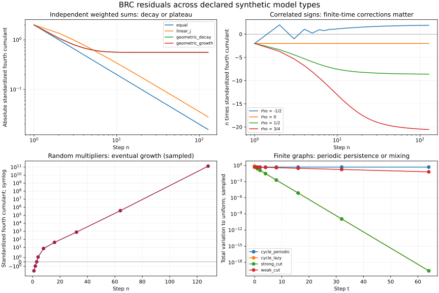

# BRC 残差：扩大类型后的结果与边界

2026-10-02（Asia/Shanghai）。任务 `RS-BRC-BASELINE-RESIDUAL-20261002`；直接研究活动 `RA-BRC-BENCHMARK-20261002-FCA717`。

## 结论

本轮把既有线性衰减、扩散、振荡基准扩展为 **11 类机制**，包括保留的基准对照。结果出现幂律、指数衰减、非零平台、周期保持、最终增长和指标未定义。**反平方不是这些 BRC 残差的统一规律。** 更有解释力的是有效独立项数、线性响应权重、相关时间、图谱与边界，以及选择了哪一种残差和归一化。

独立对称加权和有可复用的精确关系：

\[
X_n=\sum_j a_j\epsilon_j,\quad
\gamma_4=\frac{\kappa_4}{\operatorname{Var}(X_n)^2}
=-2\frac{\sum_j a_j^4}{(\sum_j a_j^2)^2}
=-\frac{2}{N_{\rm eff}},\qquad \epsilon_j=\pm1.
\]

只有等幅独立累积、且把 RMS 宽度定义为 `ell=sqrt(Var)` 时，才同时有 `N_eff=n=ell²`，进而出现 `gamma4=-2/ell²`。改变响应权重后，即使时间上仍是 `1/n`，宽度上的指数也会改变。这里的宽度不是物体间距离；结果未建立引力或其他物理力律。



图中前两幅使用完整 128 步结果，后两幅只连接明确抽样时点。不同面板的指标不同，不比较纵轴数值大小；曲线只作展示，核验采用精确有理数。

## 类型、参考与最强有界结论

| 机制（参数/规模） | BRC 表示及参考 | 观测与结果 |
|---|---|---|
| 1. 非均匀独立响应：等幅、`j`、`(3/4)^(j−1)`、`(4/3)^(j−1)` | 仿射矩传输；原始矩递推与早期完整枚举 | 等幅 `gamma4=-2/n`；`j` 权重 `gamma4~−18/(5n)~const*ell^(−2/3)`；两种几何权重都趋 `−14/25` |
| 2. 有限窗口 `L=2,4,8` | 真正移位删除旧状态；完整状态枚举跨过窗口填满时刻 | `gamma4=−2/min(n,L)`，长期非零平台 |
| 3. 相关创新 `rho=−1,−1/2,0,1/2,3/4,1` | 保留隐藏符号的条件 BRC 矩；独立条件四阶矩与枚举 | 混合参数渐近 `C(rho)/n`；持续符号的平台；交替符号的退化时点 |
| 4. 乘性随机系数 `A=3/4,5/4` 各半 | 随机仿射包；乘积原始矩闭式与早期枚举 | 均值恒为 1，标准化四阶量最终按 `(353/289)^n` 增长 |
| 5. 阻尼、中性、放大振荡模态 `cR` | 二维仿射矩；独立径向四阶递推与枚举 | `c=1` 径向标准化残差 `−1/n`；`c=3/4,4/3` 都趋 `−7/25`，但宽度一有界一发散 |
| 6. 非线性 logistic，`r=2,3,4`、两种同均值方差初态 | 完整端点 CWM；逐步核对非线性矩恒等式 | 只保留前两阶不能闭合；`r=4` 两步均值差达到 `3/4` |
| 7. 状态依赖 lazy Ehrenfest，容量 `N=4,8` | 按当前状态赋正权的 CWM；条件矩递推、完整平稳式 | 此特例二阶矩仍精确闭合；平稳 `gamma4=−2/N` |
| 8. 周期四环与加停留四环 | 端点 CWM；矩阵、全谱、正路径枚举 | 点初值：无停留 TV 长期 `1/2`；有停留 TV=`2^(−t−1)`，`t≥1` |
| 9. 两组四点图的强/弱割，`epsilon=1/4,1/64` | 同上，固定组间初始模态 | TV=`(1−2epsilon)^t/2`；节点数相同但混合速率显著不同 |
| 10. 吸收区间及加停留版本，3 个内部点 | 次概率 CWM；生存递推与条件分布分开 | 无停留生存质量趋零而条件形状两周期；加停留时两者都收敛，但指数不同 |
| 11. 对称幂尾 `p=2,4`，截断 `L=8,...,256` | 有限支路矩传输；另作无限尾绝对矩判据 | 有限截断可算；无限尾的所需矩可能不存在，不能外推标准化矩律 |

另执行二维积分噪声 `v'=v+epsilon, x'=x+v`，作为第 1 类 `j` 权重的动力学实现。它不是独立的新机制或新证据重复计数。中性模态、等幅权重、`rho=0` 也都是已有规律的保留对照。

## 动力学推导与闭包失败

### 随机乘子：均值正确并不保证形状趋于高斯

`X_0=1, X_n=prod A_j`，独立乘子等概率取 `3/4,5/4`。任意所需原始矩均有 `E X_n^k=(E A^k)^n`，所以均值为 1、方差为 `(17/16)^n−1`。四阶中心矩扣除三倍方差平方后，最高指数项为 `(353/256)^n`；除以方差平方的主项 `(289/256)^n`，得到 `gamma4~(353/289)^n`。其他原始矩项的指数基更小。

`n=1,2` 时 gamma4 为负，`n=3` 首次变正，`n=128` 约为 `1.32010635×10^11`。这里声称最终增长，没有用短期变化冒充所有时点的单调性。

### 旋转、阻尼与放大

`R=[[3/5,−4/5],[4/5,3/5]]`，每步加四个单位坐标方向之一（各 `1/4`），初态零。令 `S2=E||X||²`、`M4=E||X||⁴`。噪声均值零、协方差为 `I/2`，与当前状态独立；旋转保持范数，故

    S2' = c² S2 + 1
    M4' = c⁴ M4 + 4c² S2 + 1
    K = M4 − 2S2² = −sum[k=0..n−1] c^(4k)

径向量 `K/S2²` 的极限为 `−|1−c²|/(1+c²)`（`c≠1`），`c=1` 则为 `−1/n`。这是一类线性振荡模态；没有验证一般波动 PDE 或把带符号干涉振幅当作正路径质量。

积分噪声的精确响应核给出 `Var x=sum[j=0..n−1]j²`、`kappa4(x)=−2sum j⁴`，从而 `ell_x~n^(3/2)/sqrt(3)`、`gamma4~−18/(5n)`。总脚本逐点核对其抽样结果与独立 `j` 权重和（时间错开一格）完全一致。

### 非线性：相同前两阶矩不足以决定下一步方差

初态 A 为 `1/4,3/4` 各半；B 为 `0,1/2,1`，权重 `1/8,3/4,1/8`。两者均值 `1/2`、方差 `1/16`。对 `f(x)=r x(1−x)`：

    E f(X) − f(E X) = −r Var(X)
    E f(X)² = r² (mu2 − 2mu3 + mu4)

第一步均值同为 `3r/16`，但方差分别为 `0` 与 `3r²/256`，第二步均值差为 `3r³/256`。使用相同前两阶矩的高斯闭包给出的第一步方差为 `r²/128`，对两者都错。`r=4` 时 A 后续固定为 `3/4`、B 两步后固定为 0。所选初态用于闭包反例，不支持“一般混沌已验证”。

所有非线性步骤使用显式端点上的确定性映射和 CWM 汇聚，没有把仿射 `MomentState` 宣称为通用非线性闭包。

### 状态依赖不一定破坏闭包

lazy Ehrenfest 在状态 `k` 停留概率 `1/2`，上移 `(N−k)/(2N)`、下移 `k/(2N)`。条件一、二阶多项式仍不超过二次：

    mean' = (1−1/N) mean + 1/2
    raw_second' = (1−2/N) raw_second + mean + 1/2

故该例低阶递推精确。程序另核对完整二项平稳分布 `Binomial(N,1/2)`；有限不可约且有停留，因而收敛，平稳方差 `N/4`、gamma4=`−2/N`。不能将这一特例推广到所有状态依赖核。

### 矩存在性边界

无限对称尾 `P(±k)=1/(2 Z k^p)` 的绝对 `m` 阶矩存在当且仅当 `m<p−1`。`p=2` 的普通均值不可积，二阶矩发散；对称截断均值为零不能替代不存在的普通均值。`p=4` 的均值与方差存在，四阶矩发散，gamma4 因而不可用。

运行只计算有限截断，`p=2` 有二阶矩 `L/Z_L`，`p=4` 有四阶矩 `L/Z_L`。即使每个固定截断分布的独立和可以适用累计量规则，也不意味着对截断极限一致成立。本轮没有执行无限 BRC。

## 真实失败与指标分型

- **短期拟合错符号：** `rho=−1/2` 的相关符号在 `n=1..16` 拟合 `C/n`，得 `C≈−0.8890`；已推导的长期系数却为 `+2`，`n=128` 有 `n*gamma4≈1.91816`。留出 `17..128` 全部保留，未重新拟合。
- **衰减与否取决于观察量：** 非 lazy 吸收区间生存质量 `s_t=2^(−floor(t/2))`，但条件二次缺陷在 `1,−1/2` 间交替。lazy 版本无条件二次缺陷为 `8^(−t)`；除以 `s_t²` 后，主指数改成 `3−2sqrt(2)`。
- **零方差不是零残差：** `rho=−1` 的 64 个偶数正时点 gamma4 未定义，JSON 记为 `null` 并附原因，没有替换成 0。

统一的是指标登记方式，而不是一个可横跨所有类型比较大小的数字：每个结果都给出参考对象、读出量、归一化、时间或宽度变量、假设和证据层次。标量 gamma4、二维径向 K/S2²、TV、生存质量、有符号二次缺陷分开记录。正支路质量始终非负；有符号坐标、特征值和残差属于外部读出。

相关机制完整推导及拟合见 [RELATED_BRANCHES.md](RELATED_BRANCHES.md)；图谱、边界、QSD 与全部时间公式见 [GRAPH_BOUNDARIES.md](GRAPH_BOUNDARIES.md)。

## 复现、实测核验与审查

在仓库根目录运行：

```bash
python experiments/brc_expanded_types_20261002_fca717/run_all.py
```

核心实验仅依赖标准库与现有生产模块；图使用 matplotlib，可加 `--no-plot` 跳过。未修改生产代码。机器可读结果为 `related_results.json`、`dynamics_results.json`、`graph_results.json`，总计数和 SHA-256 为 `summary.json`。

| 模块 | 实际完成的精确核验 |
|---|---|
| 不等幅/窗口/相关 | 1,664 个生产矩时点；112 个显式分布时点；768 个条件四阶矩及 768 个闭式方差核对 |
| 扩展动力学 | 640 个仿射时点；20 个早期显式分布时点；48 个非线性转换；256 个状态依赖转换；12 个有限尾截断 |
| 图与边界 | 6 个矩阵 × 3 个初值 = 18 条轨迹，各至 `t=64`；22,182 个精确断言 |

检查计数有重叠，不相加成独立实验数。128 步递推、图上 64 步及前期完整路径枚举均实际执行。JSON 为控制大小记录抽样点及完整训练/留出汇总；相关模型另完整保留变号与未定义时点。全时间结论依赖上文代数或谱推导，有限核验承担实现一致性检查。

交叉审查：`EM-DIRECT-A48630` 独立审查动力学，见 [DYNAMICS_REVIEW.md](DYNAMICS_REVIEW.md)；根执行者复核相关模型的条件矩、倾斜谱展开和窗口删除实现，以及图模型的完整谱、特征递推、吸收 QSD 常数与归一化。审查促成补充 `p=2` 普通均值不存在的边界，并保留乘子 `n=3` 的变号时点。这些是研究内交叉检查，不是正式 Driver 接受。

## 已完成范围与后续边界

本次有限类型扩展完成。证据适用于明确列出的合成模型，尚无真实观测数据、一般非线性分类、一般波动 PDE、一般无限图定理或真实空间力学验证。最值得带到后续检验的候选结构是 `N_eff`、条件状态与闭包所需信息、相关谱以及边界归一化；如继续扩展，应针对这些明确缺口选择模型或数据，沿本证据恢复。

Researcher-ID: EM-BRC-FCA717 / TASK_RESEARCH
