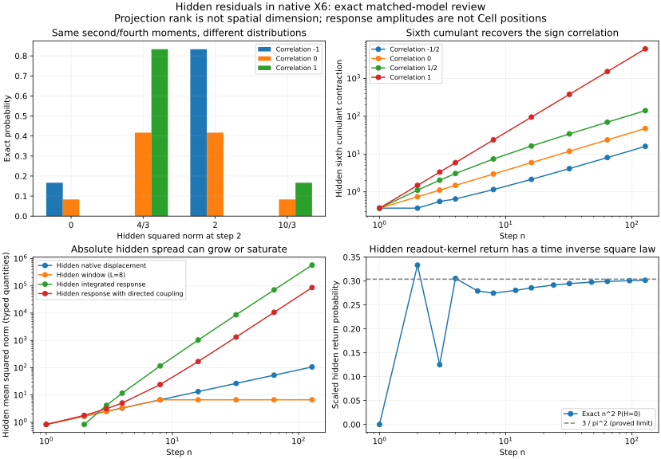

# 隐藏残差自身的规律：六维立体计算的扩大复盘

日期：2026-10-03（Asia/Shanghai）。任务：`RS-BRC-BASELINE-RESIDUAL-20261002`。
研究及综合：`EM-BRC-FCA717`；相关支路及独立审查：`EM-DIRECT-A48630`；扩展动态：`EM-BRCGRAPH-FCA717`。

**本轮找到了隐藏残差自身的明确规律，也找到了它们的边界：低阶标准化量可以普适衰减，但绝对残差仍增长；六阶、混合矩、时间相关和返回事件能识别低阶指标掩盖的结构。** 新增复盘覆盖旧有限窗口、积分噪声和乘性噪声；同时检查轴路由偏置与显式响应耦合对上一轮结论的影响。

当前原生进取坐标系没有平面，所有研究以心跳世界X6为基础；本次演化显式使用步序n。旧二维模型仅是下文已给定X6状态／读出桥的观察。

固定项目语义：六维是完整原生立体空间；三维是其中一层晶包，时间另型。以下秩4/秩5指六分量读出的线性支撑，不是另一个空间维数，也不自动定义晶包层。原生 `X` 始终由整数 `±E_i` 基本步推进，响应和隐藏投影均另型。

## 这次“隐藏残差”到底是什么

对于旧标量 `S=sum_i X_i`，隐藏量定义为 `H5=P5X`，其中 `P5=I−J/6`。对于上一轮匹配旧二维读出概率律的 `U X=(X1+X3+X5,X2+X4+X6)`，定义 `H4=P4X`，其中 `P4=I−UᵀU/3`。它们都是旧观察遗漏的分量，而不是新的 Cell 地址。

窗口、积分与振荡研究分别对窗口位移、积分响应、振荡响应取相同类型的隐藏读出。主表明确标识变量，避免用同一个“残差”词将原生位移与响应幅度混为一谈。

隐藏量非零不自动证明发生了跨轴物理通量；本轮将共同原生输入驱动和显式可见→隐藏响应驱动分开计算。支路质量保持正，坐标与响应正负不被当作负质量。

## 1. 一个稳健规律：绝对隐藏宽度增长，标准化四阶量衰减

六轴路由独立均匀，独立于任意完整正负符号历史。对旧标量遗漏的 `H5`，不仅六组旧 Markov 参数，对每一条固定符号历史都精确有

\[
E\|H5_n\|^2=\frac{5n}{6},\qquad
K_{H,4}=-\frac{5n}{18},\qquad
\Gamma_{H,4}=-\frac{2}{5n}.
\]

定义 `K_{H,4}=E||H||⁴−(trΣ_H)²−2tr(Σ_H²)`，`Γ=K/(E||H||²)²`。这说明三种观察同时存在：平方宽度增长，未标准化四阶差值的绝对值增长，标准化差值趋零。**“残差衰减”必须说明是哪一个量。**

对确定权重的独立创新响应 `W=sum a_j ξ_j`，同样有

\[
E\|P5W\|^2=\frac56\sum a_j^2,\qquad
\Gamma_{H,4}=-\frac{2}{5N_{\rm eff}},\quad
N_{\rm eff}=\frac{(\sum a_j^2)^2}{\sum a_j^4}.
\]

有效独立次数能统一解释本轮窗口、积分和等权例子的四阶行为；改变读出、路由或响应耦合后需重新推导系数。

## 2. 低阶相同，第六阶仍保留来源；混合四阶更早能看见它

保持旧符号链 `rho=-1,-1/2,0,1/2,3/4,1`，令 `V_S=Var(S_n)`。隐藏量的六阶径向矩为

\[
E\|H5_n\|^6=\frac5{216}(63n^3-54n^2+16V_S).
\]

真正的六阶累积量张量收缩还要扣去四阶与二阶配分，结果为

\[
\boxed{K_{H,6}=\frac{10}{27}V_S}.
\]

因此隐藏残差的二阶、四阶对这些相关参数完全相同，第六阶却能重新识别符号相关性。这里“六阶首次识别”限定为同一时刻、纯隐藏多项式矩；非多项式事件和包含旧观察的联合量可以更早识别。

最小完整分布反例已经在第2步出现：`P(H5_2=0)=(1−rho)/12`。严格交替时为1/6，独立符号时为1/12，持续同号时为0，但三者二阶、四阶仍一样。

另令 `A3=sum_i H_i³`，则 `E[S_n A3_n]=(5/9)V_S`。它是联合四阶量；不能只看 `Cov(S,H)=0` 就删除联合信息。本轮窗口、积分、乘性及振荡中，甚至 `Cov(可见平方,隐藏平方)=0`，仍有非零混合四阶作为不独立的证据。完整证明与独立词枚举见 [HIDDEN_CORRELATED.md](HIDDEN_CORRELATED.md) 和 [HIDDEN_DYNAMICS.md](HIDDEN_DYNAMICS.md)。

### 在固定机制内，标准化分布确有共同极限

这不仅是几条低阶矩曲线的巧合。设 `Z=e_I−1/6·1`，`B=Cov(Z)=P5/6`，`f(u)=E exp(iuᵀZ)`。Z有界且均值0，故在0邻域 `log f(u)=−uᵀBu/2+O(||u||³)`。给定任意符号词，

\[
\log E\left[e^{iu^TH_n/\sqrt n}\mid\epsilon\right]
=\sum_{t=1}^n\log f(\epsilon_tu/\sqrt n)
=-\frac1{12}u^TP5u+O_u(n^{-1/2}).
\]

误差对全部符号词一致，所以再平均任意独立于整个轴序列的符号过程，仍有 `H_n/√n` 弱收敛于协方差 `P5/6` 的 Gaussian 分量读出。无需假设符号过程混合。这个连续分布是离散量的标准化极限描述，不改变原生离散空间。

但弱极限不决定格点点概率或周期：持续同号时 `H_n=0` 要求六轴使用次数相等，只在6整除n时可能；它仍满足上述同一弱极限。权重、轴符号耦合、非均匀路由及新增响应驱动均不在此推论范围。该推论由跨作者另行核对，详细审查记录见 [ROOT_REVIEW.md](ROOT_REVIEW.md)。

## 3. 二维读出归零不会抹去隐藏结构；某阶残差归零也不代表拟合完成

均匀路由下，给定任意完整旧二维读出方向词，仍有

\[
E(\|H4_n\|^2\mid\text{旧二维读出方向词})=2n/3.
\]

故只挑旧二维读出端点归零的路径，也有 `E(||H4_n||²|Y_n=0)=2n/3`。第128步条件隐藏平方残差为256/3，没有因二维读出归零而消失。

偶数步的条件标准化四阶量精确为

\[
\Gamma_{H4\mid Y=0}=-\frac{n-2}{2n(n-1)}.
\]

第2步该量恰为0，但 `||H||²` 仍以1/3概率为0、2/3概率为2。其六阶矩16/3不同于同协方差 Gaussian 的64/9。**一个阶次的残差为零，不能当作整体结构已经消除的证据。**

隐藏部分自身也有可算的返回律：

\[
P(H4_n=0)\sim\frac3{\pi^2 n^2}.
\]

精确整数计数已算到128步；常数和周期1由声明差分格点的 Fourier / 局部极限分析确定。第3步隐藏返回概率1/72，而完整原生返回仍不可能。这里再次出现**时间上的反平方概率律**，其对象是隐藏返回事件；没有得到空间距离上的引力反平方定律。证明、条件分布及独立复算见 [HIDDEN_PLANE.md](HIDDEN_PLANE.md)。

## 4. 扩大旧研究后，隐藏残差呈现平台、记忆、扩散及相位结构

| 旧类型或明确新增机制 | 隐藏量 | 平方残差行为 | 标准化四阶及记忆规律 |
| --- | --- | --- | --- |
| 旧相关符号六参数 | `P5X` | 精确5n/6 | 精确−2/(5n)，但六阶保留相关性 |
| 新纳入的旧窗口L=2、4、8 | `P5(sum最近L项 ξ)` | 填满后5L/6 | 平台−2/(5L)；窗口相隔至少L步时独立 |
| 新纳入的旧积分噪声 | `P5Q`，Q_next=Q+X | 渐近5n³/18 | 渐近−18/(25n)，按响应宽度为负2/3次幂 |
| 新纳入的旧乘性噪声 | `P5X` | 精确5n/6 | 精确−2/(5n)；旧乘性响应四阶却指数增长 |
| 旧阻尼/中性/放大振荡 | `P4Z` | 有界／线性／指数，随响应核 | 隐藏四阶可趋平台；时间相关保留旋转相位 |
| 新增可见→隐藏响应驱动 | `P5Z`，A=I+(e1−e2)1ᵀ/4 | 渐近n³/24 | 渐近−18/(5n)，旧标量全部路径仍不变 |

后三种响应模型中的 Q/Z 与原生位置 X 分型。上述程序的原生基本步仍为合法整数六轴步；原生位置的平方位移不因响应积分或放大就自动变成三次或指数增长。有限窗口研究实际保留原生有序队列，不能用当前窗口和替代未来删项所需的记忆。

复盘范围现为20个参数或机制配置，含重叠：6相关、3窗口、1积分、1乘性、5既有振荡隐藏统计、3路由敏感性、1新响应耦合。新增覆盖了三类旧研究，未声称穷尽此前全部非线性、有限图或重尾类型。

## 5. 哪些规律能推广，哪些还不能

还检验了保持旧全部二维读出概率律不变的三个原生路由核。两组三轴各占总概率1/2，组内权重q分别为均匀、(1/2,1/4,1/4)、(4/5,1/10,1/10)，全部六轴概率均正。

三者无条件隐藏平方残差都为2n/3，但条件于旧二维读出归零时，分别变为 `2n/3、5n/8、17n/50`。标准化四阶系数也分别为 `−1/2、−17/32、−149/200` 乘1/n。**即使旧概率律完全相同，隐藏残差的具体系数仍会随原生路由改变。**

本轮可信的共同结构是：在明确的独立创新、读出和响应条件下，隐藏残差有可证明的尺度律、有效独立次数、记忆范围和高阶关联；具体指数、系数、平台和返回周期仍受机制决定。六维立体空间是固定起点，待辨认的是传播规则，而不是空间是否六维。

后续评估至少应同时记录：绝对隐藏平方宽度、标准化四阶与六阶、可见—隐藏混合统计、时间相关，以及完整/可见/隐藏三类返回事件。本轮反例证明这些观察不能互相替代。

## 可复算与验算强度

```bash
python experiments/brc_hidden_residual_20261003_fca717/run_all.py
```

全部核心计算为 Fraction 或整数；绘图才转浮点。没有随机抽样、学习拟合或新增生产数学模块。现有 BRC `Affine/EffectHistogram/MomentState` 和正 CWM 得到实际复用；更高阶使用已证明的条件闭包或响应核，没有冒称二阶矩模块自动具备六阶能力。

相关模块：768个完整矩和新隐藏闭包时间点；前4步完整分布与独立符号词×轴词组合相等。二维读出模块：三个核及一个响应耦合各128步；完整X6 CWM至6/4/4步、联合响应至3步，隐藏返回另用独立整数系数至128步。动态模块：26,250项精确断言；旧窗口/积分/乘性原函数实际执行，振荡复用已保存结果，仅新增隐藏统计与时滞核验。根二维读出模块44,318项直接精确检查调用，端点观察与边数另记。跨模块54个等式核对共同极限。

这些计数有重叠，不相加为独立实验数。独立审查还枚举了耦合模型第4步的全部20,736条原生词，超过根模块的3步枚举边界；其数值与公式一致。见 [CROSS_REVIEW.md](CROSS_REVIEW.md)、[ROOT_REVIEW.md](ROOT_REVIEW.md)、`summary.json` 和运行日志。


