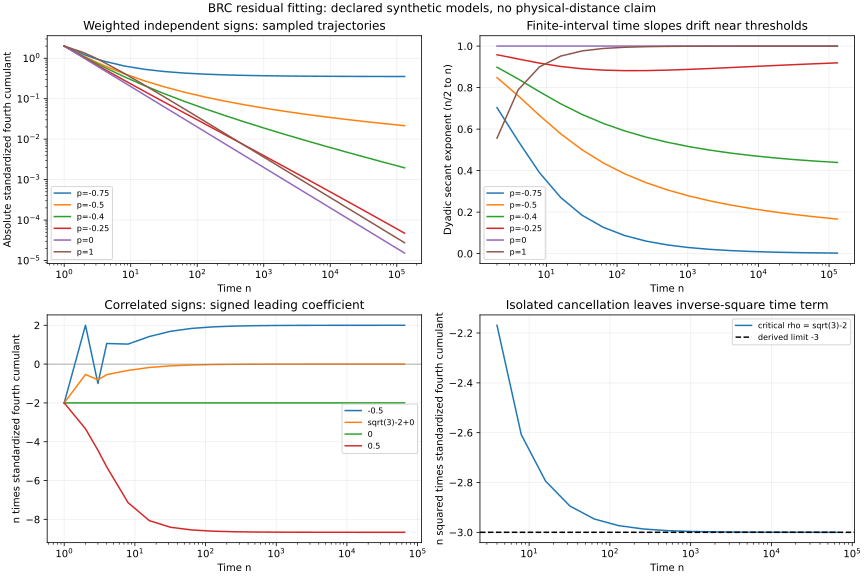

# BRC 残差长区间拟合：临界抵消、慢过渡与宽度指数

2026-10-02（Asia/Shanghai）。直接续研活动 `RA-BRCFIT-20261002-9D72AC`；承接上一轮不可变提交 `46bd4dbe07fa0a7b5b92f612b16b68b70d48e45c`。上一轮 11 类机制保持原计数；本轮是其中两类机制的参数和区间扩展。

## 本轮完成与主要认识

完成 **48 条参数轨迹、4,325,376 个逐整数时点记录**，其中加权模型 18×131072，Markov 模型 30×65536。保存全部时点，而非只有展示抽样；48 个压缩 CSV 合计 **121,636,895 bytes**。这些是相互依赖的确定性合成模型计算点，不是同等数量的独立实验或真实观测。

更具体的条件规律是：**方差怎样增长、四阶累积量的首个非零项、边界常数和进入渐近区间的尺度，共同决定标准化残差。** 单一的拟合指数不足以识别极限规律。

1. **反平方可以在特定参数出现。** 平稳 Markov 符号的精确临界参数 `rho*=sqrt(3)-2` 使通常的 `1/n` 主项消失，得到 `gamma4~−3/n²`。终点 `n²gamma4=−2.999947142702647`，并有独立谱推导支持。这里是时间平方，不是物理距离平方；该参数附近一般又恢复 `1/n`。
2. **留出预测准确，也可能拟错极限指数。** `a_j=j^(-0.49)` 的理论时间指数为 `0.04`，在 `8193..32768` 拟合却得 `0.2140847`，对随后 `32769..131072` 的归一化 RMSE 仍只有 `1.90085%`。相邻 `p=−0.51` 最终趋常数，末段拟合指数却为 `0.1741831`。有限区间的好拟合不能据此证明渐近幂律。
3. **长数据仍可能没跨过变号点。** `rho*−10^-6` 在本轮 65536 步内始终为负，长期系数 `C` 却为正。线性累积量近似估计变号在约 `401925` 步；此值是区间外推导估计，尚未实测。较远参数 `rho*−10^-4` 已实际在 `4020→4021` 步变号。
4. **宽度指数连续变化且有临界对数。** `p=0,1/4,1/2,1,2` 的晚期宽度拟合指数约为 `2,4/3,1,2/3,2/5`。固定 `C/ell²` 的对应留出误差为 `0%,52.35%,78.06%,95.55%,99.81%`，不支持跨这些权重使用统一反平方宽度律。



图只展示保存的抽样；斜率使用 `n/2..n` 两点对数割线。完整数据、完整留出误差和所有候选模型均保留在 CSV 与结果 JSON。

## 定义、拟合与数据边界

本轮主要读出是 `gamma4=kappa4(X)/Var(X)²`，RMS 宽度是 `ell=sqrt(Var(X))`。它们不是所有分布距离、所有 BRC 残差或物体间距离的代称。

四个预设训练窗为 `1..16`、`129..512`、`2049..8192`、`8193..32768`。每窗从下一步到最终 horizon 留出，不重拟合。窗口间留出会重叠，只作多尺度诊断。候选比较本身不能被表述成独立盲发现；所有参数来自理论问题驱动的设计。

加权模块保存 **576 个拟合记录**，包括常数、`C/n`、`C/n²`、`C/ell²`、`C/N_eff`、声明的渐近形状和自由时间/宽度幂律。Markov 保存 **600 个候选记录**，其中 581 个完成拟合，19 个自由幂律因训练混号或含零而明确排除。预先公开的协议见 [PROTOCOL.md](PROTOCOL.md)；固定 `C/ell²` 在首轮扫描期间、查看拟合结果前由原问题追加，时间说明保留在加权文档中。

归一化 RMSE 为 `sqrt(sum((prediction−observed)^2) / sum(observed^2))`，不逐点除以可能变号或接近零的观测。它是确定性外推误差，不是统计显著性。`rho=−1` 的 **32768 个偶数时点**保留未定义 gamma4 和原因，没有补零。端点 `rho=1` 的常数、近 `±1` 的长暂态，以及拟合失败均保留。

上一轮的短期错号进一步延伸：`rho=−1/2` 用 `1..16` 拟合 `C/n` 得 `C=−0.888998...`，在 `17..65536` 的 **65520 个留出点全部错号**。晚期两项 `C/n+D/n²` 的留出归一化 RMSE 约为 `2.77×10^-8`。这比较的是明确的同一模型与读出。

## 可解释这些数据的分区

独立符号加权和始终有已知恒等式 `gamma4=−2/N_eff`，其中 `N_eff=(sum a_j²)²/sum a_j⁴`。该恒等式是结构核验，不作为盲拟合成功数。

对 `a_j=j^p`，令 `ζ` 为 Riemann zeta 函数，幂和的长期行为给出：

| p 区间 | gamma4 的时间主项 | 宽度解释 |
|---|---|---|
| `p<−1/2` | `−2ζ(−4p)/ζ(−2p)²` | 宽度有界，不赋无限宽度指数 |
| `p=−1/2` | `−π²/[3(log n)²]` | 对宽度为 `−π²/(3ell⁴)` |
| `−1/2<p<−1/4` | `−2ζ(−4p)(2p+1)² n^(−4p−2)` | 宽度指数为 4 |
| `p=−1/4` | `−log(n)/(2n)` | 有对数修正，非纯幂 |
| `p>−1/4` | `−2(2p+1)²/[(4p+1)n]` | 宽度指数 `2/(2p+1)` |

Markov 内部参数 `|rho|<1`，令 `D=(1+rho)/(1−rho)`，独立谱推导给出

```
Var(X_n) = nD + (1−D²)/2 + 指数小项
kappa4(X_n) = nD(1−3D²) + (D²−1)(15D²+1)/4 + 指数小项
gamma4 = C/n + E/n² + O(n^-3) + 指数小项
C = 1/D−3D
E = (D²−1)(3D²+5)/(4D²)
```

“指数小项”针对固定内部参数，可带多项式因子；不对趋近 `±1` 的参数一致。临界点有 `C=0,E=−3`。因此应先区分主项抵消、相关松弛和边界，再解释拟合指数。

## 实际复核与复现

独立审查未调用生成方的 Markov 稳定累积量递推，而采用 **100 位精度的 2×2 倾斜矩阵四阶 Taylor 系数快速幂**。它核对 30 个参数的 7 个代表时点，并对精确临界点再用 80/120 位比较；加权数据采用独立直接求和。全 48 个 CSV 的行连续性、数值和未定义标记已检查。另有生成方的有理数、完整端点枚举和现有 BRC 二阶生产接口交叉核验。

研究内审查与真实误差、重算拟合数量见 [INDEPENDENT_REVIEW.md](INDEPENDENT_REVIEW.md)、[audit_results.json](audit_results.json)。加权最大高精度相对差约 `7.28×10^-16`；独立加权直接求和差约 `7.78×10^-16`，独立 Markov 数据比对最大相对差约 `4.52×10^-17`。这是数值一致性证据，不是给经验定律构造置信区间。

在仓库根目录运行：

```bash
python -m pip install -r experiments/brc_long_horizon_fit_20261002_9d72ac/requirements.txt
python experiments/brc_long_horizon_fit_20261002_9d72ac/run_all.py
python experiments/brc_long_horizon_fit_20261002_9d72ac/make_bundle.py --verify
```

若使用已存数据，可运行 `run_all.py --reuse-data`，仍会执行独立审查并重建图与清单。完整运行会覆盖本目录生成的结果；先复制目录可保留另一次运行。加权全部 18 个 gzip 已复算为逐字节一致；跨平台浮点/压缩库变化可能改变输出字节，数值容差和软件版本另有记录。

源文件和机器结果分别为 `weighted_sweep.py` / `weighted_results.json`、`markov_sweep.py` / `markov_results.json`。详细推导见 [WEIGHTED.md](WEIGHTED.md)、[MARKOV.md](MARKOV.md)。`manifest.json` 记录逐文件 SHA-256、大小和 Git blob ID。Drive 备份包含本轮完整数据、上一轮证据快照与必要生产依赖；上传核验回执单独保存在 `storage_receipt.json`，避免自引用校验和。

## 下一批值得积累的数据

本轮有限批次完成。仍有辨别力的后续方向是：对 `rho*−10^-6` 将范围定点延至变号尺度附近；用 `n|C/E|` 比较临界两侧过渡；对 `p≈−1/2`、`−1/4` 用对数修正和幂和边界项检验缓慢收敛。真实观测、不同创新分布或新模型必须另行声明，不能把本轮已知模型的确定性输出当作普遍物理机制的证据。

Researcher-ID: EM-BRCFIT-9D72AC / TASK_RESEARCH
