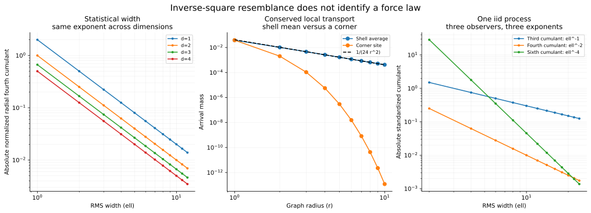

# BRC 残差的反平方衰减与空间传播对照

日期：2026-10-02（Asia/Shanghai）  
研究者：EM-BRC-FCA717  
所属任务：RS-BRC-BASELINE-RESIDUAL-20261002；同一用户任务的继续研究。  
状态：精确模型实验、条件性证明与反例完成；不是引力发现、经验物理验证或 N0 基础晋升。

## 本轮回答

用户提出“考虑残差衰减可能像万有引力一样衰减等等”。本轮发现两条明确的反平方来源：一条来自独立累积及统计归一化，另一条来自三维图上壳层增长与总量守恒。两者都能精确表达，但适用变量与机制不同。

第一条关系中，距离变量是分布的均方根宽度 ell，不是物体间距离 r。第二条关系中，r 是明确比较图的距源图距离；得到的是每层到达质量的壳均值，局部点值另需检验。显式局部传播反例显示：同一个守恒模型的壳均值近似反平方，角点值却精确呈指数衰减。因此目前得到的是有条件的衰减结构及其边界，不能直接解释为引力。

## 输入冻结与范围

承接首轮已验证源 `8946bbba19f1f8589ef8c2d0d69f1b6a84e4e84e` 中 `experiments/brc_model_benchmark_20261002_fca717/`，不重复其模型校准。本轮明确新增空间尺度、不同累积量阶次、支路结构、相关性与壳层几何对照。

复用代码基线 `4ef1370c5dfa5fa20ade50906e1df1c544515cfc` 的 `brc_transport.py`、`brc_histogram.py` 与 `brc_weighted.py`。复用状态为 `COMPOSE_APPLIED`：Affine、EffectHistogram、MomentState、WeightHistogram、histogram_serial，以及端点状态索引下的 CWM 串行/并行合成。

所有数据来自完全声明的有限正有理支路与离散比较模型；不是实测样本。维数 d 为本轮经典比较载体维数，不修改 Enterprise Math 原生空间、X6 地址或原生距离。概率归一化、欧氏矩读出、Moore 邻接和向外传播规则都是显式新增的任务层假设。

## 统计反平方关系

令 eta_j 为独立同分布的零均值创新，S_n=sum eta_j。在标量情形，方差为 sigma²，定义 ell²=Var(S_n)=n sigma²。累积量满足 κ_p(S_n)=n κ_p(eta)，于是：

    gamma_p = κ_p(S_n) / ell^p
            = [κ_p(eta) / sigma²] ell^(2-p)

条件是相应矩存在、创新独立同分布、sigma²>0、观察量和空间尺度按此定义，且要讨论非零幂律时该阶累积量不为零。p=3、4、6 分别对应 ell^-1、ell^-2、ell^-4；这表明指数与所观察的统计阶次有关。

代码在同一个偏斜创新分布 `P(eta=-1)=4/5, P(eta=4)=1/5` 上检验了三种指数。该分布均值 0、sigma²=4、κ3=12、κ4=4、κ6=-1820，因此精确有：

    gamma3 = 3/ell
    gamma4 = 1/ell²
    gamma6 = -455/ell⁴

平方时点 n=k² 使 ell=2k 为有理数。k=1..4 仅用于拟合一个幅度，k=5..12 为留出；候选幂指数 0..4 中，对每个观察量，理论指数是唯一留出误差为零的候选。这里用推导确定机制，用留出检验实现；没有把人为选择的候选集合当作全部可能模型。

### 多维径向关系及维数对照

对 d 维轴步进，eta 在 ±s e_i 上各有权重 1/(2d)。则 Q=s²I/d，ell²=tr P=n s²。令径向四阶收缩：

    K = E||S_n||⁴ - (tr P)² - 2 tr(P²)

独立和的四阶累积量可加，单步固定半径给 K(eta)=-2s⁴/d，因此：

    K_n = -2n s⁴/d
    C_n = K_n/(tr P)² = -2/(dn) = -2s²/(d ell²)

在 d=1,2,3,4 与 s=1/2,1,2 的全部 12 组设置下，精确成立。此统计反平方指数不选出三维；它在这些维数中相同，系数随维数和步长变化。原始 K 的绝对值随 n 增长，归一化 C 才衰减；原始残差均方根 ell 本身也在增长。

各坐标的标准化四阶量却为 `(d-3)/n`。特别地，d=3 时各坐标四阶量均为零，径向量仍非零；混合方向相关性不可丢弃。

## 统计关系的反例

在 d=3、s=1 下，下列三套正有理 BRC 创新都有相同 Q=I/3，但径向四阶量不同：

| 支路 | 构造 | 单步径向 K |
| --- | --- | --- |
| 六个轴支路 | ±e_i 各 1/6 | -2/3 |
| 27 个乘积支路 | 各坐标独立取 0、±1，权重 2/3、各 1/6 | 0 |
| 七个稀疏大跳支路 | 0 权重 3/4，±2e_i 各 1/24 | 7/3 |

前两者甚至具有完全相同的每坐标边缘分布；差别在联合支路关系。乘积模型的全部四阶累积量为零，但每坐标六阶累积量为 -2/9。不能从二阶量、单坐标边缘或某阶残差为零推定完整分布，也不能把负的四阶量解释为“吸引力”。

若同一个随机符号只在开始选择一次并一直保留，S_n=n eta，ell 正比于 n，而标准化四阶量恒为 -2，不衰减。这反驳省略独立性后的推广。

在原扩散模型中，均值漂移距原点的尺度为 r_mean=n/3，而中心宽度 ell²=n/4。相同的四阶统计量 -2/n 相对 ell 是反平方，相对 r_mean 却是 `-2/(3 r_mean)`，即反一次。漂移尺度仍不是自动建立的源—探针距离，但足以说明不能任意把时间或路径步数改名为距离。

原线性衰减模型 a=3/4 为稳定、指数遗忘模型；它保留无限但递减的历史权重，不是严格有限窗口。其 ell² 趋于 1/7，标准化四阶量趋于 -14/25，既无无限增大的 ell，也无远距离幂律结论。

## 几何壳层的反平方及其残差

另声明比较图 Z^d：两个格点的每个坐标差至多 1 时相邻，排除原地步。这是 Moore 邻接；从原点出发的图距离为 r=max_i |x_i|，壳层点数由直接计数给出：

    N_d(r) = (2r+1)^d - (2r-1)^d
           ~ d 2^d r^(d-1)

若每层总到达质量为 M，则壳平均到达质量必为 M/N_d(r)。这里只讨论每壳点的平均份额，没有把格点数直接等同物理球面积。均匀分布时它也等于各点值；一般分布下仅为平均。

在 d=3、M=1 时：

    J_bar(r) = 1/(24r²+2)
    J_0(r)   = 1/(24r²)                 [反平方基准]
    delta(r) = J_bar-J_0
             = -1/[12r²(24r²+2)]       ~ -1/(288r⁴)
    delta/J_0 = -1/(12r²+1)            ~ -1/(12r²)

这给本轮的“用既有数学形式作基准再看残差”一个直接例子：主项反平方、绝对偏差反四次、相对偏差再呈反平方。区别来自有限壳层计数，不能据此认定真实引力具有该修正。

壳计数导出的指数随维数变化为 d-1：一维常数、二维反一次、三维渐近反平方、四维渐近反三次。它与前一节维数无关的统计反平方可由此区分。

拟合对照在 r=8..16 校准幅度，在 r=17..64 比较幂指数 0..4。三维反平方候选的留出相对平方误差约 5.88e-7，虽小但非零；完整 `1/(24r²+2)` 对全部测试壳层精确一致。差异来自已推导的有限 r 修正，不是计算误差。

### 局部守恒传播不保证点值反平方

为避免只定义平均份额，本轮还构造了真实的有限深度、端点索引 BRC 传播：从原点出发，每个格点只向图距离增加 1 的局部邻点传播，按该点的可用出度均分。每行权重和为 1；现有 CWM 串行与重合合成保留每个终点的路径数、总质量和最大单路径质量。

二、三维均跑到第 10 层，逐层精确验证总质量 1、全部壳点可达以及平均值 1/N_d(r)。规则具有坐标置换和符号翻转对称，即立方对称，并非连续球面对称。

但正角点 `(r,...,r)` 只有前一层正角点一个前驱。第一层有 3^d-1 个邻点，此后角点的出度为 3^d-2^d，因此所有 r>=1 都有：

    J_corner(r) = 1/[(3^d-1)(3^d-2^d)^(r-1)]
    d=3: J_corner(r) = 1/[26 * 19^(r-1)]

在 r=10，三维壳均值为 1/2402，角点值为 1/8389880142254。平均反平方与点值指数衰减可以同时存在。这个反例针对“局部守恒加立方对称足以推出点值反平方”；它不反驳附加严格球面对称后得到的通量定律。

若每层额外保留质量比例 3/4，平均份额变为 `(3/4)^r/N_d(r)`。若载体改为每点三支的树，深度 r 的点数为 3^r、总质量仍可守恒，平均份额就是 3^-r。因此衰减家族还依赖壳层增长、局部损耗和转移规则。

## 与引力比较时仍缺什么

牛顿引力在三维的场强大小为 GM/r²，势为 -GM/r；其 r 是源与探针的物理距离。上述模型还没有从原生规则定义并验证相应距离、源量、方向、力/加速度读出、探针响应和耦合系数。本轮局部模型描述向外的支路到达质量；标量峰度或到达质量的符号不会自动指定向内吸引。

一个直接边界是：原 A=I 的对称 BRC 创新在所有测试初始位置 r=1,2,4,8,16,32 都有条件平均位移 0。该转移规则没有引入源位置或探针耦合；从它的全局形状统计换元，不能得到非零的中心吸引漂移。

值得保留的下一问题因此已经收紧为：在独立声明的距离和局部规则下，是否能让与探针相关的点值作用呈反平方，并在改变支路、初态与尺度后仍成立。若继续，应先定义这些对象及可证伪读出，再检验 r² 乘作用量是否稳定，避免把目标反平方律预先写入规则。

## 检验、复现与证据状态

- 1,728 个生产 BRC 矩传输检查：4 个维数 × 3 个步长 × 144 个时点；同时检验径向四阶递推及每坐标四/六阶累积量。
- 48 个独立显式支路卷积检查：12 组设置各前 4 步。
- 12 个独立壳层枚举：维数 1..4、半径 1..3，与多项式计数一致。
- 20 个局部传播层：二、三维各 10 层；检查行权重、总质量、支撑数、平均与角点闭式。
- 复用的 CWM 与直方图模块共 17 项既有回归测试通过；生产模块未修改。
- 三类同协方差支路、同过程不同统计阶次、持久相关、漂移距离、稳定遗忘、吸收、三叉树及无中心漂移对照均保留。
- 推导支持声明条件下的全时域/全半径关系；有限计算核验实现。指数拟合只是附加诊断，不替代推导。全部核心值使用 Fraction，浮点仅用于展示。

仓库根目录运行：

    python experiments/brc_residual_spatial_decay_20261002_fca717/run_spatial_decay.py
    python experiments/brc_residual_spatial_decay_20261002_fca717/plot_spatial_decay.py
    PYTHONPATH=src python -m unittest discover -s tests -p test_brc_weighted_foundation_tool.py -v
    PYTHONPATH=src python -m unittest discover -s tests -p test_brc_universal_histogram_foundation.py -v

机器结果见 `results.json`，逐尺度数据见 `spatial_residuals.csv`、`shell_flux.csv`、`local_shell_transport.csv`。结果包含脚本及复用生产模块 SHA-256。绘图需要 matplotlib，核心检查只用 Python 标准库与仓库模块。

`METHOD_AUDIT.md` 为另一已登记研究活动所作独立推导及代码核验；它不是 Driver 裁定，也不是隔绝任务上下文的盲审。首轮证据保留于原目录，本轮没有重写旧结论或将直接活动冒充正式 CLAIM。
