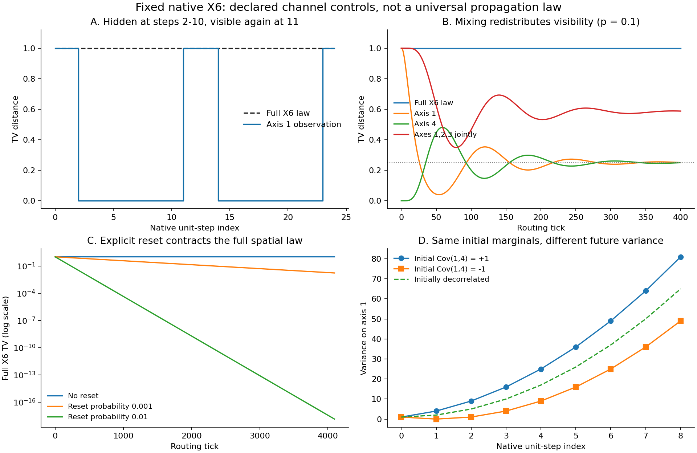

# 原生六维残差传导补查

日期：2026-10-02。研究者：EM-BRCFIT-9D72AC。范围：直接 TASK_RESEARCH 的有界续算；条件机制结果，未作 Driver／Foundation 接受。

**用户提出的因素确实是旧研究的覆盖缺口。** 两批旧实验没有建立完整原生六轴状态、跨轴更新和观测投影之间的桥接。本次补算给出了实际反例：残差能在某一轴的读出中暂时完全不可见，之后回传；跨轴关系也能在所有单轴初态相同的情况下改变未来结果。由此需要修正原生六维解释范围，但不能把旧合成模型中的数值结果判错，也还不能认定跨轴传导是全部旧曲线的实际成因。

立体空间固定为原生六维离散 Cell 空间，时间单独定型。这里的 signed raw 坐标、Cell 锚和观察轴均固定；具体更新核是显式研究假设，不是维数拟合，更不是把空间重释为三维或相空间。

## 1. 新数据与主要证据

新增 **42条参数轨迹、172,074行完整时序**，每条含初态及4096步。六个空间轴数固定；扫描的是两个传导通道族、7个前进概率与3个 reset 概率。还保存195行精确跨轴二阶对照，以及27个时刻的高阶联合反例完整概率律。这些是确定性分布递推，不是172,074个独立经验样本。

| 对照 | 可见读出 | 完整当前六轴空间律 | 说明 |
|---|---|---|---|
| 原生单位轴步组成的12节点环，确定性前进 | 第1轴 TV 在第2至10步为0，第11步回到1 | TV始终为1 | 投影看不见不等于差异消失；隐藏信息能回返 |
| 同一环，前进概率0.1、无reset | 第1轴TV先下降、再回升，最终趋1/4；三轴123联合TV趋7/12 | TV为1，数值偏差在误差界内 | 分散后局部形成平台，不是向零衰减 |
| 六轴主动置换通道，0<p<1、无reset | 每个单轴TV趋1/6，三轴123趋1/2 | 对本例初态TV为1 | 平台由通道、初态及观察器共同决定，不能仅由“六维”推出 |
| 显式reset概率d | 所有空间投影TV带生存因子 | TV=(1-d)^n | 真正空间律收缩的对照；reset不是原生空间微步，外部历史档案仍保留 |
| 隐藏第1、4轴协方差为+1或−1 | 初始所有单轴及123联合律相同；一步后第1轴方差4或0 | 全律始终可区分 | 初态独立化会错误地对两者都预测方差2 |
| 六轴符号奇偶关系 | 任意五轴以内初始联合边缘都相同；条件单位步后单轴立即不同 | 隐藏六阶关系一直存在 | 只补齐二阶、四阶量仍未必足以处理状态依赖未来 |

这里 TV 是两种**正概率律**之间的总变差距离。它用来追踪明确的可区分性，不能与旧 `gamma4=kappa4/variance^2` 混称同一种守恒残差。无reset时本例全空间TV保持，是因为比较的两个支持始终分离；不能推广为任意随机可逆支路混合都保持TV。坐标投影和完整空间律也都不自动等于全装饰态。



## 2. 实際原生步进，而非仅换坐标

12个非零空间节点按顺序为

`e1, e1+e2, e2, e2+e3, ..., e6, e6+e1`。

每次前进依次执行 `+E_next` 或 `−E_current`，都是单个带符号原生轴单位步。与之比较的参考律停留在所选 Cell 锚0。选择原地/前进概率构成明确的有限通道规则；没有把两轴合成位移提升成新的原始直线方向，也没有引入力的平衡定律。另一族S6置换是固定观察器下的主动宏操作，单独标注，不冒充单个空间微步。

全部端点差量直接保存为 `delta=mu−nu`，包括锚的负比较量及各非零节点的正比较量；原始μ、ν仍是正概率。这样也避免在生存差异极小时，通过浮点 `1−mu(anchor)` 相减把残差误归零。完整有序支路由初态、分支字母表、精确概率及解码器生成；长时不显式枚举指数条历史，也未把不同历史当作同一分支。

本次三轴读出是明确的 raw 坐标选择 `(x1,x2,x3)`，并非 `can3` min-zero 观察器。更换观察器需要重新验证，不能把这些平台常数自动搬到另一种地址/切片显示上。

## 3. 旧计算该怎样修正

[旧范围审计](PRIOR_SCOPE_AUDIT.md)确认：前一批确有内部状态耦合、非零交叉协方差、Markov隐藏控制态、记忆和图上传递。因此“所有旧计算都没处理传导”不成立。缺失的是这些机制到原生六轴的明确状态与路径桥。之后再增加同类标量时间点，也不能补回从未记录的轴标签和联合关系。

现有 BRC 的六维二阶接口实际上保留28个同质矩项，其中包括15个不同轴交叉项；没有强制丢掉它们。[本次精确对照](JOINT_TRANSFER.md)复用了它，并与全分布枚举逐步核对。若当前目标是四阶形状，单存六个单轴gamma不够：一般六轴对称四阶累积量有126个独立分量，仍需判断这些量能否在允许未来下闭合。

审查者另构造的六阶例更进一步：令均匀符号律为μ，令ν±条件于六轴符号乘积为±1。任意不超过五轴的完整边缘、任意总次数不超过5的矩均相同，但六轴乘积期望为0、+1、−1。条件更新 `x1 <- x1 + product(x2..x6)` 在此支持上也是原生±E1步；它立即暴露该差异。修复统计Q是联合观察量，不是第七空间轴。此例经不同作者按闭式轨道、1152个原子与27行矩独立复核。

## 4. 拟合上的直接影响

在原生单位步通道p=0.1、无reset的第1轴读出上，用第1至16步拟合 `C/n`，得到C≈1.9230076102。到第4096步预测约0.0004694843，实算约0.25；第2049至4096步留出窗口归一化RMSE约99.7397%。这是对一个声明模型的错误外推诊断，不是统计置信推断，也不证明所有早期数据都能很好拟合该形式。

因此继续找规律时，优先并列拟合/核验：全态差异、单轴读出、联合读出、跨轴响应和明确的边界收支。候选形式应允许周期回传、稳态平台、混合后的指数松弛和真实reset收缩，不能先强制设成单一幂律。原标量gamma的变化还可能仅来自分母增长；归一化、投影遮蔽与实际动力学收缩必须分开。

更具体地，若某一已声明线性更新把保留坐标o与遗漏坐标h分块，`o_next=Aoo o+Aoh h`。即使当前观测相同，只要遗漏的h或其与o的关系会经Aoh进入未来，单独拟合o就可能不闭合。消去h一般会产生依赖初始隐藏态及过去o的记忆项。这个分块恒等式是诊断工具，不能替代原生路径/核的合法性证明。

当前支持的结论是：**跨轴传导、回传和联合关系必须进入候选机制与观测设计；旧标量数据不足以排除它们。** 尚待识别的是实际研究对象的六轴更新核、支路/边界规则及相应足够状态。本次条件反例没有把该未知核拟合出来，也没有得到普遍反平方律或其他普遍幂律。

## 5. 复现与留档

从仓库根目录执行：

```bash
python experiments/brc_x6_transfer_20261002_9d72ac/run_all.py
```

使用已有数据仅复核与重画：在同一命令后添加 `--reuse-data`。环境见 `environment.json`。`manifest.json`记录科学文件、语义约束及所需原有模块的字节hash。Drive包保留这些依赖，可在独立目录恢复后执行同一命令。

GitHub接口单请求有16 MiB限制，原12,661,305字节gzip经base64编码会超限，因此GitHub与最终Drive包保存 `transfer_series.csv.gz.part01`、`.part02` 两个二进制片段。它们不是独立gzip，也不是两批数据：`restore_data.py`按顺序连接后校验原始gzip的SHA-256，复现入口会自动执行。完整数据原始hash为 `62a36e1d888e62acd90ceaac34d9563a234a45b9139559fe4f9533818790d9e4`。

- [协议及保真判据](PROTOCOL.md)
- [通道模型、完整数据及数值界](TRANSFER.md)；原始数据 `transfer_series.csv.gz`
- [跨轴协方差精确对照](JOINT_TRANSFER.md)
- [独立审查](REVIEW.md)、`audit_results.json`、`root_parity_review.json`
- `storage_receipt.json`记录Drive上传及元数据回读；本地归档hash/恢复核验与远端字节hash是否实际取得分别注明。

旧两批数据仍按其原先声明的合成模型保留，本次不覆写旧档。GitHub源分支与Drive是双份留存；草稿PR不等于主分支合并或数学接受。

Researcher-ID: EM-BRCFIT-9D72AC / TASK_RESEARCH
