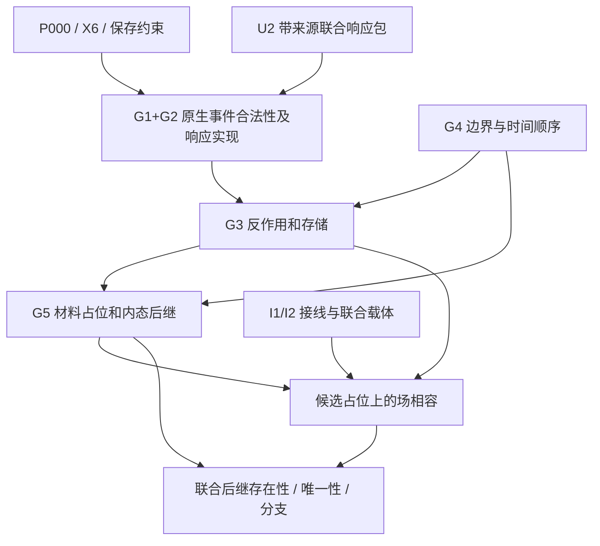

# U2 两单位原生接口缺口证书

日期：2026-10-07。Task `RS-U2-NATIVE-OCCUPANCY-BRIDGE-20261007`；publication `TP2-E49C20B8D0A6569355F6`。

**结论：`SOURCE_INTERFACE_GAP / NATIVE_SUCCESSOR_UNKNOWN`。** 固定来源给出了响应电路和规定位置后的场，尚未给出原生作用实现及材料占位后继。本文定位不可直接推出的输入；不证明无合法完成，不证明非唯一，也不假造两个“完成”。

作者是已授权执行 `EM-DIRECT-FA0C27 / RA-283C0A8BF9F924806C568F05` 下的临时协作者 `/root/followup_review`，共享上下文、非盲、非独立 Driver，不另注册身份或 CLAIM。原 U2 作者仍为 `EM-DIRECT-CDFEA3 / RA-CCF8BEDDC068211BBAB0B7D9`。

## 1. 固定来源

- **U2-R**：[README@fe9ce582](https://github.com/awdawmip/enterprise-math/blob/fe9ce58293ac77b72092512620e8670ca9be2d78/research_notes/chatgpt_direct/20261007_cell_closure_u2_7f21d8/README.md)，blob `bd35175a2e5ca379e95a9c0b922395ce3be45ec7`。
- **U2-P**：[packet_router.py@fe9ce582](https://github.com/awdawmip/enterprise-math/blob/fe9ce58293ac77b72092512620e8670ca9be2d78/research_notes/chatgpt_direct/20261007_cell_closure_u2_7f21d8/packet_router.py)，blob `7465f5aa16cbb8fba61ba4be80f8a6884b879c53`；下文行号属于此文件。
- **U2-C**：[CHECKPOINT@ccd05f7](https://github.com/awdawmip/enterprise-math/blob/ccd05f7e0e68b8c04288985c38f5f0bd15381d4e/research_notes/chatgpt_direct/20261007_cell_closure_u2_7f21d8/CHECKPOINT.json)，blob `3f404aa25a5cb403106a21a65478b6fd2069d0c6`；明确 `native_material_position_solved=false`、`unforced_native_reachability=false`。
- **T**：[taskbook@aa6e9fafe28a39ab90971e0263e65586ca737c83](https://github.com/awdawmip/enterprise-math/blob/aa6e9fafe28a39ab90971e0263e65586ca737c83/research_tasks/RS-U2-NATIVE-OCCUPANCY-BRIDGE-20261007.md) §§1、2.2–2.4，SHA256 `00be9114d1169f56620158200b08eac136302c497a45d9a60d99829af2ff6017`。

基础文件按仓库快照 `9800fa40569c9541ffa8f0c917050cfb067418a3` 读取，检查时均与该提交无差异；以下简称均指此版本的精确路径：

| 简称 | 路径及决定性位置 |
| --- | --- |
| P000 | `p000_reality_foundation.json`：`typed_semantics.primitive_force_balance`、`research_semantics.still_open` |
| TRIAD | `definitions/P000_DISCRETE_DIRECTION_TRIADIC_BALANCE_20260905.md` §§5–7 |
| X6 | `definitions/ENTERPRISE_X6_NATIVE_SPATIAL_CELL_TORSOR_20260905.md` §§1–3 |
| WORLD | `definitions/HEARTBEAT_WORLD_NATIVE_X6_TIME.json`：`event_layout`、`time_modeling` |
| HEARTBEAT | `definitions/HEARTBEAT_SELF_CONSISTENT_INSTANT_V0_1.json`：`snapshot_required`、`index_types`、`input_policy`、`unknown_or_truncated_external_response` |
| JOINT | `definitions/ENTERPRISE_JOINT_RELATION_OBSERVER_PRESERVATION_20260905.json`：`redundancy_certification_protocol`、`observer_safety_contract` |
| RESIDUAL | `definitions/RESIDUAL_FAITHFUL_DISCRETE_RELATIONAL_SYSTEM.json`：`state_semantics`、`compression`、`cancellation` |

已应用本任务 `policy/WORLDVIEW.md`、`BRC_POLICY.md`、`BRC_ONLY.md`。这里只做符号接口及 source 检查，未用普通分数程序或经典传播器生成科学结果。

## 2. 已有电路的准确强度

`Packet` 保存 `tag,born_at,incoming,ports,budget,leg`；响应预算的三腿分配保留联合成员和父预算。它说明第三条**响应腿**的份额，不说明第三个**原始作用事件**的来源；替代分支也不自动成为同时作用。[U2-P L82–120；U2-R §1]

给定占位 `x`、注入 `J_x` 及固定默认核后，总响应满足 `Phi_x=J_x+rho P_x Phi_x`。`0<rho<1` 下的唯一性和 `N rho^(L+1)/(1-rho)` 尾界是固定算子的正响应结论：`Phi_x` 唯一不等于 `x` 唯一，更不选择下一占位。[U2-R §2；U2-P L173–215]

`gate(ps,blocked)` 接受外部给定阻断集，返回完整 `ready,held`，没有定义材料为何阻断、承担何种反作用、何时释放。来源盲的有向三元直方图充分性限于声明的整包阀门及正标量串联语言；不覆盖未知来源敏感的材料后继。不能把边际、两两摘要或直方图升级为完整原生状态。[U2-P L131–147；U2-R §§3–4]

## 3. 联合状态和来源标签

固定材料身份 `A={a,b}`，初始占位 `x_0(a)=c`、`x_0(b)=c+E_1`。`c` 是任选 Cell；表达式是 X6 torsor 中的内部关系，不是最终地址编码。相邻准备不证明运动限于 `E_1`，不删其余五轴或任一有向端口。[T；X6]

为定位完整性义务，写待实例化接口：

`S_n=(A,x_n,u_n,F_n,Pi_n,Q_n,B_n,t_n;L,provenance)`。

| 字段 | 必须交代什么 | 当前状态 |
| --- | --- | --- |
| `x_n` | 两材料各自完整 X6 Cell 身份；`x_(n+1)` 是未知输出 | 初始给定；后继 UNKNOWN |
| `u_n` | 对后续有影响的材料内态／反作用记录；本构若需动量，明确类型 | 类型、初值 UNKNOWN；省略不等于零 |
| `F_n` | 来源 `a/b`、目标 Cell、入射端口，以及本构需要的源历史／路径关联 | 固定电路载体可用；原生桥 UNKNOWN |
| `Pi_n` | 包成员、来源／父预算、入射、产生点、目标、必要支路重数 | 条件 Packet 可用；原始作用实现 UNKNOWN |
| `Q_n` | 可释放的完整包或保真编码、存储归属／位置及释放所需状态 | held 输出可用；跨时存储规则 UNKNOWN |
| `B_n` | 外部输入／阻断、回流、准备历史、储库；截断边界残差 | 电路边界可声明；原生演化边界 UNKNOWN |
| `t_n,L` | 独立时间／顺序与确切作用、材料、占位规则版本 | 顺序类型固定；更新关系 UNKNOWN |

这不是已证最小状态元组，更不是任意原生动力学的封闭载体。只保留声明操作／观察需要的字段；删除须证明未来组合保真，未知定律可能需要额外修复坐标。RESIDUAL 明确 `carrier_list_is_universal_required_tuple=false`，也不要求永久保存全部历史。

必须区分 `F_(b→a)`、`F_(a→a)` 等来源。自源返回只是响应路径分类，不自动等于反作用或第三作用。材料身份数与一个原子事件的作用数类型不同：两材料不意味只有两个作用，三作用不要求三材料。[TRIAD §§5–7]

## 4. 不能由来源推出的接口输入

以下 UNKNOWN 仅限定于上述冻结来源，不是全项目不存在性结论。

| 缺口 | 必须补的关系 | 已知约束和未决点 |
| --- | --- | --- |
| G1 原生作用与 signed incidence | 原始作用对象、有向标签、适用上下文及可核验 `Adm_E`／`TRIADIC_CLOSURE_E` | P000 固定稳定原子有三个非零作用且闭合；三异轴不是闭合证书，默认 40 组未获合法性证明 |
| G2 不可分实现及第三作用来源 | U2 包到完整原生事件的实现／读出关系；共同事件归属、各作用来源、预算单位 | 三腿预算已记账；分数响应不自动实现不可分作用，父包标签不证明第三作用存在 |
| G3 反作用／存储 | 联合来源输入到材料内态、反作用、held／release 和边界交换的关系及初态 | `gate` 不删 blocked 包；没有材料阻断、释放或反作用定律，预算守恒不等于物理守恒 |
| G4 时间／边界 | 下一事件的时间／顺序语义、来源和边界共同更新；若顺序无关须证明 | 心跳是声明范围的自洽状态；没有固定时间步、自动场重算或无限储库假设 |
| G5 占位后继 | 作用和内态到新 Cell 的相容关系；冲突、允许移动及占位条件 | 当前场程序要求输入 Cell 不重复；这是程序前置条件，不是已证原生排斥律或运动律 |

**首要切口是 G1+G2 的原生事件接口，不能先认定一个纯端口组合表合法再附作用语义。** 作用载体、signed closure、不可分实现和第三来源可能共同定义，可以合成一个 `Lift_E` 关系；本文没有证明它们相互独立。“最小”仅指固定 U2 前沿通向完整 native action→occupancy 见证时首先需补的接口，不是最少 bit、全局唯一最小公理集或最小充分状态定理。

分数响应也不能反向证明原生实现不可能。RESIDUAL 的 `discrete_basis_implies_discrete_amplitudes=false`；原始事件不可分不自动给响应权重整数量纲。须说明响应是什么读出／计量／聚合，不能凭分母、材料数或整除性宣布不相容。

第三作用可在后续研究中来自获准的内部、环境、路径或时间关联；TRIAD §6 列的是允许研究的来源种类，不是本例已经建立的具体作用。不能用 `-(f1+f2)`、正响应总量或目标形状补造它。三条单轴空间腿的 `Z^6` 位移和不是 `TRIADIC_CLOSURE_E`。[U2-R §1；TRIAD §§5–6]

P000 约束的是**稳定原子事件**，不要求每个非平衡瞬间、每个输入包都已稳定闭合。不能把尚未稳定本身当作对象非法或无动力学。[P000；HEARTBEAT]

## 5. 两个可定位的实现断点

**I1：新合法 incidence 没有接入场求解器。** `packets(...,incidence=H)` 只核验含入射端口、三异轴等组合条件 [L99–120]；`transport_tables(rho)` 没有 H 参数，L165 强制默认 `packets`；`field_prefix` L185 使用该默认表。未来给出合法 H 后，应证明新 H 的所需散射读出等于原表，或扩展接线并重证受影响条件，不能说旧场已执行新 H。端口核相同不保证联合阀门等价。

**I2：返回摘要不足以作为联合材料输入。** `field_prefix` 内部 `layer` 保留 `(source,z,incoming)` [L187、203–208]；返回 `material_ports` 却合并所有来源 [L195–197]，只另给 own-source 返回总量 [L193–199]。自身总量与混合端口量不足以恢复每端口自源／交叉源分配，返回值也不含完整联合包关系。此为返回接口欠项，不证明原始路径数据不存在。

来源／联合读出的充分性须由 G3/G5 操作语言决定；不能反向规定未知本构只看现有粗摘要。

## 6. 依赖图与联合后继问题

这是证据依赖图，不规定更新算法的先后；关系可能隐式耦合。不能据图默认“先场、再力、再移动、再瞬时重算”。G4 不由 G1/G2 推出，G5 也不由 G3 的预算账推出。

若未来给出有来源版本 `L` 及边界 `B`，精确目标可写为**待实例化关系**：

`Succ_(L,B)(S_n)={S' : exists E, NativeLift_L(S_n,E) & ReactionStorage_L(S_n,E,S') & Occupancy_L(S_n,E,S') & BoundaryTime_L(S_n,S';B) & FieldCompat_L(S')}`。

谓词名不是本构。`x'(a),x'(b)` 始终是 `S'` 中未知输出。若只使用现有场函数的输入域，须证后继占位不同；若允许重叠／合并，须另证适用材料接口，不能调用拒绝重复 Cell 的旧函数。

只有 `FieldCompat_L` 保留固定正、列守恒散射、有限注入及 `rho<1` 时，才可套用 U2 静态收敛证明。移动材料、跨时场、历史释放、边界反馈或改变注入可改变算子；原尾界没有自动覆盖这些误差。把各 `S_n` 都设成准静态解也是新增桥，不由静态唯一性推出。

观察涵盖身份分辨占位、必要内态／储存、来源、联合阀门及边界；操作限于已明确定义者，不把未知原生动作预标合法。压缩须保证同一压缩状态在声明的所有未来组合后给同一观察，再删除区分。[JOINT；RESIDUAL]

## 7. 时间、边界和四种结论

`n` 是候选心跳序号，`t_n` 是独立时间／顺序，`ell` 是 BRC 路径深度，`k` 是同一候选的求解迭代。`rho^ell` 不是已标定时间律。初始邻接加静态场也不构成已验证完整 `H_0`：材料内态、本构及来源边界仍未齐备。[HEARTBEAT；U2-R §2]

条件电路可声明全 X6 上只有两材料准备注入；这不是原生材料闭系统证明。有限窗口外响应应保留为带界截断或 `SCOPE_OPEN` 边界残差，不能默认为零。P/Q 受控准备使用不同查询历史及不同已披露剩余储库；不是相同外部边界下两材料的无操控后继见证。[U2-R §3；HEARTBEAT]

| 结论 | 所需证据 | 本次状态 |
| --- | --- | --- |
| 相容 | 有来源 `L,B,S_n,S'` 与全部相容检查 | UNKNOWN |
| 不相容 | 固定合法前提下无解证明，或某明确候选的精确违约证书 | 未证明；缺本构不等于无解 |
| 已证非唯一 | 同一完整前提和边界下两个合法后继，或两个合法完成；明确非唯一的对象 | 未给出；合法性尚 UNKNOWN |
| 精确前提缺失 | 已知接口、未给关系及第一可执行补充问题 | 本文交付 |

场程序接受多个规定布局不证明它们是材料后继。“保持原地”和“移动一步”缺少 G1–G5 时不是两个合法完成。

## 8. 唯一下一问题及验收对象

**对相邻两有身份材料的一次明确事件，能否给出有准确来源、可检查的 `Lift_E`，使至少一个 U2 带来源联合响应输入具有合法 signed triad 实现，并交代三个不可分作用、第三作用来源及响应读出？**

最小交接对象包括：作用载体和一个上下文输入；三作用的有向标签、同事件关联和来源；闭合验证依据；对应 U2 来源／入射／包成员／预算单位；实现或读出桥及保真范围。来源缺失只能标候选。一个实例不授权默认其余组合，更不覆盖十二端口注入；全输入覆盖是后续义务。若原生候选不保持 U2 核，标明受影响接口，不强行拟合。

该对象仍须显式列出 G3–G5 哪些 UNKNOWN：一个合法事件不等于完整两单位后继。没有此接口时按 T 的停止规则返回缺口，不靠加深路径、重复 2/3、四单位枚举或素合标签越过；取得接口后才准备完整作用→占位相容见证。本文不预选终点。

## 9. 复用、检查和新增信息

`REUSE_APPLIED`：U2 的显式包／来源／阀门与正 CWM 类型边界；`REUSE_EXECUTED=false`。既有 `tool-coverage.json` 的 `t0.brc_residue_port_transport` 明确不覆盖一般 occupancy／非线性／隐藏控制闭合，`t0.heartbeat_residue_guarded_transport` 也要求给定有限控制；目录匹配不能提供缺失原生本构。待接口齐备，可考虑 `EXTEND_EXISTING_TOOL` 接 incidence 和联合读出，目前未改代码。

已逐字段检查冻结实现，并验证 `source/FETCH_MANIFEST.json` 的 7 个本地文件 Git blob 全部匹配；哈希属于文件完整性检查，不是科学计算。未运行 replay、重算历史检查、进行四单位或素数运算，未取得详版未公开附件。没有独立 Driver 结论。

新增信息：G1+G2 第一切口、G3–G5 依赖、I1/I2 实现断点和占位为未知量的后继接口。
