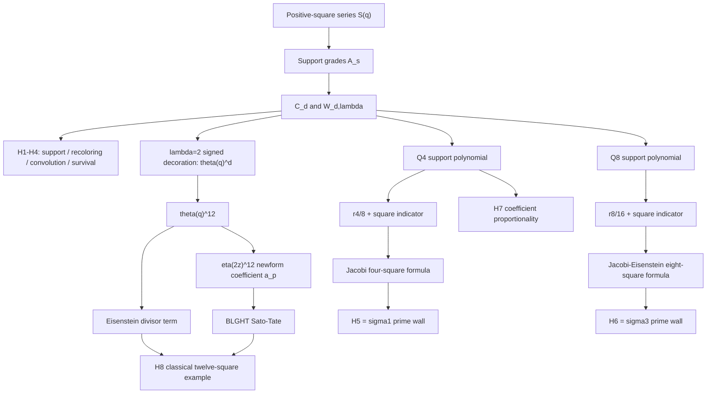

# High-Dimensional Prime Walls — Filter Algebra and Classical Equivalence Audit

Researcher-ID: `EM-HDPWA-03E870`

Task-ID: `RS-HIGHDIM-PRIME-WALL-FILTER-ALGEBRA-EQUIVALENCE-AUDIT`

Owner branch: `research/highdim-prime-wall-equivalence-audit`

Hard target:
`HIGHDIM_PRIME_WALL_FILTER_ALGEBRA_CLASSICALLY_EQUIVALENT_OR_RESIDUALLY_NEW_CLASSIFIED`

## 1. Executive Verdict

The hard target is met as a classification result, with aggregate verdict
`SCOPE_NARROWING_REQUIRED`.

H1 and H4 are exact elementary identities packaged in a useful project-specific support
language.  H5, H6, and H8 reduce completely to classical four-, eight-, and twelve-square
theory.  H2 and H3 are exact only at the carrier/completed-series scope; neither supports the
stronger collapsed-array inference suggested by an unqualified reading.  H7 has a unique
nonzero solution `lambda=2` only under a structural support-grade quantifier; its per-fixed-prime
active-support reading is false.

No residual invariant remains after subtracting the classical divisor walls, convolution
content, and the weight-6 level-4 newform coefficient in twelve dimensions.  The useful
survivor is a presentation: the `A_s` support basis makes the square-theorem cancellation and
the lambda criterion transparent.  It does not add new arithmetic capability.

## 2. Scope, Inputs, and Evidence Separation

### Frozen inputs

- Taskbook source commit: `12725505c636449df7dd913ac06e581bf418b89c`.
- Locked packet commit: `0173b1ea489a4811d42b77b9e8d977d327c4d08e`.
- Locked packet blob: `597eabefb57110a58267fc6627ca603adadd6e59`.
- Global Knowledge snapshot: `506eb72c7d409dafda4763403a0bba7c5cc28287`.

### Independent Proof Checkpoint

Before opening any classical source, toolbox catalog, source free-research branch, source script,
Draft PR #595, or withheld GLOBAL_KNOWLEDGE narrative, the independent proof checkpoint was
frozen at:

`research_output/checkpoints/HIGHDIM_PRIME_WALL_INDEPENDENT_PROOF_CHECKPOINT_20260823.md`

SHA-256:
`7d7596f846068fbdea97047019a1dd822499fc2799095696424b5461467cccca`.

At that freeze, H1–H6 had exact derivations, H7's two quantifier readings had been separated,
and the twelve-square cusp form had been reconstructed while its distribution theorem remained
explicitly pending external verification.  Only after this event were classical sources opened.

### Four evidence layers

1. Independent exact proof: the checkpoint and the algebra below.
2. Independently authored computation: the checker, kept non-probative for theorem claims.
3. External classical-equivalence evidence: the theorem-level source map.
4. Post-freeze source comparison: intentionally not performed.  The withheld source branch and
   proof remain unopened; reconciliation belongs to the Driver.

The layers are not interchangeable.  In particular, finite zero-mismatch computation did not
establish H5, H6, or H8.

## 3. Independent Method and Proofs

Let

`S(q)=sum_{m>=1}q^(m^2)`, `theta(q)=1+2S(q)`,

and let `delta_square(n)=[q^n]S(q)`.  Write `r_d(n)=[q^n]theta(q)^d`.
The signed count `r_d` is used only as an arithmetic decoration channel; it does not introduce
native negative axes.

### H1–H4

- H1: partition each nonnegative shell by its support set.  A support set of size `s` leaves an
  ordered positive `s`-tuple; summing over `binom(d,s)` supports proves the formula.
- H2: `T_lambda(T_mu(F))=T_(lambda*mu)(F)` by direct affine algebra.  On support grade `s`,
  recoloring multiplies by `lambda^s`.  The grade-collapsed `W` sequence has no induced inverse
  or composition operator in general, because `T_lambda(F^d) != T_lambda(F)^d`.
- H3: after adjoining `Wbar_d(0)=1`, Cauchy multiplication gives
  `Wbar_(d+e)(n)=sum_(k=0)^n Wbar_d(k)Wbar_e(n-k)`.  For positive-only arrays, the endpoint
  terms must be written as `W_d(n)+W_e(n)`.
- H4: for a fixed coordinate `j`, survivors are exactly shell states with `x_j=0`.
  Coordinate symmetry gives `Pr(x_j>0)=E[s]/d`, proving the ratio.

### H5 and H6 wall algebra

In the support variable `X`, the wall polynomials are

`P4(X)=1+2X+3X^2+4X^3+2X^4`,

`P8(X)=1+2X+7X^2+28X^3+70X^4+112X^5+112X^6+64X^7+16X^8`.

Coefficient comparison gives

`(1+2X)^4=8P4(X)-7-8X`,

`(1+2X)^8=16P8(X)-15-16X`.

Therefore, for every `n>=1`,

`Q4(n)=r4(n)/8+delta_square(n)`,

`Q8(n)=r8(n)/16+delta_square(n)`.

The exact square formulas yield

`Q4(n)=sum_(d|n,4 does not divide d)d+delta_square(n)`,

`Q8(n)=sum_(d|n)(-1)^(n+d)d^3+delta_square(n)`.

For odd `n`, these become

`Q4(n)=sigma1(n)+delta_square(n)`,

`Q8(n)=sigma3(n)+delta_square(n)`.

The prime implications are immediate.  Conversely, an odd composite has a positive proper
divisor in addition to `1,n`, so its divisor sum is strictly above the prime target; the square
correction cannot cancel the excess.  For distinct odd primes,

`Q4(pq)=(1+p)(1+q)`, hence `Q4(pq)-(pq+1)=p+q`.

For a general odd factorization `n=product p_i^(a_i)`,

`Q4(n)=product_i(1+p_i+...+p_i^(a_i))+delta_square(n)`,

`Q8(n)=product_i(1+p_i^3+...+p_i^(3a_i))+delta_square(n)`.

### H7 lambda criterion

At an odd prime, `A_1(p)=0`.  In the formal admissible grades `s=2,3,4`, the `Q4` weights are
`(3,4,2)`, whereas `W_(4,lambda)` has weights
`(6lambda^2,4lambda^3,lambda^4)`.  Requiring one grade-independent proportionality scalar gives

`2lambda^2=lambda^3=lambda^4/2`.

For nonzero `lambda` in characteristic zero, the unique solution is `lambda=2`, with scalar
`8`.  This is a structural coefficient-vector theorem.  It is not true if the quantifier is
restricted to whichever grades happen to be nonzero at one fixed prime: for `p=3`, only grade
`s=3` is active, so every nonzero lambda is vacuously proportional on that singleton.

### H8 twelve-dimensional boundary

Let

`f(z)=eta(2z)^12=sum_(n>=1)a(n)q^n`.

The exact decomposition is

`r12(n)=8sigma5(n)-512sigma5(n/4)+16a(n)`.

For an odd prime,

`r12(p)=8(p^5+1)+16a(p)`.

The external audit verifies that `f` is the normalized non-CM weight-6 level-4 newform and that
BLGHT Theorem B(3)/Corollary 8.6 applies exactly:

`(r12(p)-8(p^5+1))/(32p^(5/2))=a(p)/(2p^(5/2))`

is equidistributed on `[-1,1]` with density `(2/pi)sqrt(1-t^2)dt`.  This is precisely the
classical twelve-square Sato–Tate example, not a new phenomenon.

## 4. Results and Classical Equivalence

### H1-H8 Verdict Table

| H | Exact status | Classical/project classification | Terminal label |
|---|---|---|---|
| H1 | exact | support partition; useful project notation only | `EXACT_NEW_PRESENTATION_ONLY` |
| H2 | carrier identity exact; W inference narrowed | affine scaling action; no collapsed-array semigroup | `REQUIRES_SCOPE_NARROWING` |
| H3 | exact after `n=0` completion | Cauchy product | `REQUIRES_SCOPE_NARROWING` |
| H4 | exact for `C_d(n)>0` | exchangeability/indicator identity | `EXACT_NEW_PRESENTATION_ONLY` |
| H5 | exact at stated odd scope | Jacobi four-square divisor formula | `CLASSICALLY_EQUIVALENT` |
| H6 | exact at stated odd scope | Jacobi/Eisenstein eight-square divisor-cube formula | `CLASSICALLY_EQUIVALENT` |
| H7 | structural reading exact; instancewise reading refuted | elementary vector proportionality after classical wall identification | `REQUIRES_SCOPE_NARROWING` |
| H8 | exact object and distribution identified | Glaisher plus non-CM newform Sato–Tate | `CLASSICALLY_EQUIVALENT` |

The machine-readable detail is in
`research_output/HIGHDIM_PRIME_WALL_H1_H8_CLASSIFICATION_20260823.csv`.

### Classical Equivalence DAG

### Project-Specific Residual Test

Define exact residuals after subtracting known content:

`R4_odd(n)=Q4(n)-sigma1(n)-delta_square(n)`,

`R8_odd(n)=Q8(n)-sigma3(n)-delta_square(n)`,

`R12_prime(p)=(r12(p)-8(p^5+1))/16-a(p)`.

The proofs give `R4_odd=R8_odd=R12_prime=0` identically on their domains.  The remaining H1–H4
and H7 objects reduce to support partition, affine scaling, Cauchy product, exchangeability,
and vector proportionality.  Consequently there is no precise nonclassical residual available
for a continuation task.  A further higher-dimensional numerical search would violate the kill
condition rather than test a surviving conjecture.

The theorem-level audit and priority distinctions are recorded in
`research_output/HIGHDIM_PRIME_WALL_CLASSICAL_SOURCE_MAP_20260823.md`.

## 5. Validation, Controls, and Nonclaims

### Independent computation

`experiments/highdim_prime_wall_filter_equivalence_checker.py` uses only Python's standard
library and separately computes:

- `A_s` by ordered positive-square convolution;
- direct nonnegative and weighted-coordinate generating products;
- `C_d`, `W`, `Q4`, and `Q8` from the packet definitions;
- divisor functions and the full 4-/8-square arithmetic formulas;
- coefficients of `eta(2z)^12` from its product.

The final run passed for `0<=n<=2048`, `d<=12`.  Pressure cases include prime powers,
squarefree products of two and three primes, and 4-adic values.  H3 was tested with its `n=0`
identity term.  A deliberately wrong wall vector
`2C4-4C3+4C2` failed at its first odd test `n=5` (`8 != 6`), demonstrating that the checker can
reject a nearby coefficient error.

The checker evidence remains separate from the symbolic proof and external sources.  Its frozen
initial SHA-256 is
`edfee5f594604a9496d93307e9b1159548a9d47449ee729eac263157085537ac`.

### Tool-reuse classification

The post-firewall toolbox lookup found existing coverage in
`T1_SCALE_ENUMERATION_VALUATION` for shell/generating-function enumeration and in the
`D1_PRIME_TOOLKIT` domain facade for prime-specific routing.  Classification:
`COMPOSE_EXISTING_TOOLS`.  The checker is task-specific evidence, not a proposed new tool family,
and no capability-gap or method-novelty claim is made.

### Complexity and Semantic Nonclaims

- No bit-complexity improvement follows.  A shell counter whose work is polynomial in the
  integer value `n` is exponential in the input length `log n`.
- The prime-wall biconditionals do not supply a faster primality or factoring algorithm.  They
  re-express exact divisor sums through representation counts.
- `lambda=2` decorates positive coordinates by two signs for arithmetic audit only; it does not
  create native Enterprise negative axes.
- H2 does not make `T_lambda` a ring homomorphism and does not create a semigroup on collapsed
  `W` arrays.
- H3 does not permit omission of the `n=0` identity coefficient.
- H7 is not a uniqueness theorem for each fixed prime's nonzero support set and is not justified
  by a finite integer-lambda scan.
- The twelve-square semicircle law, its newform, and its normalization are classical and are not
  an Enterprise Sato–Tate discovery.
- No claim is extended to higher dimensions merely from visual or finite numerical patterns.

## 6. Closure and Final Status

### Final Aggregate Verdict

`SCOPE_NARROWING_REQUIRED`.

The required narrowing is fully specified rather than left open:

1. H2 is a carrier/support-grade semigroup identity only.
2. H3 uses completed sequences with `W(0)=1`, or explicitly includes endpoint terms.
3. H7 quantifies over the formal structural grades `{2,3,4}`, not the active grades of one prime.

After these repairs, the mathematical content is exhausted by classical square-representation,
theta/modular-form, divisor-sum, and Sato–Tate results, together with useful but non-novel project
presentation.  No residual novelty claim survives.  All H1–H8 items have a terminal label; no
item remains `OPEN_AFTER_AUDIT`.

Repository closure can therefore publish the report, reducer, checker, classification matrix,
source map, evidence stream, and frozen checkpoint as one Draft-PR evidence package.  The
withheld source branch remains unread, and package reconciliation remains a Driver action.
